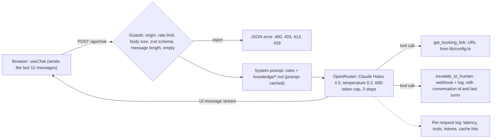

# Cadre AI Support Chatbot

[](https://github.com/johnfelipe/cadre-chatbot/actions/workflows/ci.yml)

A support chatbot for Cadre AI's website. It answers common inbound questions from a curated knowledge base,
routes interested prospects to a strategist call, and hands anything it can't answer to the Cadre team.

**Live URL:** https://cadre-chatbot-ebon.vercel.app (Vercel, redeployed on every push to `main`)

## What it handles
1. What Cadre AI does and whether it works with the user's industry
2. Booking a call with an AI strategist
3. Accessing the Cadre client portal
4. The AI Maturity Index and how to get scored
5. Cadre's approach to LLM selection and data security
6. Anything else: says it doesn't know and escalates to a human (collects the email, sends the request with the
   conversation's last turns to a webhook)

It declines off-topic requests, legal/medical/financial advice and prompt-injection attempts, won't confirm false
premises ("the first month is free, right?"), and replies in the user's language. Facts it doesn't have are marked
`[NOT PUBLISHED]` in `knowledge/`, and the bot redirects instead of guessing.

## How it works



- `knowledge/` is the only source of facts (every fact carries its cadreai.com URL). The whole corpus (~5k tokens)
  goes into the system prompt: no RAG at this size, and Anthropic prompt caching serves ~95% of the input from cache.
- `lib/prompt.ts` holds behaviour rules only; `lib/config.ts` holds the model, limits and every URL, so the model
  can't invent links: it gets them from tools or knowledge.
- Design decisions, scope cuts, budget (measured) and the scaling path are in [`plan.md`](plan.md).

## Verification

| Layer | What | Cost |
|---|---|---|
| Unit tests (`npm test`, Vitest) | 37 tests: every API rejection path, the params sent to the model, escalation payload and PII masking, rate limit, knowledge loading, XSS-safe rendering, the knowledge guard hook | Free, model mocked |
| Behavioural evals (`npm run eval`) | 82 cases against the deployed bot: the 6 scenarios, knowledge gaps, false premises, pushback and poisoned history, injection (fake system tags, base64, zero-width, translation), data leaks, tool misuse, languages, API contract | Real model calls |
| CI (GitHub Actions) | lint, typecheck, unit tests and build on every push; evals on manual dispatch only | Free / opt-in |

Latest full eval run on production: **81/82**. The miss was "how much?": the bot took the likely meaning (price)
instead of asking which service, and the case now accepts either. Every failure found along the way is a regression
case in `evals/cases.ts`, and each fix is described in the commit that made it.

## Run locally
Requires Node 22.18+ (the eval runner uses Node's built-in TypeScript support).

```bash
npm install
# .env.local
#   OPENROUTER_API_KEY=...          required
#   OPENROUTER_MODEL=...            optional, default anthropic/claude-haiku-4.5
#   BOOKING_URL=...                 optional, overrides https://cadreai.com/contact
#   ESCALATION_WEBHOOK_URL=...      optional, Slack/Discord incoming webhook for escalations
npm run dev                          # http://localhost:3000
```

| Script | What it does |
|---|---|
| `npm run lint` | ESLint |
| `npm run typecheck` | Next route type generation + `tsc --noEmit` |
| `npm test` | Unit tests, model mocked |
| `npm run build` | Production build |
| `npm run eval [-- <case-prefix>]` | Behavioural evals against a running server (`EVAL_URL`). Spends budget |

## How this was built

AI coding assistants wrote most of the code. I set the direction, made the scope and design calls, and nothing
shipped without verification: unit tests, evals against the deployed bot, and reading the answers, not just the
pass/fail line. Claude Code and Cursor's agent were both used; commits made from Cursor carry its `Co-authored-by` trailer.

- **[`CLAUDE.md`](CLAUDE.md)** is the onboarding doc for the agent: hard constraints from the brief, architecture map,
  rules, verified AI SDK v7 gotchas, and a **mistakes log** of what the AI got wrong and how it was caught.
- **[`plan.md`](plan.md)** is the source of truth for phases, scope, decisions and budget, updated in the same commit
  as the change it describes.
- **Subagents** (`.claude/agents/`): `knowledge-writer` researched cadreai.com into `knowledge/` with a URL per fact;
  `code-reviewer` checks a diff against the repo rules; `eval-runner` runs evals and classifies each failure.
  Read-only explore subagents read the bundled AI SDK v7 and Next 16 docs before any code was written, because the
  installed versions differ from most examples online.
- **Commands** (`.claude/commands/`): `/ship`, `/eval`, `/add-knowledge`, `/log-decision`.
- **Hooks** (`.claude/hooks/`): the rules are enforced by the harness, not only written down. One blocks new facts in
  `knowledge/` that carry a number or URL without a source; another lints and typechecks every edited TypeScript file.

Examples of AI output that was caught and changed (full list in the `CLAUDE.md` mistakes log):
- The first rewrite of the docs switched to `@ai-sdk/anthropic` + `ANTHROPIC_API_KEY`, breaking the brief's
  OpenRouter-only rule. Caught in review.
- The bot said hospitality "isn't on the list" and then listed it: `industries.md` held two conflicting lists. The
  eval passed; reading the answers caught it.
- A new "don't promise outcomes" rule didn't hold because `knowledge/portal.md` still said "say the team will follow
  up". Prompt rules and knowledge guidance have to be changed together.
- Budget estimates missed that a tool call runs a second model step; per-request usage logs showed the real numbers.
