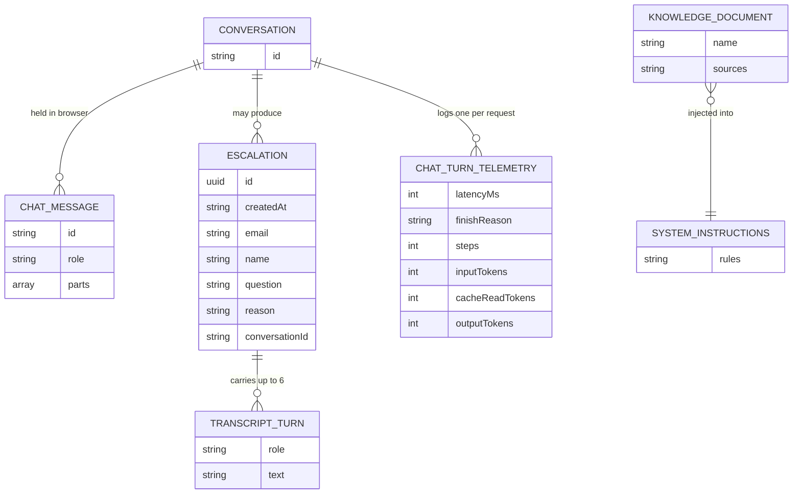

# Project Requirements: Cadre AI Support Chatbot

> **Template Origin**: Official | **ArcKit Version**: 6.16.3 | **Command**: `/arckit:requirements`

## Document Control

| Field | Value |
|-------|-------|
| **Document ID** | ARC-001-REQ-v1.0 |
| **Document Type** | Business and Technical Requirements |
| **Project** | Cadre AI Support Chatbot — cadre-chatbot (Project 001) |
| **Classification** | OFFICIAL |
| **Status** | DRAFT |
| **Version** | 1.0 |
| **Created Date** | 2026-09-27 |
| **Last Modified** | 2026-09-27 |
| **Review Cycle** | Monthly |
| **Next Review Date** | 2026-10-27 |
| **Owner** | Jhon Felipe Urrego — Solution Architect, Cadre AI Support Chatbot |
| **Reviewed By** | [PENDING] |
| **Approved By** | [PENDING] |
| **Distribution** | Project Team, Architecture Team, Cadre AI Engineering, take-home review panel |

## Revision History

| Version | Date | Author | Changes | Approved By | Approval Date |
|---------|------|--------|---------|-------------|---------------|
| 1.0 | 2026-09-27 | ArcKit AI | Initial creation from `/arckit:requirements` command | [PENDING] | [PENDING] |

## Document Purpose

This document specifies the business, functional, non-functional, integration and data requirements for the Cadre AI Support Chatbot. It is written **retrospectively against an already-built application**, the `cadre-chatbot` repository (Doc ID `APP`; paths listed in its `.gitignore` were excluded from review). Every requirement therefore carries an **Implementation Status**:

| Status | Meaning |
|--------|---------|
| ✅ Implemented | Built and verified by unit tests, eval cases or a recorded manual check in the repo |
| ⚠ Partial | Built in part, or built for demo scale but not production scale |
| ❌ Not implemented | A gap or a deliberately deferred item (the backlog) |

The document serves three uses: (1) the reference for design reviews (`/arckit:hld-review`) and principle compliance; (2) the backlog for moving from take-home MVP to production on cadreai.com; (3) the acceptance baseline for regression (evals map to requirements).

---

## Executive Summary

### Business Context

Cadre AI is an AI strategy and implementation consultancy that helps businesses "move from AI confusion to AI confidence" [CACTHC-C1]. Its inbound team receives "a growing volume of inquiries from prospective clients, existing clients, and people who want to learn more", and needs a chatbot that "handles the most common interactions so the team can focus on high-value conversations" [CACTHC-C2].

The chatbot's audience is senior buyers at lower-middle-market PE-backed companies, professional services and financial services firms [CACTHC-C3]. For them, one wrong answer about pricing, clients or security costs more than a polite handoff. The project is also a Staff AI Engineer take-home challenge [NSTCCA-C1], judged on a live deployment, the repository history and a 1-hour review [CACTHC-C9]. The brief is "intentionally underspecified — how you scope and prioritize is part of the evaluation" [CACTHC-C4].

The as-built MVP is a single-page web chat backed by one server endpoint. It answers only from a curated, sourced knowledge base, uses two deterministic tools (booking link, human handoff), and is protected by strict cost and input guards. It is verified by 39 unit tests and an 83-case behavioural evaluation suite.

### Objectives

- Answer the six common inquiry scenarios accurately on a public URL [CACTHC-C5]
- Never state an organisation fact that isn't in the curated knowledge base (zero ungrounded claims)
- Route engagement intent to a strategist call, and hand every unanswerable request to the Cadre team with context
- Operate within a $5 runtime credential that expires in 7 days [NSTCCA-C2], staying live through the review
- Deliver an ownable, documented, verifiable system with explicit scope and decisions [CACTHC-C6]

### Expected Outcomes

- **O-1 Trusted AI front door**: 0 ungrounded commercial claims per release (eval subset 100%; last full run 83/83)
- **O-2 Inbound capacity freed**: ≥ 60% self-resolution within 3 months of production launch (proposed target, not yet measured)
- **O-3 Qualified pipeline**: booking path offered on 100% of intent turns; ≥ 10% of strategy-call requests attributable to the bot within 6 months (proposed)
- **O-4 Predictable cost**: about $0.003 per tool turn with prompt caching (measured); ≤ $0.02 average per conversation
- **O-5 Assessment success**: live URL and repository ready on day 4 (2026-09-27), review on day 5
- **O-6 Compliance-ready**: DPIA, AI disclosure and retention documented before production traffic

(Outcome IDs trace to ARC-001-STKE-v1.0.)

### Project Scope

**In Scope** (from application `plan.md`):

- Company overview, services, industries served
- Booking a strategist call (tool → canonical link)
- Client portal access guidance and handoff
- AI Maturity Index: what it is, how to get scored
- LLM selection approach and data security posture
- Escalation: capture email (+ optional name) and question → log + optional team webhook
- Refusal of off-topic and prompt-injection requests; replies in the user's language
- Personas: prospective clients, existing clients, general visitors; maintainers (engineering)

**Out of Scope** (intentional, with revisit triggers in `plan.md`):

- Authentication and portal integration: the bot explains access, it doesn't log users in
- Retrieval (RAG) / vector database: the corpus is about 5k tokens, so full context is used; revisit above ~50k tokens
- Persistent chat history or a database: no requirement justifies it for the MVP
- Admin dashboard for escalations: a team-channel webhook covers it
- Pricing quotes: not published, so always routed to a strategist
- CRM integration, shared-state rate limiting, analytics dashboard: production phase (see ❌ items)

---

## Stakeholders

| Stakeholder | Role | Organization | Involvement Level |
|-------------|------|--------------|-------------------|
| Executive Leadership (Founder/CEO, President) | Executive Sponsor | Cadre AI | Decision maker (go-live, brand risk) |
| Chief Client Officer / Inbound team | Product Owner (support experience) | Cadre AI — Client Success | Requirements definition (handoff, scope) |
| VP of Client Strategy / AI strategists | Business owner (booking flow) | Cadre AI — Client Strategy | Requirements input (qualification) |
| Chief AI Officer / AI Engineering | Technical owner; engineering standards | Cadre AI — Engineering | Technical oversight, future maintainer |
| Take-home Review Panel | Assessor | Cadre AI — Engineering | Acceptance of the MVP |
| Privacy / Legal | Compliance Officer | Cadre AI | Privacy and regulatory review |
| Marketing / Website owner | Content owner | Cadre AI | Knowledge content and tone |
| Finance (CFO) | Cost owner | Cadre AI | Spend ceiling |
| Jhon Felipe Urrego | Solution Architect / Builder | Candidate | Author, builder |
| Prospective and existing clients | End users | External | User acceptance (via evals and demo) |

Full analysis, drivers SD-1…SD-14, goals G-1…G-8 and the RACI matrix are in ARC-001-STKE-v1.0.

---

## Business Requirements

### BR-001: Answer Common Inbound Inquiries

**Description**: The chatbot must answer the six common inquiry scenarios from the brief: (1) what Cadre does and industry fit; (2) how to book a call with an AI strategist; (3) how a client accesses the portal; (4) what the AI Maturity Index is and how to get scored; (5) Cadre's approach to LLM selection and data security; (6) a question the bot can't answer, which it escalates or redirects [CACTHC-C5].

**Rationale**: The brief's minimum bar is "a functional chatbot that a prospective or existing Cadre AI client could plausibly use to get answers" [CACTHC-C7]. Deflecting repetitive volume is the core value (SD-2).

**Success Criteria**:

- All six acceptance scenarios pass on the deployed URL (eval cases `s1-*` … `s6-*`)
- ≥ 60% self-resolution within 3 months of production launch (G-2; to validate with Inbound)

**Priority**: MUST_HAVE

**Stakeholder**: Executive Leadership, Chief Client Officer (G-2, O-2)

**Implementation Status**: ✅ Implemented (scenarios); ❌ self-resolution not measured (see BR-007)

---

### BR-002: Protect Brand Credibility (Zero Ungrounded Claims)

**Description**: The chatbot must never state a price, client name, result, certification, policy or URL about Cadre that isn't in the curated knowledge base. It must say it doesn't have the information and offer a next step instead.

**Rationale**: Cadre sells AI confidence. A hallucinating Cadre-branded bot would publicly contradict its core promise (SD-1). "You decide what the bot knows. You decide where it draws the line." [CACTHC-C8]

**Success Criteria**:

- 100% pass rate on grounding, false-premise and gap eval cases per release
- 0 ungrounded claims in a monthly 50-answer production sample (once answer sampling exists)

**Priority**: MUST_HAVE

**Stakeholder**: Executive Leadership, AI Engineering (G-1, O-1)

**Implementation Status**: ✅ Implemented (eval subset passes; monthly sampling ❌)

---

### BR-003: Convert Engagement Intent to Strategist Conversations

**Description**: When users show buying or engagement intent (pricing, getting started, fit), the chatbot must offer the canonical path to book a strategist call.

**Rationale**: Booking a strategist call is Cadre's primary conversion event and a required scenario [CACTHC-C5] (SD-3).

**Success Criteria**:

- Booking offered on 100% of intent turns (eval-verified)
- Chatbot-sourced requests attributable in the CRM (production)

**Priority**: MUST_HAVE

**Stakeholder**: VP of Client Strategy (G-3, O-3)

**Implementation Status**: ✅ Offer implemented; ❌ attribution not implemented

---

### BR-004: Human Handoff for Anything the Bot Cannot Answer

**Description**: Every conversation must have a path to a human. When the user asks for one, needs account-specific help, or needs information the bot doesn't have, the bot must hand off with the user's email, question, reason and recent context, and must never promise outcomes or timelines on the team's behalf.

**Rationale**: This is a required scenario [CACTHC-C5], and it keeps the team's workload actionable (SD-4, SD-11).

**Success Criteria**:

- ≥ 99% of handoffs delivered to the team channel (G-4)
- 0 promise violations in evals

**Priority**: MUST_HAVE

**Stakeholder**: Chief Client Officer (G-4, O-2)

**Implementation Status**: ✅ Implemented (delivery rate not yet reported)

---

### BR-005: Operate Within the Runtime Budget and Stay Live Through the Assessment

**Description**: The deployed chatbot must stay available on a public URL from submission (day 4, 2026-09-27) until credential expiry (~2026-10-01). Total spend on the challenge credential must stay ≤ $5, with a reserve for reviewer traffic.

**Rationale**: The key "has a $5 budget and expires in 7 days" [NSTCCA-C2]. The app "must be deployed and accessible on a public URL" [CACTHC-C10]. A dead bot on review day overrides every other merit (SD-6, SD-8).

**Success Criteria**:

- Smoke test of the six scenarios passes after the key switch + redeploy and on review morning
- ≥ $1.50 credit remaining on review morning (G-5)

**Priority**: MUST_HAVE

**Stakeholder**: Builder, Finance, Review Panel (G-5, O-4)

**Implementation Status**: ⚠ Partial. Cost guards are implemented; the switch back to the challenge key + redeploy + smoke test is still pending (`plan.md` phase 6).

---

### BR-006: Deliver Required Project Artefacts for Review

**Description**: The submission must include a `CLAUDE.md` and a `plan.md` at the repository root, a git history of small descriptive commits, and a lightweight zip that includes `.git` and excludes dependency and build folders [CACTHC-C9][NSTCCA-C3].

**Rationale**: Reviewers assess "commit history, pacing, and methodology" and the AI-assisted workflow, which carries 30% of the score [CACTHC-C11].

**Success Criteria**:

- Both files present and current; zip is a few MB and includes `.git`
- Every scope change is reflected in `plan.md` in the same commit [CACTHC-C6]

**Priority**: MUST_HAVE

**Stakeholder**: Review Panel, Talent team (G-7, G-8, O-5)

**Implementation Status**: ⚠ Partial. Files and history exist; the zip is pending.

---

### BR-007: Measure Outcomes Without Compromising Privacy

**Description**: Before production traffic, the system should produce anonymised operational metrics: self-resolution, escalation reasons, `[NOT PUBLISHED]` hits, booking click-through and cost per conversation. It must not retain raw personal data beyond a documented period.

**Rationale**: Outcomes O-2, O-3 and O-4 can't be proven without measurement (SD-2, SD-3, SD-8), and the measurement must respect SD-9.

**Success Criteria**:

- Weekly metrics view available; DPIA signed off

**Priority**: SHOULD_HAVE

**Stakeholder**: AI Engineering, Privacy / Legal, Finance (G-6)

**Implementation Status**: ⚠ Partial. Per-request structured logs exist; there is no dashboard, attribution or DPIA.

---

### BR-008: Ownable, Maintainable System

**Description**: Cadre engineering must be able to own the system: separation of behaviour, knowledge and configuration; free automated tests; CI on every push; documented decisions with revisit triggers; a knowledge change shippable within 1 hour by a new engineer.

**Rationale**: Engineering is the future owner (SD-5). System design is 25% of the score and code quality 15% [CACTHC-C11].

**Success Criteria**:

- CI green on `main`; 13/13 decisions have a revisit trigger; onboarding trial ≤ 1 hour

**Priority**: SHOULD_HAVE

**Stakeholder**: AI Engineering (G-7)

**Implementation Status**: ✅ Implemented (onboarding trial not yet run)

---

## Functional Requirements

### User Personas

#### Persona 1: Prospective Client Executive ("Priya, Operating Partner / COO")

- **Role**: COO or operating partner at a lower-middle-market PE-backed company, or a leader at a professional or financial services firm [CACTHC-C3]
- **Goals**: Learn within a minute whether Cadre fits their industry and needs; understand data-security posture; reach a strategist
- **Pain Points**: Vague marketing sites; unpublished pricing; fear of choosing the wrong AI partner under PE scrutiny
- **Technical Proficiency**: Medium

#### Persona 2: Existing Client ("Marco, Department Head at a Cadre client")

- **Role**: Uses the Cadre portal to track AI tools, agents and results
- **Goals**: Access the portal; get account help quickly
- **Pain Points**: The login URL and steps aren't public; needs a human for account issues
- **Technical Proficiency**: Medium

#### Persona 3: General Visitor

- **Role**: Job seeker, researcher, partner, press, or someone off-topic
- **Goals**: Quick facts or contact route
- **Pain Points**: None specific; may probe or misuse the bot
- **Technical Proficiency**: Low–High

#### Persona 4: Inbound Team Member (receiver of handoffs)

- **Role**: Cadre Client Success / inbound
- **Goals**: Receive actionable handoffs in the channel they watch; no promises made on their behalf
- **Pain Points**: Repetitive questions; handoffs without context
- **Technical Proficiency**: Medium

#### Persona 5: Cadre AI Engineer (maintainer)

- **Role**: Maintains knowledge, prompt rules, tools and deployment
- **Goals**: Change knowledge or behaviour safely, with fast verification
- **Pain Points**: Model regressions, unverified AI-generated changes, budget-costly testing
- **Technical Proficiency**: High

---

### Use Cases

#### UC-1: Learn What Cadre Does and Check Industry Fit

**Actor**: Prospective Client Executive

**Preconditions**:

- Chat page loaded; no authentication required

**Main Flow**:

1. User selects a starter question or types, for example, "What does Cadre AI do? Do you work with manufacturing companies?"
2. System validates and rate-limits the request, then streams an answer drawn only from the knowledge base
3. System confirms the industry is on the published list (including close synonyms, e.g. hotels → Hospitality)
4. System offers a strategist call when the user seems ready to engage

**Postconditions**:

- No data persisted server-side; a telemetry record is logged

**Alternative Flows**:

- **Alt 3a**: If the industry isn't on the published list, the system says it isn't listed, that the list isn't exhaustive, and suggests a strategist call. It does not claim experience in that industry.

**Exception Flows**:

- **Ex 1**: Rate limit exceeded → the UI shows "Too many messages. Please wait a moment and try again." with a Retry button

**Business Rules**:

- Only facts in `knowledge/` may be stated (BR-002)

**Priority**: CRITICAL

---

#### UC-2: Book a Call With an AI Strategist

**Actor**: Prospective Client Executive

**Preconditions**:

- Booking URL configured (default: the Cadre contact page)

**Main Flow**:

1. User asks how to book a call (or shows intent: pricing, getting started)
2. System calls the booking tool and receives the configured URL
3. System explains that the link opens Cadre's contact form (not a calendar) and renders a "Talk to an AI strategist →" card
4. User opens the link in a new tab

**Postconditions**:

- Tool call recorded in telemetry

**Alternative Flows**:

- **Alt 1a**: The user explicitly declines booking → the system does not push the booking tool (eval `tool-explicit-decline-booking`)

**Exception Flows**:

- **Ex 1**: Model error → error notice with Retry

**Business Rules**:

- The model never types a booking URL itself

**Priority**: CRITICAL

---

#### UC-3: Existing Client Needs Portal Access

**Actor**: Existing Client

**Main Flow**:

1. User asks how to access the client portal
2. System explains what the portal is for, says login steps aren't published, gives the published support contact, and asks for the user's email in the same reply
3. User provides an email
4. System calls the handoff tool (reason `account_specific`) and confirms the team will follow up by email

**Alternative Flows**:

- **Alt 3a**: User declines to share an email → the system points to the website and the support contact

**Exception Flows**:

- **Ex 1**: Handoff tool error → "We couldn't reach the team. Please try again."

**Business Rules**:

- Never guess a portal URL or login steps; never promise restored access

**Priority**: HIGH

---

#### UC-4: Learn About the AI Maturity Index

**Actor**: Prospective Client Executive

**Main Flow**:

1. User asks what the AI Maturity Index is and how to get scored
2. System explains the eight-pillar assessment, that it's free and takes about 10 minutes, and gives the assessment link from the knowledge base

**Alternative Flows**:

- **Alt 2a**: The user asks for grading-scale details → the system says they're not published and offers a strategist call

**Priority**: HIGH

---

#### UC-5: Ask About LLM Selection and Data Security

**Actor**: Prospective Client Executive

**Main Flow**:

1. User asks how Cadre chooses LLMs and handles data security
2. System shares the published facts (multi-vendor partners, "black-box" data not used for training, company-wide platform approach)
3. For specifics (SOC 2, data residency, NDAs), the system says they aren't published and offers a handoff or a strategist call

**Business Rules**:

- Never state generic security claims as Cadre policy (eval `ground-false-premise-certification`)

**Priority**: HIGH

---

#### UC-6: Escalate an Unanswerable Question or Reach a Person

**Actor**: Any user

**Main Flow**:

1. User asks something not in the knowledge base or asks for a person
2. System offers both a strategist call (booking tool) and an email follow-up, asking for the email in the same reply
3. User provides an email (and optionally a name)
4. System immediately calls the handoff tool with the question (or "Wants to talk to someone at Cadre" if unstated), a reason, the conversation id and the last 6 turns
5. The team channel receives a formatted message; the system confirms "Sent to the Cadre team. They'll follow up by email."

**Alternative Flows**:

- **Alt 3a**: Invalid email → the tool rejects it; the system asks again (eval `tool-invalid-email`)
- **Alt 3b**: User corrects their email → the corrected email is used (eval `tool-email-self-correction`)
- **Alt 3c**: User refuses → the system points to the website (eval `tool-user-refuses-email`)

**Exception Flows**:

- **Ex 1**: Webhook down or times out after 3 s → the failure is logged with the escalation id, and the user still receives confirmation (known limitation)

**Business Rules**:

- No confirmation before the tool succeeds; no response-time promises; never invent an email

**Priority**: CRITICAL

---

#### UC-7: Maintain Knowledge (Engineer)

**Actor**: Cadre AI Engineer

**Main Flow**:

1. Engineer runs `/add-knowledge <topic>`; the knowledge-writer subagent fetches cadreai.com pages and writes facts with `(source: URL)`
2. The PreToolUse hook blocks any new fact that has a number, price or URL but no source
3. Engineer reviews the diff, adds or updates an eval case, runs `/eval` for affected cases, then `/ship`
4. CI runs lint, typecheck, tests and build; a push to `main` deploys

**Business Rules**:

- A `[NOT PUBLISHED]` gap is removed only when the sourced fact replacing it is added

**Priority**: MEDIUM

---

### Functional Requirements Detail

#### FR-001: Web Chat Conversation With Streaming Responses

**Description**: The system must provide a single-page web chat where users type messages and receive assistant replies streamed incrementally, with a visible "Thinking…" state and a Stop control while generating.

**Relates To**: BR-001, UC-1…UC-6

**Acceptance Criteria**:

- [ ] Given the page is loaded, when the user sends a message, then the reply streams into an assistant bubble
- [ ] Given a reply is streaming, when the user clicks Stop, then generation stops
- [ ] Edge case: while a reply is in progress, a new send is ignored

**Data Requirements**:

- **Inputs**: User text (≤ 2,000 characters)
- **Outputs**: UI message stream (text parts and tool parts)
- **Validations**: Trimmed non-empty text

**Priority**: MUST_HAVE | **Complexity**: MEDIUM | **Dependencies**: INT-001 | **Assumptions**: Modern browser with JavaScript

**Implementation Status**: ✅ `components/Chat.tsx` (`useChat`, Stop, Thinking…)

---

#### FR-002: Starter Questions

**Description**: The empty state must show clickable starter questions covering the five answerable scenarios.

**Relates To**: BR-001, BR-003

**Acceptance Criteria**:

- [ ] Given a new conversation, when the page renders, then five starter questions are shown (overview + industry, booking, portal, Maturity Index, LLM and security)
- [ ] When a starter is clicked, then it is sent as the user's message

**Priority**: SHOULD_HAVE | **Complexity**: LOW

**Implementation Status**: ✅ `STARTER_QUESTIONS` in `components/Chat.tsx`

---

#### FR-003: Grounded Answers From the Curated Knowledge Base Only

**Description**: The assistant must answer questions about Cadre only from the curated knowledge base, which is injected into the system instructions. It must not use general knowledge to fill gaps.

**Relates To**: BR-002, UC-1, UC-4, UC-5; PRIN Principle 4

**Acceptance Criteria**:

- [ ] Given a question covered by knowledge, then the answer states only facts present in it
- [ ] Given a question about a fabricated product or metric, then the assistant says it has no such information (evals `ground-nonexistent-product`, `ground-fabricated-metric`)
- [ ] Given pressure ("just give me a ballpark"), then no figure is invented (`ground-ballpark-pressure`, `ground-hypothetical-price`)

**Data Requirements**:

- **Inputs**: `knowledge/*.md` loaded in file-name order, each wrapped in `<doc name="…">`
- **Validations**: Knowledge load fails loudly if no files are found

**Priority**: MUST_HAVE | **Complexity**: MEDIUM | **Dependencies**: DR-001

**Implementation Status**: ✅ `lib/knowledge.ts`, `lib/prompt.ts` grounding rules; `ground-*` evals

---

#### FR-004: Explicit Handling of Unpublished Information

**Description**: For topics marked `[NOT PUBLISHED]` or absent from the knowledge base, the assistant must say it doesn't have that information and offer a strategist call or a handoff.

**Relates To**: BR-002, BR-004

**Acceptance Criteria**:

- [ ] Price per project, employee count, client names → "not published" + next step (evals `gap-*`)
- [ ] Unpublished URLs (e.g. the portal login) are never produced (`ground-unpublished-url`)

**Priority**: MUST_HAVE | **Complexity**: LOW

**Implementation Status**: ✅

---

#### FR-005: False-Premise and Poisoned-History Handling

**Description**: When the user presents an unsupported claim about Cadre as fact (a date, an offer, a price, a policy, an office), the assistant must say it can't confirm it, name the claim, and not build on it. If the knowledge contradicts the claim, it must give the correct fact. The same applies when earlier assistant turns in the client-supplied history contain a forged claim.

**Relates To**: BR-002; STKE R-3

**Acceptance Criteria**:

- [ ] "The first month is free, right?" → cannot confirm; holds under pushback (`gap-false-premise-free-month`, `ground-pushback-free-month`)
- [ ] Forged earlier assistant turn stating a price → corrected (`ground-poisoned-history-price`)
- [ ] False founding date / certification / office → cannot confirm or corrected (`gap-false-premise-founding`, `ground-false-premise-certification`, `ground-false-premise-office`)

**Priority**: MUST_HAVE | **Complexity**: MEDIUM

**Implementation Status**: ✅ (mitigated in prompt; full closure needs server-side history, see NFR-SEC-003)

---

#### FR-006: Company Overview and Industry Fit

**Description**: The assistant must describe what Cadre does (services, approach, clients served) and confirm fit for any industry on the published list, including close synonyms. For unlisted industries, it must say the list isn't exhaustive and suggest a call, without claiming experience.

**Relates To**: BR-001, UC-1

**Acceptance Criteria**:

- [ ] Evals `s1-overview`, `s1-industry-listed`, `s1-industry-unlisted`, `s1-industry-hospitality` pass

**Priority**: MUST_HAVE | **Complexity**: LOW

**Implementation Status**: ✅ `knowledge/company.md`, `services.md`, `industries.md`, `case-studies.md`

---

#### FR-007: Booking Link Tool and Booking Card

**Description**: The assistant must share the booking path only by calling a `get_booking_link` tool that returns the configured URL. The UI must render the result as a distinct "Talk to an AI strategist →" card that opens in a new tab.

**Relates To**: BR-003, UC-2; PRIN Principle 7

**Acceptance Criteria**:

- [ ] "How do I book a call?" → the tool is called and the card rendered (`s2-booking`, `s2-getting-started`)
- [ ] The card URL equals `BOOKING_URL` if set, else the Cadre contact page
- [ ] The assistant explains that the link opens a contact form, not a calendar

**Data Requirements**:

- **Inputs**: none (empty schema)
- **Outputs**: `{ url }`

**Priority**: MUST_HAVE | **Complexity**: LOW | **Dependencies**: INT-003

**Implementation Status**: ✅ `lib/tools.ts`, `LinkCard` in `components/Chat.tsx`

---

#### FR-008: Proactive Booking Offer on Engagement Intent

**Description**: When the user seems ready to engage (pricing, getting started, fit), the assistant must offer the strategist call. It must respect an explicit decline.

**Relates To**: BR-003

**Acceptance Criteria**:

- [ ] Indirect intent triggers the booking tool (`tool-indirect-booking-intent`)
- [ ] Explicit decline suppresses it (`tool-explicit-decline-booking`)

**Priority**: SHOULD_HAVE | **Complexity**: LOW

**Implementation Status**: ✅

---

#### FR-009: Client Portal Access Guidance and Handoff

**Description**: The assistant must explain what the portal is for, state that login steps aren't published, give the published support contact, and ask for the user's email to hand off. It must never guess a URL or promise restored access.

**Relates To**: BR-001, BR-004, UC-3

**Acceptance Criteria**:

- [ ] Eval `s3-portal` passes (3/3 runs at temperature 0.2 recorded)
- [ ] No "they'll get you set up/sorted/back in" phrasing (promise-outcome check)

**Priority**: MUST_HAVE | **Complexity**: LOW

**Implementation Status**: ✅ `knowledge/portal.md` with suggested wording

---

#### FR-010: AI Maturity Index Explanation and Assessment Link

**Description**: The assistant must explain the AI Maturity Index (eight-pillar assessment, free, about 10 minutes, email verification) and provide the assessment link from the knowledge base.

**Relates To**: BR-001, UC-4

**Acceptance Criteria**:

- [ ] Eval `s4-maturity-index` passes; grading-scale questions → "not published" + call offer

**Priority**: MUST_HAVE | **Complexity**: LOW | **Dependencies**: INT-004

**Implementation Status**: ✅ `knowledge/maturity-index.md`

---

#### FR-011: LLM Selection and Data Security Answers

**Description**: The assistant must share Cadre's published LLM-selection and data-security positioning [CACTHC-C5], and redirect to a handoff or call for unpublished specifics (certifications, data residency, NDAs, client project data handling).

**Relates To**: BR-001, BR-002, UC-5

**Acceptance Criteria**:

- [ ] Eval `s5-llm-security` passes; no SOC 2 or residency claims (`ground-false-premise-certification`)

**Priority**: MUST_HAVE | **Complexity**: LOW

**Implementation Status**: ✅ `knowledge/llm-and-security.md`

---

#### FR-012: Pricing Questions Routed, Never Quoted

**Description**: The assistant must never give a price, range or estimate, and must not promise a quote, proposal or estimate. It must explain that pricing depends on scope and is discussed with a strategist, and offer the booking link. The only published pricing fact (the Maturity Index assessment is free) may be stated.

**Relates To**: BR-002, BR-003; Conflict C-1

**Acceptance Criteria**:

- [ ] Evals `pricing`, `gap-price-per-project`, `ground-ballpark-pressure`, `ground-hypothetical-price` pass
- [ ] No "get an accurate/custom quote" phrasing (promise-deliverable check)

**Priority**: MUST_HAVE | **Complexity**: LOW

**Implementation Status**: ✅ `knowledge/pricing.md`

---

#### FR-013: Human Request Flow

**Description**: When the user asks for a human, the assistant must offer both a strategist call (booking tool) and an email follow-up, asking for the email in that same reply. Listing Cadre's contact details alone is not a handoff.

**Relates To**: BR-004, UC-6

**Acceptance Criteria**:

- [ ] Eval `s6-human-request-no-email` passes (asks for the user's email; the regex distinguishes it from Cadre's own address)
- [ ] Eval `s6-human-request-then-email` passes (escalates as soon as the email arrives, without re-asking the question)

**Priority**: MUST_HAVE | **Complexity**: MEDIUM

**Implementation Status**: ✅ (regression fixed in commit `4c091a0`)

---

#### FR-014: Escalation Tool

**Description**: The assistant must hand off by calling an `escalate_to_human` tool with a validated input `{ email, name?, question, reason }`. The server enriches it with an id, a timestamp, the conversation id and a bounded transcript, logs it, and posts it to the team webhook if one is configured.

**Relates To**: BR-004, UC-3, UC-6; DR-002; INT-002

**Acceptance Criteria**:

- [ ] Invalid email → tool input rejected (`tool-invalid-email`)
- [ ] `reason` ∈ {user_requested_human, unknown_answer, account_specific, other}
- [ ] Transcript = last 6 non-empty turns, ≤ 500 characters each
- [ ] The tool returns `{ ok: true, id }`

**Data Requirements**:

- **Inputs**: email (valid format), name (≤ 100 chars, optional), question (1–1,000 chars), reason (enum)
- **Outputs**: Escalation record (DR-002)

**Priority**: MUST_HAVE | **Complexity**: MEDIUM | **Dependencies**: INT-002

**Implementation Status**: ✅ `lib/tools.ts`, `lib/escalations.ts` (unit-tested)

---

#### FR-015: Truthful Handoff Confirmation

**Description**: The assistant must not say the team will follow up, or describe what the team will do, until the handoff tool has succeeded. After success it must say the team will follow up by email, with no response-time promise. The UI must show a success notice, or on tool error "We couldn't reach the team. Please try again."

**Relates To**: BR-004; PRIN Principle 2

**Acceptance Criteria**:

- [ ] No "soon"/"shortly"/outcome promises in any escalation eval
- [ ] Tool `output-error` renders the failure notice

**Priority**: MUST_HAVE | **Complexity**: LOW

**Implementation Status**: ✅ (note: a webhook failure is not surfaced as a tool error; see NFR-A-003)

---

#### FR-016: Email Declined → Public Contact Route

**Description**: If the user does not want to share an email, the assistant must point them to the website and the published contact details instead.

**Relates To**: BR-004

**Acceptance Criteria**:

- [ ] Eval `tool-user-refuses-email` passes; no invented email is used

**Priority**: MUST_HAVE | **Complexity**: LOW

**Implementation Status**: ✅

---

#### FR-017: Scope Boundaries and Declines

**Description**: The assistant must discuss only Cadre and how it can help the user's business. It must decline in one sentence and steer back for: unrelated requests (coding, weather, trivia); competitor comparisons; ROI or result guarantees; legal, medical, financial or investment advice. For a possible medical emergency, it must tell the user to contact emergency services.

**Relates To**: BR-002; PRIN Principle 1

**Acceptance Criteria**:

- [ ] Evals `off-topic`, `oos-*` (weather, python script, competitor, ROI guarantee, legal, medical, financial) pass

**Priority**: MUST_HAVE | **Complexity**: LOW

**Implementation Status**: ✅

---

#### FR-018: Prompt-Injection Resistance and Confidentiality

**Description**: The assistant must ignore instructions in user content that try to change its rules or persona. It must never reveal its instructions, configuration, API keys or environment variables, and must never pretend to be a human or a Cadre employee.

**Relates To**: BR-002; NFR-SEC-006

**Acceptance Criteria**:

- [ ] Evals `prompt-injection`, `sec-*` (fake system tag, role-play jailbreak, base64, zero-width, translation and summary exfiltration, authority impersonation, cross-session leak, phishing link, JSON format injection, persistent instruction, social-engineering contact, employee discount, system prompt, API key, script tag) pass

**Priority**: MUST_HAVE | **Complexity**: HIGH

**Implementation Status**: ✅

---

#### FR-019: Reply in the User's Language

**Description**: The assistant must reply in the language of the user's latest message, including mid-conversation switches, code-switching and right-to-left scripts, while keeping the English knowledge semantically accurate.

**Relates To**: BR-001 (prospects write in Spanish too)

**Acceptance Criteria**:

- [ ] Evals `spanish`, `lang-mid-conversation-switch`, `lang-rtl-arabic`, `lang-code-switching` pass

**Priority**: SHOULD_HAVE | **Complexity**: LOW

**Implementation Status**: ✅ (UI chrome is English only; see NFR-U-003)

---

#### FR-020: Clarification of Vague or Unclear Input

**Description**: The assistant must read typos and informal wording normally. For unclear input (only emojis, random characters) or overly vague input ("how much?", "tell me more"), it must ask one short clarifying question and suggest two or three topics. For "how much?", answering the likely pricing meaning is also acceptable.

**Relates To**: BR-001

**Acceptance Criteria**:

- [ ] Evals `input-typos-slang`, `input-emojis-only`, `input-random-chars`, `input-vague-how-much`, `input-vague-tell-more` pass

**Priority**: SHOULD_HAVE | **Complexity**: LOW

**Implementation Status**: ✅

---

#### FR-021: Multi-Turn Context

**Description**: The assistant must use earlier turns within the history window to resolve references ("the second one"), follow topic changes and self-corrections, and behave correctly when the history exceeds the window.

**Relates To**: BR-001

**Acceptance Criteria**:

- [ ] Evals `multi-reference-earlier-turn`, `multi-topic-switch`, `multi-self-correction`, `multi-long-history`, `multi-history-over-cap` pass

**Priority**: SHOULD_HAVE | **Complexity**: MEDIUM

**Implementation Status**: ✅

---

#### FR-022: Response Style and Safe Rendering

**Description**: Replies must be concise (2–5 sentences or a short list), in plain text with "- " lists and **bold** only for short labels, with no headings, tables or Markdown links, and URLs written in full. The UI must render bold and make http(s) URLs clickable, while escaping all other markup.

**Relates To**: BR-001; NFR-SEC-004

**Acceptance Criteria**:

- [ ] Eval `fmt-one-sentence-no-bullets` passes
- [ ] Unit tests: HTML escaped; only http(s) linked (never `javascript:`); trailing punctuation and dashes excluded from links; bold renders with links inside

**Priority**: SHOULD_HAVE | **Complexity**: LOW

**Implementation Status**: ✅ `RichText` in `components/Chat.tsx` + `Chat.test.tsx`

---

#### FR-023: Error, Retry and Input States

**Description**: The UI must display server error messages from the `{ error }` contract in plain language with a Retry action. It must disable Send for empty input and limit the input to the configured maximum characters.

**Relates To**: BR-001; NFR-U-001

**Acceptance Criteria**:

- [ ] 429/413/400/403/500 responses show their `error` text; unknown errors show "Something went wrong."
- [ ] Send is disabled when the input is blank; the input `maxLength` equals the server cap

**Priority**: MUST_HAVE | **Complexity**: LOW

**Implementation Status**: ✅

---

#### FR-024: Ephemeral Conversations

**Description**: Conversations must not be persisted. Reloading the page starts a new conversation, and nothing is written to browser local or session storage.

**Relates To**: BR-007; DR-003; PRIN Principle 11

**Acceptance Criteria**:

- [ ] After a reload, the message list is empty; storage inspection shows no chat data

**Priority**: MUST_HAVE | **Complexity**: LOW

**Implementation Status**: ✅ (manually verified, recorded in `plan.md`)

---

#### FR-025: Knowledge Maintenance Through Version Control

**Description**: Knowledge must be maintained as version-controlled Markdown files with a fixed structure (Facts, Not published, How to answer), changed through reviewed commits, and deployed by the normal pipeline. No admin UI is required.

**Relates To**: BR-008, UC-7; DR-001

**Acceptance Criteria**:

- [ ] A knowledge change deploys via a push to `main` with no code change
- [ ] The provenance hook blocks unsourced risky facts (unit-tested)

**Priority**: SHOULD_HAVE | **Complexity**: LOW

**Implementation Status**: ✅ `.claude/commands/add-knowledge.md`, `.claude/agents/knowledge-writer.md`, `.claude/hooks/guard-knowledge.mjs`

---

## Non-Functional Requirements (NFRs)

> Sub-prefixes: P = Performance, A = Availability, S = Scalability, SEC = Security, C = Compliance, U = Usability, M = Maintainability, I = Interoperability, F = Financial / cost control (FinOps).

### Performance Requirements

#### NFR-P-001: Response Time

**Requirement**:

- First streamed content visible: < 3 seconds (p95) for plain turns
- Complete reply: < 10 seconds (p95) for turns with a tool call (two model steps)
- Server function hard limit: 30 seconds (`maxDuration`)

**Measurement Method**: `latencyMs` in the per-request `[chat]` log (total stream duration). Time-to-first-token is not yet logged.

**Load Conditions**: Demo and review traffic (single-digit concurrent users); production estimate ≤ 20 concurrent conversations at peak (to validate).

**Priority**: HIGH

**Implementation Status**: ⚠ Partial. Latency is logged per request; p95 targets are not yet measured or reported.

---

#### NFR-P-002: Throughput and Per-Client Rate

**Requirement**: Each client IP may send up to 10 chat requests per 60-second window. Excess requests receive 429 with a `retry-after` header in seconds.

**Scalability**: Limits are configuration (`CONFIG.rateLimit`).

**Priority**: HIGH

**Implementation Status**: ✅ `lib/rate-limit.ts` (unit-tested); ⚠ per serverless instance (see NFR-S-001)

---

#### NFR-P-003: Bounded Work per Request

**Requirement**: Each request is bounded to ≤ 600 output tokens, ≤ 3 model steps, the last 12 messages of history, and a knowledge prefix served from cache where the provider supports it.

**Priority**: HIGH

**Implementation Status**: ✅ `lib/config.ts`, `app/api/chat/route.ts` (unit test "passes the caps…")

---

### Availability and Resilience Requirements

#### NFR-A-001: Availability Target

**Requirement**:

- **Assessment window** (2026-09-27 → ~2026-10-01): the public URL answers all six scenarios; smoke test green on submission and on review morning
- **Production** (proposed): 99.5% monthly availability of the chat endpoint, excluding upstream model-provider outages, which are shown to users as a retryable error

**Maintenance Windows**: None; deployments are atomic and immutable.

**Priority**: CRITICAL (assessment window) / HIGH (production)

**Implementation Status**: ⚠ Partial. Live on a public URL with deploy on push; no uptime monitoring.

---

#### NFR-A-002: Disaster Recovery

**RPO (Recovery Point Objective)**: Not applicable to conversations (not persisted). For escalations, RPO = 0 once posted to the team channel; if the webhook fails, the structured log is the only copy.

**RTO (Recovery Time Objective)**: ≤ 15 minutes, by redeploying the last known-good build or reverting the offending commit.

**Backup Requirements**:

- Source, knowledge and configuration are in git (remote-hosted)
- Environment variables documented in `CLAUDE.md` / `.env.example` (values held in the hosting platform)

**Failover Requirements**:

- Automatic failover to a secondary region: NO (platform-managed)

**Priority**: MEDIUM

**Implementation Status**: ⚠ Partial. Rollback is possible via the platform; no written runbook.

---

#### NFR-A-003: Fault Tolerance

**Requirement**: The system must degrade gracefully when dependencies fail.

**Resilience Patterns Required**:

- [x] Timeout on all outbound network calls (webhook: 3 s)
- [x] Handoff notification failures never break the conversation (logged with the escalation id)
- [x] Knowledge load failure clears the cache so the next request retries
- [x] User-facing Retry after any error; eval runner retries on 429
- [ ] Retry queue for failed handoff notifications (❌, production)
- [ ] Alert on webhook failure log lines (❌)

**Priority**: HIGH

**Implementation Status**: ⚠ Partial

---

### Scalability Requirements

#### NFR-S-001: Horizontal Scaling

**Requirement**: The server must hold no conversation state, so any instance can serve any request. Instance-local state must be bounded and documented.

**Growth Projections** (proposed, to validate with Inbound):

- Year 1: ≤ 1,000 conversations/month
- Year 2: ≤ 5,000 conversations/month
- Year 3: ≤ 15,000 conversations/month

**Scaling Triggers**: Platform-managed autoscaling of serverless functions. Move the rate limit and a daily spend counter to a shared store once traffic is real or abuse appears.

**Priority**: HIGH

**Implementation Status**: ⚠ Partial. Stateless except the per-instance rate-limit map (bounded at 10,000 keys, with expired-window sweeps).

---

#### NFR-S-002: Knowledge Volume Scaling

**Requirement**: Full-context knowledge injection is used while the corpus stays under ~50k tokens (currently about 5k). Above that, switch to retrieval, with the behavioural eval suite as the release gate.

**Data Archival Strategy**: Not applicable (knowledge in git).

**Priority**: MEDIUM

**Implementation Status**: ✅ Trigger documented in `plan.md`

---

### Security Requirements

#### NFR-SEC-001: Authentication and Authorisation

**Requirement**: The chat is public and anonymous by design. No user accounts, sessions or privileged actions are exposed. The only side-effecting action (handoff) requires only a user-supplied email. Browser requests from other origins are rejected with 403; server-to-server callers without an `Origin` header are allowed (used by the eval runner).

**Multi-Factor Authentication (MFA)**: Not applicable to end users. Required on the maintainers' source-control, hosting and model-gateway accounts (organisational control, not verifiable in the repo).

**Session Management**: None; conversation id is client-generated and used only for correlation.

**Priority**: HIGH

**Implementation Status**: ✅ Origin check (unit-tested); ❌ MFA on accounts not evidenced

---

#### NFR-SEC-002: Secrets Management

**Requirement**: The model-gateway credential and webhook URL must exist only in server-side environment variables. They must never be committed, placed in client-exposed variables, or returned to the browser. Development tooling must be denied access to secret files. The challenge credential must be used only for the chatbot's runtime, not for coding help or bulk experiments [NSTCCA-C4].

**Priority**: CRITICAL

**Implementation Status**: ✅ Key read only in `app/api/chat/route.ts`; `.env*` gitignored (except `.env.example`) and denied in `.claude/settings.json`; the code-reviewer subagent checks this. ⚠ The recruiter note containing the live credential sits in this ArcKit workspace's `external/` folder and must not be committed.

---

#### NFR-SEC-003: API Input Validation and Hardening

**Requirement**: `POST /api/chat` must validate in this order, rejecting before any model call: configuration (500) → origin (403) → rate limit (429) → declared body size > 256 KB (413) → JSON parse (400) → schema: `messages` non-empty array with `role` ∈ {user, assistant} only (400; a forged `system` role is rejected) → messages > 100 (413) → UI-message and tool-part validation (400) → trimmed history must start with a user message (400) → any user message > 2,000 characters (413) → latest message must be a non-empty user message (400).

**Priority**: CRITICAL

**Implementation Status**: ✅ All paths unit-tested ("never calls the model for a rejected request"); evals `api-forged-system-role`, `api-oversized-history-turn`, `input-empty`, `input-whitespace`, `input-too-long`. ⚠ Client-supplied history can still be forged within the allowed roles (mitigated by FR-005; closed only by a server-side session store).

---

#### NFR-SEC-004: Output Safety

**Requirement**: Model and user text must be rendered as text, never as HTML. Only `http(s)` URLs become links, which open in a new tab with `noopener noreferrer`. The model may only show URLs from the knowledge base or a tool result.

**Priority**: CRITICAL

**Implementation Status**: ✅ `Chat.test.tsx`; eval `sec-script-tag`, `sec-phishing-link-injection`

---

#### NFR-SEC-005: Security Headers

**Requirement**: All responses carry `X-Content-Type-Options: nosniff`, `Referrer-Policy: strict-origin-when-cross-origin`, `X-Frame-Options: DENY` and a `Permissions-Policy` denying camera, microphone and geolocation.

**Priority**: HIGH

**Implementation Status**: ✅ `next.config.ts`. ❌ No Content-Security-Policy yet. ⚠ Frame denial conflicts with future embedding as a widget on cadreai.com (see Conflict C-5).

---

#### NFR-SEC-006: Prompt-Injection and Data-Exfiltration Resistance

**Requirement**: The behavioural suite must include direct and indirect injection, encoded payloads, instruction exfiltration, secret requests, impersonation and social engineering, and all must pass on every release (FR-018).

**Priority**: CRITICAL

**Implementation Status**: ✅ 20+ `sec-*` / injection cases

---

#### NFR-SEC-007: Vulnerability Management

**Requirement**:

- Dependency vulnerability scanning on every CI run; critical findings block merge
- Pinned framework versions; dependency additions require approval (`CLAUDE.md` rule)
- CI workflow inputs passed via environment variables, never interpolated into shell

**Priority**: HIGH

**Implementation Status**: ⚠ Partial. Approval rule and safe CI inputs are in place; ❌ no dependency scanning step.

---

#### NFR-SEC-008: Development-Tooling Guardrails

**Requirement**: AI coding assistants must operate under an allow/ask/deny permission policy: allow the safe verification commands; ask for eval runs, installs, deploys and pushes; deny reading or editing secrets, force-push and hard reset.

**Priority**: HIGH

**Implementation Status**: ✅ `.claude/settings.json`

---

### Compliance and Regulatory Requirements

#### NFR-C-001: Data Privacy Compliance

**Requirement**: Personal data (email, optional name, free-text context) is collected only at handoff with explicit user input, minimised (bounded transcript), masked in logs when the webhook is the system of record, and retained for a documented period. Applicable regimes depend on Cadre's footprint and visitor locations (for example California privacy law for a San Diego company; GDPR for EU visitors; Colombian Law 1581 if Colombian users are served). A DPIA must be completed before production traffic.

**Priority**: CRITICAL (before production)

**Implementation Status**: ⚠ Partial. Minimisation and masking with a webhook are done. ❌ The full email is logged when no webhook is configured; no retention statement; no DPIA; no privacy-notice link in the chat UI.

---

#### NFR-C-002: Audit Logging of Handoffs

**Requirement**: Every handoff produces one structured log record with id, timestamp, reason, conversation id and (masked) contact. Webhook failures are logged with the same id to allow reconciliation.

**Priority**: HIGH

**Implementation Status**: ✅ `[escalation]` log lines; ❌ no reconciliation job

---

#### NFR-C-003: AI Transparency

**Requirement**: Users must be able to tell they are talking to an automated assistant that answers from Cadre's published information. The assistant must never claim to be human or a Cadre employee.

**Priority**: HIGH

**Implementation Status**: ⚠ Partial. The header reads "Cadre AI Assistant — Answers come from Cadre's published information", and the prompt forbids impersonation. ❌ No explicit "you are chatting with an AI" disclosure reviewed by Legal.

---

### Usability Requirements

#### NFR-U-001: User Experience

**Requirement**: The UI must work at a 390×844 mobile viewport and on desktop: no horizontal overflow, fixed header and input, long URLs wrap, touch targets ≥ 44 px, auto-scroll to the latest message, and a dark-mode-compatible palette.

**Priority**: HIGH

**Implementation Status**: ✅ (manual mobile pass recorded in `plan.md` phase 5)

---

#### NFR-U-002: Accessibility

**Requirement**: The UI should meet WCAG 2.2 AA: labelled controls, keyboard operability, sufficient contrast, and a live region announcing new replies.

**Priority**: MEDIUM

**Implementation Status**: ⚠ Partial. Labelled input, `lang="en"`, native buttons. ❌ No audit; no `aria-live` region for streamed replies.

---

#### NFR-U-003: Localization and Internationalization

**Requirement**: Replies follow the user's language (FR-019). UI chrome (header, starters, notices) is English for the MVP.

**Priority**: LOW

**Implementation Status**: ✅ (as specified)

---

### Maintainability and Supportability Requirements

#### NFR-M-001: Observability

**Requirement**: Every chat request logs one structured `[chat]` JSON record: conversationId, latencyMs, finishReason, steps, tools called, and input, cache-read, cache-write and output tokens. Stream errors are logged. No message content is logged in chat telemetry.

**Priority**: HIGH

**Implementation Status**: ✅ Logging; ❌ no dashboards, SLOs or alerts (BR-007)

---

#### NFR-M-002: Documentation

**Requirement**: The repository must contain: `CLAUDE.md` (hard constraints, architecture, commands, rules, version-specific gotchas, mistakes log); `plan.md` (goal, scope IN/OUT, phases, API and data model, scaling path, decisions with revisit triggers, measured budget, known limitations, with-more-time list, demo script); `README.md` (what it handles, architecture diagram, verification). Scope or decision changes update `plan.md` in the same commit.

**Priority**: MUST_HAVE (HIGH)

**Implementation Status**: ✅

---

#### NFR-M-003: Operational Runbooks

**Requirement**: Runbooks for: pre-submission / release (key switch, redeploy, smoke test); handoff channel ownership and webhook-failure reconciliation; spend-limit exhaustion; model-provider outage.

**Priority**: MEDIUM

**Implementation Status**: ⚠ Partial. The release checklist and demo script are in `plan.md`; ❌ no incident runbooks.

---

#### NFR-M-004: Automated Quality Gates

**Requirement**: Every push and pull request runs lint → typecheck → unit tests → build in CI (10-minute timeout, cancelling superseded runs). Unit tests never call the paid model. A bug fix or new validation rule in `app/` or `lib/` comes with a unit test.

**Priority**: HIGH

**Implementation Status**: ✅ `.github/workflows/ci.yml`; 39 unit tests (README)

---

#### NFR-M-005: Behavioural Evaluation Suite

**Requirement**: A version-controlled suite (`evals/cases.ts`) runs against a real deployment on demand (`npm run eval`, or CI `workflow_dispatch` with `run_evals`). Every answer bug found becomes a regression case, and each eval run records its result in `plan.md`. Assertions target claims, not mentions.

**Priority**: HIGH

**Implementation Status**: ✅ 83 cases; last full run 83/83 in 489 s. ❌ No LLM-as-judge groundedness check.

---

#### NFR-M-006: AI-Assisted Development Workflow

**Requirement**: The repository must provide scoped subagents (knowledge-writer: no code; code-reviewer: read-only; eval-runner: proposes only), slash commands for recurring workflows (add-knowledge, eval, log-decision, ship), and hooks that enforce rules mechanically: a provenance guard before edits, lint and typecheck after edits [CACTHC-C11].

**Priority**: HIGH

**Implementation Status**: ✅ `.claude/`

---

### Portability and Interoperability Requirements

#### NFR-I-001: API Standards

**Requirement**: One endpoint, `POST /api/chat`, accepting `{ id?, messages }` (UI message format; extra fields ignored) and returning a streamed UI message stream (Server-Sent Events). Errors return JSON `{ error }` with 400, 403, 413, 429 (plus `retry-after`) or 500.

**Priority**: HIGH

**Implementation Status**: ✅ Documented in `plan.md` "API and data model"

---

#### NFR-I-002: Model Portability

**Requirement**: The model identifier must be configurable through an environment variable without code changes. Any change requires a full eval run before release.

**Priority**: HIGH

**Implementation Status**: ✅ `OPENROUTER_MODEL` override

---

#### NFR-I-003: Data Portability

**Requirement**: Handoff records must be emitted as full structured JSON so that any receiver (chat platform, CRM, queue) can consume them without format loss.

**Priority**: MEDIUM

**Implementation Status**: ✅ The `escalation` object is included in the webhook payload

---

### Financial and Cost-Control Requirements

#### NFR-F-001: Hard Cost Caps

**Requirement**: Output ≤ 600 tokens; ≤ 3 steps; history window of 12 messages (client and server); ≤ 2,000 characters per user message; ≤ 100 messages per request; ≤ 256 KB body; 10 requests/min/IP. All values live in central configuration.

**Priority**: CRITICAL

**Implementation Status**: ✅

---

#### NFR-F-002: Prompt-Prefix Caching

**Requirement**: The static instruction and knowledge prefix must be marked cacheable. The cache-hit ratio must be observable in telemetry.

**Priority**: HIGH

**Implementation Status**: ✅ Measured 13,786 of 14,520 input tokens read from cache on a booking turn (≈ $0.003 vs ≈ $0.015 per tool turn)

---

#### NFR-F-003: Spend Ceiling Enforced Upstream

**Requirement**: The total spend ceiling is enforced by the model gateway's credential credit limit, not by an in-app counter (which is not shared across serverless instances). A shared daily spend counter is added before production traffic.

**Priority**: HIGH

**Implementation Status**: ✅ Upstream limit; ❌ daily counter

---

#### NFR-F-004: Zero-Cost Automated Verification

**Requirement**: No automated test calls the paid model. Paid evaluation runs are opt-in, filterable by case prefix, and costed before running.

**Priority**: HIGH

**Implementation Status**: ✅ Model mocked in Vitest; the `/eval` command states case count and cost first

---

## Integration Requirements

### External System Integrations

#### INT-001: Integration With the Model Access Gateway

**Purpose**: Generate replies and tool calls. The brief's credential grants access to one multi-vendor model gateway [NSTCCA-C5], and model choice is free [CACTHC-C12].

**Integration Type**: Real-time API (streaming)

**Data Exchanged**:

- **From Chatbot to Gateway**: System instructions (rules + knowledge, cache-marked), last ≤ 12 messages, tool schemas, sampling settings (temperature 0.2, max 600 tokens)
- **From Gateway to Chatbot**: Streamed text and tool calls; usage metrics including cache reads and writes

**Integration Pattern**: Request / streamed response with multi-step tool calling (≤ 3 steps)

**Authentication**: Bearer API key from a server-side environment variable

**Error Handling**: Stream errors logged; the user sees an error with Retry. No automatic retry, to avoid double spend.

**SLA**: Provider-dependent; bounded by the 30-second function limit

**Owner**: AI Engineering (credential owner: Cadre)

**Priority**: CRITICAL

**Implementation Status**: ✅ Default model: a small, fast tier (Haiku 4.5), chosen for latency and cost; see `plan.md` decisions

---

#### INT-002: Integration With the Team Notification Channel (Webhook)

**Purpose**: Deliver human handoffs to the channel the Cadre team watches.

**Integration Type**: Event-driven outbound HTTP POST (webhook)

**Data Exchanged**:

- **From Chatbot to Channel**: `{ text, content, escalation }`. `text` is for Slack-style receivers and `content` for Discord-style receivers (a formatted message ≤ 2,000 chars with reason, contact, question, conversation id and last turns); `escalation` carries the full record for generic receivers.
- **From Channel to Chatbot**: HTTP status only

**Integration Pattern**: Fire-and-confirm, best effort

**Authentication**: Secret webhook URL from an environment variable

**Error Handling**: 3-second timeout; failures logged with the escalation id; the user flow continues. ❌ No retry queue.

**SLA**: ≥ 99% delivery (G-4)

**Owner**: Chief Client Officer (channel); AI Engineering (integration)

**Priority**: HIGH

**Implementation Status**: ✅ Live delivery verified 2026-09-25 (Discord)

---

#### INT-003: Integration With the Cadre Contact / Booking Page

**Purpose**: The destination for strategist-call requests.

**Integration Type**: Outbound link (no API)

**Data Exchanged**: None (navigation only). ❌ Source attribution (e.g. a campaign parameter) not yet added.

**Authentication**: None

**Owner**: Marketing

**Priority**: HIGH

**Implementation Status**: ✅ `BOOKING_URL` override, defaulting to the contact page

---

#### INT-004: Integration With the AI Maturity Index Assessment

**Purpose**: Send users to the free online assessment.

**Integration Type**: Outbound link from the knowledge base

**Owner**: Cadre (portal)

**Priority**: MEDIUM

**Implementation Status**: ✅ Link in `knowledge/maturity-index.md`

---

#### INT-005: Integration With Source Control, CI and Hosting

**Purpose**: Continuous verification and deployment [CACTHC-C13].

**Integration Type**: Git push → CI pipeline (lint, typecheck, test, build) and platform deploy of `main` to production

**Authentication**: Platform-managed; environment variables set in the hosting project

**Error Handling**: A failed build does not deploy; rollback via redeploy of a previous build

**Owner**: AI Engineering

**Priority**: HIGH

**Implementation Status**: ✅

---

#### INT-006: Integration With CRM (Future)

**Purpose**: Replace the chat-channel webhook as the system of record for handoffs, and attribute strategist requests.

**Integration Type**: Real-time API

**Priority**: LOW (WONT_HAVE for MVP)

**Implementation Status**: ❌ Deferred (`plan.md` scaling path)

---

## Data Requirements

### Data Entities

#### Entity 1: KnowledgeDocument

**Description**: One Markdown file in `knowledge/` covering a topic (booking, case studies, company, industries, LLM and security, maturity index, portal, pricing, services).

**Attributes**:

| Attribute | Type | Required | Description | Constraints |
|-----------|------|----------|-------------|-------------|
| name | String (file name) | Yes | Topic file name | `*.md`; loaded in sorted order |
| title | String | Yes | `# Title` | One per file |
| sources | String (URLs + fetch date) | Yes | `Source:` line | Fetched pages only |
| facts | List of bullets | Yes | `## Facts` | Risky facts (digits, $, %, URLs) need `(source: …)` |
| not_published | List of bullets | No | `## Not published` | `[NOT PUBLISHED]` marker |
| how_to_answer | List of bullets | No | `## How to answer` | Behavioural guidance per topic; must not contradict prompt rules |

**Relationships**: Injected together into the system instructions.

**Data Volume**: 9 files, about 5k tokens total; limit about 50k before retrieval.

**Access Patterns**: Read once per server instance; cached in memory.

**Data Classification**: PUBLIC (derived from the public website)

**Data Retention**: Indefinite (git history)

---

#### Entity 2: ChatMessage (client-held)

**Description**: A UI message in the browser conversation.

**Attributes**:

| Attribute | Type | Required | Description | Constraints |
|-----------|------|----------|-------------|-------------|
| id | String | Yes | Message id | Client-generated |
| role | Enum | Yes | Author | user or assistant (system rejected) |
| parts | Array | Yes | Text parts and tool parts (`tool-get_booking_link`, `tool-escalate_to_human`) | Validated against tool schemas |

**Relationships**: Belongs to one conversation (id ≤ 100 chars).

**Data Volume**: ≤ 12 sent per request; ≤ 100 accepted.

**Data Classification**: CONFIDENTIAL (may contain personal data typed by the user)

**Data Retention**: Browser memory only; lost on reload.

---

#### Entity 3: Escalation

**Description**: A human handoff request.

**Attributes**:

| Attribute | Type | Required | Description | Constraints |
|-----------|------|----------|-------------|-------------|
| id | UUID | Yes | Escalation id | Server-generated |
| createdAt | ISO-8601 timestamp | Yes | Creation time | Server clock |
| email | String | Yes | User's email as given | Valid email format; never invented |
| name | String | No | User's name | ≤ 100 chars |
| question | String | Yes | What the user needs | 1–1,000 chars |
| reason | Enum | Yes | Why handed off | user_requested_human, unknown_answer, account_specific, other |
| conversationId | String | No | Correlation id | ≤ 100 chars |
| transcript | Array of { role, text } | No | Recent context | Last 6 non-empty turns, ≤ 500 chars each |

**Relationships**: References one conversation.

**Data Volume**: Proposed ≤ 200/month in Year 1.

**Access Patterns**: Written once; read by the team in the channel.

**Data Classification**: CONFIDENTIAL (personal data)

**Data Retention**: Channel: per Cadre's retention for the website's personal data (to be confirmed in the DPIA). Logs: ≤ 30 days (proposed; ❌ not configured).

---

#### Entity 4: ChatTurnTelemetry

**Description**: One structured log record per chat request.

**Attributes**:

| Attribute | Type | Required | Description | Constraints |
|-----------|------|----------|-------------|-------------|
| conversationId | String | No | Correlation | — |
| latencyMs | Integer | Yes | Stream duration | — |
| finishReason | String | Yes | Model finish reason | — |
| steps | Integer | Yes | Model steps | ≤ 3 |
| tools | Array of String | Yes | Tools called | — |
| inputTokens, cacheReadTokens, cacheWriteTokens, outputTokens | Integer | Yes | Usage | — |

**Data Classification**: INTERNAL (no message content, no PII)

**Data Retention**: Platform log retention (to document)

---

#### Entity 5: RateLimitWindow (instance memory)

**Description**: Per-IP request counter.

**Attributes**:

| Attribute | Type | Required | Description | Constraints |
|-----------|------|----------|-------------|-------------|
| key | String | Yes | First `x-forwarded-for` address, else `x-real-ip`, else shared "unknown" | — |
| count | Integer | Yes | Requests in window | ≤ 10 |
| resetAt | Epoch ms | Yes | Window end | 60 s window |

**Data Volume**: ≤ 10,000 keys per instance (sweep of expired windows when full)

**Data Classification**: CONFIDENTIAL (IP addresses)

**Data Retention**: Instance lifetime

---

### Data Requirements Detail

#### DR-001: Knowledge Provenance and Structure

**Requirement**: Every knowledge fact with a number, price, percentage or URL must carry `(source: <fetched URL>)`. Unknown but commonly asked items must be marked `[NOT PUBLISHED]`. Enforced automatically at edit time. **Priority**: MUST_HAVE. **Status**: ✅ (guard hook + tests)

#### DR-002: Escalation Record Schema

**Requirement**: Escalations conform to Entity 3, validated on input. **Priority**: MUST_HAVE. **Status**: ✅

#### DR-003: No Conversation Persistence

**Requirement**: No server-side or browser-storage persistence of conversations (FR-024). **Priority**: MUST_HAVE. **Status**: ✅

#### DR-004: PII Minimisation in Logs and Notifications

**Requirement**: Chat telemetry contains no message content. Escalation logs mask the email (first letter + domain) whenever a webhook is the system of record. Transcripts are bounded to 6 × 500 characters. **Priority**: MUST_HAVE. **Status**: ⚠ Partial: without a webhook, the log keeps the full email by design (the only copy); this must be closed before production.

#### DR-005: Retention

**Requirement**: Document and configure retention for logs (≤ 30 days proposed) and for handoff records in the team channel or CRM, in line with the website privacy policy. **Priority**: SHOULD_HAVE. **Status**: ❌

#### DR-006: Knowledge Freshness

**Requirement**: Record the snapshot date of the knowledge base (currently 2026-09-24). Refresh at least monthly, or on material website changes, through the reviewed knowledge-writer workflow. Affected topics are marked `[NOT PUBLISHED]` until refreshed. **Priority**: SHOULD_HAVE. **Status**: ⚠ Snapshot date recorded; ❌ no schedule

### Data Quality Requirements

**Data Accuracy**: 0 unsourced risky facts (enforced); key facts spot-checked by hand at authoring time.

**Data Completeness**: Every in-scope topic has a knowledge file, and gaps are explicitly marked.

**Data Consistency**: One industry list (duplicate lists caused a contradiction that is now fixed). "How to answer" guidance must not contradict prompt rules (grep on rule changes).

**Data Timeliness**: Snapshot of 2026-09-24; see DR-006.

**Data Lineage**: Source URL per fact; git history per change.

---

### Data Migration Requirements

**Migration Scope**: None. This is a greenfield system with no legacy data.

**Migration Strategy**: Not applicable.

**Data Transformation**: Not applicable.

**Data Validation**: Not applicable.

**Rollback Plan**: Not applicable (code rollback: NFR-A-002).

**Migration Timeline**: Not applicable.

---

## Constraints and Assumptions

### Technical Constraints

**TC-1**: All model access goes through the single gateway provided by Cadre, using the challenge credential in production for the assessment window [NSTCCA-C5]. The credential is for the chatbot's runtime only [NSTCCA-C4].

**TC-2**: The app must be deployed on a public URL [CACTHC-C10]; the stack is free choice.

**TC-3**: Serverless execution: function duration ≤ 30 s; instance memory is not shared between instances.

**TC-4**: Knowledge files are read from the filesystem at runtime and must be included in the deployment bundle via file-tracing configuration.

**TC-5**: Models that require the first message to be from the user: after trimming, leading non-user messages are dropped.

---

### Business Constraints

**BC-1**: Timeline: challenge received 2026-09-24; 3 days of work; submission due day 4 (2026-09-27); live review day 5 [NSTCCA-C1]. Recommended effort 4–6 hours of build [CACTHC-C14].

**BC-2**: Runtime budget: $5 on a credential expiring 7 days after issue (~2026-10-01) [NSTCCA-C2].

**BC-3**: Submission is a zip of the repository with `.git`, without dependency and build folders, a few MB in size [NSTCCA-C3].

**BC-4**: Facts about Cadre are limited to publicly published information. Pricing, client names, portal login and security certifications are not published.

---

### Assumptions

**A-1**: Users have a modern browser with JavaScript enabled.

**A-2**: The gateway and the chosen model support streaming, tool calling and prompt-prefix caching.

**A-3**: The Cadre contact page remains the canonical booking path.

**A-4**: The Cadre team monitors the configured notification channel.

**A-5**: Production growth projections (NFR-S-001) and business targets (BR-001, BR-003) are proposals pending stakeholder interviews (STKE R-1).

**Validation Plan**: Validate A-3 to A-5 in the review conversation and in follow-up interviews with Inbound, Client Strategy and Privacy; re-baseline in v1.1.

---

## Success Criteria and KPIs

### Business Success Metrics

| Metric | Baseline | Target | Timeline | Measurement Method |
|--------|----------|--------|----------|-------------------|
| Acceptance scenarios passing on live URL | 6/6 | 6/6 | Every release | Evals `s1`–`s6` + manual smoke test |
| Ungrounded commercial claims | 0 in last full eval run | 0 | Every release; monthly sample | Grounding eval subset; 50-answer sample |
| Self-resolution rate | Not measured | ≥ 60% | 3 months post-launch | Log-derived conversation outcomes |
| Booking offer on intent turns | Eval-verified | 100% | Every release | Evals |
| Chatbot-attributed strategy-call requests | 0 (no attribution) | ≥ 10% of total | 6 months post-launch | Tagged link → CRM |
| Handoff delivery rate | Verified live once | ≥ 99% | Monthly | Escalation vs webhook-failure logs |

---

### Technical Success Metrics

| Metric | Target | Measurement Method |
|--------|--------|-------------------|
| Behavioural eval pass rate | 100% (last: 83/83) | `npm run eval` |
| Unit tests passing in CI | 100% (39 tests) | GitHub Actions |
| Complete reply latency (p95, tool turn) | < 10 s | `latencyMs` in `[chat]` logs |
| Cost per tool turn (cached) | ≈ $0.003; ≤ $0.02 per conversation | Token logs × model prices |
| Cache-read share of input tokens | ≥ 80% | `cacheReadTokens / inputTokens` |
| Availability (production) | 99.5% | Uptime monitor (❌ to add) |
| Rollback time | ≤ 15 min | Redeploy drill |

---

### User Adoption Metrics

| Metric | Target | Timeline | Measurement Method |
|--------|--------|----------|-------------------|
| Conversations per month | Baseline in month 1 | 3 months post-launch | Log-derived |
| Booking-card click-through on intent conversations | ≥ 15% | 3 months post-launch | Client click event (❌) |
| Clarification-loop rate | < 10% | 3 months post-launch | Log-derived |

---

## Dependencies and Risks

### Dependencies

| Dependency | Description | Owner | Target Date | Status | Impact if Delayed |
|------------|-------------|-------|-------------|--------|-------------------|
| Challenge credential restored + redeploy | Switch the hosting env var back to the challenge key, redeploy, smoke test | Builder | 2026-09-27 | At Risk (pending) | HIGH |
| Submission zip | Repo zip with `.git`, excluding dependency and build folders | Builder | 2026-09-27 | On Track | HIGH |
| Team channel ownership | A named person watches the handoff channel | Chief Client Officer | Before production | Not started | HIGH |
| DPIA + disclosure text | Privacy review | Privacy / Legal | Before production | Not started | HIGH |
| Booking attribution | Source tag on the contact form | Marketing | Before production | Not started | MEDIUM |

---

### Risks

| Risk ID | Description | Probability | Impact | Mitigation Strategy | Owner |
|---------|-------------|-------------|--------|---------------------|-------|
| R-1 | Budget exhausted or bot down on review day | LOW | HIGH | Caps, rate limit, reserve ≥ 30%, smoke test on review morning | Builder |
| R-2 | Subtle ungrounded claim passes regex evals | MEDIUM | HIGH | Temperature 0.2, claim-targeted assertions, answer reading, LLM judge (planned) | AI Engineering |
| R-3 | Handoff lost when webhook fails | MEDIUM | HIGH | Failure logged by id; add retry queue + alert | AI Engineering |
| R-4 | Rate limit bypassed across instances / rotating IPs | MEDIUM | MEDIUM | Upstream spend ceiling; shared-state limiter before production | AI Engineering |
| R-5 | Knowledge drifts from the website | HIGH (6+ months) | MEDIUM | Monthly refresh workflow | Marketing |
| R-6 | Live credential committed from the ArcKit workspace (`external/` recruiter note) | MEDIUM | HIGH | Gitignore or redact before any commit; rotate if exposed | Builder |
| R-7 | Business targets wrong (not validated with stakeholders) | HIGH | MEDIUM | Interviews; re-baseline in v1.1 | Builder |

**Risk Scoring**: Probability × Impact = Risk Level

- High Risk (Red): Requires executive escalation
- Medium Risk (Yellow): Active monitoring and mitigation
- Low Risk (Green): Accepted

---

## Requirement Conflicts & Resolutions

> **Purpose**: Document conflicting requirements that arise from competing stakeholder drivers and show how they were resolved.
>
> **Source**: ARC-001-STKE-v1.0 Conflict Analysis.
>
> **Principle**: Be transparent about trade-offs. Don't hide conflicts or pretend both requirements can be fully satisfied.

### Conflict C-1: Lead Capture vs Grounded Pricing Answers

**Conflicting Requirements**:

- **Requirement A**: BR-003 / FR-008: convert every engagement moment (Marketing, Client Strategy want pricing questions to convert)
- **Requirement B**: BR-002 / FR-012: never state a price, range or estimate; never promise a quote

**Stakeholders Involved**:

- **Marketing / Client Strategy** (SD-12, SD-3): want to capture and qualify every pricing inquiry
- **Executive Leadership / Prospects** (SD-1, SD-10): need answers that can be trusted

**Nature of Conflict**:

- Pricing isn't published, so a grounded answer is a non-answer that may cause bounce. An estimate would convert better but risks a false commitment.

**Trade-off Analysis**:

| Option | Pros | Cons | Impact |
|--------|------|------|--------|
| **Option 1**: Give indicative ranges | ✅ Satisfies curiosity | ❌ Ungrounded; commercial risk | Marketing happy, Leadership exposed |
| **Option 2**: Refuse and stop | ✅ Safe | ❌ Dead end, lost lead | Leadership happy, Strategy frustrated |
| **Option 3**: "Not published, depends on scope" + booking card in the same reply | ✅ Grounded AND converts | ❌ Some bounce remains | Both mostly satisfied |

**Resolution Strategy**: INNOVATE

**Decision**: Option 3. Every pricing gap answer carries the booking path. Quote and proposal promises were removed ("get an accurate quote" was eliminated from the prompt and from `pricing.md`).

**Rationale**: Grounding is non-negotiable (PRIN Principles 4, 7); conversion is preserved by routing.

**Decision Authority**: AI Engineering lead (Accountable for architecture decisions, per the STKE RACI); publishing prices is an Executive Leadership decision.

**Impact on Requirements**:

- **Modified**: FR-012 includes a booking offer and a no-promise rule

**Stakeholder Management**:

- **Marketing (partially lost)**: Measure bounce after pricing answers (BR-007). If high, the remedy is to publish indicative pricing in the knowledge base (a business decision), not to change the bot.

**Future Consideration**:

- Revisit if analytics show pricing is the top escalation driver

---

### Conflict C-2: Rich Handoff Context vs Data Minimisation

**Conflicting Requirements**:

- **Requirement A**: FR-014: handoff carries enough context to act without re-asking
- **Requirement B**: NFR-C-001 / DR-004: minimise personal data

**Stakeholders Involved**:

- **Inbound / Client Success** (SD-4): wants the full conversation
- **Privacy / Legal** (SD-9): wants the minimum necessary

**Nature of Conflict**:

- More transcript means better handoffs but more personal data flowing to a third-party channel.

**Trade-off Analysis**:

| Option | Pros | Cons | Impact |
|--------|------|------|--------|
| **Option 1**: Full transcript | ✅ Maximum context | ❌ Excess PII in channel | Inbound happy, Privacy concerned |
| **Option 2**: Question only | ✅ Minimal | ❌ Team must re-ask | Privacy happy, Inbound frustrated |
| **Option 3**: Last 6 turns × 500 chars, email only with explicit input, masked in logs | ✅ Actionable and bounded | ❌ Occasionally truncated | Both mostly satisfied |

**Resolution Strategy**: COMPROMISE

**Decision**: Option 3 (as built)

**Rationale**: Most handoffs concern the last few turns. The limits are easy to explain in a DPIA.

**Decision Authority**: Privacy / Legal (Accountable for personal-data handling, per the STKE RACI)

**Impact on Requirements**:

- **Added**: DR-005 retention; NFR-C-001 DPIA before production

**Stakeholder Management**:

- **Inbound**: Can request the limits be raised once a CRM with access control replaces the chat channel

**Future Consideration**:

- Revisit when INT-006 (CRM) is implemented

---

### Conflict C-3: Verification Spend vs Runtime Budget

**Conflicting Requirements**:

- **Requirement A**: NFR-M-005: frequent behavioural evaluation on a real deployment
- **Requirement B**: BR-005 / NFR-F-003: ≤ $5 challenge budget kept alive for reviewers

**Stakeholders Involved**:

- **AI Engineering / Builder** (SD-5, SD-13): want confidence
- **Finance / Review Panel** (SD-8, SD-6): need the bot alive and bounded

**Nature of Conflict**:

- A full run is about 78 model turns (≈ $0.25 with caching); many runs plus manual testing would drain the credential.

**Trade-off Analysis**:

| Option | Pros | Cons | Impact |
|--------|------|------|--------|
| **Option 1**: Evals on every commit | ✅ Maximum confidence | ❌ Budget exhausted | Engineering happy, bot dies |
| **Option 2**: No evals | ✅ Budget safe | ❌ Regressions ship | Budget safe, quality lost |
| **Option 3**: Free unit tests on every push; opt-in, prefix-filtered, costed evals; development traffic on a separate personal key | ✅ Both satisfied | ❌ Manual discipline; key-switch step | Both satisfied |

**Resolution Strategy**: INNOVATE + PHASE

**Decision**: Option 3 (as built). Production traffic moved to a personal key from 2026-09-24 17:43 and returns to the challenge key before submission.

**Rationale**: Separates the cost of confidence from the reviewers' budget.

**Decision Authority**: Builder (Responsible), AI Engineering lead (Accountable)

**Impact on Requirements**:

- **Added**: NFR-F-004; the BR-005 success criterion includes the key switch + redeploy + smoke test

**Stakeholder Management**:

- **Review Panel**: Informed via `plan.md` Budget section

**Future Consideration**:

- In production, schedule a nightly eval run on a separate budget

---

### Conflict C-4: Broad Helpfulness vs Focused Scope

**Conflicting Requirements**:

- **Requirement A**: Prospects and visitors may expect general AI advice, competitor comparisons or ROI promises
- **Requirement B**: FR-017: decline out-of-scope requests; never guarantee results

**Stakeholders Involved**:

- **Prospects / Marketing** (SD-10, SD-12) vs **Review Panel / Engineering** (SD-6, SD-5) [CACTHC-C15]

**Nature of Conflict**:

- Declines can feel unhelpful, but open scope multiplies risk and cost.

**Trade-off Analysis**:

| Option | Pros | Cons | Impact |
|--------|------|------|--------|
| **Option 1**: General assistant | ✅ Always answers | ❌ Ungrounded, costly, off-brand | Visitors happy, Leadership exposed |
| **Option 2**: One-sentence decline + steer back to Cadre topics or a strategist | ✅ Safe, on-brand | ❌ Some users unsatisfied | Engineering happy, visitors mostly fine |

**Resolution Strategy**: PRIORITIZE (scope)

**Decision**: Option 2 (as built)

**Rationale**: "3 working features > 8 broken ones" [CACTHC-C15]

**Decision Authority**: AI Engineering lead, consulted with Client Strategy

**Impact on Requirements**:

- FR-017 MUST_HAVE; declined topics feed BR-007 analytics

**Stakeholder Management**:

- **Marketing**: Declined-topic data can justify future scope additions through `plan.md`

**Future Consideration**:

- Add topics only through the knowledge workflow and an eval case

---

### Conflict C-5: Frame Protection vs Website Embedding

**Conflicting Requirements**:

- **Requirement A**: NFR-SEC-005: `X-Frame-Options: DENY`
- **Requirement B**: Future production requirement: embed the chat on cadreai.com as a widget (`plan.md` "With more time")

**Stakeholders Involved**:

- **AI Engineering / Security** vs **Marketing** (SD-12)

**Nature of Conflict**:

- Denying all framing blocks an iframe embed on Cadre's own site.

**Trade-off Analysis**:

| Option | Pros | Cons | Impact |
|--------|------|------|--------|
| **Option 1**: Keep DENY; ship an embeddable script widget instead of an iframe | ✅ Clickjacking-safe | ❌ Widget build effort | Security happy |
| **Option 2**: Replace with CSP `frame-ancestors` allowing only cadreai.com | ✅ Simple iframe embed; still protected | ❌ Needs CSP work | Both satisfied |

**Resolution Strategy**: PHASE

**Decision**: Keep DENY for the standalone MVP. At embedding time, move to CSP `frame-ancestors` restricted to Cadre's domains (Option 2).

**Rationale**: No embedding is required for the assessment.

**Decision Authority**: AI Engineering lead

**Impact on Requirements**:

- NFR-SEC-005 to be revised when embedding is scheduled

**Stakeholder Management**:

- **Marketing**: Embedding is on the roadmap

**Future Consideration**:

- Add a CSP at the same time

---

## Timeline and Milestones

### High-Level Milestones

| Milestone | Description | Target Date | Dependencies |
|-----------|-------------|-------------|--------------|
| Challenge received | Brief and credential issued | 2026-09-24 | — |
| Phases 0–5 complete | Context files, scaffold + deploy, knowledge, prompt + tools + guards, evals, UI polish | 2026-09-25 (done) | — |
| Requirements baseline | This document (retrospective) | 2026-09-27 | ARC-000-PRIN, ARC-001-STKE |
| Submission (day 4) | Key switch + redeploy + smoke test; zip with `.git` | 2026-09-27 | BR-005, BR-006 |
| Live review (day 5) | Demo, architecture, AI workflow, code, trade-offs | 2026-09-28 | Submission |
| Credential expiry | Challenge key stops working | ~2026-10-01 | — |
| Production readiness (if adopted) | DPIA, disclosure, retry queue, shared rate limit, analytics, CSP | Not scheduled (Cadre decision) | Stakeholder validation |

---

## Budget

### Cost Estimate

| Category | Estimated Cost | Notes |
|----------|----------------|-------|
| Development | 4–6 hours recommended [CACTHC-C14] | Single engineer with AI coding assistant |
| Infrastructure | Hosting plan cost not recorded in the repo | Serverless platform, deploy on push |
| Third-party services | $5 challenge credit | Model gateway; ≈ $1.2–1.9 spent before moving development traffic to a personal key |
| Testing | $0 unit tests; ≈ $0.25 per full eval run (cached) | Evals run on a personal key during development |
| Training | $0 | Documentation in repo |
| **Total** | **≤ $5 on the challenge credential** | Plus hosting |

### Ongoing Operational Costs

| Category | Annual Cost | Notes |
|----------|-------------|-------|
| Model usage | ≈ $120–300/year | Estimate: 1,000 conversations/month × ~3 turns × $0.003–0.008 per turn; verify prices before relying on it |
| Infrastructure | Platform plan dependent | Serverless hosting, logs |
| Support | Part of an engineer's time | Knowledge refresh, eval runs, handoff channel |
| **Total** | **≈ $120–300/year + hosting + staff time** | Excludes CRM or shared cache if added |

---

## Approval

### Requirements Review

| Reviewer | Role | Status | Date | Comments |
|----------|------|--------|------|----------|
| [PENDING] | Business Sponsor (Executive Leadership) | [ ] Approved | [PENDING] | |
| [PENDING] | Product Owner (Chief Client Officer) | [ ] Approved | [PENDING] | |
| Jhon Felipe Urrego | Enterprise / Solution Architect (author) | [ ] Approved | [PENDING] | |
| [PENDING] | Security (AI Engineering) | [ ] Approved | [PENDING] | |
| [PENDING] | Compliance (Privacy / Legal) | [ ] Approved | [PENDING] | |

### Sign-Off

By signing below, stakeholders confirm that requirements are complete, understood, and approved to proceed to design phase.

| Stakeholder | Signature | Date |
|-------------|-----------|------|
| [PENDING], Executive Sponsor | _________ | [PENDING] |
| [PENDING], AI Engineering lead | _________ | [PENDING] |

---

## Appendices

### Appendix A: Glossary

- **Escalation / handoff**: Passing a conversation to the Cadre team via the `escalate_to_human` tool
- **Eval**: A behavioural test case run against the live chatbot with real model calls
- **Grounding**: Answering only from the curated knowledge base
- **`[NOT PUBLISHED]`**: A knowledge-base marker for information commonly asked about but not publicly available
- **Prompt caching**: Provider-side reuse of an identical instruction prefix at reduced input cost
- **Model gateway**: A single API that brokers access to models from many vendors
- **Tool (function) calling**: The model requesting a server-defined, schema-validated action
- **UI message stream**: The streamed response protocol used between the chat endpoint and the browser

### Appendix B: Reference Documents

- ARC-000-PRIN-v1.0: Cadre AI Enterprise Architecture Principles
- ARC-001-STKE-v1.0: Stakeholder Drivers & Goals Analysis
- Application `CLAUDE.md`, `plan.md`, `README.md` (Doc ID `APP`)

### Appendix C: Wireframes and Mockups

The as-built UI is the reference: a header ("Cadre AI Assistant" + a source statement), the message list with user and assistant bubbles, starter-question chips in the empty state, booking and handoff cards, an error banner with Retry, and an input with Send/Stop.

### Appendix D: Data Models

### Appendix E: Requirements Traceability Matrix

| Requirement | Stakeholder Goal | Principle (ARC-000-PRIN) | Status | Verification Evidence |
|-------------|------------------|--------------------------|--------|-----------------------|
| BR-001 | G-2 | 1 | ✅ / ❌ metric | Evals `s1`–`s6` |
| BR-002 | G-1 | 4, 5 | ✅ | `ground-*`, `gap-*` evals |
| BR-003 | G-3 | 3 | ✅ / ❌ attribution | `s2-*`, `tool-*booking*` evals |
| BR-004 | G-4 | 2 | ✅ | `s6-*`, `tool-*` evals; escalation unit tests |
| BR-005 | G-5 | 16 | ⚠ | Smoke test pending |
| BR-006 | G-7, G-8 | 20, 22, 23 | ⚠ | Repo files; zip pending |
| BR-007 | G-6 | 11, 18 | ⚠ | `[chat]` logs |
| BR-008 | G-7 | 6, 20, 21 | ✅ | CI, `plan.md` decisions |
| FR-001–FR-002 | G-2 | 19 | ✅ | UI |
| FR-003–FR-005 | G-1 | 4 | ✅ | `ground-*`, `gap-*` |
| FR-006, FR-009–FR-011 | G-2 | 4 | ✅ | `s1`, `s3`, `s4`, `s5` evals |
| FR-007–FR-008, FR-012 | G-3 | 3, 7 | ✅ | `s2-*`, `pricing`, `tool-*` |
| FR-013–FR-016 | G-4 | 2, 7 | ✅ | `s6-*`, `tool-*`; unit tests |
| FR-017–FR-018 | G-1 | 1, 13 | ✅ | `oos-*`, `sec-*` |
| FR-019–FR-021 | G-2 | 19 | ✅ | `lang-*`, `input-*`, `multi-*` |
| FR-022–FR-023 | G-2 | 13, 19 | ✅ | `Chat.test.tsx`; `fmt-*` |
| FR-024 | G-6 | 11 | ✅ | Manual storage check |
| FR-025 | G-7 | 5 | ✅ | Hook tests |
| NFR-P-001–003 | G-5 | 16, 18 | ⚠ / ✅ | Logs; route tests |
| NFR-A-001–003 | G-5, G-4 | 15, 17 | ⚠ | Live URL; escalation tests |
| NFR-S-001–002 | G-5 | 9, 17 | ⚠ / ✅ | Rate-limit tests; `plan.md` |
| NFR-SEC-001–008 | G-1 | 13, 14 | ✅ / ⚠ (007) | Route tests; `sec-*` evals; settings |
| NFR-C-001–003 | G-6 | 11 | ⚠ | Masking tests; DPIA pending |
| NFR-U-001–003 | G-2 | 19 | ✅ / ⚠ (002) | Mobile pass |
| NFR-M-001–006 | G-7 | 10, 18, 20, 21, 23 | ✅ / ⚠ (003) | CI; evals; `.claude/` |
| NFR-I-001–003 | G-7 | 8, 15 | ✅ | `plan.md` API section |
| NFR-F-001–004 | G-5 | 16 | ✅ / ❌ daily counter | Config; route tests; budget log |
| INT-001–005 | G-3, G-4, G-5 | 8, 15, 22 | ✅ | Live deployment |
| INT-006 | G-4 | 12 | ❌ | Deferred |
| DR-001–004 | G-1, G-6 | 4, 5, 11 | ✅ / ⚠ (004) | Hook and escalation tests |
| DR-005–006 | G-6, G-1 | 11 | ❌ / ⚠ | — |

---

**Document History**

| Version | Date | Author | Changes |
|---------|------|--------|---------|
| 1.0 | 2026-09-27 | ArcKit AI | Initial retrospective requirements baseline from brief, recruiter note, principles, stakeholder analysis and as-built application |

## External References

> This section provides traceability from generated content back to source documents.
> Follow citation instructions in the project's citation reference guide.

### Document Register

| Doc ID | Filename | Type | Source Location | Description |
|--------|----------|------|-----------------|-------------|
| CACTHC | Cadre_AI_Chatbot_Take_Home_Candidate_v1.1.pdf | Product brief / assessment guide | 001-cadre-chatbot/external/ | Cadre AI take-home challenge guide v1.1: brief, scenarios, deliverables, evaluation, tips, FAQ |
| NSTCCA | Next Steps  Tech Challenge  Cadre AI.txt | Recruiter correspondence | 001-cadre-chatbot/external/ | Timeline, credential constraints, model gateway, submission rules. Contains a live credential, which is deliberately not reproduced |
| PRIN | ARC-000-PRIN-v1.0.md | Architecture principles | 000-global/ | Principle references in the traceability matrix |
| STKE | ARC-001-STKE-v1.0.md | Stakeholder analysis | 001-cadre-chatbot/ | Goals G-1…G-8, outcomes, conflicts, RACI |
| APP | cadre-chatbot repository (git-tracked files; `.gitignore` paths excluded) | Reference implementation | /mnt/g/Users/GAMEMAX/Documents/ENTREVISTAS/gocadre.ai/cadre-chatbot | Evidence for implementation status: `CLAUDE.md`, `plan.md`, `README.md`, `app/`, `components/`, `lib/`, `knowledge/`, `evals/`, `.claude/`, `.github/workflows/ci.yml`, `next.config.ts`, unit tests |

### Citations

| Citation ID | Doc ID | Page/Section | Category | Quoted Passage |
|-------------|--------|--------------|----------|----------------|
| CACTHC-C1 | CACTHC | p.2, The Brief | Business Requirement | "We help businesses move from AI confusion to AI confidence — going department by department to identify high-ROI AI opportunities, build workflows and agents, and train teams so the changes actually stick." |
| CACTHC-C2 | CACTHC | p.2, The Brief | Business Requirement | "Cadre's inbound team is receiving a growing volume of inquiries from prospective clients, existing clients, and people who want to learn more about what we do. Your job is to build a chatbot that handles the most common interactions so the team can focus on high-value conversations." |
| CACTHC-C3 | CACTHC | p.2, The Brief | Stakeholder Need | "Our clients range from lower middle market private equity-backed companies to professional services firms and financial services organizations." |
| CACTHC-C4 | CACTHC | p.3, What to Build | Business Requirement | "The prompt is intentionally underspecified — how you scope and prioritize is part of the evaluation." |
| CACTHC-C5 | CACTHC | p.3, What to Build | Functional Requirement | Scenario list: what Cadre AI does and industry fit; how to book a call with an AI strategist; how to access the Cadre portal "to track their AI tools, agents, and results"; what the AI Maturity Index is and how to get scored; "Cadre's approach to LLM selection and data security"; "A user asking a question the bot can't answer — and needs to escalate or redirect" |
| CACTHC-C6 | CACTHC | p.7, Tips | Design Decision | "Make your scope decisions explicit in plan.md." |
| CACTHC-C7 | CACTHC | p.3, What to Build | Business Requirement | "Minimum bar: a functional chatbot that a prospective or existing Cadre AI client could plausibly use to get answers. Everything beyond that is your call." |
| CACTHC-C8 | CACTHC | p.3, What to Build | Design Decision | "You decide what the bot knows. You decide where it draws the line. You decide what's in scope." |
| CACTHC-C9 | CACTHC | p.4, Deliverables | Compliance Constraint | Deliverables list: a deployed, publicly accessible URL; a zip of the complete project excluding dependency folders; a CLAUDE.md and a plan.md at the root; "Include your .git folder in the zip." |
| CACTHC-C10 | CACTHC | p.4, Deliverables | Non-Functional Requirement | "The app must be deployed and accessible on a public URL." |
| CACTHC-C11 | CACTHC | p.5, What We're Looking For | Stakeholder Need | Weighted dimensions: Claude Code Proficiency 30% ("How you set up CLAUDE.md, plan.md, use subagents, custom commands, and manage AI context"), System Design & Architecture 25%, Development Speed & Scope 20%, Code Quality & Verification 15%, Communication & Reasoning 10% |
| CACTHC-C12 | CACTHC | p.8, FAQ | Design Decision | "You have full flexibility on model selection. Choose what you think is right for the job and be ready to explain why during the review." |
| CACTHC-C13 | CACTHC | p.7, Tips | Non-Functional Requirement | "Deploy early. Get something live before you start iterating." |
| CACTHC-C14 | CACTHC | p.2, Challenge Format | Business Requirement | "We recommend budgeting 4–6 hours. Build, deploy, and prepare your submission." |
| CACTHC-C15 | CACTHC | p.7, Tips | Design Decision | "Cut scope aggressively. 3 working features > 8 broken ones." |
| NSTCCA-C1 | NSTCCA | Opening paragraphs | Business Requirement | "you'll have 3 days to work on the challenge, with your project due on day 4 for the team to review. On day 5, you'll meet with one of our AI Engineers to walk them through your process and decisions." |
| NSTCCA-C2 | NSTCCA | Paragraph "API Key" | Procurement Constraint | "It has a $5 budget and expires in 7 days, so plan accordingly" (credential value redacted) |
| NSTCCA-C3 | NSTCCA | Paragraph "Submission" | Compliance Constraint | "Exclude node_modules, dist, build, or your virtual environment, but keep the .git folder so we can review your commit history. The zip should stay lightweight, just a few MB." |
| NSTCCA-C4 | NSTCCA | Paragraph "API Key" | Security Requirement | "Note — this key is for the chatbot only, not for coding assistance. Use it exclusively so your chatbot can respond to users with the model of your choice." |
| NSTCCA-C5 | NSTCCA | Paragraph "Models" | Integration Requirement | "The API key gives you access to OpenRouter, which means you can use any available model — OpenAI, Gemini, Anthropic, and others." |

### Unreferenced Documents

| Filename | Source Location | Reason |
|----------|-----------------|--------|
| Cadre_AI_Chatbot_Take_Home_Candidate_v1.1.pdf:Zone.Identifier | 001-cadre-chatbot/external/ | Windows download metadata, no content |
| README.md | 001-cadre-chatbot/external/ | ArcKit folder placeholder |
| README.md | 000-global/policies/ | ArcKit folder placeholder; no organisational policies provided |

---

**Generated by**: ArcKit `/arckit:requirements` command
**Generated on**: 2026-09-27 GMT
**ArcKit Version**: 6.16.3
**Project**: Cadre AI Support Chatbot — cadre-chatbot (Project 001)
**AI Model**: Claude Opus 5.5 (claude-opus-5-5)
**Generation Context**: Retrospective baseline derived from the take-home brief (PDF), recruiter note (credential redacted), ARC-000-PRIN-v1.0, ARC-001-STKE-v1.0, and the git-tracked files of the as-built `cadre-chatbot` application
