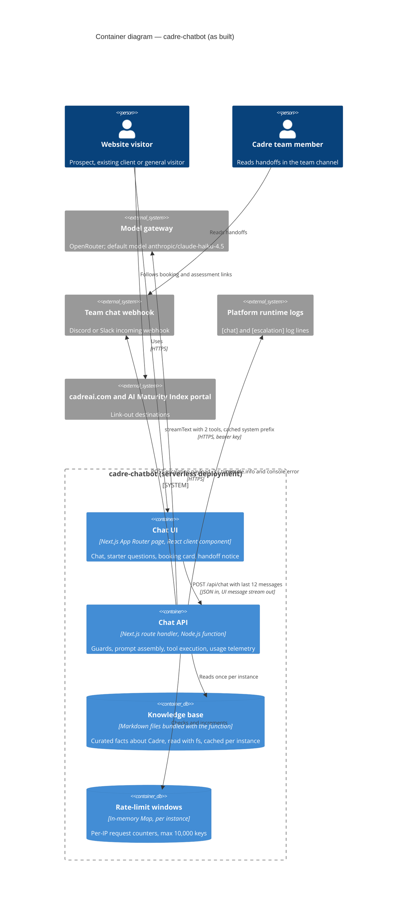

# Codebase Audit: cadre-chatbot

> **Template Origin**: Community | **ArcKit Version**: 6.16.3 | **Command**: `/arckit-repo:repo-audit`

## Document Control

| Field | Value |
|-------|-------|
| **Document ID** | ARC-001-CDAU-001-v1.0 |
| **Document Type** | Codebase Audit |
| **Project** | Cadre AI Support Chatbot — cadre-chatbot (Project 001) |
| **Classification** | OFFICIAL-SENSITIVE |
| **Status** | DRAFT |
| **Version** | 1.0 |
| **Created Date** | 2026-09-27 |
| **Last Modified** | 2026-09-27 |
| **Review Cycle** | On-Demand |
| **Next Review Date** | 2026-09-28 |
| **Owner** | Jhon Felipe Urrego — Solution Architect, Cadre AI Support Chatbot |
| **Reviewed By** | PENDING |
| **Approved By** | PENDING |
| **Distribution** | Repository owner; Cadre AI Engineering (need to know — contains exploitable weakness details for a live public service) |

## Revision History

| Version | Date | Author | Changes | Approved By | Approval Date |
|---------|------|--------|---------|-------------|---------------|
| 1.0 | 2026-09-27 | ArcKit AI | Initial creation from `/arckit-repo:repo-audit` command | PENDING | PENDING |

---

## 1. Audit Scope

| Field | Value |
|-------|-------|
| Target | https://github.com/johnfelipe/cadre-chatbot |
| Resolved source | Shallow clone (`--depth 100 --single-branch --no-tags --recurse-submodules=no`) into the session scratchpad; deleted after this report was written |
| Commit audited | `d63c3aca16858dcebb9a5945d227f1292c051d96` |
| Branch | `main` |
| History depth | Full: 63 commits (the depth-100 limit was not reached) |
| Audit date | 2026-09-27 |
| Mode | Conformance |
| Scored against | `projects/000-global/ARC-000-PRIN-v1.0.md`, `projects/001-cadre-chatbot/ARC-001-REQ-v1.0.md` (context: `ARC-001-STKE-v1.0.md`) |
| Dimensions covered | 1 Structure and stack · 2 As-built architecture · 3 Infrastructure as code · 4 Security posture · 5 Data · 6 Operability · 7 Resilience · 8 Delivery · 9 Documentation and decision record · 10 AI/LLM specifics |
| Dimensions skipped | None. IaC was assessed and found absent (F-018). |

**Project correspondence check (Step 3b).** Confirmed. The REQ artefact's Document Purpose names this repository. Its requirements cite components present in the tree (`app/api/chat/route.ts`, `lib/tools.ts`, `knowledge/`, `evals/`). The audited commit equals `HEAD` of the local checkout the REQ and PRIN artefacts were derived from, so conformance scoring applies. Those artefacts were written retrospectively from a lighter reading of the same code. Where this audit disagrees with their status markers, the disagreement is listed explicitly (Sections 7 and 8).

> **Point-in-time.** This audit reflects the repository at the commit above. Re-run after significant change.

---

## 2. Executive Summary

**Overall posture**: ⚠️ Material gaps

**Biggest single risk**: The server caps only *user* message length. An anonymous client can pad the client-supplied *assistant* turns of one request to about 250 KB and spend roughly 20–65× the cost of a normal turn. That exhausts the model-gateway credit, and takes the public bot offline, within minutes (F-001). Production currently runs on a personal OpenRouter key (`plan.md:103`), so that key's credit limit is the only financial ceiling.

**Findings**: 22 total: 1 CRITICAL, 3 HIGH, 8 MEDIUM, 10 LOW

**Blocking decisions**: 8 undocumented decisions requiring an ADR

**Recommendation**: REMEDIATE BEFORE PROCEEDING. F-001 is a small, contained code change and should land before the review-day traffic window. F-002 to F-004 must be closed before any production use on cadreai.com. The rest of the codebase is unusually well verified and documented for its age (Section 5).

---

## 3. Repository Profile

Facts only. No judgement in this section.

| Attribute | Value |
|-----------|-------|
| Primary languages | By line count, excluding `package-lock.json` and the favicon: TypeScript 62.2% (`.ts` 52.3%, `.tsx` 9.9%), Markdown 26.5%, JSON 4.0%, JavaScript (`.mjs`) 3.7%, YAML 1.9%, CSS 0.9% |
| Top-level structure | `app/` (page, layout, `api/chat` route), `components/` (chat UI), `lib/` (config, knowledge loader, prompt, tools, escalations, rate limit), `knowledge/` (9 Markdown files), `evals/` (runner + cases), `.claude/` (agents, commands, hooks, settings), `.github/workflows/` |
| Build tooling | Next.js 16.3.6 (`next build`), TypeScript 5.9.3 (`next typegen && tsc --noEmit`), ESLint 9.39.5 with `eslint-config-next` 16.3.6, Tailwind CSS 4.3.3 via `@tailwindcss/postcss`, npm (lockfile v3) |
| Package manifests | `package.json`, `package-lock.json`: 499 unique package versions (79 production, 420 development) |
| Test framework(s) | Vitest 5.0.2: 39 tests in 6 files (38 test blocks, one `it.each` with 2 cases). Custom behavioural eval runner `evals/run.ts` with 83 cases in `evals/cases.ts` (real model calls) |
| CI/CD | GitHub Actions: `.github/workflows/ci.yml` (verify job on push to `main`, pull requests and manual dispatch; eval job on manual dispatch only). Deployment: hosting-platform Git integration described in `plan.md:30`; no deployment configuration in the repository |
| IaC | None found |
| Licence | None found (no `LICENSE*` file, no `license` field in `package.json`) |
| Commits in audited range | 63 (48 on 2026-09-24, 15 on 2026-09-25) |
| Contributors in audited range | 1 |
| Most recent commit | 2026-09-25 (`d63c3ac`, "docs: record the escalation fix and the 83/83 run") |

---

## 4. As-Built Architecture

The code builds a **single Next.js application** deployed as serverless functions. It has two runtime parts.

1. **Chat UI**: a server-rendered page (`app/page.tsx`) that mounts a React client component (`components/Chat.tsx`). The component uses the AI SDK `useChat` hook, keeps the whole conversation in browser memory, and sends only the last 12 messages with each request (`components/Chat.tsx:26`). It renders assistant text as escaped text with safe auto-linking. Tool results are rendered as a booking card or a handoff notice.
2. **Chat API**: one route handler, `POST /api/chat` (`app/api/chat/route.ts:33-119`), on the Node.js runtime with a 30-second limit. It runs a fixed guard sequence: key present, same-origin check (browser requests only), per-IP fixed-window rate limit, declared body size, JSON parse, role schema, message count, UI-message validation, history trim, user-message length, non-empty latest message. It then assembles the system instructions (behaviour rules plus the full knowledge corpus, marked for prompt caching) and calls the model through the OpenRouter provider with two tools, capping output tokens and steps. The result streams back as an AI SDK UI message stream.

**State and data.** There is no database. The Markdown knowledge base is bundled with the function (`next.config.ts:12-14`), read with `fs`, and cached per instance (`lib/knowledge.ts:8-27`). Rate-limit windows live in an in-memory `Map` per instance (`lib/rate-limit.ts:5-7`). Escalations go to runtime logs and, when configured, a team-chat webhook (`lib/escalations.ts:54-85`). Nothing else persists.

**Integrations.** Two outbound calls happen at runtime:
- **Model gateway**: bearer key from an environment variable; the model id is configurable, defaulting to `anthropic/claude-haiku-4.5` (`lib/config.ts:2`).
- **Team webhook**: JSON POST with a 3-second timeout, no retry (`lib/escalations.ts:28, 70-82`).

Everything else is a link-out (the cadreai.com contact page, the AI Maturity Index assessment).

**AI/LLM specifics.**
- **Model coupling.** The model is swappable by environment variable, but the code carries Anthropic-specific assumptions: the `cacheControl` provider option (`route.ts:86-91`) and dropping leading non-user turns (`route.ts:121-126`).
- **Prompt management.** Prompts are version-controlled code (`lib/prompt.ts`) and knowledge is version-controlled Markdown.
- **Guardrails.** Guardrails are prompt rules only; there is no runtime output filter.
- **Evaluation.** The eval harness is regex-based, runs against a live deployment, and enforces a URL allowlist at evaluation time (`evals/run.ts:95-98`).
- **Cost controls.** Cost controls are central constants (`lib/config.ts:5-16`) plus prompt caching.
- **Data sent to the gateway.** Every call sends the full knowledge corpus, the rules, and up to 12 client-supplied turns. No provider-routing or data-collection preference is set in code (F-011).

**Component evidence**

| Component | Evidenced by | Notes |
|-----------|--------------|-------|
| Chat UI | `app/page.tsx:1-19`, `components/Chat.tsx:18-113` | Verified |
| Chat API | `app/api/chat/route.ts:18-119` | Verified |
| Tools (`get_booking_link`, `escalate_to_human`) | `lib/tools.ts:7-26` | Verified |
| Escalation recorder and webhook client | `lib/escalations.ts:4-85` | Verified |
| Knowledge base | `knowledge/*.md`, `lib/knowledge.ts:4-27`, `next.config.ts:12-14` | Verified |
| Rate-limit windows | `lib/rate-limit.ts:5-35` | Verified |
| Model gateway | `app/api/chat/route.ts:9, 82-96`, `lib/config.ts:2` | Verified in code; upstream provider selection is decided by gateway account settings (inferred) |
| Team chat webhook | `lib/escalations.ts:70-82`, `CLAUDE.md:65` | Verified in code; "Discord in production" is a documentation claim (`plan.md:52-54`) |
| Platform runtime logs | `app/api/chat/route.ts:97-113`, `lib/escalations.ts:68, 78, 80` | Verified in code; retention is not visible |
| Hosting and deploy pipeline | `plan.md:30`, `.gitignore:17` (`.vercel/`) | Inferred; no platform configuration is committed |
| CI | `.github/workflows/ci.yml:1-56` | Verified |
| Eval harness | `evals/run.ts:1-134`, `evals/cases.ts` | Verified |

**Divergences between docs and code**

- `plan.md:106` ("2000-char message cap") and `README.md:27` ("message length") describe a general cap. In code it applies to `role === "user"` turns only (`route.ts:72`). This matters: see F-001.
- `README.md:27` lists a "body size" guard. In code it trusts the declared `Content-Length` header (`route.ts:50`). See F-005.
- `README.md:37` says every knowledge fact carries its cadreai.com URL. In fact, 12 facts seeded from the brief carry only the file-level `Source:` line. No risky fact (number, price, URL) lacks a source.
- `.gitignore:3` whitelists `.env.example`, but no such file is committed. Environment variables are documented in prose only (`CLAUDE.md:62-66`, `README.md:60-66`).

---

## 5. Strengths

| # | Strength | Evidence |
|---|----------|----------|
| S-1 | **Layered API guard with complete rejection-path tests.** Guards are ordered cheapest first. Every rejection returns the JSON `{ error }` contract with a specific status, and a test asserts the model is never called for a rejected request. | `app/api/chat/route.ts:33-78`; `app/api/chat/route.test.ts:43-114` |
| S-2 | **No secrets anywhere in the repository or its history.** Ten credential patterns (gateway, Anthropic, generic `sk-` keys, Discord/Slack webhooks, GitHub, AWS, private keys, Vercel tokens, bearer tokens) returned 0 hits across all 63 commits. No sensitive filename was ever added. The key is read only in server code, and env files are ignored and denied to the coding agent. | Secret scan of `git rev-list --all`; `app/api/chat/route.ts:34`; `.gitignore:1-4`; `.claude/settings.json:27-30` |
| S-3 | **Deterministic tools for consequential values.** The booking URL comes from configuration, never from model text. Escalation input is schema-validated, including email format and an enum reason. | `lib/tools.ts:9-24`; `lib/config.ts:17-21`; `lib/escalations.ts:4-11` |
| S-4 | **Grounding with explicit gaps and a mechanical provenance control.** Unpublished topics are marked `[NOT PUBLISHED]`. A PreToolUse hook blocks unsourced risky facts, and 0 of the 56 `## Facts` bullets with numbers, prices or URLs lack a source. | `.claude/hooks/guard-knowledge.mjs:6-29`; `.claude/hooks/guard-knowledge.test.ts`; `knowledge/*.md` |
| S-5 | **A behavioural evaluation harness that tests the right things.** 83 cases cover the six scenarios, knowledge gaps, false premises, sycophancy, 18 injection/exfiltration cases, tool misuse, languages and the API contract. The runner checks answer URLs against the knowledge allowlist. | `evals/cases.ts`; `evals/run.ts:15-21, 95-98` |
| S-6 | **Cost engineering, measured rather than estimated.** Central caps, prompt caching on the static prefix (asserted in a unit test), per-request token and cache telemetry, and zero-cost unit tests with the model mocked. | `lib/config.ts:5-16`; `app/api/chat/route.ts:86-113`; `app/api/chat/route.test.ts:4-14, 117-129`; `plan.md:94-109` |
| S-7 | **XSS-safe rendering.** No `dangerouslySetInnerHTML` anywhere. Only `http(s)` URLs are linked, with `noopener noreferrer`, and the behaviour is unit-tested. | `components/Chat.tsx:155-180`; `components/Chat.test.tsx:8-31` |
| S-8 | **Exceptional decision and AI-workflow record.** A 13-row decisions table with "revisit when" triggers, an explicit known-limitations list, and a 13-entry mistakes log of AI-generated errors and how they were caught. Subagents run with scoped toolsets, and the hooks are themselves tested. | `plan.md:77-93, 110-124`; `CLAUDE.md:107-127`; `.claude/agents/*.md:4`; `.claude/hooks/*` |
| S-9 | **Disciplined, reviewable history.** 63 small commits over two days, 62 with conventional prefixes. Bot defects are fixed together with a regression eval (for example `4c091a0` with case `s6-human-request-then-email`). | `git log`; `evals/cases.ts:137-151` |
| S-10 | **Clean dependency snapshot.** OSV.dev reported 0 advisories for all 499 locked package versions on 2026-09-27, and the framework version is pinned exactly. | OSV `querybatch` over `package-lock.json`; `package.json:19, 30` |
| S-11 | **Handoff failures never break the conversation.** The webhook call is time-boxed and its failure is caught and logged with the escalation id. | `lib/escalations.ts:28, 70-82`; `lib/escalations.test.ts:81` |

---

## 6. Findings

**Severity rubric**

- **CRITICAL** — exploitable now, or data loss with no recovery path.
- **HIGH** — no exploit today, but no control either.
- **MEDIUM** — works, but will not scale or blocks safe handover.
- **LOW** — hygiene.

**Confidence**

- **Verified** — the code was read and the finding confirmed.
- **Inferred** — structural signal only (naming, layout, dependency presence).
- **Absent** — an expected artefact or control was not found anywhere in scope. Absence is the weakest evidence: state where you looked.

| ID | Dimension | Severity | Finding | Evidence | Confidence | Recommendation |
|----|-----------|----------|---------|----------|------------|----------------|
| F-001 | Security / Cost | CRITICAL | Only user turns are length-capped, so client-supplied assistant turns can fill the 256 KB body. One anonymous request then carries about 60–100k uncached input tokens, roughly $0.06–0.20 against about $0.003 for a normal cached turn at the model prices in `plan.md:97-98`. At that rate the key's credit, and with it the bot, is exhausted in about 25–80 requests, which is minutes at 10 requests/min from a single IP. The unit test and the eval case for oversized history both use a user turn. | `app/api/chat/route.ts:21-24, 50-52, 70-74, 92`; `app/api/chat/route.test.ts:67-73`; `evals/cases.ts:660-665` | Verified (cost figures are estimates) | Cap every turn regardless of role and add a total-character budget across the trimmed window. Add a unit test and an eval case for an oversized assistant turn. Today, confirm that the key serving production has a credit limit. |
| F-002 | Security / Cost | HIGH | Length checks count only `text` parts, but UI-message validation accepts other part types. User messages carrying `file` parts (data URLs or remote URLs) would reach the model, or be downloaded by the SDK, outside both the per-message and body caps. | `app/api/chat/route.ts:67, 92, 128-130`; no test or eval uses a non-text part (grep of `*.ts`, `*.tsx`) | Inferred (AI SDK validation and conversion behaviour) | Allowlist part types per role (user: `text`; assistant: `text` plus known tool parts) and reject anything else with 400. |
| F-003 | Resilience / Data | HIGH | A handoff is confirmed to the user even when it never reached the team. Webhook failures are swallowed, the tool always returns `ok: true`, and the UI says "Sent to the Cadre team". The only trace is a log line; there is no retry, alert or reconciliation, and the same happens when the webhook variable is unset. | `lib/escalations.ts:65-84`; `lib/tools.ts:20-23`; `components/Chat.tsx:139-143`; `lib/escalations.test.ts:81`; `plan.md:122-124` | Verified | Return `ok: false` with a fallback contact on delivery failure, or write to a durable queue with retries before confirming. Record the delivery guarantee (C-3). |
| F-004 | Security | HIGH | Client-controlled text is posted verbatim to the staff channel: name, question, conversation id, and transcript turns, including forged "assistant" turns from client history. Nothing neutralises mentions (`@everyone`, `<!channel>`), masked links or fabricated bot statements, and there is no per-conversation escalation cap or deduplication. | `lib/escalations.ts:38-52`; `app/api/chat/route.ts:22, 80-81, 132-137` | Verified in code; channel-side effects inferred | Disable mentions (for example Discord `allowed_mentions: { parse: [] }`, escaped Slack `<!…>`), defang links, and label transcript turns as unverified client content. Cap escalations per conversation and per email. |
| F-005 | Security | MEDIUM | The body-size guard trusts the declared `Content-Length`. With the header absent or non-numeric, `Number(...)` is `0` or `NaN` and the check passes, so `req.json()` reads the whole body up to the hosting platform's limit. | `app/api/chat/route.ts:50-56`; `app/api/chat/route.test.ts:103-108` tests only a declared oversize header | Verified in code; platform limit inferred | Enforce the cap on bytes actually read (a bounded stream reader) and reject a missing or invalid `Content-Length`. |
| F-006 | Security / Cost | MEDIUM | The Origin check applies only when the header is present, so any non-browser client passes; the eval runner depends on this. The per-IP limiter is per serverless instance. Scripted traffic from a handful of IPs can therefore drain the shared budget even with normal-sized requests. | `app/api/chat/route.ts:37-41`; `lib/rate-limit.ts:5-7`; `evals/run.ts:38-42`; `plan.md:85, 87, 111` | Verified | Decide the access model (C-2): a shared-store limiter with a daily spend counter, platform bot protection, and a separate key or preview deployment for eval traffic. |
| F-007 | Delivery | MEDIUM | Production deploys are not gated on CI. The Git integration deploys every push to `main`, while lint, typecheck and tests run in a workflow nothing requires. All 63 commits went straight to `main`, with no pull-request merges. | `plan.md:30`; `.github/workflows/ci.yml:3-38` (no deploy or required-check linkage); `git log --merges` returns 0 | Inferred (hosting and branch settings are not visible) | Require the CI check before production promotion (deployment protection or required status checks) and move eval runs to preview deployments. |
| F-008 | Security (supply chain) | MEDIUM | There is no dependency-vulnerability scanning or update automation. Actions are pinned to mutable tags and the workflow has no least-privilege `permissions:`. Dependencies are clean today (S-10), but nothing keeps them so. | `.github/workflows/ci.yml:29-30, 46-47` (no `permissions:` key); `.github/dependabot.yml` absent; `package.json:16-18, 22` (caret ranges) | Absent / Verified | Add Dependabot for npm and GitHub Actions, a dependency-review or `npm audit` step, SHA-pinned actions and `permissions: contents: read`. |
| F-009 | Data / Privacy | MEDIUM | Stream errors are logged as raw error objects. Provider API errors normally carry the full request body (knowledge prompt plus the user's conversation), so personal data can reach logs despite the content-free `[chat]` telemetry design. | `app/api/chat/route.ts:97` | Inferred (library error shape) | Log a sanitised error (name, HTTP status, provider code, conversation id) instead of the object. |
| F-010 | Data / Privacy | MEDIUM | No retention is documented or configured for logs or handoff records. Without a webhook, the full email is logged as the only copy of the request. | `lib/escalations.ts:65-68`; `lib/escalations.test.ts:49`; `plan.md:112-114`; no retention configuration in the repository | Verified / Absent | Define retention in a DPIA, mask emails in logs unconditionally, and make a durable handoff destination mandatory in production. |
| F-011 | AI / Data | MEDIUM | Third-party inference data handling is not pinned in code. No provider-routing or data-collection preference is sent to the gateway, so which upstream provider processes conversations, and under which retention terms, depends on account defaults. | `app/api/chat/route.ts:82-96` (only `cacheControl` is set); `plan.md:80` records the gateway choice but no data policy | Verified absence in code; account settings not visible | Set provider-routing and data-collection preferences explicitly, and record them in an ADR (C-6) and the DPIA. |
| F-012 | Operability | MEDIUM | Telemetry is log lines only. There is no health endpoint, metrics, dashboards, alerts, SLOs or incident runbooks; `plan.md` holds a release checklist only. | `app/api/chat/route.ts` is the only route under `app/`; no telemetry dependency in `package.json`; `plan.md:52-58` | Absent | Add a health check and alerts on `[escalation] webhook` failures, stream errors and spend, plus short runbooks (webhook down, key exhausted, provider outage). |
| F-013 | Data (grounding) | LOW | The provenance guard only inspects `## Facts` sections. `knowledge/services.md` (seven custom sections) and `company.md` "Getting started" sit outside it. Their current figures are sourced, but a new unsourced figure there would not be blocked. | `.claude/hooks/guard-knowledge.mjs:10-16`; `knowledge/services.md:7-58`; `knowledge/company.md:41` | Verified | Restructure those files under `## Facts` or make the guard check every bullet. |
| F-014 | Security / AI | LOW | The UI turns any `http(s)` URL the model writes into a clickable link. The "known URLs only" rule is enforced by the prompt and the eval runner, not at runtime. | `components/Chat.tsx:155, 170-180`; `lib/prompt.ts:14`; `evals/run.ts:95-98` | Verified | Link only allowlisted domains (knowledge plus configuration) and render other URLs as plain text. |
| F-015 | Resilience / Cost | LOW | The model call has no abort signal, so generation continues, and is billed, after the user presses Stop or leaves. It is bounded at 600 output tokens per step. | `app/api/chat/route.ts:84-114`; `abortSignal` and `req.signal` not found in `app/` or `lib/` | Verified / Absent | Pass `abortSignal: req.signal` to `streamText`. |
| F-016 | Resilience | LOW | A knowledge-load failure throws out of the handler and returns a framework 500 instead of the JSON `{ error }` contract. | `app/api/chat/route.ts:89`; `lib/knowledge.ts:8-18` | Verified | Wrap prompt assembly in `try`/`catch` and return `jsonError(500, …)`. |
| F-017 | Security | LOW | There is no Content-Security-Policy and no HSTS header in code; HSTS is left to the platform. | `next.config.ts:3-8` | Verified | Add a CSP (its `frame-ancestors` replaces `X-Frame-Options` when embedding on cadreai.com) and HSTS. |
| F-018 | IaC / Handover | LOW | Hosting configuration lives only in the platform UI. There is no IaC or platform config file, no `.env.example` (although `.gitignore` whitelists one), no Node `engines` field and no licence. | Repository root: `vercel.json`, `.env.example`, `LICENSE*` absent; `.gitignore:3`; `package.json:1-35`; `CLAUDE.md:62-66` | Absent | Commit `.env.example`, an `engines` field and a licence, and document or codify the platform settings (env vars, region, deployment protection, log retention). |
| F-019 | Delivery | LOW | Eval runs default to the production URL, and 4 cases trigger real escalations into the team channel, so test traffic mixes with real handoffs. | `.github/workflows/ci.yml:13-15`; `evals/run.ts:6`; `evals/cases.ts:126-136` (plus 3 more `expectTool: "escalate_to_human"`) | Verified | Point evals at a preview deployment with the webhook disabled, or tag eval conversations so the recorder skips the webhook. |
| F-020 | Security (dev tooling) | LOW | The coding agent's secret deny rules cover `Read`/`Edit` and `cat` only. Other shell readers and `git add -f` on ignored files are allowed, and the "read-only" `code-reviewer` subagent is granted `Bash`. | `.claude/settings.json:14-15, 27-33`; `.claude/agents/code-reviewer.md:4` | Inferred (permission-matching behaviour) | Add a sandbox `denyRead` for `.env*`, and drop `Bash` from the reviewer or restrict it to `git diff`/`git status`. |
| F-021 | Documentation | LOW | The docs have drifted from the code in small ways. The README says every fact carries a URL, and it and `plan.md` describe message-length and body-size guards more broadly than the code enforces. Eval cost is stated as about $0.006 per case against about $0.003 measured. | `README.md:27, 37`; `plan.md:106` vs `app/api/chat/route.ts:50, 72`; `.claude/commands/eval.md:8`, `.claude/agents/eval-runner.md:10` vs `plan.md:98` | Verified | Correct the statements in the same commits that fix F-001 and F-005. |
| F-022 | Security | LOW | The rate-limit key trusts the first `X-Forwarded-For` value, which is spoofable on hosts that don't overwrite it. Requests carrying neither header share one `"unknown"` bucket. | `lib/rate-limit.ts:32-35` | Inferred (depends on the host's proxy behaviour) | Use the platform's trusted client-IP source and document that dependency. |

---

## 7. Principles Conformance

Source: `projects/000-global/ARC-000-PRIN-v1.0.md`

| Principle | Statement | Verdict | Evidence | Gap |
|-----------|-----------|---------|----------|-----|
| P-01 | Focused scope, explicitly bounded | Met | `plan.md:11-24`; `lib/prompt.ts:27` | — |
| P-02 | Human handoff over guessing | Partial | `lib/tools.ts:16-24`; `lib/escalations.ts:70-84`; `components/Chat.tsx:139-143` | The handoff is confirmed even when delivery failed (F-003) |
| P-03 | Route intent to the right conversation | Met | `lib/tools.ts:9-14`; `lib/config.ts:19` | Attribution is an outcome gap, not a principle gap |
| P-04 | Grounded answers from a single curated source of truth | Met | `lib/prompt.ts:7-8`; `knowledge/*.md` (`[NOT PUBLISHED]`); `evals/cases.ts` (`ground-*`, `gap-*`) | Runtime enforcement is prompt-only, by design |
| P-05 | Provenance for every fact | Partial | `.claude/hooks/guard-knowledge.mjs:10-25` | Guard scope limited to `## Facts` sections (F-013) |
| P-06 | Separation of behaviour, knowledge and configuration | Met | `lib/prompt.ts`; `lib/config.ts:1-22`; `lib/prompt.test.ts:27` | — |
| P-07 | Deterministic actions through typed tools | Partial | `lib/tools.ts:9-24` vs `components/Chat.tsx:155-180` | Any model-written URL becomes a link; the URL rule is not enforced at runtime (F-014) |
| P-08 | Right-sized, replaceable models | Met | `lib/config.ts:2, 4`; `plan.md:80-82` | Anthropic-specific options (`route.ts:86-91, 121-126`) make a model-family swap non-trivial |
| P-09 | Simplest knowledge-access strategy | Met | `lib/knowledge.ts:8-27`; `app/api/chat/route.ts:86-91`; `plan.md:83-84` | — |
| P-10 | Behavioural evaluation as a release gate | Partial | `evals/run.ts`; `.github/workflows/ci.yml:40-56` | Evals are manual dispatch only, not wired to release (F-007); results exist only as prose in `plan.md`; assertions are regex-only |
| P-11 | Privacy by design and data minimisation | Partial | No browser storage APIs (grep of `app/`, `components/`, `lib/`); `lib/escalations.ts:65-68`; `app/api/chat/route.ts:97` | F-009, F-010, F-011 |
| P-12 | Single system of record per data domain | Partial | `lib/escalations.ts:65-84` | The handoff system of record is a best-effort webhook plus logs (F-003) |
| P-13 | Security by design (non-negotiable) | Partial | `app/api/chat/route.ts:33-78`; `next.config.ts:3-8`; secret scan clean | F-001, F-002, F-004, F-005, F-008 |
| P-14 | Validate every input at the boundary | Partial | `app/api/chat/route.ts:50, 72, 128-130` | Caps miss assistant turns, non-text parts and undeclared body size |
| P-15 | Loose coupling through standard, minimal interfaces | Met | Single endpoint (`route.ts:33`); generic webhook payload (`lib/escalations.ts:51`) | Payload content safety is covered under F-004 |
| P-16 | Cost as a first-class architectural constraint | Partial | `lib/config.ts:5-16`; `app/api/chat/route.ts:86-96` | Amplification (F-001, F-002); no abort (F-015); no shared spend counter |
| P-17 | Stateless compute with an explicit scaling path | Partial | `lib/rate-limit.ts:5-7`; `plan.md:72-76, 111` | Per-instance limiter state is documented, by design |
| P-18 | Observability of every model interaction | Partial | `app/api/chat/route.ts:98-113` | No metrics, alerts or SLOs (F-012); raw error logging (F-009) |
| P-19 | Accessible, resilient user experience | Met | `components/Chat.tsx:62, 77-83, 92-105` (labelled input, 44 px targets, error and retry) | No `aria-live` region; accessibility audit pending |
| P-20 | AI-augmented development with explicit context and guardrails | Met | `CLAUDE.md:83-127`; `.claude/settings.json`; `.claude/agents/*.md`; `.claude/hooks/*` with tests | Minor deny-rule gaps (F-020) |
| P-21 | Automated verification before every change | Partial | `.github/workflows/ci.yml:25-38` | Production deploys are not gated on CI (F-007) |
| P-22 | Continuous delivery in small, traceable steps | Met | 63 commits, 62 conventional; `plan.md:30` | The post-deploy smoke test is manual |
| P-23 | Transparent decisions and honest limitations | Partial | `plan.md:77-93, 110-124` | 8 decisions implied by the code are unrecorded (Section 9) |

**Summary**: 10 Met, 13 Partial, 0 Not met, 0 Not evidenced.

**Status corrections for ARC-000-PRIN-v1.0.** Its Appendix marks P-02, P-05, P-07, P-14, P-16, P-21 and P-23 as "✅ Aligned". This audit rates them Partial for the reasons above.

---

## 8. Requirements Coverage

Source: `projects/001-cadre-chatbot/ARC-001-REQ-v1.0.md` (80 requirements). Sorted with Not met first. **⇄** marks a verdict that disagrees with the status recorded in REQ v1.0.

| Requirement | Verdict | Implementing component | Evidence | Gap |
|-------------|---------|------------------------|----------|-----|
| INT-006 CRM | Not met | — | Not found in `lib/`, `app/`, `package.json` | Deferred by design (`plan.md:127`) |
| DR-005 Retention | Not met | — | No retention configuration or documentation in the repository | F-010 |
| NFR-F-003 Upstream spend ceiling | Not evidenced ⇄ | Gateway account (outside the repository) | `plan.md:85, 103` (documentation claims only) | This is account configuration; production runs on a personal key, so confirm its limit |
| BR-001 Common inquiries | Partial | Chat API, knowledge, evals | `knowledge/*.md`; `evals/cases.ts` (`s1-`–`s6-` cases) | The self-resolution metric is not implemented |
| BR-002 Zero ungrounded claims | Partial | Prompt rules, knowledge, evals | `lib/prompt.ts:7-8, 14`; `.claude/hooks/guard-knowledge.mjs` | Prompt-only at runtime; guard scope (F-013); no answer sampling |
| BR-003 Convert intent | Partial | Booking tool | `lib/tools.ts:9-14` | No attribution |
| BR-004 Human handoff | Partial ⇄ | Escalation tool | `lib/escalations.ts:54-85` | False confirmation on delivery failure (F-003) |
| BR-005 Budget and live window | Partial | Config caps | `lib/config.ts:5-16` | Amplification (F-001); key switch pending (`plan.md:56`) |
| BR-007 Private measurement | Partial | `[chat]` telemetry | `app/api/chat/route.ts:98-113` | No dashboard or attribution |
| FR-015 Truthful handoff confirmation | Partial ⇄ | Tool plus UI notice | `lib/tools.ts:20-23`; `components/Chat.tsx:139-143` | `ok: true` regardless of delivery (F-003) |
| FR-025 Knowledge via version control | Partial ⇄ | Provenance hook | `.claude/hooks/guard-knowledge.mjs:10-16` | Guard misses non-`## Facts` sections (F-013) |
| NFR-P-001 Response time | Partial | Latency telemetry | `app/api/chat/route.ts:103` | No p95 reporting; no time-to-first-token |
| NFR-P-002 Per-client rate | Partial | Rate limiter | `lib/rate-limit.ts:11-35` | Per instance (F-006) |
| NFR-P-003 Bounded work per request | Partial ⇄ | Caps in config and route | `lib/config.ts:5-12`; `app/api/chat/route.ts:72, 94-96` | Assistant turns and non-text parts uncapped (F-001, F-002); no abort (F-015) |
| NFR-A-001 Availability | Partial | — | No monitoring in the repository | F-012 |
| NFR-A-002 Disaster recovery | Partial | Git, platform rollback | `plan.md:30` | REQ cites `.env.example`, which does not exist (F-018); no runbook |
| NFR-A-003 Fault tolerance | Partial | Webhook timeout, knowledge cache reset | `lib/escalations.ts:28, 76`; `lib/knowledge.ts:9-12` | No retry queue or alerting |
| NFR-S-001 Horizontal scaling | Partial | Stateless route | `lib/rate-limit.ts:5-7` | Per-instance state (by design) |
| NFR-SEC-001 Authentication and authorisation | Partial | Origin check | `app/api/chat/route.ts:37-41` | Non-browser clients unrestricted (F-006); MFA on accounts not evidenced |
| NFR-SEC-003 Input validation | Partial ⇄ | Route guards | `app/api/chat/route.ts:50, 67, 72` | F-001, F-002, F-005 |
| NFR-SEC-004 Output safety | Partial ⇄ | Renderer | `components/Chat.tsx:155-180`; `components/Chat.test.tsx:8-31` | Rendering is safe, but the URL allowlist is not enforced at runtime (F-014) |
| NFR-SEC-005 Security headers | Partial | Next config | `next.config.ts:3-8` | No CSP or HSTS (F-017) |
| NFR-SEC-007 Vulnerability management | Partial | CI | `.github/workflows/ci.yml:52-56` (safe inputs) | No scanning, update automation or `permissions:` (F-008) |
| NFR-SEC-008 Dev-tooling guardrails | Partial ⇄ | Claude Code settings | `.claude/settings.json:3-34` | Deny coverage gaps (F-020) |
| NFR-C-001 Privacy compliance | Partial | Escalation masking | `lib/escalations.ts:30-33, 65-68` | F-009, F-010, F-011; no DPIA |
| NFR-C-002 Handoff audit logging | Partial | `[escalation]` log | `lib/escalations.ts:68, 78, 80` | No reconciliation |
| NFR-C-003 AI transparency | Partial | Page header | `app/page.tsx:8-11`; `lib/prompt.ts:31` | No explicit AI disclosure text |
| NFR-U-002 Accessibility | Partial | Chat UI | `components/Chat.tsx:94` | No `aria-live`; no audit |
| NFR-M-001 Observability | Partial | Telemetry | `app/api/chat/route.ts:97-113` | No metrics or alerts (F-012); raw error logging (F-009) |
| NFR-M-003 Runbooks | Partial | `plan.md` checklist | `plan.md:52-58` | No incident runbooks |
| NFR-M-004 Automated quality gates | Partial ⇄ | CI | `.github/workflows/ci.yml:25-38` | Deploy not gated (F-007) |
| NFR-F-001 Hard cost caps | Partial ⇄ | Config caps | `lib/config.ts:5-16`; `app/api/chat/route.ts:50, 72` | F-001, F-002, F-005 |
| INT-002 Team webhook | Partial ⇄ | Escalation recorder | `lib/escalations.ts:38-82` | No retry (F-003); unsanitised content (F-004) |
| INT-005 CI and hosting | Partial ⇄ | CI, platform Git deploy | `.github/workflows/ci.yml`; `plan.md:30` | Deploy not gated (F-007); platform config not in repository (F-018) |
| DR-001 Knowledge provenance | Partial ⇄ | Provenance hook | `.claude/hooks/guard-knowledge.mjs:6-25` | F-013 |
| DR-004 PII minimisation | Partial | Masking, telemetry without content | `lib/escalations.ts:65-68`; `app/api/chat/route.ts:98-113` | Full email without a webhook (F-010); raw error logging (F-009) |
| DR-006 Knowledge freshness | Partial | `Source:` lines with fetch date | `knowledge/*.md:3-5` | No refresh schedule |
| BR-006 Required artefacts | Met | `CLAUDE.md`, `plan.md`, git history | Repository root; `git log` | The submission zip is outside the repository's scope |
| BR-008 Ownable system | Met | Docs, CI, decisions | `README.md`; `CLAUDE.md`; `plan.md:77-93`; `.github/workflows/ci.yml` | — |
| FR-001 Streaming chat | Met | Chat UI | `components/Chat.tsx:30-33, 97-109` | — |
| FR-002 Starter questions | Met | Chat UI | `components/Chat.tsx:8-14, 53-68` | — |
| FR-003 Grounded answers | Met | Knowledge loader, prompt | `lib/knowledge.ts`; `lib/prompt.ts:7-8` | — |
| FR-004 Unpublished information | Met | Knowledge, prompt | `knowledge/*.md` (`## Not published`); `lib/prompt.ts:8` | — |
| FR-005 False premises | Met | Prompt, evals | `lib/prompt.ts`; `evals/cases.ts` (`ground-*`, `gap-false-premise-*`) | History forgery is mitigated, not closed (C-1) |
| FR-006 Overview and industry | Met | Knowledge | `knowledge/company.md`, `industries.md`, `services.md` | — |
| FR-007 Booking tool and card | Met | Tool, UI | `lib/tools.ts:9-14`; `components/Chat.tsx:135-137, 182-193` | — |
| FR-008 Proactive booking | Met | Prompt, evals | `lib/prompt.ts`; `evals/cases.ts` (`tool-indirect-booking-intent`, `tool-explicit-decline-booking`) | — |
| FR-009 Portal guidance | Met | Knowledge | `knowledge/portal.md` | — |
| FR-010 AI Maturity Index | Met | Knowledge | `knowledge/maturity-index.md` | — |
| FR-011 LLM and security | Met | Knowledge | `knowledge/llm-and-security.md` | — |
| FR-012 Pricing routed | Met | Knowledge, prompt | `knowledge/pricing.md` | — |
| FR-013 Human request flow | Met | Prompt | `lib/prompt.ts:19-24` | — |
| FR-014 Escalation tool | Met | Tool, recorder | `lib/escalations.ts:4-11`; `lib/tools.ts:16-24`; `app/api/chat/route.ts:132-137` | — |
| FR-016 Email declined | Met | Prompt, evals | `evals/cases.ts` (`tool-user-refuses-email`) | — |
| FR-017 Scope boundaries | Met | Prompt, evals | `lib/prompt.ts:27-30`; `evals/cases.ts` (`oos-*`) | — |
| FR-018 Injection resistance | Met | Prompt, evals | `lib/prompt.ts:31-32`; 18 injection/exfiltration cases | REQ says "20+"; the actual count is 18 |
| FR-019 User's language | Met | Prompt | `lib/prompt.ts:35`; `evals/cases.ts` (`lang-*`, `spanish`) | — |
| FR-020 Clarification | Met | Prompt, evals | `evals/cases.ts` (`input-*`) | — |
| FR-021 Multi-turn context | Met | History window | `app/api/chat/route.ts:122-126`; `evals/cases.ts` (`multi-*`) | — |
| FR-022 Style and safe rendering | Met | Renderer | `components/Chat.tsx:152-180`; `components/Chat.test.tsx` | — |
| FR-023 Error and retry states | Met | Chat UI | `components/Chat.tsx:77-83, 92, 103-109, 203-211` | — |
| FR-024 Ephemeral conversations | Met | Chat UI | No storage APIs found in `app/`, `components/`, `lib/` | — |
| NFR-S-002 Knowledge volume | Met | Full-context loader | `lib/knowledge.ts`; `plan.md:83` | — |
| NFR-SEC-002 Secrets management | Met | Environment-only key | `app/api/chat/route.ts:34`; secret scan clean; `.gitignore:1-4` | Dev-tooling gaps (F-020) |
| NFR-SEC-006 Injection eval coverage | Met | Evals | 17 `sec-*` cases plus `prompt-injection` | Correct "20+" to 18 in REQ |
| NFR-U-001 User experience | Met | Chat UI | `components/Chat.tsx:62, 95-105` (44 px targets); `app/page.tsx:6` (`h-dvh`) | The mobile pass is a documentation claim (`plan.md:51-52`) |
| NFR-U-003 Localisation | Met | Prompt | `lib/prompt.ts:35` | — |
| NFR-M-002 Documentation | Met | Docs | `README.md`; `CLAUDE.md`; `plan.md` | Drift (F-021) |
| NFR-M-005 Eval suite | Met | Eval harness | `evals/run.ts`; `evals/cases.ts` (83 cases) | No LLM judge |
| NFR-M-006 AI-assisted workflow | Met | `.claude/` | `.claude/agents/*`, `commands/*`, `hooks/*` | — |
| NFR-I-001 API standards | Met | Route | `app/api/chat/route.ts:29-31, 116-118`; `plan.md:60-70` | — |
| NFR-I-002 Model portability | Met | Config | `lib/config.ts:2` | Anthropic-specific options (P-08 note) |
| NFR-I-003 Data portability | Met | Webhook payload | `lib/escalations.ts:51` | — |
| NFR-F-002 Prompt caching | Met | Route | `app/api/chat/route.ts:86-91`; `app/api/chat/route.test.ts:127` | — |
| NFR-F-004 Zero-cost tests | Met | Vitest mocks | `app/api/chat/route.test.ts:4-14` | — |
| INT-001 Model gateway | Met | Route | `app/api/chat/route.ts:82-96` | Data policy not pinned (F-011) |
| INT-003 Booking page | Met | Config, tool | `lib/config.ts:19`; `lib/tools.ts:13` | No attribution |
| INT-004 AI Maturity Index | Met | Knowledge | `knowledge/maturity-index.md` | — |
| DR-002 Escalation schema | Met | Recorder | `lib/escalations.ts:4-26` | — |
| DR-003 No persistence | Met | Architecture | No database dependency in `package.json`; no storage APIs | — |

**Summary**: 77 of 80 requirements evidenced in code (43 Met, 34 Partial). 2 Not met; 1 Not evidenced (account configuration).

**Corrections for ARC-001-REQ-v1.1.**
- **Status changes (13):**
  - BR-004, FR-015, FR-025, NFR-P-003, NFR-SEC-003, NFR-SEC-004, NFR-SEC-008, NFR-M-004, NFR-F-001, INT-002, INT-005 and DR-001: ✅ → Partial
  - NFR-F-003: ✅ → Not evidenced
- **Text corrections:**
  - Remove the `.env.example` reference from NFR-A-002.
  - Change the injection-case count in NFR-SEC-006 and FR-018 from "20+" to 18.
  - Add the raw-error-logging caveat (F-009) to NFR-M-001 and DR-004.

---

## 9. Blocking Decisions

Decisions the codebase implies but never records. Each is a ready-to-file ADR. Hand to `/arckit:adr`.

### C-1: Trust boundary for client-held conversation history

- **Context found in repo**: The browser owns the conversation and sends up to 12 turns, which the server validates structurally but trusts in content. Assistant turns and non-text parts are not bounded, and forged assistant turns flow into the model and into staff-facing transcripts (`app/api/chat/route.ts:21-24, 67-74, 92, 132-137`; `components/Chat.tsx:26`). `plan.md:117-120` acknowledges forgery only as an answer-integrity issue.
- **Options visible from the code**: (a) Keep client-held history but bound every turn and part type (a small change in `route.ts`). (b) Have the server sign the assistant turns it produced and reject unsigned ones. (c) Keep history server-side (session store keyed by conversation id) and accept only the new user message.
- **Why it blocks**: F-001, F-002 and F-004 can't be fixed consistently without it, and any future privileged tool would inherit the same forgeable context.
- **Suggested ADR title**: "Treat client-supplied conversation history as untrusted: validation and ownership model"

### C-2: Access and abuse-control model for the public chat API

- **Context found in repo**: Non-browser callers are deliberately allowed so the eval runner works (`app/api/chat/route.ts:37-41`; `evals/run.ts:38-42`). The only other controls are a per-instance IP limiter and the gateway credit limit (`lib/rate-limit.ts:5-7`; `plan.md:85, 87`).
- **Options visible from the code**: (a) Require a secret header or token for non-browser callers and run evals against a preview deployment with its own key. (b) Add platform bot protection or firewall rules. (c) Use a shared-store limiter plus a daily spend counter. (d) Accept the risk while bounded by a low credit limit.
- **Why it blocks**: Cost and availability depend on it (F-006), and the eval pipeline design (F-019) follows from it.
- **Suggested ADR title**: "Abuse protection and non-browser access for the public chat API"

### C-3: Handoff delivery guarantee and confirmation semantics

- **Context found in repo**: Delivery is at-most-once and best-effort, the user is told the handoff succeeded regardless, and logs are the silent fallback (`lib/escalations.ts:65-84`; `lib/tools.ts:20-23`; `components/Chat.tsx:139-143`). `plan.md:88` records the channel choice, but not the guarantee.
- **Options visible from the code**: (a) Confirm only on webhook success and show a fallback contact otherwise. (b) Use a durable queue with retries and confirm on enqueue. (c) Write to a CRM API as the system of record.
- **Why it blocks**: BR-004 and FR-015 can't be verified until the expected guarantee is stated (F-003).
- **Suggested ADR title**: "Escalation delivery guarantee and user confirmation"

### C-4: Handling untrusted content in staff-facing notifications

- **Context found in repo**: Name, question, conversation id and transcript text are interpolated into chat-platform markup unescaped (`lib/escalations.ts:38-52`).
- **Options visible from the code**: (a) Neutralise mentions and links, and label client-supplied transcript content. (b) Send only server-verified fields (question and reason) and link to the transcript elsewhere. (c) Move handoffs to a system that renders plain text.
- **Why it blocks**: It determines the fix for F-004 and the staff-side threat model.
- **Suggested ADR title**: "Sanitisation policy for user content in team notifications"

### C-5: Logging, PII and retention policy

- **Context found in repo**: Logs carry masked or unmasked emails depending on configuration (`lib/escalations.ts:65-68`). Raw error objects are logged (`app/api/chat/route.ts:97`). No retention is defined anywhere.
- **Options visible from the code**: (a) Always mask personal data and log sanitised errors, with a defined retention. (b) Route logs to a drain with enforced retention and access control. (c) Keep the status quo for demo scale only, with an expiry date.
- **Why it blocks**: DR-004, DR-005 and NFR-C-001 need it, and the DPIA can't conclude without it (F-009, F-010).
- **Suggested ADR title**: "Logging, personal-data and retention policy"

### C-6: Inference provider routing and data handling

- **Context found in repo**: All conversations go through one gateway with no routing or data-collection preferences (`app/api/chat/route.ts:82-96`). `plan.md:80` records only the transport choice.
- **Options visible from the code**: (a) Set provider-routing and data-collection preferences per request. (b) Set them at gateway-account level and document them. (c) Call the model vendor directly under its enterprise terms.
- **Why it blocks**: The privacy posture and the answer to "Cadre's approach to data security" (FR-011) should hold for Cadre's own bot (F-011).
- **Suggested ADR title**: "Inference provider routing and data-retention policy"

### C-7: Production release gating and environments

- **Context found in repo**: Every push to `main` deploys to production (`plan.md:30`), CI runs independently (`.github/workflows/ci.yml:3-38`), and evals target production by default (`.github/workflows/ci.yml:13-15`).
- **Options visible from the code**: (a) Require CI checks before promotion (deployment protection or required checks). (b) Deploy from CI after the verify job. (c) Use a preview-first flow with evals on preview and manual promotion.
- **Why it blocks**: P-10 and P-21 rely on gates that don't currently gate anything (F-007, F-019).
- **Suggested ADR title**: "Production release gating and environment strategy"

### C-8: Dependency and CI supply-chain policy

- **Context found in repo**: Caret dependency ranges (`package.json:16-18, 22`), tag-pinned actions, no workflow `permissions:`, and no scanning or update automation (`.github/workflows/ci.yml:29-30, 46-47`).
- **Options visible from the code**: (a) Dependabot plus dependency review plus SHA-pinned actions with least-privilege permissions. (b) A scheduled `npm audit` job with an alert. (c) Pinning plus a documented manual update cadence.
- **Why it blocks**: NFR-SEC-007 has no control to test against (F-008).
- **Suggested ADR title**: "Dependency and CI supply-chain policy"

Decisions already recorded informally in `plan.md:77-93` (model, temperature, full-context knowledge, prompt caching, spend cap, config-sourced URLs, in-memory limiter, webhook channel, language, no persistence, history window, empty-message handling) are **not blocking**, but should be promoted to formal ADRs so conformance can be checked against them.

---

## 10. Recommended Next Actions

| # | Action | Command | Rationale |
|---|--------|---------|-----------|
| 1 | Bound every turn (all roles) with a total-character budget, allowlist part types, enforce the real body size, and add a unit test plus an `api-oversized-assistant-turn` eval | `/ship` (the cadre-chatbot repository's own Claude Code command), after `/log-decision` for C-1 | Closes F-001, F-002 and F-005: exploitable now, small change |
| 2 | Confirm a credit limit on the key serving production, then do the planned switch to the challenge key with a **redeploy** and smoke test (`plan.md:56`) | Manual (gateway and hosting dashboards) | Bounds the financial and availability impact of F-001 and F-006 before review traffic |
| 3 | Record C-1 to C-8 as ADRs, starting with C-1, C-3, C-2 | `/arckit:adr` | The fixes need a recorded trust, delivery and abuse model |
| 4 | Promote F-001 to F-004 (and F-006, F-007) to the risk register | `/arckit:risk` | Tracks owners and mitigations |
| 5 | Make handoff confirmation truthful and sanitise notification content | `/ship` (app repository) | Closes F-003 and F-004 |
| 6 | Apply the REQ v1.1 and PRIN status corrections from Sections 7 and 8 | `/arckit:requirements`, `/arckit:principles-compliance` | Keeps the governance record consistent with the code |
| 7 | Run a DPIA covering logs, retention, the inference provider and handoff data | `/arckit:dpia` | F-009, F-010, F-011; a prerequisite for production |
| 8 | Gate releases on CI, add supply-chain controls, alerts and runbooks | `/arckit:devops`, `/arckit:operationalize` | F-007, F-008, F-012 |
| 9 | Run an LLM-specific architecture review (guardrails, evaluation, inference data flows) | Install the `arckit-agent-architecture` overlay: `claude plugin install arckit-agent-architecture@arckit-claude` | Dimension 10 is material for this repository |
| 10 | Re-check conformance once ADRs exist, then re-run this audit after remediation | `/arckit:conformance`, `/arckit-repo:repo-audit https://github.com/johnfelipe/cadre-chatbot` | Confirms the closures |

---

## 11. Limitations

- The full history (63 commits) was available; nothing was truncated.
- **No code was executed.** Unit tests, the build and evals were not run. Test counts come from reading the test files. Pass rates (for example "83/83") and measured costs are the author's records in `plan.md`/`README.md` and were not reproduced.
- **Live configuration is not visible.** This includes:
  - hosting project settings (environment variables, region, deployment protection, required checks, log retention, request-size limits)
  - GitHub branch protection
  - gateway key credit limits and data-collection settings
  - team-channel webhook permissions

  Findings that depend on them are marked Inferred.
- **Library and platform behaviour was inferred**, not verified against installed sources: AI SDK part validation and file handling (F-002), provider error serialisation (F-009), proxy header handling (F-022), and chat-platform mention rendering (F-004). `node_modules` is absent from the clone and nothing was installed, per the audit rules.
- **Paths read in full**: `app/api/chat/route.ts`, `app/api/chat/route.test.ts`, `lib/*.ts`, `evals/run.ts`, `next.config.ts`, `package.json`, `.github/workflows/ci.yml`, `.claude/settings.json`, `.claude/hooks/*.mjs`, `.gitignore`, `app/layout.tsx`, `app/page.tsx`.
- **Paths read by targeted grep or partial read**: `components/Chat.tsx` (fully read in an earlier session pass against the same commit), `evals/cases.ts` (ids and selected cases, not every regex), `knowledge/*.md` (structure, sources and selected sections; factual accuracy against cadreai.com was not re-verified), `README.md`, `CLAUDE.md`, `plan.md`, `.claude/agents/*.md`, `.claude/commands/eval.md`.
- **Paths not read**: `app/globals.css`, `app/favicon.ico`, `postcss.config.mjs`, `tsconfig.json` beyond the `strict`/`target` keys, `eslint.config.mjs` rules beyond its presets, and most of `package-lock.json` (used only for the dependency list).
- **Submodules skipped**: none present.
- **Generated and vendored directories excluded**: none present in the clone (`node_modules/`, `.next/`, `.vercel/` are git-ignored).
- The OSV dependency result is a point-in-time snapshot (2026-09-27) and includes development dependencies.
- The local working tree the governance artefacts were derived from has an uncommitted `.gitignore` change. It is outside this audit, which covers the pushed commit only.
- Cost figures in F-001 are estimates from token-density assumptions and the prices recorded in `plan.md:97-98`; verify them against current gateway pricing.

---

**Generated by**: ArcKit `/arckit-repo:repo-audit` command
**Generated on**: 2026-09-27
**ArcKit Version**: 6.16.3
**Project**: Cadre AI Support Chatbot — cadre-chatbot (Project 001)
**Model**: Claude Opus 5.5 (claude-opus-5-5)
