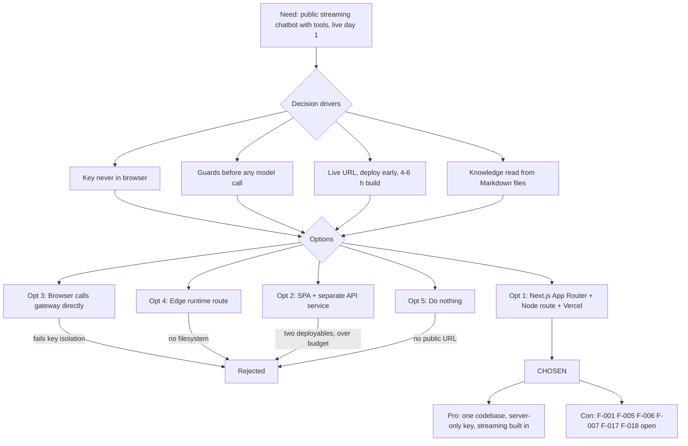

# Architecture Decision Record: Use Next.js 16 App Router With a Single Streaming Route Handler on Vercel

> **Template Origin**: Official | **ArcKit Version**: 6.16.3 | **Command**: `/arckit:adr`

## Document Control

| Field | Value |
|-------|-------|
| **Document ID** | ARC-001-ADR-001-v1.0 |
| **Document Type** | Architecture Decision Record |
| **Project** | Cadre AI Support Chatbot — cadre-chatbot (Project 001) |
| **Classification** | OFFICIAL |
| **Status** | DRAFT |
| **Version** | 1.0 |
| **Created Date** | 2026-09-28 |
| **Last Modified** | 2026-09-28 |
| **Review Cycle** | Monthly |
| **Next Review Date** | 2026-10-28 |
| **Owner** | Jhon Felipe Urrego — Solution Architect, Cadre AI Support Chatbot |
| **Reviewed By** | [PENDING] |
| **Approved By** | [PENDING] |
| **Distribution** | Project Team, Architecture Team |

## Revision History

| Version | Date | Author | Changes | Approved By | Approval Date |
|---------|------|--------|---------|-------------|---------------|
| 1.0 | 2026-09-28 | ArcKit AI | Initial creation from `/arckit:adr` command (retrospective, as-built at commit `d63c3ac`) | [PENDING] | [PENDING] |

---

## 1. Decision Title

**Use Next.js 16 App Router (React 19) With a Single Streaming Route Handler `POST /api/chat`, Deployed on Vercel**

| Attribute | Value |
|-----------|-------|
| **ADR Number** | ADR-001 |
| **Decision Status** | **Accepted** (retrospective record of an implemented decision) |
| **Decision Date** | 2026-09-24 (stack recorded in commit `8e504ac`; app scaffolded in `25f59c2`; route added in `0e87a40`) |
| **Recorded** | 2026-09-28, against repository commit `d63c3ac` |
| **Escalation Level** | Team |
| **Governance Forum** | Builder self-review via `plan.md` decisions log, then the take-home review panel (day-5 live review) |

> **Retrospective record.** This ADR describes what the code does at `d63c3ac`. The repository records the choice (`CLAUDE.md` "Stack", commit `8e504ac`) but not a written comparison of alternatives. The rejected options in Section 5 are **reconstructed from what the code and the hard constraints rule out**, and are labelled as such. Paths listed in the application's `.gitignore` were not reviewed.

---

## 2. Stakeholders

### 2.1 Deciders (RACI: Accountable)

- **Jhon Felipe Urrego, Solution Architect / Builder** — chose and implemented the stack within the 3-day challenge window (SD-13).

### 2.2 Consulted (RACI: Consulted)

- **Cadre AI Engineering (Chief AI Officer, AI engineers)** — future technical owner; the stack has to be ownable by them (SD-5, BR-008).
- **Take-home Review Panel** — assesses system design (25%) and code quality (15%) [CACTHC-C11].

### 2.3 Informed (RACI: Informed)

- Cadre AI Executive Leadership (brand risk, go-live)
- Finance (hosting and model run cost, SD-8)
- Marketing / Website owner (future embedding on cadreai.com)
- Talent / Recruiting (submission and live URL)

### 2.4 UK Government Escalation Context

**Decision Level**: Team

**Escalation Rationale**:

- [x] **Team**: Local implementation choice (framework, runtime, hosting for a single-engineer MVP)
- [ ] **Cross-team**: Integration patterns, shared services, API standards
- [ ] **Department**: Technology standards, cloud providers, security frameworks
- [ ] **Cross-government**: National infrastructure, cross-department interoperability

Cadre AI is a private company, so UK Government escalation tiers are used only as a scale. The decision affects one repository and one deployment and does not set a company-wide standard.

**Governance Forum**: `plan.md` "Decisions & trade-offs" (the repo's decisions log), reviewed at the day-5 live review.

**Approval Date**: [PENDING] (no formal approval recorded; implemented 2026-09-24)

---

## 3. Context and Problem Statement

### 3.1 Problem Description

Cadre's inbound team needs a chatbot on a public URL that answers common questions, routes prospects to a strategist call and hands anything else to a human. The builder had 3 days and a recommended 4–6 hours of build [CACTHC-C14]. The model credential had a $5 budget [NSTCCA-C2] and had to stay out of the browser [NSTCCA-C4]. The app had to be live early and redeployed often [CACTHC-C13], [CACTHC-C10].

**Problem statement as a question**: Which application framework, server runtime shape and hosting platform deliver a streaming, tool-calling chat UI plus a protected server-side model call, live on a public URL, within hours and with no infrastructure to operate?

### 3.2 Why This Decision Is Needed

- **Business context**: BR-001 (answer common inquiries), BR-005 (stay live within the runtime budget through the assessment), BR-008 (ownable, maintainable system).
- **Technical context**:
  - FR-001: streamed replies with Stop.
  - NFR-SEC-002: the credential stays server-side.
  - NFR-SEC-003: input is validated before any model call.
  - NFR-I-001: one documented endpoint.
  - NFR-S-001: a stateless server.
  - INT-001: the model gateway.
  - INT-005: CI and hosting.
- **Regulatory context**: No UK Government regime applies (private US company). Relevant concerns are personal data in handoffs (NFR-C-001) and security headers (NFR-SEC-005).

### 3.3 Supporting Links

- **Repository evidence**:
  - `CLAUDE.md` "Stack" and "Architecture"
  - `plan.md` phase 1 and "API and data model"
  - Commits `8e504ac`, `25f59c2`, `0e87a40`
- **Requirements**: BR-001, BR-005, BR-008, FR-001, FR-023, NFR-P-001, NFR-P-003, NFR-A-001, NFR-A-003, NFR-S-001, NFR-SEC-002, NFR-SEC-003, NFR-SEC-005, NFR-I-001, NFR-M-004, NFR-F-001, INT-001, INT-005, TC-1, TC-2
- **Research findings**: None (no RSCH artefact exists for this project)
- **Related ADRs**: ADR-002 to ADR-008 (planned; see Section 12)

---

## 4. Decision Drivers (Forces)

### 4.1 Technical Drivers

- **Credential isolation**: The model key must be read only on the server; "every model call goes through a server route" (`CLAUDE.md`).
  - Requirements: NFR-SEC-002, INT-001
  - Principles: P-13 Security by Design
- **Streaming with tool calls**: Replies stream token by token and carry tool parts (booking card, escalation notice) to the UI.
  - Requirements: FR-001, FR-007, FR-014
  - Principles: P-15 Loose Coupling Through Standard, Minimal Interfaces
- **Validate at the boundary**: All guards run before the model is called and return JSON `{ error }`.
  - Requirements: NFR-SEC-003, NFR-I-001
  - Principles: P-14 Validate Every Input at the Boundary
- **Stateless horizontal scale**: No conversation state on the server.
  - Requirements: NFR-S-001
  - Principles: P-17 Stateless Compute With an Explicit Scaling Path
- **Filesystem access to knowledge**: `lib/knowledge.ts` reads `knowledge/*.md` with `node:fs/promises`, so the handler needs the Node.js runtime and file tracing.
  - Requirements: FR-003, FR-025

### 4.2 Business Drivers

- **Speed to a live URL**: "Deploy early. Get something live before you start iterating" [CACTHC-C13]. Build budget 4–6 hours [CACTHC-C14]. "3 working features > 8 broken ones" [CACTHC-C15].
  - Requirements: BR-005, TC-2
  - Stakeholder goals: G-5 (stay live and within budget), SD-13
- **Ownable by Cadre engineering**: One TypeScript codebase, standard tooling, CI on every push.
  - Requirements: BR-008, NFR-M-004
  - Stakeholder goals: G-7, SD-5
- **Bounded run cost**: Hosting must add no fixed infrastructure to operate. Model spend is capped upstream and per request.
  - Requirements: NFR-F-001, BR-005
  - Stakeholder goals: SD-8

### 4.3 Regulatory & Compliance Drivers

- **GDS Service Standard**: Not applicable (private US company). Points 5 (security) and 9/11 (technology choice) are used below only as a checklist of engineering concerns.
- **Technology Code of Practice**: Not applicable. The "cloud first" and "use open standards" ideas are reflected by managed hosting and HTTP streaming (SSE).
- **NCSC Cyber Security**: Not applicable. The equivalent controls in this project are the security headers (NFR-SEC-005) and secrets handling (NFR-SEC-002).
- **Data Protection**: Handoffs carry an email address. A DPIA is required before production (ARC-001-REQ NFR-C-001); this decision does not change the data processed.
- **Accessibility**: NFR-U-002 (the framework is neutral; the component markup decides it).

### 4.4 Alignment to Architecture Principles

Principles from `projects/000-global/ARC-000-PRIN-v1.0.md`:

| Principle | Alignment | Impact |
|-----------|-----------|--------|
| P-6 Separation of Behaviour, Knowledge and Configuration | ✅ Supports | The App Router layout keeps UI (`app/`, `components/`), behaviour (`lib/prompt.ts`), configuration (`lib/config.ts`) and knowledge (`knowledge/`) apart in one repo |
| P-13 Security by Design | ⚠️ Partial | Key read only in the route handler. Security headers are set in `next.config.ts`, but there is no CSP or HSTS in code (F-017) and the body-size guard trusts `Content-Length` (F-005) |
| P-14 Validate Every Input at the Boundary | ⚠️ Partial | Ordered guards in `route.ts` before any model call. Only user turns and text parts are length-capped (F-001, F-002) |
| P-15 Loose Coupling Through Standard, Minimal Interfaces | ✅ Supports | One endpoint, UI message stream over SSE, JSON error contract (NFR-I-001) |
| P-16 Cost as a First-Class Architectural Constraint | ✅ Supports | `maxDuration = 30` bounds each invocation, and all caps live in `lib/config.ts`. Generation is not aborted when the client disconnects (F-015) |
| P-17 Stateless Compute With an Explicit Scaling Path | ⚠️ Partial | Serverless functions with no session. The only instance-local state is the rate-limit map and the knowledge cache |
| P-18 Observability of Every Model Interaction | ⚠️ Partial | A per-request `[chat]` JSON log line from `onEnd`; no health endpoint or alerts (F-012) |
| P-22 Continuous Delivery in Small, Traceable Steps | ⚠️ Partial | Vercel Git integration deploys every push to `main`, but that deploy is not gated on the CI workflow (F-007) |

---

## 5. Considered Options

Five options are recorded: the chosen one, three alternatives the code and constraints rule out, and the Do Nothing baseline. Options 2–4 are **reconstructed**; the repository does not document them being evaluated.

### Option 1: Next.js 16 App Router Full-Stack App, Single Node.js Streaming Route Handler, Vercel Git Integration (CHOSEN)

**Description**: One Next.js 16.3.6 application (React 19.2.8, TypeScript strict, Tailwind 4) with these parts:

- A server-rendered page `app/page.tsx` that mounts the client component `components/Chat.tsx`.
- One route handler, `app/api/chat/route.ts`, that exports `POST`, `runtime = "nodejs"` and `maxDuration = 30`.
- Deployment through Vercel's Git integration, so every push to `main` goes to production (`https://cadre-chatbot-ebon.vercel.app`).

**Implementation approach (as built)**:

1. **Client**: `useChat` (`@ai-sdk/react` 4) with `DefaultChatTransport({ api: "/api/chat" })`. `prepareSendMessagesRequest` sends `{ id, messages: messages.slice(-maxHistoryMessages) }`, which is the last 12 messages. `page.tsx` passes `CONFIG.limits` into the client component, so the UI and the server share one source for limits.
2. **Route handler guards**, in order, each returning JSON `{ error }` from `jsonError()`:
   - key configured (500)
   - cross-site `Origin` (403)
   - per-IP rate limit (429 with `retry-after`)
   - declared `Content-Length` > 256,000 (413)
   - JSON parse (400)
   - zod `bodySchema`, where roles are only `user` or `assistant` (400)
   - more than 100 messages (413)
   - `safeValidateUIMessages` against the tool schemas (400)
   - `trimHistory` to 12 messages starting at a user turn (400 if empty)
   - any user message over 2,000 characters (413)
   - latest message empty or not from the user (400)
3. **Generation**: `streamText` via `createOpenRouter`, with `instructions` = system prompt (rules + knowledge, `cacheControl: ephemeral`). It uses per-request tools from `buildTools()`, `maxOutputTokens` 600, `temperature` 0.2 and `stopWhen: isStepCount(3)`. `onError` logs; `onEnd` logs one `[chat]` JSON line (latency, finish reason, steps, tools, token and cache usage).
4. **Response**: `createUIMessageStreamResponse({ stream: toUIMessageStream({ stream: result.stream }) })`, which streams text and tool parts over Server-Sent Events.
5. **Framework configuration** (`next.config.ts`):
   - Security headers on `/:path*`: `nosniff`, `strict-origin-when-cross-origin`, `X-Frame-Options: DENY`, and a `Permissions-Policy` denying camera, microphone and geolocation.
   - `outputFileTracingIncludes: { "/api/chat": ["./knowledge/**/*.md"] }`, so the knowledge files ship with the function.
6. **Delivery**:
   - GitHub Actions `verify` job (lint, typecheck with `next typegen`, Vitest, build) on push to `main` and on pull requests.
   - Vercel builds and deploys `main` independently.
   - No `vercel.json`; hosting settings live in the Vercel UI.

**Wardley Evolution Stage**: Framework = Product. Serverless hosting = Commodity (utility). Chat route and guards = Custom-Built.

#### Good (Pros)

- ✅ **One deployable, one language**: UI, API and configuration share TypeScript types. For example, the `ChatMessage` type from `lib/tools.ts` is used by both the route and `Chat.tsx`. This supports BR-008 and P-6.
- ✅ **Credential never reaches the browser**: `process.env.OPENROUTER_API_KEY` is read only inside `POST`. There is no `NEXT_PUBLIC_` variable (NFR-SEC-002 ✅).
- ✅ **First-class streaming and tool calling**: The AI SDK's UI message stream plugs directly into a route handler `Response`, and tool parts render as cards (FR-001, FR-007, FR-014 ✅).
- ✅ **Live on day 1**: Deployed during phase 1 on 2026-09-24, redeployed on every push, 63 commits to date (BR-005, P-22).
- ✅ **No servers to operate**: Serverless functions scale out with no session state (NFR-S-001), and `maxDuration = 30` bounds each invocation (NFR-P-001).
- ✅ **Portable framework**: `next start` is in `package.json`, so the same build can run outside Vercel. Only Git-integration deploys and UI-held settings are platform-specific.

#### Bad (Cons)

- ❌ **Fast-moving framework**: Next 16 and AI SDK 7 differ from most online examples. The repo carries `AGENTS.md` ("This is NOT the Next.js you know") and a verified gotchas list in `CLAUDE.md`. Next and React are pinned to exact versions; AI SDK packages use caret ranges.
- ❌ **Public endpoint on shared serverless instances**: The rate limiter and the knowledge cache are per instance, so abuse control is weak without a shared store (F-006).
- ❌ **Deploy and CI are decoupled**: The Git integration deploys regardless of the CI result (F-007).
- ❌ **Platform configuration not in code**: Environment variables, region, deployment protection and log retention exist only in the Vercel UI (F-018).

#### Cost Analysis

- **CAPEX**: Build effort inside the 4–6 hour recommendation [CACTHC-C14]; no licences (framework MIT, hosting account).
- **OPEX**: The hosting plan tier and invoice are not recorded in the repository. The dominant runtime cost is the model: about $0.003 per cached tool turn and about $0.015 uncached, measured in `plan.md` "Budget". That cost is the same under Options 1–3.
- **TCO (3-year)**: Not estimated; there is no traffic forecast beyond the proposed NFR-S-001 projections. See `/arckit:finops` if needed.

#### GDS Service Standard Impact

| Point | Impact | Notes |
|-------|--------|-------|
| 5. Security | Positive / Partial | Server-only credential and headers; F-001, F-005, F-017 open |
| 9. Technology | Positive | Managed serverless hosting, standard HTTP streaming |
| 11. Choose the right tools | Positive | Mainstream framework with a documented AI SDK integration |

*Not applicable to a private company; shown as an engineering checklist only.*

---

### Option 2: Separate SPA Front End Plus a Standalone API Service on a Container Host (REJECTED — reconstructed)

**Description**: A static single-page app (for example Vite + React) served from a CDN, calling a separately deployed API service (for example Express or FastAPI in a container) that holds the key and calls the gateway.

**Why the code implies rejection**: The repository has one `package.json`, one build, and the API co-located at `app/api/chat/route.ts`. There is no CORS handling. The Origin guard compares `Origin` with the request's own `Host` (`route.ts:38-41`), which only works when the page and the API share an origin.

**Wardley Evolution Stage**: Product (frameworks) + Custom-Built (service) + Commodity (container hosting)

#### Good (Pros)

- ✅ **Independent scaling and language choice** for the API (Python ML tooling, for example).
- ✅ **Long-lived process** allows a genuinely shared in-memory rate limiter on a single instance.

#### Bad (Cons)

- ❌ **Two deployables, two pipelines** and cross-origin configuration (CORS, credentials) within a 4–6 hour budget [CACTHC-C14].
- ❌ **Container operations** (image, health checks, scaling, TLS) that the MVP does not need, which works against "3 working features > 8 broken ones" [CACTHC-C15].
- ❌ **Types not shared** between UI and API unless a monorepo is added.

#### Cost Analysis

- **CAPEX**: Higher build effort (second service, pipeline, infrastructure).
- **OPEX**: An always-on container instance plus a CDN; model cost unchanged.
- **TCO (3-year)**: Higher than Option 1 at MVP traffic (qualitative).

#### GDS Service Standard Impact

| Point | Impact | Notes |
|-------|--------|-------|
| 5. Security | Neutral | Key stays server-side; larger attack surface (two origins) |
| 9. Technology | Negative | More infrastructure to run for the same outcome |

---

### Option 3: Static Site Calling the Model Gateway Directly From the Browser (REJECTED — reconstructed)

**Description**: A client-only app that calls OpenRouter from the browser with the key embedded or supplied at build time.

**Why the code implies rejection**: This would break a hard constraint. The key "is for the chatbot only" [NSTCCA-C4] and must never be sent to the browser (`CLAUDE.md` hard constraints). The code reads the key only in the server handler, and no guard, cap or tool secret could be enforced client-side.

**Wardley Evolution Stage**: Commodity (static hosting)

#### Good (Pros)

- ✅ **Simplest possible hosting**: no server code at all.

#### Bad (Cons)

- ❌ **Credential exposure**: Anyone could extract the key and spend the $5 budget [NSTCCA-C2] outside the bot (NFR-SEC-002 ❌).
- ❌ **No server-side guards**: Caps on history, tokens, steps and rate (NFR-F-001, NFR-SEC-003) would be advisory only.
- ❌ **No trusted side effects**: The escalation webhook URL would also be public.

#### Cost Analysis

- **CAPEX**: Lowest.
- **OPEX**: Unbounded model spend risk.
- **TCO (3-year)**: Not meaningful; the option is infeasible under the constraints.

#### GDS Service Standard Impact

| Point | Impact | Notes |
|-------|--------|-------|
| 5. Security | Negative | Secret in the client |

---

### Option 4: Same Framework, Edge Runtime for the Route Handler (REJECTED — explicit in code)

**Description**: Run `POST /api/chat` on the Edge runtime (V8 isolates) instead of Node.js serverless functions.

**Why the code implies rejection**: `route.ts:18` pins `export const runtime = "nodejs"`. `lib/knowledge.ts` uses `node:fs/promises` (`readdir`, `readFile`) at runtime, and `next.config.ts` adds `outputFileTracingIncludes` so those files ship with the Node function. Neither works on Edge.

**Wardley Evolution Stage**: Commodity

#### Good (Pros)

- ✅ **Lower cold-start latency** and global placement.

#### Bad (Cons)

- ❌ **No filesystem**: The knowledge would have to be bundled as imported strings, which changes the "facts live only in `knowledge/*.md`" workflow and the knowledge guard hook.
- ❌ **Latency is dominated by the model call**, not the function start, so the benefit is small for this workload (NFR-P-001; time-to-first-token not yet measured).

#### Cost Analysis

- **CAPEX**: Refactor of knowledge loading.
- **OPEX**: Similar; model cost unchanged.
- **TCO (3-year)**: Similar to Option 1.

#### GDS Service Standard Impact

| Point | Impact | Notes |
|-------|--------|-------|
| 9. Technology | Neutral | Same platform, different runtime |

---

### Option 5: Do Nothing (Baseline)

**Description**: Build no chatbot; the inbound team keeps handling every inquiry by hand.

#### Good

- ✅ **No immediate cost**: No build or run cost, no model spend.
- ✅ **No new attack surface**: No public API.

#### Bad

- ❌ **Fails the brief**: "The app must be deployed and accessible on a public URL" [CACTHC-C10].
- ❌ **Opportunity cost**: Inbound volume keeps growing with no self-service (BR-001, SD-2).
- ❌ **No evidence for review**: No system to demonstrate (SD-6).

---

## 6. Decision Outcome

### 6.1 Chosen Option

**"Option 1: Next.js 16 App Router full-stack app, single Node.js streaming route handler `POST /api/chat`, Vercel Git integration"**

### 6.2 Y-Statement (Structured Justification)

> **In the context of** a public support chatbot for Cadre AI's website, built by one engineer in 3 days on a $5 model budget,
> **facing** the need to stream tool-calling replies while keeping the model credential and every guard on the server, live on a public URL from day 1,
> **we decided for** a single Next.js 16 App Router app with one Node.js route handler `POST /api/chat`, deployed by Vercel's Git integration,
> **to achieve** one TypeScript codebase with shared types, server-only secrets, validation before any model call, stateless horizontal scale and continuous deployment with no infrastructure to operate,
> **accepting** per-instance best-effort controls, platform settings held outside the repo, production deploys that aren't gated by CI, and a fast-moving framework whose APIs differ from most published examples.

### 6.3 Justification (Why This Option?)

**Key reasons** (from the repo's own records; the comparison itself is reconstructed):

1. **It meets the hard constraints at the lowest build cost**: server-only credential (NFR-SEC-002), public URL [CACTHC-C10], deploy early [CACTHC-C13]. The app was live during phase 1 on 2026-09-24 (`plan.md` phases).
2. **The AI SDK fits the framework directly**: `streamText` → `toUIMessageStream` → `createUIMessageStreamResponse` on the server and `useChat` on the client provide streaming, tool parts, Stop and Retry. Of the 39 unit tests, 13 cover the route (`route.test.ts`: 11 `it` plus a 2-case `it.each`), with the model mocked.
3. **Verified behaviour on the deployed URL**: 83/83 behavioural evals against production (`README.md`, `plan.md` phase 4).
4. **Ownership**: Standard tooling (ESLint, `tsc`, Vitest, GitHub Actions) and a documented architecture map in `CLAUDE.md` support BR-008.

**Stakeholder consensus**: A single-builder decision, not yet reviewed by Cadre AI Engineering. It is presented for review at the day-5 live review.

**Risk appetite**: Appropriate for an assessment-window MVP (BR-005). Moving to production on cadreai.com depends on blocking decisions C-2 and C-7 (Section 7.4).

---

## 7. Consequences

### 7.1 Positive Consequences

- ✅ **Single contract**: One endpoint with a documented request, stream and error contract (`plan.md` "API and data model"; NFR-I-001 ✅).
- ✅ **Guards before spend**: Every rejection path returns before `streamText` is called, which is unit-tested as "never calls the model for a rejected request" (NFR-SEC-003).
- ✅ **Shared limits**: `CONFIG.limits` drives both the client history slice and the server checks.
- ✅ **Security headers everywhere**: `next.config.ts` `headers()` covers every path (NFR-SEC-005 ✅, with no CSP).
- ✅ **Continuous deployment**: Every push to `main` is live within one build cycle (P-22).

**Measurable outcomes (from the repo)**:

- Deployed availability through the assessment window: live since 2026-09-24 → target: up until ~2026-10-01 (NFR-A-001)
- Behavioural evals on production: 83/83 at `d63c3ac`
- Cost per cached tool turn: ≈ $0.003 (measured, `plan.md` "Budget")
- p95 response time: not yet measured → target < 3 s first content, < 10 s tool turn (NFR-P-001)

### 7.2 Negative Consequences (Accepted Trade-offs)

Audit gaps from `ARC-001-CDAU-001-v1.0` that come from, or sit in, the shape chosen here:

- ❌ **F-001 (CRITICAL) — Uncapped assistant turns in a public route**: The handler length-checks only user turns (`route.ts:72`). Client-supplied assistant turns can fill the 256 KB body, so one anonymous request can cost roughly 20–60× a normal turn.
- ❌ **F-002 (HIGH) — Non-text parts unmeasured**: `messageText()` counts only `text` parts, but `safeValidateUIMessages` accepts other part types.
- ❌ **F-005 (MEDIUM) — Body-size guard trusts `Content-Length`**: A missing or non-numeric header makes the check pass (`route.ts:50`), and `req.json()` then reads up to the platform limit.
- ❌ **F-006 (MEDIUM) — Public, per-instance controls**: The Origin check applies only when the header is present, which the eval runner relies on. The rate-limit map is per serverless instance (`lib/rate-limit.ts:5-7`).
- ❌ **F-007 (MEDIUM) — Production deploy not gated by CI**: The Vercel Git integration deploys `main` whatever the result of `.github/workflows/ci.yml`. There are no pull-request merges in the history.
- ❌ **F-012 (MEDIUM) — One route, log-only telemetry**: `app/api/chat/route.ts` is the only route. There is no health endpoint, metrics or alerts.
- ❌ **F-015 (LOW) — No abort signal**: `streamText` gets no `abortSignal: req.signal`, so generation continues and is billed after Stop or disconnect (bounded at 600 tokens per step).
- ❌ **F-016 (LOW) — Knowledge-load failure breaks the error contract**: An exception from `loadKnowledge()` (`route.ts:89`) produces a framework 500 instead of JSON `{ error }`.
- ❌ **F-017 (LOW) — No CSP or HSTS in code**: HSTS is left to the platform. `X-Frame-Options: DENY` also blocks future embedding on cadreai.com (REQ conflict C-5).
- ❌ **F-018 (LOW) — Hosting configuration not in code**: No `vercel.json`, `.env.example`, `engines` field or licence.

**Mitigation strategies**:

- **F-001 / F-002 / F-005**: Cap every turn regardless of role, allowlist part types, and enforce the size cap on bytes actually read. Blocked on decision **C-1** (trust boundary for client history); to be recorded in the planned request-guards ADR.
- **F-006**: Shared-store limiter plus a daily spend counter, or platform bot protection. Blocked on decision **C-2**.
- **F-007**: Require the CI check before production promotion, or deploy from CI. Blocked on decision **C-7**.
- **F-012 / F-015 / F-016**: Small, unblocked changes: add a health route and alerts, pass `abortSignal: req.signal`, and wrap prompt assembly in `try`/`catch` with `jsonError(500, …)`.
- **F-017 / F-018**: Add CSP (`frame-ancestors` in place of `X-Frame-Options` when embedding) and HSTS. Commit `.env.example`, `engines` and a licence, and document the Vercel settings.

### 7.3 Neutral Consequences (Changes Needed)

- 🔄 **Team training**: Engineers need the Next 16 and AI SDK 7 specifics (`CLAUDE.md` "AI SDK gotchas"; docs bundled in `node_modules/ai/docs/` and `node_modules/next/dist/docs/`).
- 🔄 **Infrastructure**: Vercel project with `OPENROUTER_API_KEY`, optional `OPENROUTER_MODEL`, `BOOKING_URL` and `ESCALATION_WEBHOOK_URL`. Environment changes apply only after a redeploy (`plan.md` phase 6).
- 🔄 **Process**: `next typegen` must run before `tsc` (the `typecheck` script), and `next dev` rewrites `AGENTS.md`.
- 🔄 **Vendor relationships**: Hosting account with Vercel; model access via OpenRouter (covered by the planned ADR-002).

### 7.4 Risks and Mitigations

| Risk | Likelihood | Impact | Mitigation | Owner |
|------|------------|--------|------------|-------|
| Budget exhausted by oversized or scripted requests to the public route (F-001, F-006) | M | H | Upstream key credit limit (in place); per-turn caps and C-1/C-2 decisions | Solution Architect / Builder |
| A broken commit reaches production because deploys aren't gated (F-007) | M | M | Run `npm run lint && npm run typecheck && npm test && npm run build` before push (`CLAUDE.md`); decide C-7 | Solution Architect / Builder |
| Framework or SDK upgrade breaks APIs used by the route | M | M | Exact pins for `next` and `react`; CI build; bundled docs read before changes | AI Engineering |
| Hosting settings lost or drift, because they live only in the platform UI (F-018) | L | M | Document or codify settings; commit `.env.example` | AI Engineering |
| Function time limit hit on slow model responses | L | L | `maxDuration = 30`, ≤ 3 steps, ≤ 600 output tokens per step | Solution Architect / Builder |

**Link to risk register**: None; no `ARC-001-RISK` artefact exists yet. Run `/arckit:risk` to register these.

---

## 8. Validation & Compliance

### 8.1 How Will Implementation Be Verified?

**Design review**:

- [x] Architecture diagrams reflect this decision: ARC-001-DIAG-002 (Container), DIAG-003 (Component), DIAG-006 (Deployment), DIAG-009 (Request pipeline), plus the Archify renders DIAG-011, DIAG-012 and DIAG-015
- [ ] High-Level Design review (no HLD artefact; run `/arckit:hld-review` if one is produced)
- [ ] Conformance check against this ADR (`/arckit:conformance`)

**Code review**:

- [x] Route shape matches: one `POST` export, `runtime = "nodejs"`, `maxDuration = 30` (`app/api/chat/route.ts:18-19, 33`)
- [x] Framework configuration matches: headers and file tracing (`next.config.ts`)
- [x] The `code-reviewer` subagent checks diffs against repo rules (`.claude/agents/code-reviewer.md`)

**Testing strategy**:

- [x] Unit tests: 13 route tests (every rejection path, the params sent to the model); model mocked
- [x] Behavioural evals against the deployed URL: 83 cases, including API-contract cases (`api-forged-system-role`, `api-oversized-history-turn`)
- [ ] Test for an oversized assistant turn and a missing `Content-Length` (F-001, F-005)
- [ ] Load or latency test for NFR-P-001 p95 targets

### 8.2 Monitoring & Observability

**Success metrics**:

- **Endpoint availability**: Six-scenario smoke test green after each redeploy and on review morning (NFR-A-001)
- **Latency**: `latencyMs` from the `[chat]` log line, reported as p95 (not yet aggregated)
- **Cost per turn**: `inputTokens`, `cacheReadTokens` and `outputTokens` from the `[chat]` log line

**Alerts and dashboards**: None today (F-012). Candidates: `[chat] stream error` rate, `[escalation] webhook` failures, 429 rate, and daily spend.

### 8.3 Compliance Verification

**GDS Service Assessment**: Not applicable (private US company).

**Technology Code of Practice**: Not applicable.

**Security assurance**:

- [x] Secrets only in server-side environment variables (NFR-SEC-002)
- [x] Security headers on every response (NFR-SEC-005, partial)
- [ ] CSP and HSTS (F-017)
- [ ] Dependency scanning and least-privilege CI (F-008, decision C-8)

**Data protection**:

- [ ] DPIA before production (`/arckit:dpia`)
- [x] Data flows shown in ARC-001-DIAG-005 (sequence) and DIAG-007 (ER)
- [ ] Log retention defined (F-010, decision C-5)

---

## 9. Links to Supporting Documents

### 9.1 Requirements Traceability

**Business Requirements**:

- BR-001: Answer Common Inbound Inquiries — delivered as a public web chat
- BR-005: Operate Within the Runtime Budget and Stay Live — Vercel deploy on push; guards before spend
- BR-008: Ownable, Maintainable System — one TypeScript codebase with CI

**Functional Requirements**:

- FR-001: Web Chat Conversation With Streaming Responses — `useChat` + UI message stream
- FR-023: Error, Retry and Input States — JSON `{ error }` contract rendered by `Chat.tsx`
- FR-024: Ephemeral Conversations — no server session; state in the browser

**Non-Functional Requirements**:

- NFR-P-001 Response Time (`maxDuration` 30 s) and NFR-P-003 Bounded Work per Request
- NFR-A-001 Availability Target and NFR-A-003 Fault Tolerance (partial)
- NFR-S-001 Horizontal Scaling (partial)
- NFR-SEC-002 Secrets Management
- NFR-SEC-003 API Input Validation and Hardening (partial, F-001/F-002/F-005)
- NFR-SEC-005 Security Headers (partial, F-017)
- NFR-I-001 API Standards
- NFR-M-004 Automated Quality Gates
- NFR-F-001 Hard Cost Caps

**Integration Requirements**: INT-001 Model Access Gateway (called from the route handler); INT-005 Source Control, CI and Hosting.

**Constraints**: TC-1 (single gateway), TC-2 (public URL).

### 9.2 Architecture Artifacts

**Architecture principles**: `projects/000-global/ARC-000-PRIN-v1.0.md` — P-6, P-13, P-14, P-15, P-16, P-17, P-18, P-22

**Stakeholder drivers**: `projects/001-cadre-chatbot/ARC-001-STKE-v1.0.md` — SD-5, SD-6, SD-8, SD-13; goals G-5, G-7

**Risk register**: Not yet created

**Research findings**: Not applicable (no RSCH artefact)

**Wardley Maps**: Not yet created (`wardley-maps/` is empty)

**Architecture diagrams**: `projects/001-cadre-chatbot/diagrams/`

- ARC-001-DIAG-001 System Context
- ARC-001-DIAG-002 Container
- ARC-001-DIAG-003 Component (Chat API)
- ARC-001-DIAG-006 Deployment
- ARC-001-DIAG-009 Request Pipeline
- Archify renders DIAG-010, 011, 012, 015 and 019

**Codebase audit**: `projects/001-cadre-chatbot/audits/ARC-001-CDAU-001-v1.0.md` — F-001, F-002, F-005, F-006, F-007, F-012, F-015, F-016, F-017, F-018; decisions C-1, C-2, C-7

**Strategic roadmap**: Not yet created

### 9.3 Design Documents

**High-Level Design**: None; `README.md` "How it works" and `CLAUDE.md` "Architecture" act as the as-built design.

**Detailed Design**: None; `plan.md` "API and data model" holds the API contract.

**Data model**: ARC-001-DIAG-007 (ER). This decision does not change the data model.

### 9.4 External References

**Standards and RFCs**:

- Server-Sent Events (WHATWG HTML Living Standard, "Server-sent events")
- RFC 9110 HTTP Semantics (status codes 400, 403, 413, 429, 500; `Retry-After`)

**Vendor documentation**:

- Next.js 16 docs bundled at `node_modules/next/dist/docs/` (Route Handlers, `outputFileTracingIncludes`, `headers`)
- AI SDK 7 docs bundled at `node_modules/ai/docs/` (`streamText`, UI message streams, `useChat`)

**UK Government guidance**: Not applicable.

**Research and evidence**: Repository `APP` at `d63c3ac`; 83/83 eval run recorded in `plan.md`.

---

## 10. Implementation Plan

### 10.1 Dependencies

**Prerequisite decisions**: None (this is the foundational decision).

**Infrastructure dependencies**: Vercel project linked to the GitHub repository; GitHub Actions; OpenRouter credential in Vercel environment variables.

**Team dependencies**: TypeScript/React skills; familiarity with Next 16 and AI SDK 7 (see `CLAUDE.md` gotchas).

### 10.2 Implementation Timeline

The decision is already implemented. Actual timeline, from the git history:

| Phase | Activities | Duration | Owner |
|-------|-----------|----------|-------|
| **Phase 1: Preparation** | Stack recorded in `CLAUDE.md` (`8e504ac`); OpenRouter-only rule restored (`756b151`) | 2026-09-24 | Builder |
| **Phase 2: Implementation** | `create-next-app` scaffold (`25f59c2`); AI SDK, OpenRouter provider and zod (`f4a033e`); `/api/chat` streaming route (`0e87a40`) | 2026-09-24 | Builder |
| **Phase 3: Validation** | Unit tests, CI workflow, 83-case eval suite on production | 2026-09-24 → 2026-09-25 | Builder |
| **Phase 4: Deployment** | Vercel Git integration live at `cadre-chatbot-ebon.vercel.app`; redeploy on every push | 2026-09-24 onwards | Builder |

**Outstanding follow-ups**: F-012, F-015, F-016, F-017 and F-018 (unblocked); F-001, F-002, F-005, F-006 and F-007 (after decisions C-1, C-2 and C-7).

### 10.3 Rollback Plan

**Rollback trigger**: A production deploy breaks any of the six acceptance scenarios, or raises the error or 429 rate.

**Rollback procedure**:

1. Promote the previous successful production deployment in Vercel, or revert the commit on `main` and push (INT-005).
2. If an environment variable changed, restore it and **redeploy**, because environment changes apply only to new deployments.
3. Re-run the six-scenario smoke test on the live URL.

**Rollback owner**: Jhon Felipe Urrego, Solution Architect / Builder (AI Engineering after handover)

---

## 11. Review and Updates

### 11.1 Review Schedule

**Initial review**: 2026-10-28, or at handover to Cadre AI Engineering if that is sooner

**Periodic review**: Quarterly after handover

**Review criteria**:

- Are the six scenarios still passing on the deployed URL?
- Have C-1, C-2 and C-7 been decided, and do they change the route or hosting shape?
- Is the bot being embedded on cadreai.com (which affects framing headers, CSP and origin checks)?
- Should this ADR be superseded?

### 11.2 Trigger Events for Review

- [ ] Major framework version change (Next 17, React 20, AI SDK 8)
- [ ] Traffic beyond serverless per-instance controls (real abuse, or NFR-S-001 Year-1 volume)
- [ ] Security incident or budget exhaustion on the public route
- [ ] Decision to embed as a widget on cadreai.com (REQ conflict C-5)
- [ ] Move of hosting away from Vercel, or a need for a long-lived process (WebSockets, background jobs)
- [ ] p95 latency above NFR-P-001 targets once measured

---

## 12. Related Decisions

### 12.1 Decisions This ADR Depends On

- None.

### 12.2 Decisions That Depend On This ADR

Planned retrospective ADRs:

- **ADR-002** (planned): LLM access through OpenRouter with Claude Haiku 4.5 — called from this route handler
- **ADR-003** (planned): Curated knowledge files grounded into the system prompt — relies on the Node runtime and file tracing chosen here
- **ADR-004** (planned): Stateless server with client-held conversation history
- **ADR-005** (planned): Two typed model tools (booking link, human escalation)
- **ADR-006** (planned): Human handoff via chat-platform webhook
- **ADR-007** (planned): Request guards in the route handler
- **ADR-008** (planned): Quality assurance with unit tests, behavioural evals, CI and auto-deploy

Future decisions from the audit that may amend this ADR: **C-2** (access and abuse control for the public API) and **C-7** (production release gating and environments).

### 12.3 Conflicting Decisions

- **REQ conflict C-5**: `X-Frame-Options: DENY` (set here) conflicts with embedding the bot on cadreai.com. To resolve it, replace the header with a CSP `frame-ancestors` allowlist when embedding is decided.

---

## 13. Appendices

### Appendix A: Options Analysis Details

| Criterion | Opt 1 Next.js + Vercel (chosen) | Opt 2 SPA + API service | Opt 3 Browser-direct | Opt 4 Edge runtime | Opt 5 Do Nothing |
|-----------|------------------------------|-------------------------|----------------------|--------------------|------------------|
| Key stays server-side | ✅ | ✅ | ❌ | ✅ | n/a |
| Guards before spend | ✅ | ✅ | ❌ | ✅ | n/a |
| Streaming + tool parts to UI | ✅ built in | ✅ more wiring | ✅ | ✅ | ❌ |
| Knowledge from `knowledge/*.md` via fs | ✅ | ✅ | ❌ | ❌ | n/a |
| Deployables to operate | 1 | 2 | 1 | 1 | 0 |
| Fits 4–6 h build [CACTHC-C14] | ✅ | ⚠️ | ✅ | ✅ | ✅ |
| Public URL [CACTHC-C10] | ✅ | ✅ | ✅ | ✅ | ❌ |

### Appendix B: Stakeholder Consultation Log

| Date | Stakeholder | Feedback | Action Taken |
|------|-------------|----------|--------------|
| 2026-09-24 | Builder (self) | Stack chosen and written into `CLAUDE.md` | Commit `8e504ac` |
| 2026-09-24 | Builder review of AI-generated docs | Draft switched to a direct vendor SDK, breaking the OpenRouter-only rule | Reverted in `756b151` (`CLAUDE.md` mistakes log) |
| 2026-09-28 | ArcKit codebase audit | Gaps F-001 … F-018 and decisions C-1, C-2, C-7 bear on this decision | Recorded under Consequences |

### Appendix C: Alternative Formats

---

## Document Approval

| Role | Name | Signature | Date |
|------|------|-----------|------|
| **Technical Architect** | Jhon Felipe Urrego | | [PENDING] |
| **Senior Responsible Owner** | [PENDING] | | [PENDING] |
| **Security Architect** | [PENDING] | | [PENDING] |
| **Governance Board** | Take-home review panel | | [PENDING] |

---

*This ADR follows the MADR v4.0 format enhanced with UK Government requirements and ArcKit governance standards.*

*For more information:*

- *MADR: https://adr.github.io/madr/*
- *UK Gov ADR Framework: https://www.gov.uk/government/publications/architectural-decision-record-framework*
- *ArcKit Documentation: `projects/001-cadre-chatbot/README.md`*

## External References

> This section provides traceability from generated content back to source documents.
> Follow citation instructions in the project's citation reference guide.

### Document Register

| Doc ID | Filename | Type | Source Location | Description |
|--------|----------|------|-----------------|-------------|
| CACTHC | Cadre_AI_Chatbot_Take_Home_Candidate_v1.1.pdf | Challenge brief | 001-cadre-chatbot/external/ | Take-home brief: scenarios, deliverables, evaluation weights, tips |
| NSTCCA | Next Steps  Tech Challenge  Cadre AI.txt | Recruiter email | 001-cadre-chatbot/external/ | Timeline, credential budget and usage rules (credential value not reproduced) |
| APP | cadre-chatbot repository at `d63c3ac` | Reference implementation | github.com/johnfelipe/cadre-chatbot | `app/api/chat/route.ts`, `app/page.tsx`, `components/Chat.tsx`, `next.config.ts`, `package.json`, `.github/workflows/ci.yml`, `CLAUDE.md`, `plan.md`, `README.md`, git history |
| CDAU | ARC-001-CDAU-001-v1.0.md | Codebase audit | 001-cadre-chatbot/audits/ | Findings F-001 … F-022, blocking decisions C-1 … C-8 |

### Citations

| Citation ID | Doc ID | Page/Section | Category | Quoted Passage |
|-------------|--------|--------------|----------|----------------|
| CACTHC-C10 | CACTHC | p.4, Deliverables | Non-Functional Requirement | "The app must be deployed and accessible on a public URL." |
| CACTHC-C11 | CACTHC | p.5, What We're Looking For | Stakeholder Need | Weighted dimensions: … System Design & Architecture 25% … Code Quality & Verification 15% … |
| CACTHC-C13 | CACTHC | p.7, Tips | Non-Functional Requirement | "Deploy early. Get something live before you start iterating." |
| CACTHC-C14 | CACTHC | p.2, Challenge Format | Business Requirement | "We recommend budgeting 4–6 hours. Build, deploy, and prepare your submission." |
| CACTHC-C15 | CACTHC | p.7, Tips | Design Decision | "Cut scope aggressively. 3 working features > 8 broken ones." |
| NSTCCA-C2 | NSTCCA | Paragraph "API Key" | Procurement Constraint | "It has a $5 budget and expires in 7 days, so plan accordingly" (credential value redacted) |
| NSTCCA-C4 | NSTCCA | Paragraph "API Key" | Security Requirement | "Note — this key is for the chatbot only, not for coding assistance. Use it exclusively so your chatbot can respond to users with the model of your choice." |

### Unreferenced Documents

| Filename | Source Location | Reason |
|----------|-----------------|--------|
| README.md | 001-cadre-chatbot/external/ | Folder placeholder; no decision content |

---

**Generated by**: ArcKit `/arckit:adr` command
**Generated on**: 2026-09-28 GMT
**ArcKit Version**: 6.16.3
**Project**: Cadre AI Support Chatbot — cadre-chatbot (Project 001)
**AI Model**: Claude Opus 5.5 (claude-opus-5-5)
**Generation Context**: Retrospective ADR from the as-built repository at commit `d63c3ac` (route handler, page, client, Next config, CI, `CLAUDE.md`, `plan.md`, git history), ARC-000-PRIN, ARC-001-REQ, ARC-001-STKE, ARC-001-CDAU-001 and the external brief and recruiter email
