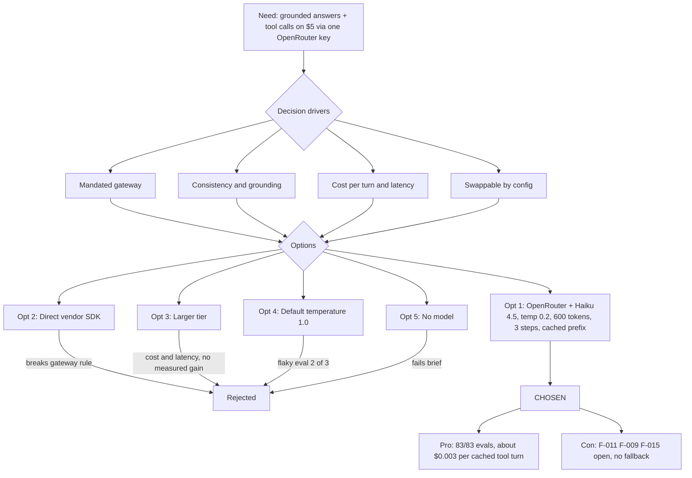

# Architecture Decision Record: Access Claude Haiku 4.5 Through OpenRouter With Bounded, Low-Temperature Generation

> **Template Origin**: Official | **ArcKit Version**: 6.16.3 | **Command**: `/arckit:adr`

## Document Control

| Field | Value |
|-------|-------|
| **Document ID** | ARC-001-ADR-002-v1.0 |
| **Document Type** | Architecture Decision Record |
| **Project** | Cadre AI Support Chatbot — cadre-chatbot (Project 001) |
| **Classification** | OFFICIAL |
| **Status** | DRAFT |
| **Version** | 1.0 |
| **Created Date** | 2026-09-28 |
| **Last Modified** | 2026-09-28 |
| **Review Cycle** | Monthly |
| **Next Review Date** | 2026-10-28 |
| **Owner** | Jhon Felipe Urrego — Solution Architect, Cadre AI Support Chatbot |
| **Reviewed By** | [PENDING] |
| **Approved By** | [PENDING] |
| **Distribution** | Project Team, Architecture Team |

## Revision History

| Version | Date | Author | Changes | Approved By | Approval Date |
|---------|------|--------|---------|-------------|---------------|
| 1.0 | 2026-09-28 | ArcKit AI | Initial creation from `/arckit:adr` command (retrospective, as-built at commit `d63c3ac`) | [PENDING] | [PENDING] |

---

## 1. Decision Title

**Access Claude Haiku 4.5 Through OpenRouter (`@openrouter/ai-sdk-provider` 3.1.0, AI SDK 7) With Temperature 0.2, 600 Output Tokens and at Most 3 Steps**

| Attribute | Value |
|-----------|-------|
| **ADR Number** | ADR-002 |
| **Decision Status** | **Accepted** (retrospective record of an implemented decision) |
| **Decision Date** | 2026-09-24 |
| **Recorded** | 2026-09-28, against repository commit `d63c3ac` |
| **Escalation Level** | Team |
| **Governance Forum** | Builder self-review via the `plan.md` decisions log, then the take-home review panel (day-5 live review) |

The decision was made in four steps, all in the git history:

| Step | Commit | Date | Change |
|------|--------|------|--------|
| 1 | `756b151` | 2026-09-24 | Gateway and default model fixed in `CLAUDE.md` |
| 2 | `f4a033e`, `0e87a40` | 2026-09-24 | Provider added and route implemented |
| 3 | `d0d39c8` | 2026-09-24 | Temperature lowered to 0.2 |
| 4 | `4f4018f` | 2026-09-25 | Prompt caching and usage logging added |

> **Retrospective record.** This ADR describes what the code does at `d63c3ac`. Paths in the application's `.gitignore` were not reviewed. Unlike ADR-001, most alternatives here **are recorded in the repository**: the vendor-SDK attempt and its reversal, "Haiku 4.5 over Sonnet" and the temperature change measured against the default. The source of each is cited.

---

## 2. Stakeholders

### 2.1 Deciders (RACI: Accountable)

- **Jhon Felipe Urrego, Solution Architect / Builder** — chose the model, the gateway integration and the sampling settings (SD-13).

### 2.2 Consulted (RACI: Consulted)

- **Cadre AI Engineering (Chief AI Officer, AI engineers)** — future owner of model choice and evals (SD-5).
- **Take-home Review Panel** — the brief expects the model choice to be explained [CACTHC-C12].

### 2.3 Informed (RACI: Informed)

- Finance: the model is the dominant run cost (SD-8).
- Privacy / Legal: conversations are processed by a third-party inference provider (SD-9).
- Cadre AI Executive Leadership: answer quality is a brand-risk concern (SD-1).

### 2.4 UK Government Escalation Context

**Decision Level**: Team

**Escalation Rationale**:

- [x] **Team**: Local implementation choice (model, SDK provider, sampling parameters)
- [ ] **Cross-team**: Integration patterns, shared services, API standards
- [ ] **Department**: Technology standards, cloud providers, security frameworks
- [ ] **Cross-government**: National infrastructure, cross-department interoperability

Cadre AI is a private company, so the UK Government tiers serve only as a scale. The **data-handling side** of inference (provider routing and retention, audit decision C-6) may need a higher level once the bot handles production traffic.

**Governance Forum**: `plan.md` "Decisions & trade-offs" (rows: OpenRouter, Haiku 4.5, temperature, prompt caching, spend cap), reviewed at the day-5 live review.

**Approval Date**: [PENDING] (no formal approval recorded; implemented 2026-09-24)

---

## 3. Context and Problem Statement

### 3.1 Problem Description

The bot has to generate short, grounded support answers and decide when to call two tools (booking link, human escalation). Model access is given as one OpenRouter credential: "The API key gives you access to OpenRouter, which means you can use any available model" [NSTCCA-C5]. That credential has a $5 budget and expires in 7 days [NSTCCA-C2], and "is for the chatbot only" [NSTCCA-C4]. The brief leaves the model to the candidate but expects a justification [CACTHC-C12].

**Problem statement as a question**: Which model, through which SDK integration, and with which generation limits, gives consistent grounded answers and reliable tool calls at a per-turn cost that keeps a public bot alive on $5 through the review window?

### 3.2 Why This Decision Is Needed

- **Business context**:
  - BR-001: answer common inquiries.
  - BR-002: zero ungrounded claims.
  - BR-005: stay live within the runtime budget.
- **Technical context**:
  - FR-003: grounded answers.
  - FR-007 and FR-014: tool calls.
  - FR-019: reply in the user's language.
  - NFR-P-001 and NFR-P-003: response time and bounded work per request.
  - NFR-I-002: model portability.
  - NFR-F-001 to NFR-F-003: cost caps, caching and an upstream spend ceiling.
  - NFR-M-001: observability.
  - INT-001: the gateway integration.
- **Regulatory context**:
  - The UK Government frameworks don't apply.
  - Conversations, including an email address at handoff, are sent to a third-party inference service. A DPIA is required before production (NFR-C-001).

### 3.3 Supporting Links

- **Repository evidence**:
  - `lib/config.ts` (model, temperature and limits).
  - `app/api/chat/route.ts:82-114` (the `streamText` call).
  - `app/api/chat/route.test.ts:117-127`.
  - `plan.md` "Decisions & trade-offs" and "Budget".
  - The `CLAUDE.md` mistakes log.
- **Requirements**: BR-001, BR-002, BR-005, FR-003, FR-007, FR-014, FR-019, NFR-P-001, NFR-P-003, NFR-I-002, NFR-F-001, NFR-F-002, NFR-F-003, NFR-M-001, NFR-C-001, INT-001, TC-1
- **Research findings**: None (no RSCH artefact)
- **Related ADRs**: ADR-001 (route handler that makes the call); ADR-003, ADR-005 and ADR-008 (planned)

---

## 4. Decision Drivers (Forces)

### 4.1 Technical Drivers

- **Mandated gateway**: All model access goes through OpenRouter with the challenge credential (TC-1).
  - Requirements: INT-001, NFR-SEC-002
- **Reliable tool calling in a streaming UI**: The model must call `get_booking_link` and `escalate_to_human` and then continue answering. That needs multi-step generation, because "the default is 1 step, so the model stops after the tool call" (`CLAUDE.md` gotchas).
  - Requirements: FR-007, FR-014
- **Consistency**: The same question should get the same substance every time. Support answers must not drift into promises.
  - Requirements: FR-003, FR-015
  - Principles: P-8 Right-Sized, Replaceable Models
- **Swappable by configuration**: Changing the model must not need a code change.
  - Requirements: NFR-I-002
  - Principles: P-8
- **Measure, don't estimate**: Per-request token and cache usage must be observable.
  - Requirements: NFR-M-001, NFR-F-002
  - Principles: P-18

### 4.2 Business Drivers

- **Bounded cost on a public endpoint**: $5 must cover development evals, reviewer traffic and the demo [NSTCCA-C2].
  - Requirements: BR-005, NFR-F-001, NFR-F-003
  - Stakeholder goals: G-5 (stay live and within budget), SD-8
- **Latency for a support chat**: A small corpus with short answers, where speed matters more than deep reasoning (`plan.md` "Haiku 4.5 over Sonnet").
  - Requirements: NFR-P-001
  - Stakeholder goals: SD-10 (fast, credible answers)
- **Brand protection**: No invented facts, prices or promises.
  - Requirements: BR-002
  - Stakeholder goals: G-1, SD-1

### 4.3 Regulatory & Compliance Drivers

- **GDS Service Standard / TCoP**: Not applicable. TCoP Point 13 (AI) is used only as a checklist for transparency and human oversight; the handoff tool gives the human route.
- **NCSC**: Not applicable. The equivalent concern is keeping the credential server-side (NFR-SEC-002).
- **Data Protection**: Conversation content and handoff emails are sent to the gateway and on to an upstream provider. The provider routing and data-collection policy are **not pinned in code** (F-011, decision C-6). A DPIA is required before production.
- **AI transparency**: The page tells the user that answers come from Cadre's published information (NFR-C-003, partial).

### 4.4 Alignment to Architecture Principles

Principles from `projects/000-global/ARC-000-PRIN-v1.0.md`:

| Principle | Alignment | Impact |
|-----------|-----------|--------|
| P-4 Grounded Answers From a Single Curated Source of Truth | ✅ Supports | Low temperature and system instructions carrying the whole knowledge base; `ground-*` evals pass |
| P-7 Deterministic Actions Through Typed Tools | ✅ Supports | Tools take zod-typed input; URLs come from `lib/config.ts`, not from the model |
| P-8 Right-Sized, Replaceable Models | ✅ Supports | Small model tier; `OPENROUTER_MODEL` override; temperature justified by a measured flaky eval; revisit triggers in `plan.md` |
| P-11 Privacy by Design and Data Minimisation | ⚠️ Partial | Only the last 12 messages are sent. There is no provider-routing or data-collection preference (F-011), and raw stream errors are logged (F-009) |
| P-16 Cost as a First-Class Architectural Constraint | ✅ Supports | 600-token cap, 3 steps, prompt caching (≈ 5× cheaper tool turns), upstream key credit limit. Generation is not aborted when the client disconnects (F-015) |
| P-18 Observability of Every Model Interaction | ⚠️ Partial | One `[chat]` JSON record per request with token and cache usage; no alerts or SLOs (F-012) |

---

## 5. Considered Options

Five options are recorded. For each rejected option, the **Source** line says whether the repo records it or it is reconstructed.

### Option 1: OpenRouter Provider + Claude Haiku 4.5, Temperature 0.2, 600 Output Tokens, ≤ 3 Steps, Prefix Caching (CHOSEN)

**Description**: The model is reached through `@openrouter/ai-sdk-provider` 3.1.0 with the AI SDK `ai` 7.0.114 `streamText`. The model id is `anthropic/claude-haiku-4.5`, which `OPENROUTER_MODEL` can override.

**Implementation approach (as built)**:

1. **Configuration** (`lib/config.ts`):
   - `model: process.env.OPENROUTER_MODEL || "anthropic/claude-haiku-4.5"`
   - `temperature: 0.2`, with the comment "Low but not zero: support answers should be consistent across runs, not word-for-word identical".
   - `limits.maxOutputTokens: 600`
   - `limits.maxSteps: 3`
2. **Provider**: `createOpenRouter({ apiKey })` is called per request with `process.env.OPENROUTER_API_KEY`. The key is read only inside `POST`, and the handler returns 500 "The chat is not configured." if it is missing.
3. **Generation call** (`route.ts:84-114`), `streamText` with:
   - `model: openrouter(CONFIG.model)`.
   - `instructions`: a `system` message with `buildSystemPrompt(await loadKnowledge())` and `providerOptions: { openrouter: { cacheControl: { type: "ephemeral" } } }`. OpenRouter turns this into Anthropic prompt caching for the static rules-and-knowledge prefix.
   - `messages`: `await convertToModelMessages(messages, { tools: requestTools })`, where `messages` is the trimmed history of up to 12 messages starting at a user turn. Anthropic models reject a conversation that starts with an assistant turn (`route.ts:121`).
   - `tools`: from `buildTools()`, which is built per request so an escalation carries its conversation id and last turns.
   - `maxOutputTokens: 600`, `temperature: 0.2`, `stopWhen: isStepCount(3)`.
   - `onError`: logs `[chat] stream error`.
   - `onEnd`: logs one `[chat]` JSON line with `conversationId`, `latencyMs`, `finishReason`, `steps`, `tools`, `inputTokens`, `cacheReadTokens`, `cacheWriteTokens` and `outputTokens`.
4. **No automatic retry, fallback model or provider-routing preferences**: Only `cacheControl` is set as a provider option (INT-001: "No automatic retry, to avoid double spend").
5. **Spend ceiling**: The upstream key credit limit on OpenRouter, not an in-app counter (`plan.md` decisions).
6. **Verification**:
   - Unit test "passes the caps, temperature and knowledge-based instructions to the model" asserts `maxOutputTokens`, `temperature`, the `system` role, the `<knowledge>` content and the exact `cacheControl` option (`route.test.ts:117-127`), with the model mocked.
   - Behavioural evals run against the deployed model: 83/83 at `d63c3ac`.

**Why ≤ 3 steps**: A turn that calls a tool needs a second step to answer after the tool result (`CLAUDE.md` gotchas; measured "a tool turn runs 2 steps"). The third step leaves room for one more step; the repo does not record why it is 3 rather than 2.

**Wardley Evolution Stage**: Model = Product, moving to Commodity (a per-token utility). Gateway = Commodity. Integration code = Custom-Built (thin).

#### Good (Pros)

- ✅ **Meets the mandated-gateway constraint**: One credential and one transport [NSTCCA-C5] (TC-1 ✅).
- ✅ **Swappable model**: Changing `OPENROUTER_MODEL` switches models across vendors without code changes (NFR-I-002 ✅).
- ✅ **Measured low cost**: On a production booking turn, 13,786 of 14,520 input tokens were read from cache, with 109 output tokens. That is ≈ $0.003 per tool turn with caching against ≈ $0.015 without (`plan.md` "Budget", commit `84d38cc`; prices to be re-verified on OpenRouter).
- ✅ **Consistent answers**: At the provider default (1.0 for Anthropic models), eval `s3-portal` passed 2 of 3 runs. At 0.2 it passed 3 of 3 with the same answer (commit `d0d39c8`, `plan.md` phase 4).
- ✅ **Bounded work per request**: ≤ 600 output tokens per step × ≤ 3 steps (NFR-P-003 ✅).
- ✅ **Quality evidence**: 83/83 behavioural evals on production, covering grounding, false premises, injection, data leaks, tool misuse and languages (FR-003, FR-005, FR-018, FR-019).

#### Bad (Cons)

- ❌ **Single gateway, single model**: No fallback model or provider is configured. A gateway or provider outage shows the user a retryable error (NFR-A-003).
- ❌ **Data handling left to account defaults**: No provider-routing or data-collection preference is sent (F-011).
- ❌ **Override not guarded**: Any `OPENROUTER_MODEL` value is accepted. "Changing the model requires a full eval run" is a process rule (P-8), not a check in code.
- ❌ **Tool turns cost roughly twice as much**: The prefix is sent once per step, which the first budget estimate missed (`CLAUDE.md` mistakes log).

#### Cost Analysis

- **CAPEX**: Integration effort inside the 4–6 hour build [CACTHC-C14]; no licences.
- **OPEX** (measured, `plan.md`; Haiku 4.5 at $1/M input and $5/M output, prices to be re-verified):
  - ≈ $0.003 per tool turn with caching.
  - ≈ $0.015 per tool turn and ≈ $0.008 per plain turn without caching.
  - A full 82-case eval run costs ≈ $0.25 with caching.
- **TCO (3-year)**: Not estimated; there is no validated traffic forecast. NFR-S-001 proposes ≤ 1,000 conversations a month in year 1. Run `/arckit:finops` for a forecast.

#### GDS Service Standard Impact

| Point | Impact | Notes |
|-------|--------|-------|
| 5. Security | Positive / Partial | Key server-side; inference data policy not pinned (F-011) |
| 9. Technology | Positive | Model swappable by configuration |
| 11. Choose the right tools | Positive | Smallest model tier that passes the eval suite |

*Not applicable to a private company; shown as an engineering checklist only.*

---

### Option 2: Direct Vendor SDK (`@ai-sdk/anthropic` With `ANTHROPIC_API_KEY`) (REJECTED — recorded)

**Description**: Call Anthropic directly through the AI SDK's Anthropic provider and a vendor API key.

**Source**: The `CLAUDE.md` mistakes log says: "Rewrote the docs around `@ai-sdk/anthropic` + `ANTHROPIC_API_KEY`, which breaks the OpenRouter-only rule. Caught in review, fixed in 756b151." Commit `756b151` switched the stack to `@openrouter/ai-sdk-provider`.

**Wardley Evolution Stage**: Product

#### Good (Pros)

- ✅ **Native provider features** (for example `cache_control`) with no gateway translation.
- ✅ **Direct enterprise data terms** with the vendor (audit option C-6(c)).

#### Bad (Cons)

- ❌ **Violates the constraint**: The only credential supplied is an OpenRouter key [NSTCCA-C5] (TC-1 ❌).
- ❌ **Locks the code to one vendor**: Switching model families would need code changes (NFR-I-002 ❌).

#### Cost Analysis

- **CAPEX**: Similar to Option 1.
- **OPEX**: Similar per-token pricing; no challenge credit available.
- **TCO (3-year)**: Not comparable during the challenge (infeasible).

#### GDS Service Standard Impact

| Point | Impact | Notes |
|-------|--------|-------|
| 9. Technology | Negative | Vendor lock-in in code |

---

### Option 3: Larger Model Tier (Claude Sonnet) Through OpenRouter (REJECTED — recorded)

**Description**: Same integration as Option 1 with a larger, more capable model id.

**Source**: The `plan.md` decisions row reads "Haiku 4.5 over Sonnet — Support Q&A over small corpus; latency and cost dominate — Revisit when: Evals show reasoning failures". The repo has **no Sonnet benchmark**; the rejection is a judgement about workload fit, not a measurement.

**Wardley Evolution Stage**: Product

#### Good (Pros)

- ✅ **More reasoning headroom** for ambiguous or multi-part questions.
- ✅ **Same integration**: Only the environment variable changes (Option 1 keeps this open).

#### Bad (Cons)

- ❌ **Higher per-token price and latency** on a workload of short answers over a small corpus (the `plan.md` rationale). The same $5 would cover fewer turns (BR-005).
- ❌ **No measured quality gap**: Haiku 4.5 passes 83/83, so the extra capability buys nothing measurable today.

#### Cost Analysis

- **CAPEX**: None beyond Option 1.
- **OPEX**: Higher than Option 1. Not quantified in the repo; verify current OpenRouter prices before any switch.
- **TCO (3-year)**: Higher than Option 1 (qualitative).

#### GDS Service Standard Impact

| Point | Impact | Notes |
|-------|--------|-------|
| 11. Choose the right tools | Neutral | Over-provisioned for the workload |

---

### Option 4: Provider Default Sampling (Temperature 1.0) (REJECTED — recorded and measured)

**Description**: Option 1 without an explicit temperature, so the provider default applies.

**Source**: Commit `d0d39c8`: "streamText used the provider default (1.0 for Anthropic models) … s3-portal passed only 2 of 3 runs because the model sometimes appended 'support will help you log in'." The `plan.md` row reads "Temperature 0.2 (default was the model's 1.0) — Revisit when: Answers read robotic or repetitive".

**Wardley Evolution Stage**: Product

#### Good (Pros)

- ✅ **More varied, conversational wording**.

#### Bad (Cons)

- ❌ **Inconsistent substance**: A measured flaky eval, and a tendency to add unapproved promises (FR-015, BR-002).
- ❌ **Harder to evaluate**: Regex-based evals need stable answers to be meaningful.

#### Cost Analysis

- **CAPEX / OPEX / TCO**: Same as Option 1; the change is purely behavioural.

#### GDS Service Standard Impact

| Point | Impact | Notes |
|-------|--------|-------|
| 5. Security | Negative | Higher risk of unsupported claims to users |

---

### Option 5: Do Nothing (Baseline) — No Generative Model

**Description**: No LLM. Visitors get a static FAQ page or the contact form, and the inbound team answers everything by hand.

#### Good

- ✅ **No model cost or inference data sharing**.
- ✅ **No hallucination risk**.

#### Bad

- ❌ **Fails the brief**: The deliverable is a functional chatbot that a client "could plausibly use to get answers" [CACTHC-C7].
- ❌ **No free-text understanding, language switching or tool-driven routing** (FR-008, FR-013, FR-019).
- ❌ **Opportunity cost**: Inbound volume stays manual (BR-001, SD-2).

---

## 6. Decision Outcome

### 6.1 Chosen Option

**"Option 1: OpenRouter provider + Claude Haiku 4.5, temperature 0.2, 600 output tokens, ≤ 3 steps, prefix caching"**

### 6.2 Y-Statement (Structured Justification)

> **In the context of** a public support chatbot that must answer from a small curated knowledge base and call two tools, on a single OpenRouter credential with a $5 budget,
> **facing** the need for consistent, grounded answers and reliable tool calls at a per-turn cost the budget can sustain through the review window,
> **we decided for** Claude Haiku 4.5 through `@openrouter/ai-sdk-provider` with temperature 0.2, 600 output tokens, at most 3 steps and a cache-marked system prefix, overridable via `OPENROUTER_MODEL`,
> **to achieve** 83/83 behavioural evals on production at about $0.003 per cached tool turn, with the model swappable by configuration and every call measured,
> **accepting** a single gateway and model with no fallback, inference data handling left to account defaults, and less reasoning headroom than a larger tier.

### 6.3 Justification (Why This Option?)

**Key reasons**:

1. **Constraint fit**: OpenRouter is the only supplied transport [NSTCCA-C5]. The vendor-SDK draft was reverted for exactly this reason (`756b151`).
2. **Measured, not estimated**: Caching cut tool-turn cost about 5× (`84d38cc`), and temperature 0.2 fixed a flaky scenario (`d0d39c8`).
3. **Right-sized**: With 83/83 evals, the small tier is enough for this workload (P-8). The revisit trigger ("evals show reasoning failures") is recorded.
4. **Bounded blast radius**: The token and step caps limit the cost of any single turn (NFR-P-003, NFR-F-001).

**Stakeholder consensus**: A single-builder decision, to be explained at the day-5 review [CACTHC-C12]. Not yet reviewed by Cadre AI Engineering.

**Risk appetite**: Suitable for the assessment window. Before production, the inference data policy (C-6) and the abuse-control model (C-2) must be decided.

---

## 7. Consequences

### 7.1 Positive Consequences

- ✅ **Configuration-only model swap** (NFR-I-002).
- ✅ **Cheap repeated prefix**: The ~7k-token rules-and-knowledge prefix is served from cache (NFR-F-002 ✅).
- ✅ **Per-request cost and latency visibility** from the `[chat]` log line (NFR-M-001 ✅ for logging).
- ✅ **Upstream spend ceiling**: The key credit limit is enforced by the gateway, not by an unshared in-memory counter (NFR-F-003 ✅).
- ✅ **Zero-cost unit tests**: The model is always mocked; only `npm run eval` spends budget (NFR-F-004).

**Measurable outcomes**:

| Measure | Value | Source |
|---------|-------|--------|
| Behavioural evals on production | 83/83 in 489 s | `plan.md` phase 4 |
| Cost per tool turn | ≈ $0.015 uncached → ≈ $0.003 cached | `84d38cc` |
| Cache read ratio on a booking turn | 13,786 / 14,520 input tokens ≈ 95% | `plan.md` "Budget" |
| `s3-portal` consistency | 2/3 at temperature 1.0 → 3/3 at 0.2 | `d0d39c8` |
| p95 latency | Not yet aggregated from `latencyMs` → target < 3 s first content, < 10 s tool turn | NFR-P-001 |

### 7.2 Negative Consequences (Accepted Trade-offs)

These are the audit gaps from `ARC-001-CDAU-001-v1.0` that relate to how the model is called:

- ❌ **F-011 (MEDIUM) — Inference data handling not pinned in code**: Only `cacheControl` is set (`route.ts:82-96`). Which upstream provider processes conversations, and under which retention terms, depends on OpenRouter account defaults.
- ❌ **F-009 (MEDIUM) — Raw stream errors logged**: `onError` logs the error object (`route.ts:97`). Provider errors can carry the request body, which contains the knowledge prompt and the user's conversation.
- ❌ **F-001 (CRITICAL) — Cost amplification reaches the model**: Client-supplied assistant turns are not length-capped. One request can send roughly 60–100k uncached input tokens, about $0.06–0.20 against ≈ $0.003 for a cached turn (estimate).
- ❌ **F-015 (LOW) — No abort signal**: `streamText` gets no `abortSignal`, so generation continues and is billed after Stop or disconnect (bounded by 600 tokens × 3 steps).
- ❌ **F-006 (MEDIUM) — Budget drain by scripted traffic**: The public endpoint, per-instance limiter and shared credential mean the key credit is the only hard stop.
- ❌ **No fallback**: A gateway or provider outage makes the bot unavailable; the user sees Retry.
- ❌ **Credential lifecycle**: The challenge key expires around 2026-10-01. Production has run on a personal key since 2026-09-24, and switching back plus a redeploy is still pending (`plan.md` phase 6, BR-005 ⚠).

**Mitigation strategies**:

- **F-011**: Set provider-routing and data-collection preferences per request or at account level, and record them in an ADR (decision **C-6**) and the DPIA.
- **F-009**: Log a sanitised error (name, HTTP status, provider code, conversation id), under decision **C-5**.
- **F-001 / F-006**: Per-turn caps and a total-character budget (decision **C-1**), plus a shared limiter, daily spend counter or bot protection (decision **C-2**). Keep a low credit limit on the serving key meanwhile.
- **F-015**: Pass `abortSignal: req.signal` to `streamText`. A one-line change, unblocked.
- **No fallback**: Optionally configure an OpenRouter fallback model list, gated by a full eval run on each fallback model (P-8).
- **Credential**: Complete `plan.md` phase 6: switch the key, redeploy, and smoke-test booking and escalation.

### 7.3 Neutral Consequences (Changes Needed)

- 🔄 **Team training**: The AI SDK 7 naming (`instructions`, `inputSchema`, `maxOutputTokens`, `isStepCount`, async `convertToModelMessages`) differs from most published examples (`CLAUDE.md` gotchas).
- 🔄 **Infrastructure**: `OPENROUTER_API_KEY` is required and `OPENROUTER_MODEL` optional in the Vercel environment. Changes need a redeploy.
- 🔄 **Process**: Any change to the model or temperature needs `npm run eval` against a deployment, which spends budget (`CLAUDE.md` rules).
- 🔄 **Vendor relationships**: OpenRouter account (credit limit, data settings) and the upstream model vendor's terms.

### 7.4 Risks and Mitigations

| Risk | Likelihood | Impact | Mitigation | Owner |
|------|------------|--------|------------|-------|
| Key credit exhausted before or during review (F-001, F-006) | M | H | Upstream credit limit; check balance before eval runs and submission; C-1/C-2 fixes | Solution Architect / Builder |
| Conversations processed or retained under unintended provider terms (F-011) | M | M | Pin provider routing and data collection; DPIA (C-6) | AI Engineering / Privacy |
| Model or provider outage makes the bot unavailable | L | H | Retry UI; optional fallback model after an eval run | AI Engineering |
| Model swapped via env var without re-running evals | L | M | P-8 process rule; document in the runbook; consider a model allowlist | AI Engineering |
| Personal data in logs via raw provider errors (F-009) | M | M | Sanitised error logging (C-5) | AI Engineering |
| Behaviour drift after an upstream model update under the same id | L | M | Re-run the eval suite on a schedule; add a pinned-version check if the gateway offers one | AI Engineering |

**Link to risk register**: None; no `ARC-001-RISK` artefact exists yet. Run `/arckit:risk` to register these.

---

## 8. Validation & Compliance

### 8.1 How Will Implementation Be Verified?

**Design review**:

- [x] Architecture diagrams reflect this decision:
  - ARC-001-DIAG-001 (Context: "Model gateway + LLM")
  - DIAG-002 (Container)
  - DIAG-005 (Sequence)
  - DIAG-009 (Generation loop)
  - Archify renders DIAG-010 and DIAG-020
- [ ] Conformance check against this ADR (`/arckit:conformance`)

**Code review**:

- [x] `lib/config.ts` holds the model, temperature and limits; no model id or cap is hard-coded in `route.ts`.
- [x] The key is read only in `app/api/chat/route.ts`, and there is no `NEXT_PUBLIC_` variable.
- [ ] `abortSignal` and provider-routing options present (F-015, F-011).

**Testing strategy**:

- [x] Unit test asserting caps, temperature, the system role, knowledge content and `cacheControl` (`route.test.ts:117-127`), with the model mocked.
- [x] Behavioural evals: 83 cases against the deployed model (`evals/cases.ts`), including `ground-*`, `tool-*`, injection and language cases.
- [ ] Scheduled eval re-run to detect upstream model drift.
- [ ] Latency test for the NFR-P-001 p95 targets.

### 8.2 Monitoring & Observability

**Success metrics**:

- **Cache hit ratio**: `cacheReadTokens / inputTokens` from `[chat]` logs. Target ≥ 90% on repeat turns (measured ≈ 95%).
- **Cost per turn**: Derived from token fields. Target ≤ $0.005 per cached tool turn.
- **Steps and tools per turn**: `steps` and `tools` fields; watch for turns hitting 3 steps.
- **Finish reason**: A rising `length` rate means the 600-token cap is truncating answers.

**Alerts and dashboards**: None today (F-012). Candidates: `[chat] stream error` rate, daily spend, and the OpenRouter credit balance.

### 8.3 Compliance Verification

**GDS Service Assessment / TCoP**: Not applicable (private US company).

**Security assurance**:

- [x] Credential server-only (NFR-SEC-002)
- [x] Prompt-injection and confidentiality evals pass (FR-018, NFR-SEC-006)
- [ ] Sanitised error logging (F-009)

**Data protection**:

- [ ] DPIA covering third-party inference (`/arckit:dpia`)
- [ ] Provider routing and data-collection settings recorded (C-6)
- [x] Data sent to the model is minimised to the last 12 messages and the knowledge prefix (DR-003, NFR-P-003)

---

## 9. Links to Supporting Documents

### 9.1 Requirements Traceability

**Business Requirements**:

- BR-001: Answer Common Inbound Inquiries — generative answers in the user's language
- BR-002: Protect Brand Credibility — low temperature, grounding rules, evals
- BR-005: Operate Within the Runtime Budget — caps, caching, upstream credit limit

**Functional Requirements**:

- FR-003: Grounded Answers From the Curated Knowledge Base Only
- FR-007 / FR-014: Booking link tool / Escalation tool (multi-step tool calling)
- FR-019: Reply in the User's Language

**Non-Functional Requirements**:

- NFR-P-001 Response Time and NFR-P-003 Bounded Work per Request
- NFR-I-002 Model Portability
- NFR-F-001 Hard Cost Caps, NFR-F-002 Prompt-Prefix Caching and NFR-F-003 Spend Ceiling Enforced Upstream
- NFR-M-001 Observability
- NFR-C-001 Data Privacy Compliance (partial)

**Integration Requirements**: INT-001 Integration With the Model Access Gateway.

**Constraints**: TC-1 (single gateway, challenge credential).

### 9.2 Architecture Artifacts

**Architecture principles**: `projects/000-global/ARC-000-PRIN-v1.0.md` — P-4, P-7, P-8, P-11, P-16, P-18

**Stakeholder drivers**: `projects/001-cadre-chatbot/ARC-001-STKE-v1.0.md` — SD-1, SD-5, SD-8, SD-9, SD-10, SD-13; goals G-1, G-5

**Risk register**: Not yet created

**Research findings**: Not applicable

**Wardley Maps**: Not yet created

**Architecture diagrams**: `projects/001-cadre-chatbot/diagrams/` — DIAG-001, DIAG-002, DIAG-005, DIAG-009; Archify DIAG-010, DIAG-020

**Codebase audit**: `projects/001-cadre-chatbot/audits/ARC-001-CDAU-001-v1.0.md` — F-001, F-006, F-009, F-011, F-012, F-015; decisions C-1, C-2, C-5, C-6

### 9.3 Design Documents

**High-Level Design**: None. The as-built design is in `CLAUDE.md` "Architecture" and "AI SDK gotchas", and `README.md` "How it works".

**Detailed Design**: `plan.md` "API and data model" and "Budget".

**Data model**: No change. Token usage is telemetry only (REQ entity ChatTurnTelemetry).

### 9.4 External References

**Vendor documentation**:

- AI SDK 7 docs bundled at `node_modules/ai/docs/` (`streamText`, `stopWhen`/`isStepCount`, `instructions`, provider options)
- `@openrouter/ai-sdk-provider` 3.1.0 (`createOpenRouter`, `cacheControl` provider option)
- OpenRouter model page for `anthropic/claude-haiku-4.5` (verify current pricing before relying on the `plan.md` figures)

**UK Government guidance**: Not applicable.

**Research and evidence**: Commits `756b151`, `d0d39c8`, `4f4018f` and `84d38cc`; eval runs recorded in `plan.md` phase 4.

---

## 10. Implementation Plan

### 10.1 Dependencies

**Prerequisite decisions**: ADR-001 (the route handler hosts the model call).

**Infrastructure dependencies**: OpenRouter account and credential with a credit limit; Vercel environment variables.

**Team dependencies**: Familiarity with AI SDK 7 and the eval workflow.

### 10.2 Implementation Timeline

Already implemented. Actual timeline, from the git history:

| Phase | Activities | Duration | Owner |
|-------|-----------|----------|-------|
| **Phase 1: Preparation** | OpenRouter-only rule and default model fixed in `CLAUDE.md` (`756b151`) | 2026-09-24 | Builder |
| **Phase 2: Implementation** | Provider, AI SDK and zod added (`f4a033e`); `streamText` route with 600-token and 3-step caps (`0e87a40`); temperature 0.2 (`d0d39c8`) | 2026-09-24 | Builder |
| **Phase 3: Validation** | Evals on production (up to 83/83); unit tests with the model mocked (`6020010`) | 2026-09-24 → 2026-09-25 | Builder |
| **Phase 4: Optimisation** | Prompt caching and per-request usage logs (`4f4018f`); measured budget (`84d38cc`) | 2026-09-25 | Builder |

**Outstanding follow-ups**: F-015 (abort signal) is unblocked. F-009 and F-011 wait for decisions C-5 and C-6. The key switch and redeploy (`plan.md` phase 6) are still pending.

### 10.3 Rollback Plan

**Rollback trigger**: The eval pass rate drops, cost per turn spikes, or a provider or model issue appears after a model or setting change.

**Rollback procedure**:

1. Unset or restore `OPENROUTER_MODEL` in Vercel (the default is `anthropic/claude-haiku-4.5`) and **redeploy**, because environment changes apply only to new deployments.
2. For a code-level change (temperature, caps, provider options), revert the commit on `main` and push, or promote the previous deployment.
3. Re-run the affected eval cases (`npm run eval -- <prefix>`) and the six-scenario smoke test.

**Rollback owner**: Jhon Felipe Urrego, Solution Architect / Builder (AI Engineering after handover)

---

## 11. Review and Updates

### 11.1 Review Schedule

**Initial review**: 2026-10-28, or at handover to Cadre AI Engineering if that is sooner

**Periodic review**: Quarterly, and whenever the model id or sampling settings change

**Review criteria**:

- Do the evals still pass 100% on the configured model?
- Is the cost per turn within budget at real traffic?
- Is the `length` finish-reason rate low (600 tokens enough)?
- Has decision C-6 fixed the provider routing and data policy?

### 11.2 Trigger Events for Review

Revisit triggers from `plan.md`:

- [ ] Evals show reasoning failures (move to a larger tier)
- [ ] Answers read robotic or repetitive (raise the temperature)

Other triggers:

- [ ] Price change of more than 20% for the configured model, or a new cheaper model that passes the evals
- [ ] Deprecation of `anthropic/claude-haiku-4.5`, or a breaking change in AI SDK 8
- [ ] Budget exhaustion or a sustained drop in cache hit ratio
- [ ] Privacy review requiring direct vendor terms (decision C-6)

---

## 12. Related Decisions

### 12.1 Decisions This ADR Depends On

- **ADR-001**: Use Next.js 16 App Router With a Single Streaming Route Handler on Vercel — the model is called from `POST /api/chat` on the Node.js runtime.

### 12.2 Decisions That Depend On This ADR

Planned ADRs:

- **ADR-003**: Curated knowledge grounded into the system prompt — relies on prefix caching and the model's context window
- **ADR-004**: Stateless server with client-held history — determines what is sent to the model
- **ADR-005**: Two typed model tools — relies on multi-step generation (≤ 3 steps)
- **ADR-007**: Request guards — bound the input sent to the model
- **ADR-008**: Quality assurance — evals are the gate for any model change

Future decisions from the audit: **C-6** (inference provider routing and data handling) will amend this ADR; **C-5** (logging and PII) affects its error logging.

### 12.3 Conflicting Decisions

- None identified.

---

## 13. Appendices

### Appendix A: Options Analysis Details

| Criterion | Opt 1 OpenRouter + Haiku 4.5 @ 0.2 (chosen) | Opt 2 Direct vendor SDK | Opt 3 Larger tier (Sonnet) | Opt 4 Default temperature 1.0 | Opt 5 No model |
|-----------|------------------------------------------|-------------------------|----------------------------|-------------------------------|----------------|
| Uses the supplied gateway | ✅ | ❌ | ✅ | ✅ | n/a |
| Swappable by config | ✅ | ❌ | ✅ | ✅ | n/a |
| Measured eval result | 83/83 | not run | not run | `s3-portal` 2/3 | n/a |
| Cost per cached tool turn | ≈ $0.003 | similar | higher (not measured) | ≈ $0.003 | $0 |
| Evidence source | code, `plan.md`, commits | `CLAUDE.md` log, `756b151` | `plan.md` row | `d0d39c8` | reconstructed |

### Appendix B: Stakeholder Consultation Log

| Date | Stakeholder | Feedback | Action Taken |
|------|-------------|----------|--------------|
| 2026-09-24 | Builder review of AI-drafted docs | The vendor-SDK draft broke the OpenRouter-only rule | Reverted in `756b151` |
| 2026-09-24 | Eval runs (s3-portal) | Inconsistent answers at the default temperature | Temperature 0.2 (`d0d39c8`) |
| 2026-09-25 | Per-request usage logs | Tool turns send the prefix twice; the estimate was wrong | Caching added; budget re-measured (`4f4018f`, `84d38cc`) |
| 2026-09-28 | ArcKit codebase audit | F-001, F-006, F-009, F-011, F-015; decision C-6 | Recorded under Consequences |

### Appendix C: Alternative Formats

---

## Document Approval

| Role | Name | Signature | Date |
|------|------|-----------|------|
| **Technical Architect** | Jhon Felipe Urrego | | [PENDING] |
| **Senior Responsible Owner** | [PENDING] | | [PENDING] |
| **Security Architect** | [PENDING] | | [PENDING] |
| **Governance Board** | Take-home review panel | | [PENDING] |

---

*This ADR follows the MADR v4.0 format enhanced with UK Government requirements and ArcKit governance standards.*

*For more information:*

- *MADR: https://adr.github.io/madr/*
- *UK Gov ADR Framework: https://www.gov.uk/government/publications/architectural-decision-record-framework*
- *ArcKit Documentation: `projects/001-cadre-chatbot/README.md`*

## External References

> This section provides traceability from generated content back to source documents.
> Follow citation instructions in the project's citation reference guide.

### Document Register

| Doc ID | Filename | Type | Source Location | Description |
|--------|----------|------|-----------------|-------------|
| CACTHC | Cadre_AI_Chatbot_Take_Home_Candidate_v1.1.pdf | Challenge brief | 001-cadre-chatbot/external/ | Minimum bar, model-selection freedom, build-time guidance |
| NSTCCA | Next Steps  Tech Challenge  Cadre AI.txt | Recruiter email | 001-cadre-chatbot/external/ | Gateway, credential budget and usage rules (credential value not reproduced) |
| APP | cadre-chatbot repository at `d63c3ac` | Reference implementation | github.com/johnfelipe/cadre-chatbot | `lib/config.ts`, `app/api/chat/route.ts`, `app/api/chat/route.test.ts`, `lib/tools.ts`, `package-lock.json`, `CLAUDE.md`, `plan.md`, git history |
| CDAU | ARC-001-CDAU-001-v1.0.md | Codebase audit | 001-cadre-chatbot/audits/ | Findings F-001, F-006, F-009, F-011, F-012, F-015; decisions C-1, C-2, C-5, C-6 |

### Citations

| Citation ID | Doc ID | Page/Section | Category | Quoted Passage |
|-------------|--------|--------------|----------|----------------|
| CACTHC-C7 | CACTHC | p.3, What to Build | Business Requirement | "Minimum bar: a functional chatbot that a prospective or existing Cadre AI client could plausibly use to get answers. Everything beyond that is your call." |
| CACTHC-C12 | CACTHC | p.8, FAQ | Design Decision | "You have full flexibility on model selection. Choose what you think is right for the job and be ready to explain why during the review." |
| CACTHC-C14 | CACTHC | p.2, Challenge Format | Business Requirement | "We recommend budgeting 4–6 hours. Build, deploy, and prepare your submission." |
| NSTCCA-C2 | NSTCCA | Paragraph "API Key" | Procurement Constraint | "It has a $5 budget and expires in 7 days, so plan accordingly" (credential value redacted) |
| NSTCCA-C4 | NSTCCA | Paragraph "API Key" | Security Requirement | "Note — this key is for the chatbot only, not for coding assistance. Use it exclusively so your chatbot can respond to users with the model of your choice." |
| NSTCCA-C5 | NSTCCA | Paragraph "Models" | Integration Requirement | "The API key gives you access to OpenRouter, which means you can use any available model — OpenAI, Gemini, Anthropic, and others." |

### Unreferenced Documents

| Filename | Source Location | Reason |
|----------|-----------------|--------|
| README.md | 001-cadre-chatbot/external/ | Folder placeholder; no decision content |

---

**Generated by**: ArcKit `/arckit:adr` command
**Generated on**: 2026-09-28 GMT
**ArcKit Version**: 6.16.3
**Project**: Cadre AI Support Chatbot — cadre-chatbot (Project 001)
**AI Model**: Claude Opus 5.5 (claude-opus-5-5)
**Generation Context**: Retrospective ADR from the as-built repository at commit `d63c3ac` (`lib/config.ts`, the `streamText` call in `route.ts`, the route unit test, `package-lock.json`, `CLAUDE.md` gotchas and mistakes log, the `plan.md` decisions and budget, and commits `756b151`, `d0d39c8`, `4f4018f`, `84d38cc`), ARC-000-PRIN, ARC-001-REQ, ARC-001-STKE, ARC-001-CDAU-001 and the external brief and recruiter email
