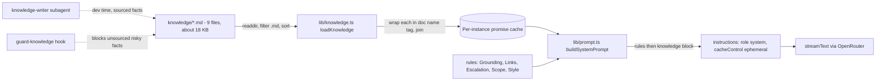

# Architecture Decision Record: Ground Answers in a Curated Markdown Knowledge Base Injected in Full Into the System Prompt

> **Template Origin**: Official | **ArcKit Version**: 6.16.3 | **Command**: `/arckit:adr`

## Document Control

| Field | Value |
|-------|-------|
| **Document ID** | ARC-001-ADR-003-v1.0 |
| **Document Type** | Architecture Decision Record |
| **Project** | Cadre AI Support Chatbot — cadre-chatbot (Project 001) |
| **Classification** | OFFICIAL |
| **Status** | DRAFT |
| **Version** | 1.0 |
| **Created Date** | 2026-09-28 |
| **Last Modified** | 2026-09-28 |
| **Review Cycle** | Monthly |
| **Next Review Date** | 2026-10-28 |
| **Owner** | Jhon Felipe Urrego — Solution Architect, Cadre AI Support Chatbot |
| **Reviewed By** | [PENDING] |
| **Approved By** | [PENDING] |
| **Distribution** | Project Team, Architecture Team |

## Revision History

| Version | Date | Author | Changes | Approved By | Approval Date |
|---------|------|--------|---------|-------------|---------------|
| 1.0 | 2026-09-28 | ArcKit AI | Initial creation from `/arckit:adr` command (retrospective, as-built at commit `d63c3ac`) | [PENDING] | [PENDING] |

---

## 1. Decision Title

**Ground Answers in 9 Curated Markdown Files, Loaded From Disk and Injected in Full Into the System Prompt (No Retrieval, No Vector Database)**

| Attribute | Value |
|-----------|-------|
| **ADR Number** | ADR-003 |
| **Decision Status** | **Accepted** (retrospective record of an implemented decision) |
| **Decision Date** | 2026-09-24 |
| **Recorded** | 2026-09-28, against repository commit `d63c3ac` |
| **Escalation Level** | Team |
| **Governance Forum** | Builder self-review via the `plan.md` decisions log, then the take-home review panel (day-5 live review) |

The decision was implemented on 2026-09-24 in three commits:

| Commit | Change |
|--------|--------|
| `2242914` | Knowledge base seeded from the brief |
| `50c196b` | System prompt built from the knowledge files |
| `b1d7364` | cadreai.com researched into the knowledge base |

> **Retrospective record.** This ADR describes what the code does at `d63c3ac`. Paths in the application's `.gitignore` were not reviewed. Code verification found **no vector database, embeddings or retrieval code**: `lib/`, `app/`, `components/` and `package.json` have no such dependency or call. The retrieval alternative is **recorded** in the repo as an intentional scope cut (`plan.md` "Scope → OUT", `CLAUDE.md` "Rules").

---

## 2. Stakeholders

### 2.1 Deciders (RACI: Accountable)

- **Jhon Felipe Urrego, Solution Architect / Builder**: chose the knowledge-access strategy and the knowledge structure (SD-13).

### 2.2 Consulted (RACI: Consulted)

- **Cadre AI Engineering**: future owner of the knowledge workflow and evals (SD-5).
- **Marketing / Website owner**: the source of truth that the knowledge mirrors (SD-12).
- **Take-home Review Panel**: "You decide what the bot knows. You decide where it draws the line." [CACTHC-C8]

### 2.3 Informed (RACI: Informed)

- Cadre AI Executive Leadership, because ungrounded claims are a brand risk (SD-1, G-1).
- Client Strategy and Inbound, who receive the calls and handoffs that `[NOT PUBLISHED]` gaps produce.

### 2.4 UK Government Escalation Context

**Decision Level**: Team

**Escalation Rationale**:

- [x] **Team**: Local implementation choice (knowledge storage and access pattern for one bot)
- [ ] **Cross-team**: Integration patterns, shared services, API standards
- [ ] **Department**: Technology standards, cloud providers, security frameworks
- [ ] **Cross-government**: National infrastructure, cross-department interoperability

Cadre AI is a private company, so the UK Government tiers are used only as a scale. Who owns the **content** (Marketing and the website) matters more than the technical choice; that ownership is covered under DR-006 and review triggers.

**Governance Forum**: `plan.md` "Decisions & trade-offs" (row "Full knowledge in system prompt"), reviewed at the day-5 live review.

**Approval Date**: [PENDING]. No formal approval is recorded; the decision was implemented on 2026-09-24.

---

## 3. Context and Problem Statement

### 3.1 Problem Description

The bot must answer questions about Cadre AI (services, industries, booking, portal, AI Maturity Index, LLM selection and security) without inventing facts. Prospects ask about pricing, clients and certifications that Cadre does not publish, and a Cadre-branded bot that invents them contradicts the company's core promise (BR-002, SD-1). The public facts about Cadre fit in a few kilobytes of text.

**Problem statement as a question**: Where should the bot's facts live, and how should they reach the model, so that every answer is traceable to a reviewed source, known gaps are handled explicitly, and cost and latency stay low?

### 3.2 Why This Decision Is Needed

- **Business context**: BR-001 (answer common inquiries), BR-002 (zero ungrounded claims), BR-008 (ownable system).
- **Technical context**:
  - FR-003 grounded answers and FR-004 unpublished information
  - FR-006, FR-009, FR-010, FR-011 and FR-012, the scenario topics
  - FR-025 knowledge maintenance through version control
  - NFR-S-002 knowledge volume scaling and NFR-F-002 prefix caching
  - DR-001 provenance and DR-006 freshness
- **Regulatory context**: No UK Government regime applies. For consumer protection (SD-14), the bot must not make deceptive claims. The knowledge holds no personal data.

### 3.3 Supporting Links

- **Repository evidence**:
  - `lib/knowledge.ts`
  - `lib/prompt.ts`
  - `lib/prompt.test.ts`
  - `knowledge/*.md` (9 files)
  - `next.config.ts` (`outputFileTracingIncludes`)
  - `.claude/hooks/guard-knowledge.mjs`
  - `.claude/agents/knowledge-writer.md`
  - `.claude/commands/add-knowledge.md`
  - `plan.md` "Scope", "Decisions & trade-offs" and "Scaling path"
- **Requirements**: BR-001, BR-002, BR-008, FR-003, FR-004, FR-005, FR-012, FR-025, NFR-S-002, NFR-F-002, NFR-M-005, DR-001, DR-006
- **Research findings**: None (no RSCH artefact)
- **Related ADRs**: ADR-001 (Node runtime and file tracing), ADR-002 (model and prefix caching)

---

## 4. Decision Drivers (Forces)

### 4.1 Technical Drivers

- **No retrieval misses**: The model should see every fact on every turn. Otherwise a missed chunk looks like a gap and triggers a wrong "not published" answer, or no answer at all.
  - Requirements: FR-003, FR-004
  - Principles: P-4 Grounded Answers From a Single Curated Source of Truth; P-9 Simplest Knowledge-Access Strategy That Meets Quality
- **Facts separated from behaviour and code**: Knowledge changes must not touch prompt rules or code.
  - Requirements: FR-025
  - Principles: P-6 Separation of Behaviour, Knowledge and Configuration
- **Provenance enforced mechanically**: AI-assisted authoring makes plausible unsourced facts easy to add.
  - Requirements: DR-001
  - Principles: P-5 Provenance for Every Fact
- **Cacheable prefix**: Identical instructions on every request, so the provider can serve them from cache.
  - Requirements: NFR-F-002
  - Principles: P-16

### 4.2 Business Drivers

- **Brand credibility**: Zero invented prices, clients, results or certifications (BR-002, G-1, SD-1).
- **Build time**: 4–6 hours recommended [CACTHC-C14]; "Cut scope aggressively" [CACTHC-C15].
- **Maintainable by engineers without an admin UI**: Knowledge changes ship through git and the normal deploy (FR-025, BR-008, G-7).

### 4.3 Regulatory & Compliance Drivers

- **GDS Service Standard / TCoP**: Not applicable. TCoP Point 13 (AI transparency) is reflected by the page header "Answers come from Cadre's published information".
- **Data Protection**: The knowledge holds public company information only. No personal data is stored in it.
- **Consumer protection**: The false-premise and no-promise rules keep the bot from confirming offers Cadre never made (FR-005).

### 4.4 Alignment to Architecture Principles

Principles from `projects/000-global/ARC-000-PRIN-v1.0.md`:

| Principle | Alignment | Impact |
|-----------|-----------|--------|
| P-4 Grounded Answers From a Single Curated Source of Truth | ✅ Supports | `knowledge/*.md` is "the ONLY source of truth about Cadre" (`CLAUDE.md`), and gaps are marked `[NOT PUBLISHED]`. The snapshot dates from 2026-09-24 and has no refresh schedule (DR-006) |
| P-5 Provenance for Every Fact | ⚠️ Partial | The guard hook blocks unsourced risky bullets, but only under `## Facts`. `services.md` and `company.md` "Getting started" fall outside it (F-013) |
| P-6 Separation of Behaviour, Knowledge and Configuration | ✅ Supports | `lib/prompt.ts` holds rules only, and a unit test asserts it has "no URLs of its own". URLs used by tools live in `lib/config.ts` |
| P-9 Simplest Knowledge-Access Strategy That Meets Quality | ✅ Supports | Full context, about 5k tokens, with a written ~50k-token retrieval trigger |
| P-10 Behavioural Evaluation as a Release Gate | ⚠️ Partial | 27 grounding, gap and scenario eval cases, but evals are opt-in and don't gate deploys (F-007) |
| P-16 Cost as a First-Class Architectural Constraint | ✅ Supports | A stable prefix and `cacheControl` give about 95% of input tokens read from cache |

---

## 5. Considered Options

There are five options. The **Source** line on each rejected option says whether the repo records it or I reconstructed it.

### Option 1: Curated Markdown Files, Loaded From Disk, Injected in Full Into the System Prompt (CHOSEN)

**Description**: Nine version-controlled Markdown files under `knowledge/`, about 18 KB in total (roughly 5k tokens, per `README.md`):

`booking.md`, `case-studies.md`, `company.md`, `industries.md`, `llm-and-security.md`, `maturity-index.md`, `portal.md`, `pricing.md`, `services.md`

The files are read at runtime and appended in full to the behaviour rules in the system instructions of every request.

**Implementation approach (as built)**:

1. **Loading** (`lib/knowledge.ts`):
   - `KNOWLEDGE_DIR = path.join(process.cwd(), "knowledge")`.
   - `readdir` lists the directory, filters `*.md` and `.sort()`s by file name, so the order is deterministic.
   - It throws `No knowledge files found in …` if the list is empty.
   - Files are read in parallel with `readFile(…, "utf8")`. Each is trimmed and wrapped as `<doc name="{file}">\n…\n</doc>`, and the docs are joined with blank lines.
2. **Caching**: `loadKnowledge()` memoises the **promise** in a module-level variable (`cached ??= …`), so each serverless instance reads the files once. On failure the cache resets to `null` and the error is rethrown, so the next request retries.
3. **Prompt assembly** (`lib/prompt.ts`): `buildSystemPrompt(knowledge)` returns the role statement, a `<rules>` block and then the knowledge inside `<knowledge>…</knowledge>`. The rule groups are:
   - Grounding
   - Links
   - Escalation
   - Scope and safety
   - Style

   The Grounding rules begin "Answer only from the <knowledge> section below. It is the only source of truth about Cadre AI." and "If something is marked [NOT PUBLISHED] or is missing from the knowledge, say you don't have that information and offer a strategist call or a handoff to the team."
4. **Delivery to the model** (`app/api/chat/route.ts:87-91`): The prompt is sent as `instructions` with `role: "system"` and `providerOptions.openrouter.cacheControl: { type: "ephemeral" }`. The prefix is identical on every request, so it is served from cache (ADR-002).
5. **Bundling** (`next.config.ts`): `outputFileTracingIncludes: { "/api/chat": ["./knowledge/**/*.md"] }`. Without it the files would be missing on Vercel, because they are read with `fs` rather than imported (see `CLAUDE.md` gotchas). A knowledge change therefore reaches production with the next deploy.
6. **File structure** (convention set by the `knowledge-writer` subagent):
   - `# Title`
   - A `Source:` line listing the fetched URLs and the fetch date (2026-09-24)
   - `## Facts`, with each risky fact followed by `(source: <url>)`
   - `## Not published`, with `[NOT PUBLISHED]` bullets
   - `## How to answer`, holding routing guidance and suggested wording

   Every one of the 9 files contains at least one `[NOT PUBLISHED]` marker. `services.md` uses topic headings instead of `## Facts`.
7. **Authoring controls** (development time, not runtime):
   - The `knowledge-writer` subagent researches cadreai.com and writes one bullet per fact with a URL fetched in the same session. It must keep the corpus under about 10k tokens and never edits code.
   - The `/add-knowledge` command sends every knowledge change through that subagent, a human diff review and an eval-case update.
   - The `guard-knowledge.mjs` PreToolUse hook blocks new `## Facts` bullets that contain a digit, `$`, `%` or URL without `(source:`. It has 6 unit tests.
8. **Verification**:
   - `lib/prompt.test.ts` checks that every file appears in a `<doc>` tag, that the result is cached, that the knowledge sits inside `<knowledge>` after `</rules>`, and that the prompt contains no URLs of its own.
   - The behavioural evals include 15 `ground-*` and `gap-*` cases plus 12 scenario cases (`s1`–`s6`).

**Wardley Evolution Stage**: The content is Custom-Built, curated for Cadre. Markdown in git and long-context models are Commodity.

#### Good (Pros)

- ✅ **No retrieval misses**: Every fact is in context on every turn (FR-003).
- ✅ **Explicit gaps**: `[NOT PUBLISHED]` markers plus "How to answer" guidance turn unknowns into redirects (FR-004, FR-012). This is covered by the `gap-*` and `ground-unpublished-url` evals.
- ✅ **Reviewable like code**: Knowledge changes are git diffs, reviewed and deployed through the normal pipeline (FR-025).
- ✅ **Cheap with caching**: 13,786 of 14,520 input tokens were read from cache on a measured booking turn, about 95% (`plan.md` "Budget").
- ✅ **No extra infrastructure**: No embedding model, vector store or ingestion job.
- ✅ **Verified quality**: All 83 behavioural evals pass on production, including the grounding and false-premise cases.

#### Bad (Cons)

- ❌ **Snapshot knowledge**: The files mirror cadreai.com as fetched on 2026-09-24, and nothing refreshes them on a schedule (DR-006).
- ❌ **Per-turn token cost grows with the corpus**: The whole corpus is sent on every step. Caching softens this but does not remove it (tool turns send the prefix twice).
- ❌ **Rules and knowledge can contradict each other**: Behaviour rules in `lib/prompt.ts` and "How to answer" lines in knowledge files must be changed together. The `CLAUDE.md` mistakes log records two such bugs (`industries.md`, `portal.md`).
- ❌ **Size budget not enforced in code**: The ~10k-token budget is an instruction to the subagent, and the ~50k retrieval trigger is a documented threshold. No runtime or CI check measures the corpus.

#### Cost Analysis

- **CAPEX**: Research and authoring of 9 files (done with the `knowledge-writer` subagent) plus about 30 lines of loader and prompt code. No licences.
- **OPEX**:
  - Model input tokens for about 5k knowledge tokens plus about 2k of rules and tool schemas per step. Measured at about $0.003 per cached tool turn (ADR-002).
  - Refresh effort per website change (not yet scheduled).
- **TCO (3-year)**: Not estimated. It is dominated by model tokens and refresh effort, with no infrastructure line.

#### GDS Service Standard Impact

| Point | Impact | Notes |
|-------|--------|-------|
| 5. Security | Positive | No external data store; knowledge is public information |
| 9. Technology | Positive | Simplest viable approach; plain text in git |
| 10. Define what success looks like | Positive | Grounding measured by eval cases |

*Not applicable to a private company; shown as an engineering checklist only.*

---

### Option 2: Retrieval-Augmented Generation (Embeddings + Vector Database, Top-k per Question) (REJECTED — recorded)

**Description**: Chunk the knowledge, embed it, store it in a vector database and inject only the top-k chunks for each question.

**Source**:

- `plan.md` "Scope → OUT": "RAG / vector DB — corpus is tiny; full-context is simpler, cheaper to maintain, and more accurate".
- `CLAUDE.md` "Rules": "Knowledge in prompt, not RAG: corpus is < 10k tokens. Don't add a vector DB. Revisit if > 50k tokens."
- `plan.md` "Scaling path": "Knowledge > ~50k tokens → retrieval (embeddings + top-k per question) instead of full context; keep evals as the gate."

**Wardley Evolution Stage**: Product (managed vector databases, embedding APIs)

#### Good (Pros)

- ✅ **Scales to large corpora** with bounded per-turn tokens.
- ✅ **Lower input tokens per turn** once the corpus is large.

#### Bad (Cons)

- ❌ **Retrieval misses**: A chunk that isn't retrieved looks like a gap, which is a new failure mode for grounding (FR-003).
- ❌ **Extra infrastructure and secrets**: An embedding model, a vector store, an ingestion job and a re-index on every change. All of this sits outside the 4–6 hour build [CACTHC-C14].
- ❌ **No benefit at this size**: At about 5k tokens, the whole corpus costs less than the retrieval machinery.
- ❌ **Weaker caching**: The per-question context varies, so the stable prefix shrinks to the rules only.

#### Cost Analysis

- **CAPEX**: Higher, for pipeline, ingestion and evaluation of retrieval quality.
- **OPEX**: Vector store and embedding calls, plus maintenance.
- **TCO (3-year)**: Higher than Option 1 at the current corpus size (qualitative).

#### GDS Service Standard Impact

| Point | Impact | Notes |
|-------|--------|-------|
| 9. Technology | Negative | Over-engineered for 9 short files |

---

### Option 3: Facts Embedded in Code or in the Prompt Rules (REJECTED — recorded as a rule)

**Description**: Put Cadre facts directly in `lib/prompt.ts` or in TypeScript constants next to the behaviour rules.

**Source**:

- `CLAUDE.md` "Architecture": "`knowledge/*.md` — the ONLY source of truth about Cadre. Facts live here, never in code." and "`lib/prompt.ts` — … Behavior only, no facts."
- The unit test "holds behaviour only: no URLs of its own" (`lib/prompt.test.ts`).

**Wardley Evolution Stage**: Custom-Built

#### Good (Pros)

- ✅ **One file to read**; no filesystem loading or file tracing.

#### Bad (Cons)

- ❌ **Mixes facts with behaviour**: Knowledge edits become code edits, and rules and facts drift together (P-6).
- ❌ **No provenance structure**: The guard hook and the `(source: …)` convention apply to `knowledge/*.md` only (DR-001).
- ❌ **Harder for non-engineers to review**.

#### Cost Analysis

- **CAPEX / OPEX**: Similar token cost to Option 1, with higher maintenance risk.
- **TCO (3-year)**: Similar to Option 1, plus the cost of drift-related defects.

#### GDS Service Standard Impact

| Point | Impact | Notes |
|-------|--------|-------|
| 9. Technology | Negative | Couples content to code releases |

---

### Option 4: Live Retrieval From cadreai.com at Runtime (Web Fetch or Search Tool) (REJECTED — reconstructed)

**Description**: Give the model a tool that fetches cadreai.com pages, or searches the web, while it answers.

**Source**: Reconstructed. Nothing in the code fetches web content at runtime. Research happens offline through the `knowledge-writer` subagent (`WebFetch` and `WebSearch` at development time only). The subagent's rules ("Never write a fact without a URL you actually fetched", "Never infer prices…") show that curated, reviewed facts were preferred over raw pages.

**Wardley Evolution Stage**: Product

#### Good (Pros)

- ✅ **Always current** with the website.

#### Bad (Cons)

- ❌ **Unreviewed content reaches users**: Marketing copy and third-party pages are not curated, and nothing marks their gaps as `[NOT PUBLISHED]` (BR-002).
- ❌ **Latency and cost**: An extra tool step and extra tokens per turn, on top of the ≤ 3-step cap (ADR-002).
- ❌ **Injection surface**: Fetched pages can carry indirect prompt injection (FR-018).

#### Cost Analysis

- **CAPEX**: Tool, fetch and sanitisation code.
- **OPEX**: Higher tokens per turn and fetch latency.
- **TCO (3-year)**: Higher than Option 1 (qualitative).

#### GDS Service Standard Impact

| Point | Impact | Notes |
|-------|--------|-------|
| 5. Security | Negative | Untrusted content in the model context |

---

### Option 5: Do Nothing (Baseline): Rely on the Model's General Knowledge

**Description**: No curated knowledge. The model answers from its pre-training and the rules alone.

#### Good

- ✅ **No authoring or maintenance effort**.
- ✅ **Fewest tokens per turn**.

#### Bad

- ❌ **Hallucination risk**: The model would invent prices, clients and certifications. This directly violates BR-002 and P-4.
- ❌ **No way to answer Cadre-specific scenarios**: Booking, portal and the AI Maturity Index [CACTHC-C5].
- ❌ **Nothing to audit**: There would be no source to trace an answer back to.

---

## 6. Decision Outcome

### 6.1 Chosen Option

**Option 1: Curated Markdown files, loaded from disk, injected in full into the system prompt.**

### 6.2 Y-Statement (Structured Justification)

> **In the context of** a Cadre-branded support bot whose public facts fit in about 5k tokens of text,
> **facing** the need for every answer to be traceable to a reviewed source, with known gaps redirected rather than guessed,
> **we decided for** 9 version-controlled Markdown files with provenance and `[NOT PUBLISHED]` markers, read from disk once per instance and injected in full into a cache-marked system prompt,
> **to achieve** no retrieval misses, knowledge changes reviewed as git diffs, and about 95% of input tokens served from cache,
> **accepting** a point-in-time snapshot with no scheduled refresh, rules and knowledge that must be kept consistent by hand, and a size budget and retrieval trigger that are documented but not enforced in code.

### 6.3 Justification (Why This Option?)

**Key reasons**:

1. **Accuracy at this size**: With the whole corpus in context, retrieval cannot miss a chunk. All 83 evals pass, including 15 grounding and gap cases.
2. **Simplicity**: About 30 lines of loader and prompt code and no infrastructure, which fits the build budget [CACTHC-C14], [CACTHC-C15].
3. **Auditability**: Facts carry sources, gaps are explicit, and a hook blocks unsourced risky facts (DR-001).
4. **Cost**: The stable prefix is cached (NFR-F-002).
5. **Recorded trigger**: Move to retrieval above about 50k tokens, with evals kept as the gate (NFR-S-002).

**Stakeholder consensus**: This was decided by the builder alone and recorded in `plan.md` and `CLAUDE.md`. Cadre Marketing and Engineering have not reviewed it yet.

**Risk appetite**: Low tolerance for ungrounded claims (BR-002). The decision favours refusing and redirecting over coverage.

---

## 7. Consequences

### 7.1 Positive Consequences

- ✅ **Grounded answers with explicit gaps** (FR-003 ✅, FR-004 ✅).
- ✅ **Knowledge-only changes need no code change**: Edit a file, push, and it deploys (FR-025 ✅).
- ✅ **Mechanical provenance control** at authoring time (DR-001 ✅, partial per F-013).
- ✅ **Deterministic prompt**: Files are sorted by name and the prefix is identical on every request, so it caches well.
- ✅ **Recoverable load failure**: A failed read resets the cache, so the next request retries (NFR-A-003).

**Measurable outcomes** (from the repo):

| Measure | Value |
|---------|-------|
| Corpus size | 9 files, 18,089 bytes, about 5k tokens, against a ~10k budget and a ~50k retrieval trigger |
| Grounding and gap evals | 15/15 pass on production (part of the 83/83 run) |
| Cache read ratio | About 95% of input tokens on a tool turn |

### 7.2 Negative Consequences (Accepted Trade-offs)

These are the audit gaps from `ARC-001-CDAU-001-v1.0` that relate to this decision, plus limitations recorded in the repo:

- ❌ **F-013 (LOW): the provenance guard sees only `## Facts`**: `knowledge/services.md` (seven custom sections) and the `company.md` "Getting started" section sit outside the check. Their current figures are sourced, but a new unsourced figure there would not be blocked (`guard-knowledge.mjs:10-16`).
- ❌ **F-016 (LOW): a knowledge-load failure breaks the error contract**: An exception from `loadKnowledge()` escapes the handler (`route.ts:89`) and returns a framework 500 instead of JSON `{ error }`.
- ❌ **F-021 (LOW): documentation drift**: `README.md` says every fact carries its cadreai.com URL. In practice only risky facts under `## Facts` must, and some facts cite the take-home brief as their seed source.
- ❌ **F-014 (LOW): URL grounding is not enforced at runtime**: The rule "Never write a URL that does not appear in the knowledge or in a tool result" is enforced by the prompt and the eval runner. The UI still links any `http(s)` URL the model writes (`components/Chat.tsx`).
- ❌ **Staleness (DR-006 ⚠)**: The snapshot dates from 2026-09-24 and has no refresh schedule (`plan.md` "Known limitations").
- ❌ **Rule–knowledge coupling**: Changes to prompt rules and knowledge guidance must be made together. The `CLAUDE.md` mistakes log records two cases where they contradicted each other.
- ❌ **Size limits not enforced**: No code or CI check measures corpus tokens against the ~10k budget or the ~50k trigger.

**Mitigation strategies**:

- **F-013**: Restructure `services.md` and `company.md` under `## Facts`, or make the guard check every bullet.
- **F-016**: Wrap prompt assembly in `try`/`catch` and return `jsonError(500, …)`.
- **F-021**: Correct the README statement.
- **F-014**: Link only allow-listed domains (knowledge plus configuration) and render other URLs as plain text.
- **Staleness**: Schedule a monthly `/add-knowledge` refresh (DR-006), with the diff reviewed like code and the evals re-run.
- **Coupling**: Keep the `CLAUDE.md` rule "When a rule changes, grep knowledge/ for 'How to answer' lines that contradict it". The `code-reviewer` subagent can check for this.
- **Size**: Add a unit test that fails when the joined knowledge exceeds a byte or token budget. Measure it on each change.

### 7.3 Neutral Consequences (Changes Needed)

- 🔄 **Process**: Knowledge edits go through `/add-knowledge`, the `knowledge-writer` subagent, human review and an eval-case update. A changed prompt or knowledge file triggers `npm run eval`, which spends budget (`CLAUDE.md` rules).
- 🔄 **Infrastructure**: None. The `next.config.ts` file-tracing entry must stay whenever the route or knowledge path changes.
- 🔄 **Ownership**: Marketing, as website owner, should notify engineering when site content changes (SD-12).
- 🔄 **Training**: Authors must learn the file structure and the `[NOT PUBLISHED]` convention.

### 7.4 Risks and Mitigations

| Risk | Likelihood | Impact | Mitigation | Owner |
|------|------------|--------|------------|-------|
| Knowledge goes stale after a website change, so the bot states outdated facts | M | M | Monthly refresh (DR-006), with site-change notification from Marketing | AI Engineering / Marketing |
| An unsourced figure is added outside `## Facts` (F-013) | L | H | Extend the guard to every bullet; subagent rules; human diff review | AI Engineering |
| Prompt rules contradict knowledge guidance, so answers are inconsistent | M | M | Grep check in review; eval cases per topic; read answers, not just pass/fail | AI Engineering |
| Corpus grows past the budget unnoticed, so cost and latency rise | L | M | Size test in CI; the recorded ~50k retrieval trigger | AI Engineering |
| Knowledge files missing from the deployment bundle | L | H | `outputFileTracingIncludes`; `loadKnowledge` throws when no files are found; smoke test after deploy | Solution Architect / Builder |

**Link to risk register**: None; no `ARC-001-RISK` artefact exists yet. Run `/arckit:risk` to register these.

---

## 8. Validation & Compliance

### 8.1 How Will Implementation Be Verified?

**Design review**:

- [x] Architecture diagrams reflect this decision:
  - ARC-001-DIAG-003 (Component: knowledge loader and prompt builder)
  - DIAG-004 (Code)
  - DIAG-007 (ER: KnowledgeDocument)
  - DIAG-009 (Request pipeline)
  - The Archify renders DIAG-012, DIAG-013 and DIAG-016
- [ ] Conformance check against this ADR (`/arckit:conformance`)

**Code review**:

- [x] No facts or URLs in `lib/prompt.ts` (unit-tested)
- [x] Knowledge loaded only from `knowledge/*.md`; no vector or embedding dependency in `package.json`
- [x] `outputFileTracingIncludes` covers `./knowledge/**/*.md`
- [ ] Guard covers every knowledge bullet (F-013)

**Testing strategy**:

- [x] Unit tests:
  - `lib/prompt.test.ts`: all files wrapped, caching, knowledge after rules, no URLs in rules
  - `guard-knowledge.test.ts`: 6 tests
- [x] Behavioural evals on the deployed bot:
  - `gap-*` (5): client names, employee count, price per project, two false premises
  - `ground-*` (10): ballpark pressure, fabricated metric, nonexistent product, poisoned-history price, unpublished URL, and others
  - Scenario cases `s1`–`s6` (12)
- [ ] Corpus size budget test
- [ ] LLM-as-judge groundedness check (`plan.md` "With more time")

### 8.2 Monitoring & Observability

**Success metrics**:

- **Grounding eval pass rate**: 100% per release (BR-002)
- **Unanswered-topic rate**: Share of turns that hit `[NOT PUBLISHED]` or escalate. Not yet measured (`plan.md` "Scaling path": log anonymised unanswered questions)
- **Cache read ratio**: `cacheReadTokens / inputTokens` from `[chat]` logs

**Alerts and dashboards**: None (F-012). A useful alert would fire when `[chat]` logs show a falling cache-read ratio, which signals a changed or unstable prefix.

### 8.3 Compliance Verification

**GDS Service Assessment / TCoP**: Not applicable (private US company).

**Security assurance**:

- [x] The knowledge base is trusted, authored content; no user content is written into it
- [x] Prompt-injection evals pass (FR-018)
- [ ] URL allow-list at render time (F-014)

**Data protection**:

- [x] No personal data in `knowledge/`
- [ ] DPIA (covers conversations, not the knowledge)

---

## 9. Links to Supporting Documents

### 9.1 Requirements Traceability

**Business Requirements**:

- BR-001: Answer Common Inbound Inquiries
- BR-002: Protect Brand Credibility (Zero Ungrounded Claims)
- BR-008: Ownable, Maintainable System

**Functional Requirements**:

- FR-003: Grounded Answers From the Curated Knowledge Base Only
- FR-004: Explicit Handling of Unpublished Information
- FR-005: False-Premise and Poisoned-History Handling
- FR-006, FR-009, FR-010, FR-011 and FR-012: the topic answers (company and industries, portal, Maturity Index, LLM and security, pricing)
- FR-025: Knowledge Maintenance Through Version Control

**Non-Functional Requirements**:

- NFR-S-002 Knowledge Volume Scaling
- NFR-F-002 Prompt-Prefix Caching
- NFR-M-005 Behavioural Evaluation Suite

**Data Requirements**: DR-001 Knowledge Provenance and Structure; DR-006 Knowledge Freshness.

### 9.2 Architecture Artifacts

**Architecture principles**: `projects/000-global/ARC-000-PRIN-v1.0.md`: P-4, P-5, P-6, P-9, P-10, P-16

**Stakeholder drivers**: `projects/001-cadre-chatbot/ARC-001-STKE-v1.0.md`: SD-1, SD-5, SD-12, SD-13, SD-14; goals G-1, G-2, G-7

**Risk register**: Not yet created

**Wardley Maps**: Not yet created

**Architecture diagrams**: `projects/001-cadre-chatbot/diagrams/`: DIAG-003, DIAG-004, DIAG-007, DIAG-009; Archify DIAG-012, DIAG-013, DIAG-016

**Codebase audit**: `projects/001-cadre-chatbot/audits/ARC-001-CDAU-001-v1.0.md`: F-007, F-012, F-013, F-014, F-016, F-021

### 9.3 Design Documents

**High-Level Design**: None. The as-built design is in `CLAUDE.md` "Architecture" and "Rules", and in `README.md` "How it works".

**Detailed Design**: `.claude/agents/knowledge-writer.md` (file structure and authoring rules).

**Data model**: REQ entity KnowledgeDocument; ARC-001-DIAG-007.

### 9.4 External References

**Vendor documentation**:

- Next.js 16 `outputFileTracingIncludes` (bundled docs, `node_modules/next/dist/docs/`)
- Anthropic prompt caching via OpenRouter `cacheControl` (see ADR-002)

**Research and evidence**:

- `knowledge/*.md` `Source:` lines (cadreai.com, portal.gocadre.ai, fetched 2026-09-24)
- `plan.md` phase 2 and phase 4 eval history
- `CLAUDE.md` mistakes log (the `industries.md` and `portal.md` contradictions)

---

## 10. Implementation Plan

### 10.1 Dependencies

**Prerequisite decisions**:

- ADR-001: Node.js runtime with filesystem access, and file tracing
- ADR-002: model context window and prefix caching

**Infrastructure dependencies**: None beyond the deployment.

**Team dependencies**: Authors familiar with the knowledge file structure and the `/add-knowledge` workflow.

### 10.2 Implementation Timeline

Already implemented. The actual timeline comes from the git history:

| Phase | Activities | Duration | Owner |
|-------|-----------|----------|-------|
| **Phase 1: Seed** | Knowledge base seeded from the take-home brief (`2242914`) | 2026-09-24 | Builder |
| **Phase 2: Implementation** | Loader and system prompt built from the knowledge files (`50c196b`) | 2026-09-24 | Builder |
| **Phase 3: Research** | `knowledge-writer` researched cadreai.com with one source per fact (`b1d7364`); single industry list (`8890315`) | 2026-09-24 | Builder + subagent |
| **Phase 4: Hardening** | Rule and knowledge consistency fixes (`f25f50b`, `53e413a`, `dd3be2e`); guard hook and tests | 2026-09-24 → 2026-09-25 | Builder |

**Outstanding follow-ups**:

- F-013, F-016 and F-021, plus a corpus size test. These are unblocked.
- A monthly refresh schedule (DR-006).

### 10.3 Rollback Plan

**Rollback trigger**: After a knowledge or rule change, a grounding eval fails, or the bot states a wrong or unsourced fact in production.

**Rollback procedure**:

1. Revert the knowledge or prompt commit on `main` and push, or promote the previous deployment. Knowledge ships with the deploy.
2. Re-run the affected eval cases (`npm run eval -- ground gap s1 …`).
3. Add a regression eval case for the failure (`CLAUDE.md` rules).

**Rollback owner**: Jhon Felipe Urrego, Solution Architect / Builder. This passes to AI Engineering after handover.

---

## 11. Review and Updates

### 11.1 Review Schedule

**Initial review**: 2026-10-28, together with the first knowledge refresh (DR-006)

**Periodic review**: Quarterly, and whenever the corpus size changes by more than 50%

**Review criteria**:

- Is the corpus still well under the ~50k-token retrieval trigger?
- Do grounding and gap evals still pass at 100%?
- Is the knowledge current with cadreai.com?
- How often do users hit topics marked `[NOT PUBLISHED]`?

### 11.2 Trigger Events for Review

- [ ] Corpus exceeds about 50k tokens (recorded trigger, NFR-S-002)
- [ ] Material website change or new published facts (pricing, certifications, portal URL)
- [ ] A grounding failure in production
- [ ] Knowledge moves to a CMS, or non-engineers need to edit it without git
- [ ] Model change that alters the context window or caching behaviour (ADR-002)

---

## 12. Related Decisions

### 12.1 Decisions This ADR Depends On

- **ADR-001**: Use Next.js 16 App Router With a Single Streaming Route Handler on Vercel. It provides the Node.js runtime (filesystem) and `outputFileTracingIncludes`.
- **ADR-002**: Access Claude Haiku 4.5 Through OpenRouter. It provides the context window and `cacheControl` prefix caching.

### 12.2 Decisions That Depend On This ADR

- **ADR-005 (planned)**: Two typed model tools. The booking URL comes from configuration, not knowledge, so that the model cannot invent links.
- **ADR-008 (planned)**: Quality assurance. The grounding evals are the gate for knowledge changes.

### 12.3 Conflicting Decisions

- None identified.

---

## 13. Appendices

### Appendix A: Options Analysis Details

| Criterion | Opt 1 Full-context Markdown (chosen) | Opt 2 RAG + vector DB | Opt 3 Facts in code | Opt 4 Live web fetch | Opt 5 Model knowledge only |
|-----------|--------------------------------------|-----------------------|---------------------|----------------------|----------------------------|
| Retrieval misses | None | Possible | None | Possible | n/a |
| Explicit `[NOT PUBLISHED]` gaps | ✅ | ✅ | ⚠️ | ❌ | ❌ |
| Provenance enforced | ✅ (hook, partial) | ✅ if kept | ❌ | ❌ | ❌ |
| Extra infrastructure | None | Embeddings + vector store | None | Fetch tool | None |
| Prefix cacheable | ✅ | ⚠️ rules only | ✅ | ⚠️ | ✅ |
| Evidence source | code, `plan.md` | `plan.md` OUT, `CLAUDE.md` rule | `CLAUDE.md` rule, unit test | reconstructed | reconstructed |

### Appendix B: Stakeholder Consultation Log

| Date | Stakeholder | Feedback | Action Taken |
|------|-------------|----------|--------------|
| 2026-09-24 | Builder review of AI-written knowledge | Unsourced one-line service descriptions added by the AI | Removed; names only (`CLAUDE.md` mistakes log) |
| 2026-09-24 | Reading eval answers | `industries.md` held two conflicting lists | Single list plus regression case (`8890315`) |
| 2026-09-24 | Eval runs | `portal.md` "How to answer" contradicted the no-promise rule | Knowledge fixed (`f25f50b`) |
| 2026-09-28 | ArcKit codebase audit | F-013, F-014, F-016, F-021 | Recorded under Consequences |

### Appendix C: Alternative Formats

---

## Document Approval

| Role | Name | Signature | Date |
|------|------|-----------|------|
| **Technical Architect** | Jhon Felipe Urrego | | [PENDING] |
| **Senior Responsible Owner** | [PENDING] | | [PENDING] |
| **Security Architect** | [PENDING] | | [PENDING] |
| **Governance Board** | Take-home review panel | | [PENDING] |

---

*This ADR follows the MADR v4.0 format enhanced with UK Government requirements and ArcKit governance standards.*

*For more information:*

- *MADR: https://adr.github.io/madr/*
- *UK Gov ADR Framework: https://www.gov.uk/government/publications/architectural-decision-record-framework*
- *ArcKit Documentation: `projects/001-cadre-chatbot/README.md`*

## External References

> This section provides traceability from generated content back to source documents.
> Follow citation instructions in the project's citation reference guide.

### Document Register

| Doc ID | Filename | Type | Source Location | Description |
|--------|----------|------|-----------------|-------------|
| CACTHC | Cadre_AI_Chatbot_Take_Home_Candidate_v1.1.pdf | Challenge brief | 001-cadre-chatbot/external/ | Scenarios, scope freedom, build-time guidance; seed source for the knowledge files |
| APP | cadre-chatbot repository at `d63c3ac` | Reference implementation | github.com/johnfelipe/cadre-chatbot | `lib/knowledge.ts`, `lib/prompt.ts`, `lib/prompt.test.ts`, `knowledge/*.md`, `next.config.ts`, `.claude/hooks/guard-knowledge.mjs`, `.claude/agents/knowledge-writer.md`, `.claude/commands/add-knowledge.md`, `CLAUDE.md`, `plan.md`, `evals/cases.ts` |
| CDAU | ARC-001-CDAU-001-v1.0.md | Codebase audit | 001-cadre-chatbot/audits/ | F-007, F-012, F-013, F-014, F-016, F-021 |

### Citations

| Citation ID | Doc ID | Page/Section | Category | Quoted Passage |
|-------------|--------|--------------|----------|----------------|
| CACTHC-C5 | CACTHC | p.3, What to Build | Functional Requirement | Scenario list: what Cadre AI does and industry fit; how to book a call with an AI strategist; how to access the Cadre portal "to track their AI tools, agents, and results"; what the AI Maturity Index is and how to get scored; "Cadre's approach to LLM selection and data security"; "A user asking a question the bot can't answer — and needs to escalate or redirect" |
| CACTHC-C8 | CACTHC | p.3, What to Build | Design Decision | "You decide what the bot knows. You decide where it draws the line. You decide what's in scope." |
| CACTHC-C14 | CACTHC | p.2, Challenge Format | Business Requirement | "We recommend budgeting 4–6 hours. Build, deploy, and prepare your submission." |
| CACTHC-C15 | CACTHC | p.7, Tips | Design Decision | "Cut scope aggressively. 3 working features > 8 broken ones." |

### Unreferenced Documents

| Filename | Source Location | Reason |
|----------|-----------------|--------|
| Next Steps  Tech Challenge  Cadre AI.txt | 001-cadre-chatbot/external/ | No knowledge-strategy content (credential not reproduced) |
| README.md | 001-cadre-chatbot/external/ | Folder placeholder; no decision content |

---

**Generated by**: ArcKit `/arckit:adr` command
**Generated on**: 2026-09-28 GMT
**ArcKit Version**: 6.16.3
**Project**: Cadre AI Support Chatbot — cadre-chatbot (Project 001)
**AI Model**: Claude Opus 5.5 (claude-opus-5-5)
**Generation Context**: Retrospective ADR written from the as-built repository at commit `d63c3ac`. Sources: the loader and prompt code and their tests, the 9 knowledge files (sizes and structure), `next.config.ts` file tracing, the knowledge-writer subagent, the guard hook and the add-knowledge command, the `plan.md` scope, decisions and scaling path, the `CLAUDE.md` rules and mistakes log, and the knowledge-related commits. Also used: ARC-000-PRIN, ARC-001-REQ, ARC-001-STKE, ARC-001-CDAU-001 and the external brief.
