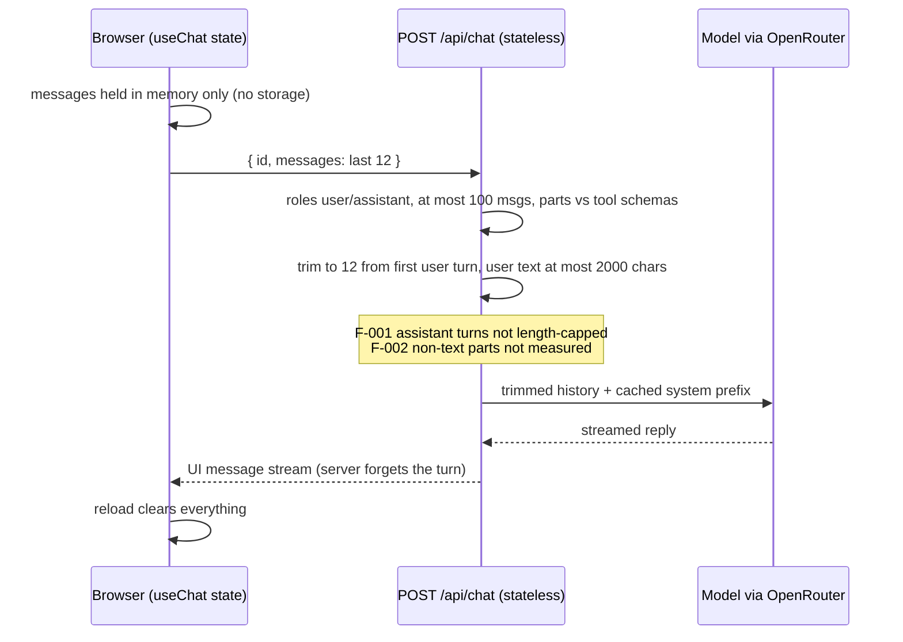

# Architecture Decision Record: Keep the Server Stateless: Conversation Held Only in Browser Memory, Last 12 Messages Sent per Request

> **Template Origin**: Official | **ArcKit Version**: 6.16.3 | **Command**: `/arckit:adr`

## Document Control

| Field | Value |
|-------|-------|
| **Document ID** | ARC-001-ADR-004-v1.0 |
| **Document Type** | Architecture Decision Record |
| **Project** | Cadre AI Support Chatbot — cadre-chatbot (Project 001) |
| **Classification** | OFFICIAL |
| **Status** | DRAFT |
| **Version** | 1.0 |
| **Created Date** | 2026-09-28 |
| **Last Modified** | 2026-09-28 |
| **Review Cycle** | Monthly |
| **Next Review Date** | 2026-10-28 |
| **Owner** | Jhon Felipe Urrego — Solution Architect, Cadre AI Support Chatbot |
| **Reviewed By** | [PENDING] |
| **Approved By** | [PENDING] |
| **Distribution** | Project Team, Architecture Team |

## Revision History

| Version | Date | Author | Changes | Approved By | Approval Date |
|---------|------|--------|---------|-------------|---------------|
| 1.0 | 2026-09-28 | ArcKit AI | Initial creation from `/arckit:adr` command (retrospective, as-built at commit `d63c3ac`) | [PENDING] | [PENDING] |

---

## 1. Decision Title

**Keep the Server Stateless: the Conversation Lives Only in Browser Memory (`useChat`), the Last 12 Messages Are Sent per Request, Nothing Is Persisted and a Reload Starts a New Conversation**

| Attribute | Value |
|-----------|-------|
| **ADR Number** | ADR-004 |
| **Decision Status** | **Accepted** (retrospective record of an implemented decision) |
| **Decision Date** | 2026-09-24 (server-side trim in `0e87a40`; client-side window and 100-message cap in `c94f85c`) |
| **Recorded** | 2026-09-28, against repository commit `d63c3ac` |
| **Escalation Level** | Team |
| **Governance Forum** | Builder self-review via `plan.md` decisions log → take-home review panel (day-5 live review) |

> **Retrospective record.** This ADR describes what the code does at `d63c3ac`; paths in the application's `.gitignore` were not reviewed. The choice and two of its alternatives are **recorded** in the repo: persistent history or a database is listed under `plan.md` "Scope → OUT" and in the "Decisions & trade-offs" rows, and a server-side session store is named in "Known limitations". The signed-assistant-turn alternative comes from the codebase audit's blocking decision C-1.
>
> **Naming note.** "C-1" here always means **CDAU C-1** (trust boundary for client-held conversation history) from `ARC-001-CDAU-001-v1.0`. It is not the requirements document's "Conflict C-1" (lead capture vs grounded pricing).

---

## 2. Stakeholders

### 2.1 Deciders (RACI: Accountable)

- **Jhon Felipe Urrego, Solution Architect / Builder** — chose the state model (SD-13).

### 2.2 Consulted (RACI: Consulted)

- **Cadre AI Engineering** — the future owner. They must decide CDAU C-1 before any privileged tool is added (SD-5).
- **Privacy / Legal** — how long personal data typed into the chat is kept (SD-9).

### 2.3 Informed (RACI: Informed)

- Inbound / Client Success — handoffs carry at most 6 recent turns of context (SD-4).
- Marketing — no conversation analytics, and no resuming a chat after a reload (SD-12).
- Prospective and existing clients — a reload clears the chat (SD-10, SD-11).

### 2.4 UK Government Escalation Context

**Decision Level**: Team

**Escalation Rationale**:

- [x] **Team**: Local implementation choice (session and state model for one app)
- [ ] **Cross-team**: Integration patterns, shared services, API standards
- [ ] **Department**: Technology standards, cloud providers, security frameworks
- [ ] **Cross-government**: National infrastructure, cross-department interoperability

Cadre AI is a private company, so UK Government tiers are used only as a scale. CDAU C-1 would need AI Engineering sign-off once privileged tools or production traffic arrive.

**Governance Forum**: `plan.md` "Decisions & trade-offs" (rows "Chat history not persisted" and "Client sends only the last 12 messages…") → day-5 live review.

**Approval Date**: [PENDING] (no formal approval recorded; implemented 2026-09-24)

---

## 3. Context and Problem Statement

### 3.1 Problem Description

A multi-turn chat needs earlier turns so it can resolve references such as "the second one" and follow corrections. The bot is public and anonymous, handles personal data only at handoff, runs on serverless instances, and must be built in hours [CACTHC-C14]. Every token of history sent to the model costs budget [NSTCCA-C2].

**Problem statement as a question**: Where should conversation state live, how much of it should reach the model per turn, and should any of it be persisted?

### 3.2 Why This Decision Is Needed

- **Business context**: BR-001 (answer common inquiries across turns), BR-005 (stay within budget), BR-007 (measure outcomes without compromising privacy).
- **Technical context**:
  - FR-021: multi-turn context.
  - FR-024: ephemeral conversations.
  - FR-005: poisoned-history handling.
  - NFR-S-001: horizontal scaling.
  - NFR-P-003 and NFR-F-001: bounded work and hard cost caps.
  - NFR-SEC-001: anonymous, sessionless access.
  - NFR-SEC-003: input validation.
- **Data requirements**: DR-003 (no conversation persistence).
- **Regulatory context**: no UK Government regime applies. Users may type personal data, so minimisation and retention matter (NFR-C-001, P-11). Not storing conversations removes most of the retention question for chat content.

### 3.3 Supporting Links

- **Repository evidence**:
  - `components/Chat.tsx:18-30` (transport and `useChat`)
  - `app/page.tsx` (limits passed from `CONFIG`)
  - `app/api/chat/route.ts:21-24, 61-78, 121-137`
  - `lib/config.ts` (`maxHistoryMessages: 12`, `maxRequestMessages: 100`)
  - `plan.md` "API and data model", "Decisions & trade-offs" and "Known limitations"
- **Requirements**: BR-001, BR-005, BR-007, FR-005, FR-021, FR-024, NFR-S-001, NFR-P-003, NFR-F-001, NFR-SEC-001, NFR-SEC-003, DR-003
- **Research findings**: None
- **Related ADRs**: ADR-001 (serverless route handler), ADR-002 (model input), ADR-007 (request guards, planned)

---

## 4. Decision Drivers (Forces)

### 4.1 Technical Drivers

- **Stateless compute**: any serverless instance should be able to serve any turn, with no shared store.
  - Requirements: NFR-S-001
  - Principle: P-17 Stateless Compute With an Explicit Scaling Path
- **Bounded input per request**: history size drives input tokens and the risk of hitting request limits.
  - Requirements: NFR-P-003, NFR-F-001
  - Principle: P-16
- **Valid model input**: Anthropic models reject a conversation that starts with an assistant turn, so a trimmed window must start at a user turn (`route.ts:121`; `CLAUDE.md` gotchas).
  - Requirements: INT-001
- **Validate at the boundary**: client-supplied history must be structurally valid before it reaches the model.
  - Requirements: NFR-SEC-003
  - Principle: P-14

### 4.2 Business Drivers

- **Privacy by default**: no personal data at rest in the browser or on the server beyond the handoff (G-6, SD-9).
  - Requirements: FR-024, DR-003
  - Principle: P-11
- **Build time and zero infrastructure**: no database to provision, secure or operate [CACTHC-C14], [CACTHC-C15].
- **Budget**: long chats must not grow cost without limit (BR-005, SD-8).

### 4.3 Regulatory & Compliance Drivers

- **GDS Service Standard / TCoP**: not applicable.
- **Data Protection**: minimisation (P-11, NFR-C-001). Conversation content is not stored. It exists only in browser memory, in transit, at the inference provider (see ADR-002, F-011), and in the escalation transcript of up to 6 turns × 500 characters when a handoff happens.
- **Security**: the bot is anonymous with no sessions (NFR-SEC-001). The conversation id is generated by the client and used only for correlation.

### 4.4 Alignment to Architecture Principles

Principles from `projects/000-global/ARC-000-PRIN-v1.0.md`:

| Principle | Alignment | Impact |
|-----------|-----------|--------|
| P-11 Privacy by Design and Data Minimisation | ✅ Supports | No conversation persistence, and nothing in local or session storage (checked, `plan.md`). Only a bounded transcript leaves the request, at handoff |
| P-13 Security by Design | ⚠️ Partial | The server trusts client history for content. Forged assistant turns reach the model and staff notifications (F-001, F-002, F-004; CDAU C-1) |
| P-14 Validate Every Input at the Boundary | ⚠️ Partial | Roles are restricted to user and assistant, parts are validated against the tool schemas, and there is a 100-message cap. Only user turns and text parts are length-measured (F-001, F-002) |
| P-16 Cost as a First-Class Architectural Constraint | ⚠️ Partial | A 12-message window is applied on both client and server. The window is capped by message count, not by characters, so assistant turns can inflate it (F-001) |
| P-17 Stateless Compute With an Explicit Scaling Path | ✅ Supports | The server holds no session. A server-side session store is documented as the successor |

---

## 5. Considered Options

Five options. Each rejected option's **Source** line says where the alternative is recorded or where it was reconstructed from.

### Option 1: Client-Held History in Browser Memory, Sliding Window of 12, Nothing Persisted (CHOSEN)

**Description**: `useChat` from `@ai-sdk/react` holds the conversation in React state in the browser tab. Each request carries the latest window. The server validates the window, trims it, generates a reply and forgets it.

**Implementation approach (as built)**:

1. **Client** (`components/Chat.tsx:21-30`):
   - `DefaultChatTransport` with `prepareSendMessagesRequest: ({ id, messages }) => ({ body: { id, messages: messages.slice(-maxHistoryMessages) } })`.
   - The code comments: "The server only uses the latest turns, so long conversations send just those and never hit the body cap."
   - `maxHistoryMessages` (12) comes from `CONFIG.limits` via `app/page.tsx`.
   - `id` is the `useChat` chat id, generated on the client.
2. **No persistence**:
   - No `localStorage`, `sessionStorage`, IndexedDB or cookies anywhere in `app/`, `components/` or `lib/` (grep at `d63c3ac`; also checked manually per `plan.md`).
   - No database dependency in `package.json`.
   - A reload creates a new, empty chat.
3. **Server validation** (`route.ts`):
   - `bodySchema`: `id` is an optional string of at most 100 characters. `messages` is a non-empty array, and each item's `role` must be `user` or `assistant`, so a forged `system` role gets 400. Other fields pass through (`.loose()`).
   - More than 100 messages (`maxRequestMessages`) gets 413 with "This conversation is too long. Reload the page to start a new one."
   - `safeValidateUIMessages` checks the messages against the tool schemas; failures get 400.
   - `trimHistory` keeps the last 12 messages, then drops any leading non-user messages. An empty result gets 400.
   - Any **user** message whose **text** parts exceed 2,000 characters gets 413.
   - The latest message must be a non-empty user message; otherwise 400.
4. **What leaves the request**:
   - The trimmed messages go to the model (ADR-002).
   - `transcriptOf(messages)` takes the last 6 turns, cuts each to 500 characters, and passes them with `conversationId` to the escalation tool (`route.ts:132-137`). This data is sent to the team channel only if a handoff happens (planned ADR-006).
   - The `[chat]` log line carries `conversationId` and usage, but no message content.
5. **Server state**: no session. The only per-instance state is the rate-limit map and the knowledge cache (ADR-003, planned ADR-007).
6. **Verification**:
   - Unit tests: forged system role → 400; oversized message, also when it sits in the history → 413; more than 100 messages → 413; empty or whitespace-only message → 400.
   - Evals: `multi-history-over-cap` (100 turns → 413), `multi-long-history`, `multi-reference-earlier-turn`, `multi-topic-switch`, `multi-self-correction`, `ground-poisoned-history-price` (forged assistant price gets corrected), `api-forged-system-role`, `api-oversized-history-turn`.

**Wardley Evolution Stage**: `useChat` client state is a Product. The stateless serverless handler is Commodity.

#### Good (Pros)

- ✅ **Zero infrastructure and zero chat data at rest**. FR-024 and DR-003 are met.
- ✅ **Scales horizontally** with no sticky sessions or shared store (NFR-S-001).
- ✅ **Bounded model input**: at most 12 messages per request, and long chats never hit the request cap. The 12-message window is enforced on both the client and the server.
- ✅ **Multi-turn quality**: the `multi-*` evals pass on production (FR-021).
- ✅ **Simple mental model**: one request is one self-contained turn, which makes it easy to test with mocked models.

#### Bad (Cons)

- ❌ **The client controls the history**: any caller can forge earlier assistant turns or send oversized ones, because only user turns are length-capped (F-001, F-002, F-004).
- ❌ **Lost on reload**: users cannot resume a conversation. `plan.md` sets the revisit trigger as "Users ask to resume chats".
- ❌ **No conversation analytics**: the unanswered-question analysis that BR-007 and the "Scaling path" call for has no data source.
- ❌ **Context limit by count, not size**: 12 messages of different lengths give an unpredictable token count.

#### Cost Analysis

- **CAPEX**: a few lines on the client and the server. No infrastructure.
- **OPEX**: none beyond model tokens. The window caps history tokens for normal messages; F-001 is the exception.
- **TCO (3-year)**: lowest of the options (qualitative).

#### GDS Service Standard Impact

| Point | Impact | Notes |
|-------|--------|-------|
| 5. Security | Mixed | No data at rest (+); client-controlled history (−, F-001/F-002/F-004) |
| 9. Technology | Positive | Stateless serverless |

*Not applicable to a private company; shown as an engineering checklist only.*

---

### Option 2: Server-Side Session Store Keyed by Conversation Id, Accepting Only the New User Message (REJECTED FOR MVP — recorded)

**Description**: Store each conversation in Redis or a database keyed by a server-issued id. The client sends only the new user message, and the server appends the assistant's reply itself.

**Source**:

- `plan.md` "Scope → OUT": "Persistent chat history / DB — no requirement justifies it for MVP".
- `plan.md` "Known limitations": "a user could forge earlier assistant turns … a server-side session store would close it fully".
- CDAU C-1 option (c).

**Wardley Evolution Stage**: Product or Commodity (managed Redis or a database)

#### Good (Pros)

- ✅ **Closes history forgery**: the assistant turns are the server's own (F-001, F-002 and F-004 transcripts).
- ✅ **Enables resume, analytics and full handoff context** (BR-007).
- ✅ **Bounded request bodies**: one user message per request.

#### Bad (Cons)

- ❌ **Personal data at rest**: conversation content would need retention rules, a DPIA scope and access control (NFR-C-001, P-11).
- ❌ **Infrastructure and a new secret** within a 4–6 hour build [CACTHC-C14].
- ❌ **Session lifecycle**: expiry, id issuance and abuse such as filling the store.

#### Cost Analysis

- **CAPEX**: store provisioning, session code and a retention job.
- **OPEX**: managed store cost, plus privacy operations.
- **TCO (3-year)**: higher than Option 1 (qualitative).

#### GDS Service Standard Impact

| Point | Impact | Notes |
|-------|--------|-------|
| 5. Security | Positive / Negative | Trusted history, but a new data store to secure |

---

### Option 3: Client-Held History With Server-Signed Assistant Turns (REJECTED — reconstructed, CDAU C-1 option b)

**Description**: Keep Option 1, but have the server sign each assistant turn it produces, for example with an HMAC over the turn's content and id. The server rejects unsigned or altered assistant turns.

**Source**: reconstructed from CDAU C-1 option (b). The repo does not mention it.

**Wardley Evolution Stage**: Custom-Built

#### Good (Pros)

- ✅ **Stops forged assistant turns** while keeping the server stateless and storing no data.

#### Bad (Cons)

- ❌ **Added complexity**: a signing key, signatures carried in the UI message parts, and verification of streamed turns.
- ❌ **Size is still unbounded unless also capped**: signing proves origin but does not limit length. The per-turn caps are still needed (F-001).

#### Cost Analysis

- **CAPEX**: moderate (signing and verification, key management).
- **OPEX**: negligible.
- **TCO (3-year)**: low (qualitative).

#### GDS Service Standard Impact

| Point | Impact | Notes |
|-------|--------|-------|
| 5. Security | Positive | Integrity of history without storage |

---

### Option 4: Persist the Conversation in Browser Storage (localStorage or sessionStorage) (REJECTED — recorded)

**Description**: Save `useChat` messages to browser storage so that a reload restores the chat.

**Source**: the `plan.md` decisions row "Chat history not persisted: a reload starts a new conversation — No PII in browser storage and no DB; the same behaviour every time (checked: nothing in local/sessionStorage) — Revisit when: Users ask to resume chats".

**Wardley Evolution Stage**: Commodity

#### Good (Pros)

- ✅ **Resume after reload** with no server infrastructure.

#### Bad (Cons)

- ❌ **Personal data persists on shared or public devices**. Emails typed for a handoff would stay in storage (P-11, FR-024 ❌).
- ❌ **No gain in integrity**: storage is as client-controlled as memory.

#### Cost Analysis

- **CAPEX**: small.
- **OPEX**: none.
- **TCO (3-year)**: low, with a privacy cost.

#### GDS Service Standard Impact

| Point | Impact | Notes |
|-------|--------|-------|
| 5. Security | Negative | PII at rest on the client device |

---

### Option 5: Do Nothing (Baseline): Send the Full Client History With No Window

**Description**: This was the behaviour before commit `c94f85c`: `useChat`'s default transport sends every message on every request, and the server keeps only a window of 12.

**Source**: recorded. Commit `c94f85c` "fix: reject empty messages and keep long chats under the request cap" added the client-side slice and the 100-message request cap.

#### Good

- ✅ **No client code**; this is the library default.

#### Bad

- ❌ **Request bodies grow without limit**, so long chats eventually fail on body or message caps.
- ❌ **Wasted bandwidth**: the server discards everything except the last 12 messages anyway.

---

## 6. Decision Outcome

### 6.1 Chosen Option

**"Option 1: Client-held history in browser memory, sliding window of 12, nothing persisted"**

### 6.2 Y-Statement (Structured Justification)

> **In the context of** a public, anonymous support chat on serverless instances, where users may type personal data,
> **facing** the need for multi-turn context at a bounded cost, with no chat data at rest and no infrastructure to build within hours,
> **we decided for** keeping the conversation only in `useChat` browser memory, sending the last 12 messages per request, validating, trimming and forgetting them on the server, and persisting nothing,
> **to achieve** stateless horizontal scaling, zero stored conversation data and a bounded model input,
> **accepting** that the client controls the history content (forged or oversized assistant turns, F-001/F-002), that chats are lost on reload, and that there are no conversation analytics, until CDAU C-1 decides the trust model.

### 6.3 Justification (Why This Option?)

**Key reasons**:

1. **Privacy by default**: no stored chat content, verified in code and manually (FR-024, DR-003).
2. **Simplicity and scale**: no store, no session and no sticky routing (NFR-S-001, P-17).
3. **No privileged actions**: the only tool with side effects needs a user-supplied email (NFR-SEC-001), so forged history mainly affects answer integrity. The prompt mitigates that (`ground-poisoned-history-price` passes). The audit shows that cost (F-001) and staff-facing content (F-004) are also exposed, which is why CDAU C-1 is a blocking decision.
4. **Measured multi-turn quality**: the `multi-*` evals pass.

**Stakeholder consensus**: made by the builder alone and recorded in `plan.md`. The limitation is disclosed in `plan.md` "Known limitations".

**Risk appetite**: acceptable for the assessment window. Before production traffic, and before adding any privileged tool, CDAU C-1 must be decided.

---

## 7. Consequences

### 7.1 Positive Consequences

- ✅ **No chat content at rest** anywhere Cadre controls (DR-003 ✅).
- ✅ **Any instance can serve any turn** (NFR-S-001 ✅ for conversations).
- ✅ **Predictable windowing**: the client and server share `CONFIG.limits.maxHistoryMessages`.
- ✅ **Clean error for very long sessions**: more than 100 messages gets a 413 telling the user to reload.

**Measurable outcomes**:

- Chat data in browser storage: none (checked, `plan.md`)
- History messages per request: at most 12 (client and server); requests with more than 100 messages are rejected
- `multi-*` and `ground-poisoned-history-price` evals: pass on production (part of 83/83)

### 7.2 Negative Consequences (Accepted Trade-offs)

Audit gaps from `ARC-001-CDAU-001-v1.0` caused by this state model:

- ❌ **F-001 (CRITICAL) — assistant turns in client history are not capped**:
  - The length check applies only to `role === "user"` (`route.ts:72`). A client can place large assistant turns in the 12-message window and fill the 256 KB body.
  - One anonymous request then carries roughly 60–100k uncached input tokens, about $0.06–0.20, against about $0.003 for a normal cached turn (audit estimate).
  - At that rate the key's credit, and the bot with it, could be used up in about 25–80 requests.
  - The existing unit test and the `api-oversized-history-turn` eval both use a **user** turn, so neither covers this case.
- ❌ **F-002 (HIGH) — non-text parts are not measured**:
  - `messageText()` counts only `text` parts, while `safeValidateUIMessages` accepts other UI part types.
  - User messages carrying `file` parts (data URLs or remote URLs) could therefore reach the model, or be downloaded by the SDK, outside both the per-message and the body caps.
- ❌ **F-004 (HIGH), in part — forged turns reach staff**: `transcriptOf()` builds the escalation transcript from client-supplied turns, including forged "assistant" turns, and posts it to the team channel with no label. The sanitisation side is covered by CDAU C-4 and the planned ADR-006.
- ❌ **Integrity of answers relies on the prompt**: a forged price in history is corrected by behaviour (FR-005), not by the architecture.
- ❌ **No resume and no analytics**: conversations are lost on reload, and BR-007 has no data source.

**Blocking decision — CDAU C-1: trust boundary for client-held conversation history.** F-001, F-002 and F-004 cannot be fixed consistently until this is decided, and any future privileged tool would inherit the forgeable context. The audit lists three options:

- **(a)** Keep client-held history, but bound every turn regardless of role, allow-list part types per role (user: `text`; assistant: `text` plus the known tool parts), and add a total character budget across the trimmed window. This is a small change in `route.ts` and keeps this ADR valid, as an amendment.
- **(b)** Server-signed assistant turns (Option 3).
- **(c)** Server-side session store accepting only the new user message (Option 2). This would supersede this ADR.

Suggested ADR title from the audit: "Treat client-supplied conversation history as untrusted: validation and ownership model".

**Mitigation strategies**:

- **Now (unblocked, compatible with C-1 (a))**:
  - Apply the 2,000-character cap to every turn.
  - Allow-list part types per role.
  - Add a total-character budget for the window.
  - Add a unit test and an eval case for an oversized **assistant** turn and a `file` part.
- **Meanwhile**:
  - Keep a low credit limit on the serving key.
  - Keep `ground-poisoned-history-price` in the eval suite.
- **Before production**: decide CDAU C-1 in an ADR. Label transcript turns as unverified client content (CDAU C-4).

### 7.3 Neutral Consequences (Changes Needed)

- 🔄 **UX**: the 413 message tells users to reload after 100 messages. There is no "clear chat" control (reload is the reset).
- 🔄 **Process**: any change to `maxHistoryMessages` affects the client and the server together, via `CONFIG`.
- 🔄 **Data protection**: the DPIA scope covers conversation content in transit, at the inference provider and in handoff transcripts, but not at rest.

### 7.4 Risks and Mitigations

| Risk | Likelihood | Impact | Mitigation | Owner |
|------|------------|--------|------------|-------|
| Budget drained by oversized assistant turns (F-001) | M | H | Cap every turn plus a window budget; low key credit limit; CDAU C-1 | Solution Architect / Builder |
| File or other parts bypass the size caps (F-002) | M | M | Part-type allow-list per role | AI Engineering |
| Forged history misleads the model or the team channel (F-004, FR-005) | M | M | Prompt rule and eval (in place); label transcripts; CDAU C-1 / C-4 | AI Engineering |
| A future privileged tool trusts forged context | L | H | Decide CDAU C-1 before adding any such tool | AI Engineering |
| Users frustrated by lost chats on reload | L | L | Revisit trigger "Users ask to resume chats" | Marketing / AI Engineering |

**Link to risk register**: none yet (`ARC-001-RISK` does not exist). Run `/arckit:risk` to register these.

---

## 8. Validation & Compliance

### 8.1 How Will Implementation Be Verified?

**Design review**:

- [x] Architecture diagrams reflect this decision:
  - ARC-001-DIAG-005 (Sequence: client sends the last 12)
  - DIAG-007 (ER: ChatMessage held by the client)
  - DIAG-008 (UI status; "reload clears the conversation")
  - DIAG-009 (trim and guard pipeline)
  - Archify renders DIAG-014, DIAG-016, DIAG-018 and DIAG-019
- [ ] CDAU C-1 decided and recorded as an ADR
- [ ] Conformance check against this ADR (`/arckit:conformance`)

**Code review**:

- [x] No browser-storage APIs or database clients in `app/`, `components/` or `lib/`
- [x] The client slice and the server trim both use `CONFIG.limits.maxHistoryMessages`
- [ ] Per-turn cap independent of role, and a part-type allow-list (F-001, F-002)

**Testing strategy**:

- [x] Unit tests: forged system role, oversized user message in history, more than 100 messages, empty message
- [x] Evals: `multi-history-over-cap`, `multi-long-history`, `multi-reference-earlier-turn`, `multi-topic-switch`, `multi-self-correction`, `ground-poisoned-history-price`, `api-forged-system-role`, `api-oversized-history-turn`
- [ ] Unit test and eval for an oversized **assistant** turn (F-001)
- [ ] Unit test for a `file` part in a user message (F-002)
- [ ] Manual check re-run: storage stays empty after a chat and a handoff (FR-024)

### 8.2 Monitoring & Observability

**Success metrics**:

- **Input tokens per request**: the `inputTokens` field of the `[chat]` log line. An outlier well above the cached baseline suggests history inflation (F-001).
- **413 rate** from the history caps: not logged today (rejections are not logged).

**Alerts and dashboards**: none (F-012). Candidate: alert when uncached input tokens per request go above a threshold.

### 8.3 Compliance Verification

**GDS Service Assessment / TCoP**: not applicable.

**Security assurance**:

- [x] System-role injection rejected (400)
- [ ] History integrity model decided (CDAU C-1)

**Data protection**:

- [x] No conversation persistence (DR-003)
- [ ] DPIA covering in-transit, inference-provider and handoff-transcript processing

---

## 9. Links to Supporting Documents

### 9.1 Requirements Traceability

**Business Requirements**:

- BR-001: Answer Common Inbound Inquiries — multi-turn context
- BR-005: Operate Within the Runtime Budget — bounded history
- BR-007: Measure Outcomes Without Compromising Privacy — no chat data stored (limits analytics)

**Functional Requirements**:

- FR-005: False-Premise and Poisoned-History Handling
- FR-021: Multi-Turn Context
- FR-024: Ephemeral Conversations

**Non-Functional Requirements**:

- NFR-S-001: Horizontal Scaling
- NFR-P-003: Bounded Work per Request
- NFR-F-001: Hard Cost Caps
- NFR-SEC-001: Authentication and Authorisation (anonymous, sessionless)
- NFR-SEC-003: API Input Validation and Hardening (partial: F-001, F-002)

**Data Requirements**: DR-003 No Conversation Persistence; REQ entity ChatMessage (client-held).

### 9.2 Architecture Artifacts

**Architecture principles**: `projects/000-global/ARC-000-PRIN-v1.0.md` — P-11, P-13, P-14, P-16, P-17

**Stakeholder drivers**: `projects/001-cadre-chatbot/ARC-001-STKE-v1.0.md` — SD-4, SD-5, SD-9, SD-10, SD-11, SD-12, SD-13; goals G-5, G-6

**Risk register**: not yet created

**Architecture diagrams**: `projects/001-cadre-chatbot/diagrams/` — DIAG-005, DIAG-007, DIAG-008, DIAG-009; Archify DIAG-014, DIAG-016, DIAG-018, DIAG-019

**Codebase audit**: `projects/001-cadre-chatbot/audits/ARC-001-CDAU-001-v1.0.md` — F-001, F-002, F-004; blocking decisions C-1 and C-4

### 9.3 Design Documents

**High-Level Design**: none; `plan.md` "API and data model" ("Conversation state lives in the browser; the server is stateless apart from the per-instance rate-limit map").

**Data model**: REQ entity ChatMessage (client-held, retained in browser memory only); ARC-001-DIAG-007.

### 9.4 External References

**Vendor documentation**: AI SDK 7 `useChat`, `DefaultChatTransport` (`prepareSendMessagesRequest`) and `safeValidateUIMessages`, in the docs bundled at `node_modules/ai/docs/`.

**Research and evidence**: commits `0e87a40` and `c94f85c`; the `plan.md` decisions rows; eval cases in `evals/cases.ts`.

---

## 10. Implementation Plan

### 10.1 Dependencies

**Prerequisite decisions**: ADR-001 (serverless route handler and `useChat` client).

**Infrastructure dependencies**: none.

**Team dependencies**: none beyond AI SDK 7 familiarity.

### 10.2 Implementation Timeline

Already implemented. Actual timeline:

| Phase | Activities | Duration | Owner |
|-------|-----------|----------|-------|
| **Phase 1: Server trim** | `trimHistory` to 12 messages from the first user turn; per-message cap (`0e87a40`) | 2026-09-24 | Builder |
| **Phase 2: Client window** | Client `slice(-maxHistoryMessages)`; 100-message request cap (413); empty-message rejection (`c94f85c`) | 2026-09-24 | Builder |
| **Phase 3: Validation** | Unit tests (`6020010`); `multi-*`, `api-*` and poisoned-history evals; storage check | 2026-09-24 → 2026-09-25 | Builder |

**Outstanding follow-ups**: fixes for F-001 and F-002 (compatible with CDAU C-1 option (a)); the CDAU C-1 ADR.

### 10.3 Rollback Plan

**Rollback trigger**: a change to the history window or validation breaks multi-turn evals, or the API starts rejecting valid `useChat` requests.

**Rollback procedure**:

1. Revert the commit on `main` and push, or promote the previous deployment.
2. Re-run `npm run eval -- multi api ground-poisoned` and the six-scenario smoke test.

**Rollback owner**: Jhon Felipe Urrego, Solution Architect / Builder (AI Engineering after handover)

---

## 11. Review and Updates

### 11.1 Review Schedule

**Initial review**: when CDAU C-1 is decided, and no later than 2026-10-28

**Periodic review**: quarterly

**Review criteria**:

- Has CDAU C-1 been decided? If option (c) was chosen, supersede this ADR.
- Do users ask to resume chats (the `plan.md` trigger)?
- Is conversation analytics needed for BR-007?
- Do answers need context older than 12 messages (the `plan.md` trigger)?

### 11.2 Trigger Events for Review

- [ ] A privileged tool is added (anything beyond booking link and handoff)
- [ ] A cost spike traced to inflated history (F-001)
- [ ] A requirement to resume conversations, or to analyse them
- [ ] Embedding on cadreai.com across pages (continuity across navigations)
- [ ] Model context-window or pricing change that makes 12 messages the wrong window

---

## 12. Related Decisions

### 12.1 Decisions This ADR Depends On

- **ADR-001**: Use Next.js 16 App Router With a Single Streaming Route Handler on Vercel — serverless handler and `useChat` client.

### 12.2 Decisions That Depend On This ADR

- **ADR-002**: Access Claude Haiku 4.5 Through OpenRouter — the model receives the trimmed window.
- **ADR-006 (planned)**: Human handoff via webhook — the escalation transcript is built from client-held turns.
- **ADR-007 (planned)**: Request guards — the history caps are part of the guard chain.
- **Future (CDAU C-1)**: Treat client-supplied conversation history as untrusted. It will amend this ADR (option a or b) or supersede it (option c).

### 12.3 Conflicting Decisions

- **REQ Conflict C-2: Rich Handoff Context vs Data Minimisation.** This is resolved here by capping the transcript at 6 turns × 500 characters and storing nothing else.

---

## 13. Appendices

### Appendix A: Options Analysis Details

| Criterion | Opt 1 Client memory, window 12 (chosen) | Opt 2 Server session store | Opt 3 Signed assistant turns | Opt 4 Browser storage | Opt 5 Full history, no window |
|-----------|----------------------------------------|----------------------------|------------------------------|-----------------------|-------------------------------|
| Chat data at rest | None | Server | None | Client device | None |
| History integrity | ❌ client-controlled | ✅ | ✅ (origin only) | ❌ | ❌ |
| Resume after reload | ❌ | ✅ | ❌ | ✅ | ❌ |
| Infrastructure | None | Store + retention | Signing key | None | None |
| Bounded request size | ⚠️ (F-001/F-002) | ✅ | ⚠️ unless also capped | ⚠️ | ❌ |
| Evidence source | code, `plan.md` | `plan.md` OUT + limitations, CDAU C-1(c) | CDAU C-1(b) | `plan.md` decisions row | commit `c94f85c` |

### Appendix B: Stakeholder Consultation Log

| Date | Stakeholder | Feedback | Action Taken |
|------|-------------|----------|--------------|
| 2026-09-24 | Builder testing | Long chats would hit the request cap | Client window and 100-message cap (`c94f85c`) |
| 2026-09-24 | Eval design | Forged assistant price in history | `ground-poisoned-history-price` added; prompt handles it |
| 2026-09-28 | ArcKit codebase audit | F-001, F-002, F-004; blocking decision C-1 | Recorded under Consequences |

### Appendix C: Alternative Formats

---

## Document Approval

| Role | Name | Signature | Date |
|------|------|-----------|------|
| **Technical Architect** | Jhon Felipe Urrego | | [PENDING] |
| **Senior Responsible Owner** | [PENDING] | | [PENDING] |
| **Security Architect** | [PENDING] | | [PENDING] |
| **Governance Board** | Take-home review panel | | [PENDING] |

---

*This ADR follows the MADR v4.0 format enhanced with UK Government requirements and ArcKit governance standards.*

*For more information:*

- *MADR: https://adr.github.io/madr/*
- *UK Gov ADR Framework: https://www.gov.uk/government/publications/architectural-decision-record-framework*
- *ArcKit Documentation: `projects/001-cadre-chatbot/README.md`*

## External References

> This section provides traceability from generated content back to source documents.
> Follow citation instructions in the project's citation reference guide.

### Document Register

| Doc ID | Filename | Type | Source Location | Description |
|--------|----------|------|-----------------|-------------|
| CACTHC | Cadre_AI_Chatbot_Take_Home_Candidate_v1.1.pdf | Challenge brief | 001-cadre-chatbot/external/ | Build-time and scope guidance |
| NSTCCA | Next Steps  Tech Challenge  Cadre AI.txt | Recruiter email | 001-cadre-chatbot/external/ | Credential budget (credential value not reproduced) |
| APP | cadre-chatbot repository at `d63c3ac` | Reference implementation | github.com/johnfelipe/cadre-chatbot | `components/Chat.tsx`, `app/page.tsx`, `app/api/chat/route.ts`, `app/api/chat/route.test.ts`, `lib/config.ts`, `evals/cases.ts`, `plan.md`, `CLAUDE.md`, commits `0e87a40`, `c94f85c` |
| CDAU | ARC-001-CDAU-001-v1.0.md | Codebase audit | 001-cadre-chatbot/audits/ | F-001, F-002, F-004; blocking decisions C-1, C-4 |

### Citations

| Citation ID | Doc ID | Page/Section | Category | Quoted Passage |
|-------------|--------|--------------|----------|----------------|
| CACTHC-C14 | CACTHC | p.2, Challenge Format | Business Requirement | "We recommend budgeting 4–6 hours. Build, deploy, and prepare your submission." |
| CACTHC-C15 | CACTHC | p.7, Tips | Design Decision | "Cut scope aggressively. 3 working features > 8 broken ones." |
| NSTCCA-C2 | NSTCCA | Paragraph "API Key" | Procurement Constraint | "It has a $5 budget and expires in 7 days, so plan accordingly" (credential value redacted) |

### Unreferenced Documents

| Filename | Source Location | Reason |
|----------|-----------------|--------|
| README.md | 001-cadre-chatbot/external/ | Folder placeholder; no decision content |

---

**Generated by**: ArcKit `/arckit:adr` command
**Generated on**: 2026-09-28 GMT
**ArcKit Version**: 6.16.3
**Project**: Cadre AI Support Chatbot — cadre-chatbot (Project 001)
**AI Model**: Claude Opus 5.5 (claude-opus-5-5)
**Generation Context**: Retrospective ADR from the as-built repository at commit `d63c3ac`. Sources: the `Chat.tsx` transport and `useChat`, route validation, trim and transcript, `CONFIG` limits, a grep for storage APIs, route unit tests, `multi-*`/`api-*`/poisoned-history evals, the `plan.md` scope, decisions and limitations, and commits `0e87a40` and `c94f85c`. Artefacts used: ARC-000-PRIN, ARC-001-REQ, ARC-001-STKE, ARC-001-CDAU-001 (F-001, F-002, F-004, C-1, C-4) and the external brief and recruiter email.
