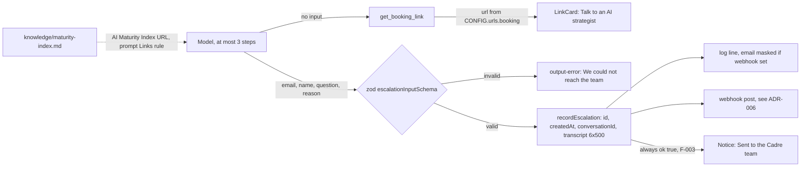

# Architecture Decision Record: Expose Exactly Two Typed Model Tools, `get_booking_link` and `escalate_to_human`

> **Template Origin**: Official | **ArcKit Version**: 6.16.3 | **Command**: `/arckit:adr`

## Document Control

| Field | Value |
|-------|-------|
| **Document ID** | ARC-001-ADR-005-v1.0 |
| **Document Type** | Architecture Decision Record |
| **Project** | Cadre AI Support Chatbot — cadre-chatbot (Project 001) |
| **Classification** | OFFICIAL |
| **Status** | DRAFT |
| **Version** | 1.0 |
| **Created Date** | 2026-09-28 |
| **Last Modified** | 2026-09-28 |
| **Review Cycle** | Monthly |
| **Next Review Date** | 2026-10-28 |
| **Owner** | Jhon Felipe Urrego — Solution Architect, Cadre AI Support Chatbot |
| **Reviewed By** | [PENDING] |
| **Approved By** | [PENDING] |
| **Distribution** | Project Team, Architecture Team |

## Revision History

| Version | Date | Author | Changes | Approved By | Approval Date |
|---------|------|--------|---------|-------------|---------------|
| 1.0 | 2026-09-28 | ArcKit AI | Initial creation from `/arckit:adr` command (retrospective, as-built at commit `d63c3ac`) | [PENDING] | [PENDING] |

---

## 1. Decision Title

**Expose Exactly Two Typed Model Tools: `get_booking_link` (No Input, Returns the Configured Booking URL) and `escalate_to_human` (Zod-Validated Email, Optional Name, Question and Enum Reason)**

| Attribute | Value |
|-----------|-------|
| **ADR Number** | ADR-005 |
| **Decision Status** | **Accepted** (retrospective record of an implemented decision) |
| **Decision Date** | 2026-09-24 (tools added in `2bf2fa8`; booking default set to the contact page in `c2ece24`); per-request context added 2026-09-25 (`5c9606a`) |
| **Recorded** | 2026-09-28, against repository commit `d63c3ac` |
| **Escalation Level** | Team |
| **Governance Forum** | Builder self-review via `plan.md` decisions log → take-home review panel (day-5 live review) |

> **Retrospective record.** This ADR describes the code at `d63c3ac`: `lib/tools.ts`, `lib/escalations.ts` (schema), `lib/prompt.ts` (tool-use rules) and `components/Chat.tsx` (tool rendering). Paths in the application's `.gitignore` were not reviewed.
>
> **Correction to the request.** `get_booking_link` returns **only** the booking URL (`CONFIG.urls.booking`: `BOOKING_URL`, or `https://cadreai.com/contact` by default). The **AI Maturity Index link is not a tool output**. It is a fact in `knowledge/maturity-index.md` (`https://portal.gocadre.ai/ai-maturity-index`), which the model may repeat because the prompt allows URLs "in the knowledge or in a tool result" (INT-004, eval `s4-maturity-index`).
>
> **Later commits.** HEAD has since moved to `acbd6a0` (five commits on 2026-09-28). They change only the webhook delivery inside `recordEscalation` (a retry, and a 1.7 s timeout per attempt). The two tool definitions, the escalation schema and the tool results are **unchanged**, so this ADR also holds at HEAD. Delivery is covered by the planned ADR-006.

---

## 2. Stakeholders

### 2.1 Deciders (RACI: Accountable)

- **Jhon Felipe Urrego, Solution Architect / Builder**: designed both tools and their schemas (SD-13).

### 2.2 Consulted (RACI: Consulted)

- **Client Strategy**: the booking destination and wording ("Talk to an AI strategist") (SD-3).
- **Inbound / Client Success**: the handoff fields they receive (SD-4).
- **Cadre AI Engineering**: future owner of any new tool, and gatekeeper for privileged ones (SD-5).

### 2.3 Informed (RACI: Informed)

- Marketing: the booking URL points at the website contact form (SD-12).
- Privacy / Legal: the escalation tool collects an email and an optional name (SD-9).

### 2.4 UK Government Escalation Context

**Decision Level**: Team

**Escalation Rationale**:

- [x] **Team**: Local implementation choice (the model's action surface in one app)
- [ ] **Cross-team**: Integration patterns, shared services, API standards
- [ ] **Department**: Technology standards, cloud providers, security frameworks
- [ ] **Cross-government**: National infrastructure, cross-department interoperability

Cadre AI is a private company, so UK Government tiers are used only as a scale. Adding any tool with **privileged** effects (account data, CRM writes, portal actions) should escalate to AI Engineering and wait for audit blocking decision **CDAU C-1**.

**Governance Forum**: `plan.md` "Decisions & trade-offs" (row "Tools return URLs from config") → day-5 live review.

**Approval Date**: [PENDING] (no formal approval recorded; implemented 2026-09-24)

---

## 3. Context and Problem Statement

### 3.1 Problem Description

The bot has two things to do that have operational consequences:

- Send a ready prospect to a strategist call (scenario 2 [CACTHC-C5]).
- Hand anything it cannot answer to the Cadre team (scenario 6 [CACTHC-C5]).

Language models invent plausible URLs and contact details, and a handoff needs a reachable email and a usable question. Both actions must be reliable, testable and impossible for the model to "free-type".

**Problem statement as a question**: Which actions should the model be able to take, with what inputs and outputs, so that links are always correct and handoffs always carry a valid email and reason?

### 3.2 Why This Decision Is Needed

- **Business context**:
  - BR-003: convert intent into strategist conversations.
  - BR-004: human handoff for anything the bot cannot answer.
  - BR-002: no invented URLs.
- **Technical context**:
  - FR-007 booking tool and card; FR-008 proactive booking offer.
  - FR-013 human request flow; FR-014 escalation tool.
  - FR-015 truthful confirmation; FR-016 email declined.
  - DR-002 escalation record schema.
  - INT-002 team webhook; INT-003 contact page; INT-004 AI Maturity Index.
- **Regulatory context**: No UK Government regime applies. The escalation tool collects personal data (an email and an optional name) with the user's explicit input. Minimisation, masking and retention are covered in NFR-C-001 and DR-004.

### 3.3 Supporting Links

- **Repository evidence**:
  - `lib/tools.ts:6-31`
  - `lib/escalations.ts:4-11, 54-85`
  - `lib/prompt.ts:40-51` (Links and Escalation rules)
  - `lib/config.ts` (`urls.booking`)
  - `components/Chat.tsx:135-143`
  - `app/api/chat/route.ts:67, 81, 93`
  - Commits `2bf2fa8`, `c2ece24`, `5c9606a`, `4c091a0`
- **Requirements**: BR-002, BR-003, BR-004, FR-007, FR-008, FR-013, FR-014, FR-015, FR-016, DR-002, INT-002, INT-003, INT-004
- **Research findings**: None
- **Related ADRs**: ADR-002 (≤ 3 steps), ADR-003 (knowledge supplies other URLs), ADR-004 (transcript from client history), ADR-006 (delivery, planned)

---

## 4. Decision Drivers (Forces)

### 4.1 Technical Drivers

- **No model-generated consequential values**: URLs and handoff records come from code and configuration, not model text.
  - Requirements: FR-007, BR-002
  - Principle: P-7 Deterministic Actions Through Typed Tools
- **Validated inputs**: A malformed email must be rejected before any record is made.
  - Requirements: FR-014
  - Principle: P-14
- **Typed end to end**: Tool parts reach the UI as typed message parts (`ChatMessage` derived from the tools) and are validated on the way back in (`safeValidateUIMessages`).
  - Requirements: NFR-SEC-003
- **Bounded multi-step use**: A tool call plus the follow-up answer must fit in the 3-step cap (ADR-002).
  - Requirements: NFR-P-003

### 4.2 Business Drivers

- **Qualified strategist conversations**: Offer the call when intent shows, and respect a decline.
  - Requirements: BR-003, FR-008
  - Stakeholder goals: G-3, SD-3
- **Actionable handoffs without a CRM**: The team gets an email, a reason and context.
  - Requirements: BR-004
  - Stakeholder goals: G-4, SD-4
- **Scope discipline**: "3 working features > 8 broken ones" [CACTHC-C15].

### 4.3 Regulatory & Compliance Drivers

- **GDS Service Standard / TCoP**: Not applicable. TCoP Point 13 (AI: human oversight) is reflected by a human handoff path always being available.
- **Data Protection**:
  - Email and name are collected only on explicit user input, and the model must "never make up an email address".
  - The user can decline and is then sent to public contact details instead (FR-016).
  - The masking and retention gaps are recorded under ADR-006 and C-5.
- **Consumer protection**: No outcome or response-time promises before or after a handoff (FR-015, SD-14).

### 4.4 Alignment to Architecture Principles

Principles from `projects/000-global/ARC-000-PRIN-v1.0.md`:

| Principle | Alignment | Impact |
|-----------|-----------|--------|
| P-2 Human Handoff Over Guessing | ✅ Supports | `escalate_to_human` plus prompt rules make a handoff the default for gaps. Confirmation truthfulness is partial (F-003) |
| P-3 Route Intent to the Right Conversation | ✅ Supports | `get_booking_link` is offered on engagement intent (evals `tool-indirect-booking-intent`, `tool-explicit-decline-booking`) |
| P-7 Deterministic Actions Through Typed Tools | ✅ Supports | The booking URL comes from config. The escalation input is zod-validated, and the id and timestamp are generated by the server |
| P-11 Privacy by Design and Data Minimisation | ⚠️ Partial | Personal data is collected only on explicit input and the transcript is bounded. Client-controlled text goes unsanitised to staff (F-004) |
| P-13 Security by Design | ⚠️ Partial | No privileged tools. There is no per-conversation or per-email escalation cap, and no sanitisation (F-004) |
| P-14 Validate Every Input at the Boundary | ✅ Supports | The email format, name ≤ 100, question 1–1,000 and reason enum are all enforced by the SDK before `execute` |

---

## 5. Considered Options

There are five options. Each rejected option has a **Source** line saying whether the repo records it or it has been reconstructed.

### Option 1: Two Typed Tools, Booking From Config and Escalation With a Validated Schema (CHOSEN)

**Description**: `buildTools(context)` in `lib/tools.ts` returns two AI SDK `tool()` definitions and is called **per request**, so the escalation carries that request's conversation id and recent turns. The module also exports `tools = buildTools()` (no context) for type inference (`ChatTools`, `ChatMessage`) and for message validation.

**Implementation approach (as built)**:

1. **`get_booking_link`** (`lib/tools.ts:9-14`):
   - Description: "Get the link to book a strategy call with a Cadre AI strategist. Call this whenever you share how to book a call."
   - `inputSchema: z.object({})`, so it takes no input.
   - `execute: async () => ({ url: CONFIG.urls.booking })`, where `CONFIG.urls.booking = process.env.BOOKING_URL || "https://cadreai.com/contact"`.
   - Commit `c2ece24` removed an earlier fallback branch, because "every 'Talk to an AI Strategist' button opens https://cadreai.com/contact". The site has no self-serve calendar.
2. **`escalate_to_human`** (`lib/tools.ts:16-24`):
   - Description: "Hand the conversation off to the Cadre team, who will follow up by email. Only call this after the user has given their email."
   - `inputSchema: escalationInputSchema` (`lib/escalations.ts:4-11`):
     - `email: z.email()`
     - `name: z.string().max(100).optional()`
     - `question: z.string().min(1).max(1000)`
     - `reason: z.enum(["user_requested_human", "unknown_answer", "account_specific", "other"])`
     - Each field has a `.describe()` hint for the model.
   - `execute` calls `recordEscalation(input, context)`. That function adds `id` (`crypto.randomUUID()`), `createdAt`, `conversationId` and `transcript` (last 6 turns × 500 chars, from `route.ts:132-137`), writes a log line and posts to the webhook if one is configured (planned ADR-006).
   - It returns `{ ok: true as const, id }`.
3. **Prompt rules** (`lib/prompt.ts`), under Links:
   - "Never write a URL that does not appear in the knowledge or in a tool result."
   - "To share the booking link, call get_booking_link. Do not type a booking link yourself."
4. **Prompt rules**, under Escalation:
   - Hand off when the user asks for a human, when the need is account-specific (for example portal access), or when information is missing and a follow-up is wanted.
   - On a human request, offer both the call and an email follow-up, and ask for the email in the same reply.
   - Until `escalate_to_human` has succeeded, make no promises about what the team will do.
   - Never make up an email.
   - As soon as an email is given, call the tool in that same reply, using the request as the question if none was stated (fix `4c091a0`).
   - If the user declines to give an email, point to the website.
   - After success, say the team will follow up by email, without promising a response time.
5. **Prompt rules**, under Style: offer the strategist call when the user seems ready to engage.
6. **Wiring** (`route.ts`):
   - `safeValidateUIMessages({ messages, tools })` validates incoming tool parts against the schemas.
   - `buildTools({ conversationId, transcript })` runs per request.
   - `tools: requestTools` goes to `streamText`, with `stopWhen: isStepCount(3)`.
7. **UI** (`components/Chat.tsx:135-143`):
   - `tool-get_booking_link` with `output-available` renders a `LinkCard` labelled "Talk to an AI strategist".
   - `tool-escalate_to_human` renders a notice: "Sent to the Cadre team. They'll follow up by email." on `output-available`, or "We couldn't reach the team. Please try again." on `output-error`.
8. **What is not a tool**: The AI Maturity Index URL and all other public URLs come from `knowledge/` (ADR-003). The model may repeat them because of the Links rule.
9. **Verification**:
   - Unit test: exactly `["escalate_to_human", "get_booking_link"]` are passed to the model (`route.test.ts:128`).
   - `lib/escalations.test.ts`: record id format, context and webhook payload.
   - Evals, 12 related:
     - `s2-booking`, `s2-getting-started`, `s4-maturity-index`
     - `s6-escalation-with-email`, `s6-human-request-no-email`, `s6-human-request-then-email`
     - `tool-indirect-booking-intent`, `tool-explicit-decline-booking`, `tool-invalid-email` (a malformed `jane.doe@` must not trigger escalation), `tool-email-self-correction`, `tool-user-refuses-email`, `tool-escalation-with-false-claim`

**Wardley Evolution Stage**: The tool-calling mechanism (AI SDK, model) is a Product. The two tools are Custom-Built and thin.

#### Good (Pros)

- ✅ **Links cannot be hallucinated for booking**: the URL is always the configured value (FR-007 ✅).
- ✅ **Malformed handoffs are rejected**: schema validation runs before `execute` (`tool-invalid-email` passes).
- ✅ **Minimal action surface**: there are no privileged actions, so a forged history cannot trigger anything beyond a handoff (NFR-SEC-001).
- ✅ **Structured records**: an enum reason plus server-generated id and time make handoffs easy to triage (DR-002).
- ✅ **Typed UI**: tool results render as distinct cards and notices instead of free text (FR-007, FR-015).
- ✅ **Verified behaviour**: 12 tool-related evals pass on production (part of 83/83).

#### Bad (Cons)

- ❌ **Confirmation does not depend on delivery**: `execute` returns `ok: true` whatever the webhook outcome (F-003).
- ❌ **Client-controlled text goes to staff**: `name`, `question` and the transcript are posted without sanitisation (F-004).
- ❌ **No rate or duplicate control per conversation or email**: the model can call `escalate_to_human` repeatedly within the step and rate limits (F-004).
- ❌ **Non-booking URLs are enforced by the prompt only**: the UI links any `http(s)` URL (F-014).

#### Cost Analysis

- **CAPEX**: about 30 lines of tool code, a schema and two UI renderers.
- **OPEX**: a turn that calls a tool runs 2 steps, which sends the cached prefix twice. That is about $0.003 per cached tool turn (ADR-002).
- **TCO (3-year)**: negligible beyond model tokens.

#### GDS Service Standard Impact

| Point | Impact | Notes |
|-------|--------|-------|
| 5. Security | Positive / Partial | Typed, non-privileged actions; F-003/F-004 open |
| 12. Make new source code open | Neutral | Not assessed |
| 14. Operate a reliable service | Partial | Handoff confirmation not tied to delivery (F-003) |

*Not applicable to a private company; shown as an engineering checklist only.*

---

### Option 2: Booking Tool Backed by a Scheduling Integration (Calendar API or Embedded Scheduler) (REJECTED — reconstructed)

**Description**: `get_booking_link` (or a `book_call` tool) creates or links a specific calendar slot through a scheduling product's API.

**Source**: Reconstructed. Commit `c2ece24` records the constraint that rules it out: "The site has no self-serve calendar: every 'Talk to an AI Strategist' button opens https://cadreai.com/contact." `knowledge/booking.md` says the link is a contact form, not a calendar.

**Wardley Evolution Stage**: Product

#### Good (Pros)

- ✅ **Fewer steps to a booked call** (BR-003).

#### Bad (Cons)

- ❌ **Doesn't match Cadre's real process**: Cadre routes through a contact form. The bot would invent a booking path that doesn't exist (BR-002).
- ❌ **New integration, credentials and personal data** (name, email, time slot) outside the build budget [CACTHC-C14].

#### Cost Analysis

- **CAPEX**: integration and OAuth or API setup.
- **OPEX**: scheduler subscription.
- **TCO (3-year)**: higher than Option 1 (qualitative).

#### GDS Service Standard Impact

| Point | Impact | Notes |
|-------|--------|-------|
| 9. Technology | Negative | Integration not backed by Cadre's process |

---

### Option 3: Collect Handoff Details With a UI Form Instead of a Model Tool (REJECTED — reconstructed)

**Description**: When a handoff is needed, the UI shows a form (email, name, question) that posts to a separate endpoint. The model only suggests it.

**Source**: Reconstructed. The repo has no form component or second endpoint. The single-endpoint design (ADR-001) and the conversational flow in the prompt ("Ask for their email in that same reply") show that a conversational handoff was chosen.

**Wardley Evolution Stage**: Custom-Built

#### Good (Pros)

- ✅ **Deterministic data capture**: the user types the fields, so the model never transcribes them.
- ✅ **Delivery confirmation is easy to tie to the POST result**, which would close F-003 by construction.

#### Bad (Cons)

- ❌ **A second endpoint to validate, rate-limit and protect** (NFR-I-001 has one endpoint).
- ❌ **More friction**: it breaks the conversational flow the scenarios expect [CACTHC-C5].
- ❌ **No automatic context**: the reason and transcript would need separate wiring.

#### Cost Analysis

- **CAPEX**: form UI, endpoint and tests.
- **OPEX**: similar.
- **TCO (3-year)**: similar to slightly higher than Option 1.

#### GDS Service Standard Impact

| Point | Impact | Notes |
|-------|--------|-------|
| 1. Understand users | Neutral | Trade-off between friction and data accuracy |

---

### Option 4: A Third Tool for the AI Maturity Index Link (REJECTED — reconstructed)

**Description**: Add `get_maturity_index_link` so that the assessment URL, like the booking URL, comes from config rather than knowledge.

**Source**: Reconstructed. The as-built design sources this URL from `knowledge/maturity-index.md` (INT-004 "Outbound link from the knowledge base"), and eval `s4-maturity-index` checks it appears in the answer.

**Wardley Evolution Stage**: Custom-Built

#### Good (Pros)

- ✅ **The same deterministic guarantee** as booking for a second high-value link (P-7).

#### Bad (Cons)

- ❌ **Duplicates a sourced knowledge fact** in configuration, giving two sources of truth (P-4).
- ❌ **An extra tool step per answer** (cost and latency, ADR-002).

#### Cost Analysis

- **CAPEX**: small.
- **OPEX**: one extra step on AI Maturity Index turns.
- **TCO (3-year)**: marginally higher.

#### GDS Service Standard Impact

| Point | Impact | Notes |
|-------|--------|-------|
| 9. Technology | Neutral | Consistency versus duplication |

---

### Option 5: Do Nothing (Baseline) — No Tools; the Model Writes Links and Contact Details in Text

**Description**: The model answers in free text only, including booking URLs and "email us at …" directions, with no structured handoff.

**Source**: Recorded as the thing to avoid. Commit `2bf2fa8`: "get_booking_link returns the configured BOOKING_URL … so the model never writes a booking link itself." `CLAUDE.md`: "The model must never invent URLs; it gets them from tools/knowledge." Prompt: "Listing Cadre's contact details alone is not a handoff."

#### Good

- ✅ **No tool code and one model step per turn**.

#### Bad

- ❌ **Hallucinated links** (P-7 bad example: "book here: https://calendly.com/cadre").
- ❌ **No handoff record**, so the team never learns about the request (BR-004 ❌).
- ❌ **Unstructured, untestable actions**.

---

## 6. Decision Outcome

### 6.1 Chosen Option

**"Option 1: Two typed tools — booking from config, escalation with a validated schema"**

### 6.2 Y-Statement (Structured Justification)

> **In the context of** a support bot that must route ready prospects to a strategist and hand unanswerable questions to the Cadre team,
> **facing** a model that invents plausible URLs and contact details, and handoffs that are useless without a valid email,
> **we decided for** exactly two AI SDK tools: `get_booking_link` (no input, returns the configured booking URL) and `escalate_to_human` (zod-validated email, optional name, 1–1,000-char question and a four-value reason enum, enriched on the server with id, time, conversation id and a bounded transcript), with the rest of the rules in the prompt,
> **to achieve** booking links that are always correct, structured and validated handoff records, typed UI cards and a minimal, non-privileged action surface,
> **accepting** that the handoff is confirmed regardless of delivery (F-003), that client text is forwarded to staff unsanitised with no escalation cap (F-004), and that the other links, including the AI Maturity Index, are guarded only by the prompt.

### 6.3 Justification (Why This Option?)

**Key reasons**:

1. **Correct links by construction**: the booking value comes from `CONFIG`, and the real Cadre path is a contact form (`c2ece24`).
2. **Validated personal data**: an invalid email is rejected at the schema before any record is made (`tool-invalid-email`).
3. **Smallest useful surface**: two tools cover scenarios 2 and 6 [CACTHC-C5], and neither can change account data.
4. **Behaviour under test**: 12 tool-related evals, including the live-demo regression fixed in `4c091a0`.

**Stakeholder consensus**: This was a single-builder decision, recorded in `plan.md`. The Discord handoff was confirmed live (`plan.md` phase 6).

**Risk appetite**: This is acceptable for the assessment window. Before production, decide C-3 (delivery guarantee) and C-4 (content sanitisation).

---

## 7. Consequences

### 7.1 Positive Consequences

- ✅ **Booking card always points at the configured URL** (FR-007 ✅, INT-003 ✅).
- ✅ **Structured handoffs**: email, reason, question, id, time, conversation id and a transcript of at most 6 × 500 chars (FR-014 ✅, DR-002 ✅).
- ✅ **Human route always available**, including when the user declines to give an email (FR-013 ✅, FR-016 ✅).
- ✅ **No privileged actions**, which limits what forged history can trigger (ADR-004).

**Measurable outcomes**:

- Tool-related evals: 12/12 pass on production (part of the 83/83 run)
- Booking URL correctness: 100% by construction (config value)
- Malformed email escalations: 0, because the schema rejects them (`tool-invalid-email`)

### 7.2 Negative Consequences (Accepted Trade-offs)

Audit gaps from `ARC-001-CDAU-001-v1.0` that come from the tool contract:

- ❌ **F-003 (HIGH) — confirmation does not depend on delivery.**
  - `execute` always returns `{ ok: true, id }` (`lib/tools.ts:20-23`), and the UI then shows "Sent to the Cadre team".
  - `recordEscalation` swallows webhook failures and only logs them. The same happens when no webhook is configured.
  - The `output-error` notice appears only when the input fails validation or execution throws, not when delivery fails. FR-015 records this as a known note.
- ❌ **F-004 (HIGH) — client-controlled content reaches staff.**
  - `name`, `question`, `conversationId` and the transcript turns, including forged "assistant" turns (ADR-004), are posted verbatim to the team channel.
  - Nothing neutralises `@everyone`, `<!channel>`, masked links or fabricated statements.
  - There is **no per-conversation or per-email escalation cap** and no deduplication.
- ❌ **F-014 (LOW) — only the booking link is deterministic.** Every other URL, including the AI Maturity Index, is guarded by the prompt's Links rule and by the eval runner. The UI turns any `http(s)` URL into a link.
- ❌ **F-019 (LOW) — evals trigger real handoffs.** Four eval cases expect `escalate_to_human`, and evals default to the production URL, so test escalations reach the real team channel.
- ❌ **Tool calls cost roughly 2×**: each tool turn runs a second model step (ADR-002).

**Blocking decisions from the audit that bear on this ADR**:

- **C-3 — Handoff delivery guarantee and confirmation semantics.** The options are:
  - (a) confirm only on webhook success and show a fallback contact otherwise, for example by returning `ok: false` with the public contact;
  - (b) confirm on enqueue to a durable queue with retries;
  - (c) use a CRM as the system of record.

  BR-004 and FR-015 cannot be verified until this is decided. The tool's return contract will change under options (a) and (b).
- **C-4 — Handling untrusted content in staff-facing notifications.** The options are:
  - (a) neutralise mentions and links and label client-supplied transcript content;
  - (b) send only server-verified fields and link to the transcript elsewhere;
  - (c) use a plain-text system.

**Mitigation strategies**:

- **F-003**: Make `recordEscalation` report delivery, and have the tool return `ok: false` with a fallback contact when delivery fails. Render that in the UI and prompt (C-3).
- **F-004**:
  - Disable mentions (Discord `allowed_mentions: { parse: [] }`, escaped Slack `<!…>`), defang links, and label transcript turns as unverified.
  - Cap escalations per conversation and per email (C-4).
- **F-014**: Allowlist link domains (knowledge plus config) at render time.
- **F-019**: Point evals at a preview deployment with the webhook disabled, or tag eval conversations so the recorder skips the webhook.

### 7.3 Neutral Consequences (Changes Needed)

- 🔄 **Process**:
  - A new tool needs a schema, a UI renderer, a unit test and eval cases (`CLAUDE.md` rules).
  - A privileged tool additionally needs CDAU C-1 decided first.
- 🔄 **Configuration**: `BOOKING_URL` is optional and defaults to the contact page. Changing it needs a redeploy.
- 🔄 **Content**: prompt Escalation rules and knowledge "How to answer" lines must stay consistent (ADR-003).

### 7.4 Risks and Mitigations

| Risk | Likelihood | Impact | Mitigation | Owner |
|------|------------|--------|------------|-------|
| User told "sent" but the team never receives it (F-003) | M | H | C-3 decision; `[escalation] webhook failed` alerts; fallback contact | AI Engineering |
| Channel abuse: mass mentions, spam escalations, fabricated statements (F-004) | M | M | Sanitise; cap per conversation/email (C-4) | AI Engineering |
| Model shares an unlisted or wrong non-booking URL (F-014) | L | M | Links rule; eval `ground-unpublished-url`; render-time allowlist | AI Engineering |
| Eval traffic pollutes the real handoff channel (F-019) | M | L | Preview deployment for evals, or a skip flag | Solution Architect / Builder |
| Future privileged tool trusts forged history | L | H | Decide CDAU C-1 before adding it | AI Engineering |

**Link to risk register**: None yet (no `ARC-001-RISK`). Run `/arckit:risk` to register these.

---

## 8. Validation & Compliance

### 8.1 How Will Implementation Be Verified?

**Design review**:

- [x] Architecture diagrams reflect this decision:
  - ARC-001-DIAG-003 (Component: tools)
  - DIAG-004 (Code: `buildTools`, schema)
  - DIAG-005 (Sequence: escalation turn)
  - DIAG-008 (State: handoff lifecycle)
  - Archify DIAG-012, DIAG-014, DIAG-017
- [ ] C-3 and C-4 decided and recorded
- [ ] Conformance check against this ADR (`/arckit:conformance`)

**Code review**:

- [x] Exactly two tools are passed to `streamText` (unit-tested)
- [x] The booking URL is read only from `CONFIG.urls.booking`
- [x] The escalation input goes through `escalationInputSchema`
- [ ] The tool result reflects the delivery outcome (F-003)

**Testing strategy**:

- [x] Unit tests: the tool set (`route.test.ts:128`); escalation record and payload (`lib/escalations.test.ts`)
- [x] Evals: `s2-*`, `s4-maturity-index`, `s6-*`, `tool-*` (12 cases)
- [ ] Unit test: tool returns `ok: false` on webhook failure (after C-3)
- [ ] Unit test: mentions neutralised in the payload (after C-4)

### 8.2 Monitoring & Observability

**Success metrics**:

- **Tool usage per turn**: the `tools` field in `[chat]` logs, giving booking-offer and escalation rates
- **Handoff delivery**: count of `[escalation] webhook failed` or `webhook error` lines against `[escalation]` lines
- **Escalation reasons**: distribution of `reason` values, which feeds knowledge gaps (`unknown_answer`)

**Alerts and dashboards**: none (F-012). The first alert to add is on webhook failure lines.

### 8.3 Compliance Verification

**GDS Service Assessment / TCoP**: Not applicable.

**Security assurance**:

- [x] No privileged tools
- [x] Invalid tool inputs rejected
- [ ] Notification content sanitised (F-004)

**Data protection**:

- [x] Email and name only on explicit user input; "never make up an email"
- [ ] DPIA covering handoff records and the team channel

---

## 9. Links to Supporting Documents

### 9.1 Requirements Traceability

**Business Requirements**:

- BR-002: Protect Brand Credibility (no invented URLs)
- BR-003: Convert Engagement Intent to Strategist Conversations
- BR-004: Human Handoff for Anything the Bot Cannot Answer

**Functional Requirements**:

- FR-007: Booking Link Tool and Booking Card
- FR-008: Proactive Booking Offer on Engagement Intent
- FR-013: Human Request Flow
- FR-014: Escalation Tool
- FR-015: Truthful Handoff Confirmation (partial, F-003)
- FR-016: Email Declined → Public Contact Route

**Data and Integration Requirements**:

- DR-002 Escalation Record Schema
- INT-002 Team Notification Channel
- INT-003 Contact / Booking Page
- INT-004 AI Maturity Index (knowledge link, not a tool)

### 9.2 Architecture Artifacts

**Architecture principles**: `projects/000-global/ARC-000-PRIN-v1.0.md` — P-2, P-3, P-7, P-11, P-13, P-14

**Stakeholder drivers**: `projects/001-cadre-chatbot/ARC-001-STKE-v1.0.md` — SD-3, SD-4, SD-5, SD-9, SD-12, SD-13; goals G-3, G-4

**Risk register**: Not yet created

**Architecture diagrams**: `projects/001-cadre-chatbot/diagrams/` — DIAG-003, DIAG-004, DIAG-005, DIAG-008; Archify DIAG-012, DIAG-014, DIAG-017

**Codebase audit**: `projects/001-cadre-chatbot/audits/ARC-001-CDAU-001-v1.0.md` — F-003, F-004, F-014, F-019; blocking decisions C-1, C-3, C-4

### 9.3 Design Documents

**Detailed Design**: `plan.md` "API and data model" (tool signatures and the Escalation record).

**Data model**: REQ entity Escalation; ARC-001-DIAG-007.

### 9.4 External References

**Vendor documentation**: AI SDK 7 `tool()`, `inputSchema`, `InferUITools` and typed tool UI parts (`tool-<name>`, states `output-available` / `output-error`), from the bundled docs in `node_modules/ai/docs/`; zod 4 `z.email()`.

**Research and evidence**: Commits `2bf2fa8`, `c2ece24`, `5c9606a`, `4c091a0`; the eval cases in `evals/cases.ts`.

---

## 10. Implementation Plan

### 10.1 Dependencies

**Prerequisite decisions**:

- ADR-001: route handler and typed `useChat` UI
- ADR-002: multi-step generation, capped at 3 steps
- ADR-004: the conversation id and transcript come from client-held history

**Infrastructure dependencies**: optional `BOOKING_URL` and `ESCALATION_WEBHOOK_URL` environment variables.

### 10.2 Implementation Timeline

Already implemented. Actual timeline:

| Phase | Activities | Duration | Owner |
|-------|-----------|----------|-------|
| **Phase 1: Tools** | Booking and escalation tools, zod schema, typed `ChatMessage` (`2bf2fa8`) | 2026-09-24 | Builder |
| **Phase 2: Booking destination** | Default booking URL set to the contact page; fallback branch removed; card label (`c2ece24`) | 2026-09-24 | Builder |
| **Phase 3: Context** | Per-request `buildTools(context)` with conversation id and transcript (`5c9606a`) | 2026-09-25 | Builder |
| **Phase 4: Behaviour** | Escalation prompt rules and evals; live-demo regression fix (`4c091a0`) | 2026-09-24 → 2026-09-25 | Builder |

**Outstanding follow-ups**: C-3 and C-4 decisions, then the F-003 and F-004 fixes; F-014; F-019.

### 10.3 Rollback Plan

**Rollback trigger**: A tool change causes wrong links, missed handoffs or failing `s2`, `s6` or `tool-*` evals.

**Rollback procedure**:

1. Revert the commit on `main` and push, or promote the previous deployment.
2. For a URL problem, fix `BOOKING_URL` in Vercel and **redeploy**.
3. Re-run `npm run eval -- s2 s4 s6 tool`.

**Rollback owner**: Jhon Felipe Urrego, Solution Architect / Builder (AI Engineering after handover)

---

## 11. Review and Updates

### 11.1 Review Schedule

**Initial review**: When C-3 and C-4 are decided, and no later than 2026-10-28.

**Periodic review**: Quarterly, and whenever a tool is added or changed.

**Review criteria**:

- Are handoffs actually delivered, and do confirmations match delivery?
- Is the booking destination still Cadre's real process?
- Do the reason categories still fit what the inbound team needs?

### 11.2 Trigger Events for Review

- [ ] Cadre adopts a self-serve scheduler, which would require revisiting Option 2
- [ ] A CRM integration replaces the webhook (`plan.md` "Scaling path")
- [ ] Any proposal for a privileged tool (account or portal actions)
- [ ] A handoff lost in production, or channel abuse
- [ ] The AI Maturity Index URL changes (a knowledge update, or promotion to a tool)

---

## 12. Related Decisions

### 12.1 Decisions This ADR Depends On

- **ADR-001**: Use Next.js 16 App Router With a Single Streaming Route Handler on Vercel
- **ADR-002**: Access Claude Haiku 4.5 Through OpenRouter — ≤ 3 steps allows tool + answer
- **ADR-003**: Curated Markdown knowledge — supplies every non-booking URL, including the AI Maturity Index
- **ADR-004**: Stateless server with client-held history — the source of the escalation transcript

### 12.2 Decisions That Depend On This ADR

- **ADR-006 (planned)**: Human handoff via chat-platform webhook — implements `recordEscalation` delivery (changed at HEAD `acbd6a0`: a retry and a 1.7 s timeout)
- **ADR-008 (planned)**: Quality assurance — the `tool-*` and `s6-*` evals gate tool changes
- **Future (CDAU C-3, C-4)**: will amend the tool's return contract and the payload content

### 12.3 Conflicting Decisions

- None identified.

---

## 13. Appendices

### Appendix A: Options Analysis Details

| Criterion | Opt 1 Two typed tools (chosen) | Opt 2 Scheduler integration | Opt 3 UI handoff form | Opt 4 Third tool for the AI Maturity Index | Opt 5 No tools |
|-----------|--------------------------------|-----------------------------|-----------------------|--------------------------------|----------------|
| Booking URL correct by construction | ✅ | ✅ | n/a | ✅ | ❌ |
| Validated handoff data | ✅ | n/a | ✅ | ✅ | ❌ |
| Confirmation tied to delivery | ❌ (F-003) | n/a | ✅ easy | ❌ | n/a |
| Matches Cadre's real process | ✅ contact form | ❌ no calendar | ✅ | ✅ | ⚠️ |
| Extra endpoints or integrations | None | Scheduler API | Second endpoint | None | None |
| Evidence source | code | `c2ece24` (constraint) | reconstructed | INT-004, reconstructed | `2bf2fa8`, `CLAUDE.md` |

### Appendix B: Stakeholder Consultation Log

| Date | Stakeholder | Feedback | Action Taken |
|------|-------------|----------|--------------|
| 2026-09-24 | Website review | No self-serve calendar; every CTA opens the contact page | Booking default set to the contact page (`c2ece24`) |
| 2026-09-25 | Live demo by hand | The bot asked what the user needed instead of escalating after the email | Prompt fix and regression eval (`4c091a0`) |
| 2026-09-25 | Inbound needs | Handoffs lacked context | Conversation id and transcript added (`5c9606a`) |
| 2026-09-28 | ArcKit codebase audit | F-003, F-004, F-014, F-019; C-3, C-4 | Recorded under Consequences |

### Appendix C: Alternative Formats

---

## Document Approval

| Role | Name | Signature | Date |
|------|------|-----------|------|
| **Technical Architect** | Jhon Felipe Urrego | | [PENDING] |
| **Senior Responsible Owner** | [PENDING] | | [PENDING] |
| **Security Architect** | [PENDING] | | [PENDING] |
| **Governance Board** | Take-home review panel | | [PENDING] |

---

*This ADR follows the MADR v4.0 format enhanced with UK Government requirements and ArcKit governance standards.*

*For more information:*

- *MADR: https://adr.github.io/madr/*
- *UK Gov ADR Framework: https://www.gov.uk/government/publications/architectural-decision-record-framework*
- *ArcKit Documentation: `projects/001-cadre-chatbot/README.md`*

## External References

> This section provides traceability from generated content back to source documents.
> Follow citation instructions in the project's citation reference guide.

### Document Register

| Doc ID | Filename | Type | Source Location | Description |
|--------|----------|------|-----------------|-------------|
| CACTHC | Cadre_AI_Chatbot_Take_Home_Candidate_v1.1.pdf | Challenge brief | 001-cadre-chatbot/external/ | Scenarios 2 (booking) and 6 (escalate or redirect); scope guidance |
| APP | cadre-chatbot repository at `d63c3ac` | Reference implementation | github.com/johnfelipe/cadre-chatbot | `lib/tools.ts`, `lib/escalations.ts`, `lib/prompt.ts`, `lib/config.ts`, `components/Chat.tsx`, `app/api/chat/route.ts`, tests, `evals/cases.ts`, `knowledge/maturity-index.md`, `knowledge/booking.md`, commits `2bf2fa8`, `c2ece24`, `5c9606a`, `4c091a0` |
| CDAU | ARC-001-CDAU-001-v1.0.md | Codebase audit | 001-cadre-chatbot/audits/ | F-003, F-004, F-014, F-019; blocking decisions C-1, C-3, C-4 |

### Citations

| Citation ID | Doc ID | Page/Section | Category | Quoted Passage |
|-------------|--------|--------------|----------|----------------|
| CACTHC-C5 | CACTHC | p.3, What to Build | Functional Requirement | Scenario list: … how to book a call with an AI strategist; … what the AI Maturity Index is and how to get scored; … "A user asking a question the bot can't answer — and needs to escalate or redirect" |
| CACTHC-C14 | CACTHC | p.2, Challenge Format | Business Requirement | "We recommend budgeting 4–6 hours. Build, deploy, and prepare your submission." |
| CACTHC-C15 | CACTHC | p.7, Tips | Design Decision | "Cut scope aggressively. 3 working features > 8 broken ones." |

### Unreferenced Documents

| Filename | Source Location | Reason |
|----------|-----------------|--------|
| Next Steps  Tech Challenge  Cadre AI.txt | 001-cadre-chatbot/external/ | No tool-design content (credential not reproduced) |
| README.md | 001-cadre-chatbot/external/ | Folder placeholder; no decision content |

---

**Generated by**: ArcKit `/arckit:adr` command
**Generated on**: 2026-09-28 GMT
**ArcKit Version**: 6.16.3
**Project**: Cadre AI Support Chatbot — cadre-chatbot (Project 001)
**AI Model**: Claude Opus 5.5 (claude-opus-5-5)
**Generation Context**: Retrospective ADR from the as-built repository at commit `d63c3ac`. Code sources: `lib/tools.ts`, the escalation schema, the prompt Links and Escalation rules, `CONFIG.urls`, the tool UI renderers, the route tool wiring and unit tests, 12 tool-related evals, and the booking and AI Maturity Index knowledge. HEAD `acbd6a0` was checked: tools and schema are unchanged, and only webhook delivery differs. Also based on ARC-000-PRIN, ARC-001-REQ, ARC-001-STKE, ARC-001-CDAU-001 and the external brief.
