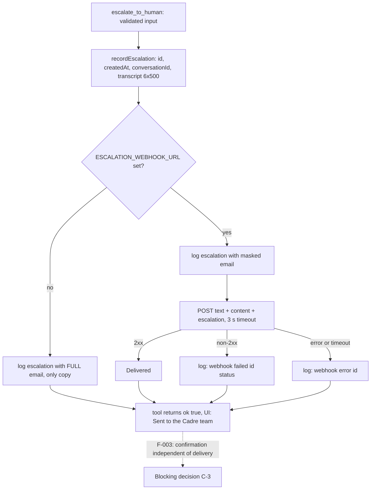

# Architecture Decision Record: Deliver Human Handoffs as a Best-Effort Chat-Platform Webhook With a Log Record, No Queue or CRM

> **Template Origin**: Official | **ArcKit Version**: 6.16.3 | **Command**: `/arckit:adr`

## Document Control

| Field | Value |
|-------|-------|
| **Document ID** | ARC-001-ADR-006-v1.0 |
| **Document Type** | Architecture Decision Record |
| **Project** | Cadre AI Support Chatbot — cadre-chatbot (Project 001) |
| **Classification** | OFFICIAL |
| **Status** | DRAFT |
| **Version** | 1.0 |
| **Created Date** | 2026-09-28 |
| **Last Modified** | 2026-09-28 |
| **Review Cycle** | Monthly |
| **Next Review Date** | 2026-10-28 |
| **Owner** | Jhon Felipe Urrego — Solution Architect, Cadre AI Support Chatbot |
| **Reviewed By** | [PENDING] |
| **Approved By** | [PENDING] |
| **Distribution** | Project Team, Architecture Team |

## Revision History

| Version | Date | Author | Changes | Approved By | Approval Date |
|---------|------|--------|---------|-------------|---------------|
| 1.0 | 2026-09-28 | ArcKit AI | Initial creation from `/arckit:adr` command (retrospective, as-built at commit `d63c3ac`; post-baseline changes to HEAD `acbd6a0` noted) | [PENDING] | [PENDING] |

---

## 1. Decision Title

**Deliver Human Handoffs by Logging a Structured Record and POSTing It to an Optional Discord/Slack Incoming Webhook (`ESCALATION_WEBHOOK_URL`, 3 s Timeout, Best Effort), With No Queue, CRM or Database**

| Attribute | Value |
|-----------|-------|
| **ADR Number** | ADR-006 |
| **Decision Status** | **Accepted** (retrospective record of an implemented decision) |
| **Decision Date** | 2026-09-24 (log + webhook, `2bf2fa8`). Refined 2026-09-25: context, masking and Slack/Discord payload (`5c9606a`); channel message format (`cdbc902`) |
| **Recorded** | 2026-09-28, against repository commit `d63c3ac` |
| **Escalation Level** | Team |
| **Governance Forum** | Builder self-review via `plan.md` decisions log → take-home review panel (day-5 live review) |

> **Retrospective record.** This ADR describes `lib/escalations.ts` **at commit `d63c3ac`**, as requested. Paths in the application's `.gitignore` were not reviewed.
>
> **Post-baseline change (HEAD `acbd6a0`, 2026-09-28).** Commits `5980503` and `414773c` changed only the delivery step: one retry after 500 ms on a network error, timeout, 429 or 5xx, and a per-attempt timeout of 1,700 ms instead of 3,000 ms. The decision is the same, so this ADR stays valid. See **Section 6.4** for what changed and what did not. The confirmation semantics behind F-003 are unchanged.

---

## 2. Stakeholders

### 2.1 Deciders (RACI: Accountable)

- **Jhon Felipe Urrego, Solution Architect / Builder**: chose the delivery channel, payload and failure behaviour (SD-13).

### 2.2 Consulted (RACI: Consulted)

- **Inbound / Client Success (Chief Client Officer)**: owns the receiving channel and the follow-up (INT-002 owner; SD-4).
- **Privacy / Legal**: personal data (email, optional name, transcript) goes to a third-party chat platform (SD-9).
- **Cadre AI Engineering**: future owner of the integration (SD-5).

### 2.3 Informed (RACI: Informed)

- Client Strategy: handoffs may turn into strategist calls (SD-3).
- Executive Leadership: a lost handoff is a lost lead or an unhappy client (SD-1, SD-2).

### 2.4 UK Government Escalation Context

**Decision Level**: Team

**Escalation Rationale**:

- [x] **Team**: Local implementation choice (notification transport for one bot)
- [ ] **Cross-team**: Integration patterns, shared services, API standards
- [ ] **Department**: Technology standards, cloud providers, security frameworks
- [ ] **Cross-government**: National infrastructure, cross-department interoperability

Cadre AI is a private company, so the UK Government tiers are used only as a scale. Moving to a CRM as the system of record would involve Inbound, Marketing and Privacy, making it Cross-team.

**Governance Forum**: `plan.md` "Decisions & trade-offs", row "Escalation = log + webhook" (revisit when "Volume justifies HubSpot/Salesforce integration"), reviewed at the day-5 live review.

**Approval Date**: [PENDING]. No formal approval is recorded; the decision was implemented on 2026-09-24.

---

## 3. Context and Problem Statement

### 3.1 Problem Description

When the bot can't answer, or the user asks for a person, the `escalate_to_human` tool (ADR-005) produces a validated record. That record has to reach Cadre's inbound team with enough context to act on it. The MVP has no database or CRM, was built in hours [CACTHC-C14], and runs on stateless serverless functions (ADR-001, ADR-004).

**Problem statement as a question**: How does a handoff record reach the team reliably enough for an MVP, without infrastructure, while keeping personal data out of logs?

### 3.2 Why This Decision Is Needed

- **Business context**:
  - BR-004: human handoff for anything the bot can't answer, with ≥ 99% delivery (G-4).
  - Scenario 6 "escalate or redirect" [CACTHC-C5].
- **Technical context**:
  - FR-014: escalation tool.
  - FR-015: truthful handoff confirmation.
  - INT-002: team notification channel.
  - NFR-A-003: fault tolerance.
  - NFR-C-002: audit logging of handoffs.
  - DR-002: escalation record schema.
- **Data context**:
  - DR-004: PII minimisation in logs and notifications.
  - DR-005: retention.
  - NFR-C-001: data privacy compliance.
- **Regulatory context**: No UK Government regime applies. Personal data (email, optional name, conversation excerpts) is processed by a third-party chat platform. A DPIA is required before production.

### 3.3 Supporting Links

- **Repository evidence**:
  - `lib/escalations.ts` at `d63c3ac` (lines 28–85)
  - `lib/escalations.test.ts` at `d63c3ac`
  - `lib/config.ts` (`urls.escalationWebhook`)
  - `lib/tools.ts:16-24`
  - `app/api/chat/route.ts:26-27, 132-137`
  - `plan.md`: "API and data model", "Scope → OUT", "Decisions & trade-offs", "Scaling path", "Known limitations", phase 6
- **Requirements**: BR-004, FR-014, FR-015, INT-002, NFR-A-003, NFR-C-001, NFR-C-002, DR-002, DR-004, DR-005, INT-006
- **Research findings**: None
- **Related ADRs**: ADR-004 (transcript source), ADR-005 (tool contract)

---

## 4. Decision Drivers (Forces)

### 4.1 Technical Drivers

- **No infrastructure**: stateless serverless functions with no store (ADR-001, ADR-004).
  - Principle: P-17
- **Receiver-agnostic integration**: one payload readable by Slack, Discord and generic JSON receivers, so the channel can change through configuration alone.
  - Requirement: INT-002
  - Principle: P-15 Loose Coupling Through Standard, Minimal Interfaces
- **Never break the conversation**: a notification failure must not fail the chat turn.
  - Requirement: NFR-A-003
  - Principle: P-15 ("a failure never blocks the user flow")
- **Bounded latency**: the webhook call runs inside a tool step that the model and the 30 s function limit wait on.
  - Requirement: NFR-P-001
- **Traceable records**: one structured log line per handoff, with an id that failure logs share.
  - Requirement: NFR-C-002
  - Principle: P-18

### 4.2 Business Drivers

- **Actionable handoffs**: the team can act without asking the user again. The payload carries the reason, contact, question, conversation id and the last turns.
  - Requirement: BR-004
  - Stakeholder goals: G-4, SD-4
- **Build within budget**: "Admin dashboard for escalations" is out of scope, because "webhook to Slack/email covers it" (`plan.md` "Scope → OUT") [CACTHC-C15].

### 4.3 Regulatory & Compliance Drivers

- **GDS Service Standard / TCoP**: not applicable.
- **Data Protection**:
  - The email is masked in logs when a webhook exists (DR-004).
  - The transcript is bounded to 6 turns × 500 characters, the compromise recorded as REQ Conflict C-2.
  - The channel message carries the unmasked email, because the team needs it to follow up.
  - No retention period is defined (DR-005 ❌).
- **Consumer protection**: the user must not be told the team will act unless the handoff has actually been made (FR-015). This is only partly met (F-003).

### 4.4 Alignment to Architecture Principles

Principles from `projects/000-global/ARC-000-PRIN-v1.0.md`:

| Principle | Alignment | Impact |
|-----------|-----------|--------|
| P-2 Human Handoff Over Guessing | ⚠️ Partial | The handoff carries full context, but confirmation does not depend on delivery (F-003) |
| P-11 Privacy by Design and Data Minimisation | ⚠️ Partial | Email masked in logs when a webhook exists, and the transcript is bounded. Without a webhook the full email is logged. No retention is defined (F-010) |
| P-12 Single System of Record per Data Domain | ⚠️ Partial | The team channel is the system of record for handoffs. When it is unavailable, the log is the only record |
| P-13 Security by Design | ⚠️ Partial | The webhook URL is a server-only secret. Client-controlled text is posted unsanitised (F-004) |
| P-15 Loose Coupling Through Standard, Minimal Interfaces | ✅ Supports | `{ text, content, escalation }` serves Slack, Discord and generic receivers. The receiver URL is an environment variable. Failures never block the user flow |
| P-18 Observability of Every Model Interaction | ⚠️ Partial | `[escalation]` and failure log lines share the id. There are no alerts and no reconciliation (F-012) |

---

## 5. Considered Options

There are five options. Each rejected option's **Source** line says whether it is recorded in the repository or reconstructed.

### Option 1: Structured Log Plus Optional Best-Effort Webhook to Slack/Discord (CHOSEN)

**Description**: `recordEscalation()` builds the record, writes one JSON log line and, if `ESCALATION_WEBHOOK_URL` is set, POSTs a receiver-agnostic payload with a 3 s timeout. Failures are logged and never thrown.

**Implementation approach (as built at `d63c3ac`)**:

1. **Record** (`lib/escalations.ts:54-63`): `{ id: crypto.randomUUID(), createdAt: ISO timestamp, ...input, ...context }`.
   - `input` is the validated `{ email, name?, question, reason }` (ADR-005).
   - `context` is `{ conversationId?, transcript? }`. The transcript is the last 6 non-empty turns, each cut to 500 characters, from client-held history (`route.ts:26-27, 132-137`; ADR-004).
2. **Configuration**: `CONFIG.urls.escalationWebhook = process.env.ESCALATION_WEBHOOK_URL || null` (`lib/config.ts`). The webhook URL is a server-only secret.
3. **Log line** (`:65-68`): `console.info("[escalation]", JSON.stringify(logged))`.
   - With a webhook configured, the email is masked by `maskEmail()`, which keeps the first letter of the local part and the domain (for example `j***@example.com`).
   - **Without a webhook, the full email is logged**. The code comment reads: "Without a webhook the log is the only record, so it keeps the full email."
4. **Payload** (`webhookPayload()`, `:38-52`):
   - The chat message has these lines:
     - `**New chatbot escalation** ({reason}) from {Name <email> | email}`
     - `Question: …`
     - `Conversation: {id}`, if present
     - `Last turns:`, followed by one `> {role}: {text}` line per turn, with whitespace collapsed
   - The message is truncated to Discord's 2,000-character limit with an ellipsis.
   - The body is `{ text: message, content: message, escalation }`: "Slack reads `text`, Discord reads `content`; other receivers get the full record."
5. **Delivery** (`:70-82`):
   - `fetch(webhook, { method: "POST", headers: { "content-type": "application/json" }, body, signal: AbortSignal.timeout(3000) })`.
   - A non-2xx response logs `console.error("[escalation] webhook failed", id, status)`.
   - A thrown error or timeout logs `console.error("[escalation] webhook error", id, error)`.
   - The function **never throws** and returns the record. The tool then returns `{ ok: true, id }` (ADR-005).
6. **Awaited in the tool step**: delivery is awaited before the tool result, so a handoff turn waits at most about 3 s longer on a slow webhook.
7. **No queue, retry, CRM, database or reconciliation job** at `d63c3ac`.
8. **Live verification**:
   - 2026-09-25: a production escalation was logged with a masked email and no webhook error (`plan.md` phase 6; INT-002 ✅ Discord).
   - Confirmed in the Discord channel on 2026-09-28 (HEAD `plan.md`).
9. **Unit tests** (`lib/escalations.test.ts`, 6 tests):
   - `maskEmail` keeps the first letter and the domain.
   - The payload contains the question, conversation and last turns.
   - The payload stays within 2,000 characters.
   - Without a webhook, the full record is logged as the only copy.
   - With a webhook, the payload is posted and the email masked in the log.
   - The function never throws when the webhook fails.

**Wardley Evolution Stage**: the chat platform and incoming webhooks are a Commodity. The recorder and payload are Custom-Built and thin.

#### Good (Pros)

- ✅ **Zero infrastructure**: one environment variable and one HTTP call.
- ✅ **Receiver-agnostic**: works with Slack, Discord or any JSON receiver without code changes (P-15).
- ✅ **Actionable context**: the team sees the reason, contact, question and the last turns (BR-004, REQ Conflict C-2 compromise).
- ✅ **The chat never breaks** because of the channel. Failures are logged with the escalation id (NFR-A-003, NFR-C-002).
- ✅ **Verified live** against Discord in production.

#### Bad (Cons)

- ❌ **At-most-once, best effort**: a failed or unconfigured webhook leaves the log as the only copy, and the user is still told it was sent (F-003).
- ❌ **Unsanitised client text in the staff channel**, with no escalation cap (F-004).
- ❌ **The full email is logged when there is no webhook**, and no retention is defined (F-010).
- ❌ **No alerting or reconciliation**: nobody learns about a lost handoff unless they read the logs (F-012).

#### Cost Analysis

- **CAPEX**: about 60 lines of code and 6 unit tests. Creating the webhook in the channel is free.
- **OPEX**: none (existing chat workspace).
- **TCO (3-year)**: negligible, excluding the cost of lost handoffs.

#### GDS Service Standard Impact

| Point | Impact | Notes |
|-------|--------|-------|
| 5. Security | Partial | Secret URL; unsanitised content (F-004) |
| 14. Operate a reliable service | Partial | Best-effort delivery; no alerting (F-003, F-012) |

*Not applicable to a private company; shown as an engineering checklist only.*

---

### Option 2: CRM as the System of Record (HubSpot or Salesforce) (REJECTED FOR MVP — recorded)

**Description**: The tool creates a contact or ticket through the CRM API. The team works handoffs in the CRM.

**Source**:

- `plan.md` "Decisions & trade-offs": "Escalation = log + webhook — Team gets notified without building a CRM — Revisit when: Volume justifies HubSpot/Salesforce integration".
- `plan.md` "Scaling path": "then a CRM (HubSpot/Salesforce) for escalations".
- REQ INT-006 (future).
- CDAU C-3 option (c).

**Wardley Evolution Stage**: Product

#### Good (Pros)

- ✅ **Durable system of record** with ownership, SLAs and reporting (BR-004 delivery metric; P-12).
- ✅ **Retention and access control** follow the CRM's policies (DR-005).
- ✅ **Confirmation can depend on the API result**, which closes F-003 by construction.

#### Bad (Cons)

- ❌ **Integration, credentials, field mapping and deduplication** do not fit a 4–6 hour build [CACTHC-C14].
- ❌ **Needs Cadre's CRM access and conventions**, which the builder did not have.

#### Cost Analysis

- **CAPEX**: API integration and mapping.
- **OPEX**: CRM seats and API limits. Cadre may already pay for these.
- **TCO (3-year)**: moderate; the best fit at production volume.

#### GDS Service Standard Impact

| Point | Impact | Notes |
|-------|--------|-------|
| 14. Operate a reliable service | Positive | Durable record |

---

### Option 3: Durable Queue With Retries Before the Channel (REJECTED FOR MVP — recorded)

**Description**: The tool writes the record to a durable queue, for example a managed queue or a Redis stream. A worker delivers it to the channel with retries, and the user is confirmed once the record is enqueued.

**Source**:

- `plan.md` "Known limitations" at `d63c3ac`: "if Discord is down the escalation is only in the logs … A queue with retries would close that gap."
- CDAU C-3 option (b).

**Wardley Evolution Stage**: Commodity (managed queues)

#### Good (Pros)

- ✅ **At-least-once delivery** survives channel outages (G-4 ≥ 99%).
- ✅ **Truthful confirmation**, because enqueue success equals acceptance.

#### Bad (Cons)

- ❌ **New infrastructure plus a worker** (or a scheduled function) in a stateless MVP.
- ❌ **Duplicates must be handled**, for example with idempotency keys.

#### Cost Analysis

- **CAPEX**: queue, worker and retry policy.
- **OPEX**: a small managed-queue cost.
- **TCO (3-year)**: low to moderate.

#### GDS Service Standard Impact

| Point | Impact | Notes |
|-------|--------|-------|
| 14. Operate a reliable service | Positive | Durable retries |

---

### Option 4: Transactional Email to an Inbound Mailbox (REJECTED — reconstructed)

**Description**: Send each handoff as an email to an inbound address through a transactional email API.

**Source**: Reconstructed. `plan.md` "Scope → OUT" mentions "webhook to Slack/email covers it", but the code implements only the webhook. No email provider or dependency exists.

**Wardley Evolution Stage**: Commodity

#### Good (Pros)

- ✅ **Lands where inbound already works**, with mailbox retention and search.

#### Bad (Cons)

- ❌ **Provider account, domain verification (SPF/DKIM) and an API key**, with deliverability risk.
- ❌ **Still best effort** unless it is combined with retries.

#### Cost Analysis

- **CAPEX**: provider setup.
- **OPEX**: a free-tier to small monthly cost.
- **TCO (3-year)**: low.

#### GDS Service Standard Impact

| Point | Impact | Notes |
|-------|--------|-------|
| 14. Operate a reliable service | Neutral | Different channel, same guarantee |

---

### Option 5: Do Nothing (Baseline) — Log-Only Handoffs

**Description**: Record escalations only in the runtime logs, with no notification. This is also the as-built fallback when `ESCALATION_WEBHOOK_URL` is unset.

**Source**: Recorded as the fallback in the code comment and in the `CLAUDE.md` env-var notes: "Unset → escalations are only logged, with the full email."

#### Good

- ✅ **No integration at all**.

#### Bad

- ❌ **Nobody is notified**, so handoffs depend on someone reading platform logs (BR-004 ❌).
- ❌ **Full email kept in the logs** (DR-004 ❌).
- ❌ **The user is still told it was sent** (F-003).

---

## 6. Decision Outcome

### 6.1 Chosen Option

**"Option 1: Structured log plus optional best-effort webhook to Slack/Discord"**

### 6.2 Y-Statement (Structured Justification)

> **In the context of** a stateless MVP chatbot that must hand unanswerable questions to Cadre's inbound team, built in hours with no database or CRM,
> **facing** the need to notify the team with enough context to act, without breaking the chat when the channel fails,
> **we decided for** one structured `[escalation]` log line (email masked when a webhook exists) plus an optional POST of a receiver-agnostic `{ text, content, escalation }` payload to a Discord or Slack incoming webhook, with a 3 s timeout and failures logged, never thrown,
> **to achieve** zero-infrastructure handoffs with full context, a channel that can be changed through configuration, and a conversation that never fails because of the channel,
> **accepting** at-most-once delivery where the user is confirmed regardless of outcome (F-003), client-supplied text posted unsanitised with no cap (F-004), and a full email in logs when no webhook is configured, until C-3 sets the delivery guarantee.

### 6.3 Justification (Why This Option?)

**Key reasons**:

1. **Cheapest path that notifies humans**: one environment variable, working with both common team chats (P-15).
2. **Context without re-asking**: reason, contact, question, conversation id and last turns, bounded as REQ Conflict C-2 requires.
3. **Resilient user flow**: a webhook failure never fails the chat turn (NFR-A-003).
4. **Verified in production**: Discord delivery was confirmed on 2026-09-25 and again on 2026-09-28.

**Stakeholder consensus**: This was a single-builder decision, recorded in `plan.md` with a revisit trigger. The receiving channel's owner (Inbound) has not yet reviewed the guarantee.

**Risk appetite**: This is acceptable for the assessment window and its low volume. It is not acceptable for production without C-3, because G-4 requires ≥ 99% delivery.

### 6.4 Post-Baseline Change at HEAD `acbd6a0` (2026-09-28)

| Aspect | `d63c3ac` (this ADR's baseline) | HEAD `acbd6a0` |
|--------|---------------------------------|----------------|
| Per-attempt timeout | 3,000 ms | 1,700 ms |
| Attempts | 1 | 2 (retry after 500 ms) |
| Retried on | — | network error, timeout, 429, 5xx (not other 4xx) |
| Worst-case delivery wait | about 3 s | about 3.9 s (1,700 + 500 + 1,700) |
| Duplicates | none | possible: a timed-out first attempt may already have been accepted (`plan.md` accepts this: "a repeated message costs less than a lost one") |
| Tool result on final failure | `{ ok: true, id }` | `{ ok: true, id }` (**unchanged**) |
| Queue, CRM, alerting | none | none |

At HEAD, a single transient failure no longer loses a handoff, which reduces F-003's likelihood. The **confirmation semantics are unchanged**: F-003 and C-3 stay open. A v1.1 of this ADR should rebaseline on HEAD once reviewed.

---

## 7. Consequences

### 7.1 Positive Consequences

- ✅ **Team notified in the channel it already watches**, with context (INT-002 ✅, BR-004 ✅ functionally).
- ✅ **One log record per handoff**, with failures sharing the id (NFR-C-002 ✅, reconciliation ❌).
- ✅ **Email masked in logs** whenever the channel holds the record (DR-004, partial).
- ✅ **Channel can be swapped through configuration**: Slack, Discord or a JSON receiver.

**Measurable outcomes**:

- Live delivery to Discord: confirmed on 2026-09-25 and 2026-09-28
- Handoff latency added to a tool step: ≤ 3 s at `d63c3ac`
- Delivery rate: **not measured**. Target ≥ 99% (G-4). It could be derived from `[escalation]` lines against `webhook failed/error` lines.

### 7.2 Negative Consequences (Accepted Trade-offs)

These are audit gaps from `ARC-001-CDAU-001-v1.0`:

- ❌ **F-003 (HIGH): a handoff is confirmed even when it never reached the team.**
  - Webhook failures are swallowed (`lib/escalations.ts:65-84`).
  - The tool always returns `ok: true` (`lib/tools.ts:20-23`), and the UI says "Sent to the Cadre team" (`components/Chat.tsx:139-143`).
  - The only trace is a log line. There is no retry at `d63c3ac`, no alert and no reconciliation.
  - The same happens when the webhook variable is unset.
  - The unit test "never throws when the webhook fails" asserts this swallow (`lib/escalations.test.ts:81`).
  - `plan.md` "Known limitations" discloses it.
- ❌ **F-004 (HIGH): client-controlled text is posted verbatim to the staff channel.**
  - Posted fields: `name`, `question`, `conversationId` and the transcript turns, including forged "assistant" turns from client history (ADR-004).
  - The text is interpolated into the chat message (`lib/escalations.ts:38-52`).
  - Nothing neutralises mentions (`@everyone`, `<!channel>`), masked links or fabricated bot statements.
  - There is no per-conversation escalation cap and no deduplication.
- ❌ **F-010 (MEDIUM): no retention is defined for logs or channel records.** Without a webhook, the full email is logged as the only copy.
- ❌ **F-012 (MEDIUM): no alerting.** `[escalation] webhook failed/error` lines trigger nothing.
- ❌ **F-019 (LOW): eval traffic creates real handoffs.** Evals default to production, and 4 cases trigger `escalate_to_human`.
- ❌ **Duplicates at HEAD**: the retry can post twice (accepted in `plan.md`).

**Blocking decision C-3: handoff delivery guarantee and confirmation semantics.** Delivery is at-most-once and best effort, the user is told the handoff succeeded regardless, and logs are the silent fallback. `plan.md` records the channel choice but not the guarantee. BR-004 and FR-015 cannot be verified until the expected guarantee is stated. The audit lists three options:

- **(a)** Confirm only on webhook success and show a fallback contact otherwise. The tool returns `ok: false` and the UI and prompt render the public contact route. This amends ADR-005 and this ADR.
- **(b)** Use a durable queue with retries and confirm on enqueue (Option 3). This supersedes this ADR's delivery part.
- **(c)** Write to a CRM API as the system of record (Option 2). This supersedes this ADR.

The audit suggests the ADR title "Escalation delivery guarantee and user confirmation".

**Mitigation strategies**:

- **F-003**:
  - Short term: have `recordEscalation` return a delivery status, and have the tool return `ok: false` with the public contact when delivery fails or no webhook is configured in production. This is C-3 option (a).
  - Also alert on failure lines.
- **F-004**:
  - Send `allowed_mentions: { parse: [] }` for Discord and escape `<!…>` for Slack.
  - Defang links.
  - Prefix transcript turns as "unverified client content".
  - Cap escalations per conversation and per email.
  - Decision C-4 covers this.
- **F-010**:
  - Mask emails in logs unconditionally.
  - Make a webhook or CRM mandatory in production.
  - Define retention in the DPIA (decision C-5).
- **F-012**: alert on `[escalation] webhook failed/error`, and reconcile the `[escalation]` count against channel messages.
- **F-019**: run evals against a preview deployment with the webhook disabled, or tag eval conversations so they skip the webhook.

### 7.3 Neutral Consequences (Changes Needed)

- 🔄 **Configuration**: set `ESCALATION_WEBHOOK_URL` in Vercel and redeploy. Rotate the URL if it leaks, because it is the only credential.
- 🔄 **Operations**: someone in Inbound must watch the channel. There is no SLA or ownership tooling (INT-002 owner: Chief Client Officer).
- 🔄 **Privacy**: the channel's own retention and access rules now govern handoff personal data.

### 7.4 Risks and Mitigations

| Risk | Likelihood | Impact | Mitigation | Owner |
|------|------------|--------|------------|-------|
| Handoff lost while the user is told it was sent (F-003) | M (L at HEAD for transient faults) | H | C-3; failure alerts; fallback contact | AI Engineering |
| Channel abuse or spam via crafted name, question or transcript (F-004) | M | M | Sanitise; cap per conversation and email (C-4) | AI Engineering |
| Webhook URL leaked, allowing anyone to post to the channel | L | M | Server-only env var; rotate on leak; never logged | AI Engineering |
| Full email retained in logs without a webhook (F-010) | M | M | Mandatory webhook in production; always mask; retention (C-5) | AI Engineering / Privacy |
| Duplicate handoff messages after a retry (HEAD) | L | L | Accepted; dedupe by escalation id in the channel or CRM | Inbound |
| Eval runs flood the real channel (F-019) | M | L | Preview deployment or skip flag for evals | Solution Architect / Builder |

**Link to risk register**: None yet (no `ARC-001-RISK`). Run `/arckit:risk` to register these.

---

## 8. Validation & Compliance

### 8.1 How Will Implementation Be Verified?

**Design review**:

- [x] Architecture diagrams reflect this decision:
  - ARC-001-DIAG-001 (Context: team chat webhook)
  - DIAG-002 (Container)
  - DIAG-005 (Sequence: escalation turn)
  - DIAG-006 (Deployment)
  - DIAG-008 (State: Posting, Delivered, DeliveryFailed, LogOnly → Confirmed)
  - Archify DIAG-010, 014, 015, 017
- [ ] C-3 decided and recorded as an ADR
- [ ] Conformance check against this ADR (`/arckit:conformance`)

**Code review**:

- [x] The webhook URL is read only from `CONFIG.urls.escalationWebhook` (environment variable)
- [x] Delivery has a timeout and never throws
- [x] The email is masked in the log when a webhook exists
- [ ] The tool result reflects the delivery outcome (F-003)
- [ ] Payload sanitisation (F-004)

**Testing strategy**:

- [x] 6 unit tests in `lib/escalations.test.ts` at `d63c3ac` (masking, payload content and length cap, log-only and webhook paths, never throws). HEAD adds retry tests.
- [x] Evals `s6-*` and `tool-*` exercise the flow end to end on production.
- [x] Live channel check on 2026-09-25 and 2026-09-28.
- [ ] Unit test that the tool returns `ok: false` on delivery failure (after C-3).
- [ ] Unit test that mentions and links are neutralised (after C-4).

### 8.2 Monitoring & Observability

**Success metrics**:

- **Delivery rate**: 1 − (webhook failed + webhook error) ÷ `[escalation]` lines. Target ≥ 99% (G-4).
- **Handoffs per day by reason**: from `[escalation]` log lines.
- **Unconfigured-webhook handoffs in production**: target 0.

**Alerts and dashboards**: none (F-012). The first alert to add is any `[escalation] webhook failed` or `webhook error` line.

### 8.3 Compliance Verification

**GDS Service Assessment / TCoP**: Not applicable.

**Security assurance**:

- [x] Webhook URL is server-only
- [ ] Notification content sanitised (F-004)
- [ ] Escalation rate limit per conversation and email

**Data protection**:

- [x] Transcript bounded to 6 × 500 characters (REQ Conflict C-2)
- [x] Email masked in logs when a webhook exists
- [ ] Unconditional masking and a defined retention period (F-010, DR-005)
- [ ] DPIA covering the third-party chat platform

---

## 9. Links to Supporting Documents

### 9.1 Requirements Traceability

**Business requirements**:

- BR-004: Human Handoff for Anything the Bot Cannot Answer (delivery rate not yet measured)

**Functional requirements**:

- FR-014: Escalation Tool (enrichment, log, webhook)
- FR-015: Truthful Handoff Confirmation (partial, F-003)

**Non-functional requirements**:

- NFR-A-003: Fault Tolerance (timeout, never throws; no retry queue)
- NFR-C-001: Data Privacy Compliance (partial)
- NFR-C-002: Audit Logging of Handoffs

**Data and integration requirements**:

- DR-002: Escalation Record Schema
- DR-004: PII Minimisation in Logs and Notifications (partial)
- DR-005: Retention (❌)
- INT-002: Team Notification Channel (Webhook)
- INT-006: CRM (Future)

### 9.2 Architecture Artifacts

**Architecture principles**: `projects/000-global/ARC-000-PRIN-v1.0.md` — P-2, P-11, P-12, P-13, P-15, P-18

**Stakeholder drivers**: `projects/001-cadre-chatbot/ARC-001-STKE-v1.0.md` — SD-1, SD-2, SD-3, SD-4, SD-5, SD-9, SD-13; goal G-4

**Risk register**: Not yet created

**Architecture diagrams**: `projects/001-cadre-chatbot/diagrams/` — DIAG-001, 002, 005, 006, 008; Archify DIAG-010, 014, 015, 017

**Codebase audit**: `projects/001-cadre-chatbot/audits/ARC-001-CDAU-001-v1.0.md` — F-003, F-004, F-010, F-012, F-019; blocking decisions C-3, C-4, C-5

### 9.3 Design Documents

**Detailed design**: `plan.md` "API and data model" (Escalation record, webhook body, masking).

**Data model**: REQ entity Escalation; ARC-001-DIAG-007.

### 9.4 External References

**Vendor documentation**:

- Discord incoming webhooks (`content`, 2,000-character limit, `allowed_mentions`)
- Slack incoming webhooks (`text`, `<!channel>` escaping)
- Node `fetch` with `AbortSignal.timeout`

**Research and evidence**:

- Commits `2bf2fa8`, `5c9606a`, `cdbc902` (baseline) and `5980503`, `414773c` (post-baseline retry)
- Live checks recorded in `plan.md` phase 6

---

## 10. Implementation Plan

### 10.1 Dependencies

**Prerequisite decisions**:

- ADR-004: the transcript comes from client-held history
- ADR-005: the `escalate_to_human` tool contract

**Infrastructure dependencies**: A Slack or Discord incoming webhook, stored in the Vercel `ESCALATION_WEBHOOK_URL` environment variable.

**Team dependencies**: Inbound watches the channel.

### 10.2 Implementation Timeline

Already implemented. Actual timeline:

| Phase | Activities | Duration | Owner |
|-------|-----------|----------|-------|
| **Phase 1: Log + webhook** | JSON log line; optional webhook with 3 s timeout; failures logged, never thrown (`2bf2fa8`) | 2026-09-24 | Builder |
| **Phase 2: Context and masking** | Conversation id and transcript; `{ text, content, escalation }` payload; email masked when a webhook exists (`5c9606a`) | 2026-09-25 | Builder |
| **Phase 3: Channel format** | Reason, contact, question, conversation, last turns; 2,000-character cap (`cdbc902`) | 2026-09-25 | Builder |
| **Phase 4: Live check** | Production escalation to Discord verified | 2026-09-25 | Builder |
| **Post-baseline** | One retry on transient failures, 1.7 s timeout (`5980503`, `414773c`); Discord check (`acbd6a0`) | 2026-09-28 | Builder |

**Outstanding follow-ups**: C-3 (then fix F-003), C-4 (F-004), C-5 (F-010), alerting (F-012), eval isolation (F-019), and a v1.1 rebaselined on HEAD.

### 10.3 Rollback Plan

**Rollback trigger**: Handoffs stop arriving, the channel is flooded, or a payload change breaks the receiver.

**Rollback procedure**:

1. For a channel problem, change or unset `ESCALATION_WEBHOOK_URL` in Vercel and **redeploy**. Note that unsetting it falls back to log-only with full emails, so treat that as a temporary measure only.
2. For a code problem, revert the commit on `main` and push, or promote the previous deployment.
3. Re-run `npm test` (escalation tests) and `npm run eval -- s6 tool-`, preferably against a preview deployment (F-019).
4. Reconcile any handoffs logged during the incident from the `[escalation]` log lines.

**Rollback owner**: Jhon Felipe Urrego, Solution Architect / Builder (AI Engineering after handover)

---

## 11. Review and Updates

### 11.1 Review Schedule

**Initial review**: When C-3 is decided, and no later than 2026-10-28, together with the HEAD rebaseline (v1.1).

**Periodic review**: Quarterly.

**Review criteria**:

- Is the delivery rate ≥ 99% (G-4)?
- Does the user confirmation match the actual delivery (FR-015)?
- Has handoff volume reached the CRM trigger in `plan.md`?
- Is retention defined and applied?

### 11.2 Trigger Events for Review

- [ ] Handoff volume justifies a CRM (`plan.md` trigger)
- [ ] Any lost handoff reported by a user or found in the logs
- [ ] Channel abuse or a leaked webhook URL
- [ ] Change of team chat platform or inbound tooling
- [ ] Privacy review or DPIA outcome requiring a different processor or retention

---

## 12. Related Decisions

### 12.1 Decisions This ADR Depends On

- **ADR-004**: Keep the Server Stateless — client-held history is the transcript's source.
- **ADR-005**: Expose Exactly Two Typed Model Tools — `escalate_to_human` calls `recordEscalation`.

### 12.2 Decisions That Depend On This ADR

- **ADR-008 (planned)**: Quality assurance — the eval environment strategy (F-019) depends on how handoffs are delivered.
- **Future C-3** (delivery guarantee): will amend (option a) or supersede (options b, c) this ADR.
- **Future C-4** (content sanitisation) and **C-5** (logging, PII and retention): will amend the payload and logging.

### 12.3 Conflicting Decisions

- **REQ Conflict C-2 (Rich Handoff Context vs Data Minimisation)**: resolved by compromise, with the transcript bounded to 6 turns × 500 characters and the email only with explicit user input and masked in logs.

---

## 13. Appendices

### Appendix A: Options Analysis Details

| Criterion | Opt 1 Log + webhook (chosen) | Opt 2 CRM | Opt 3 Durable queue | Opt 4 Transactional email | Opt 5 Log only |
|-----------|------------------------------|-----------|---------------------|---------------------------|----------------|
| Team notified | ✅ | ✅ | ✅ | ✅ | ❌ |
| Delivery guarantee | At most once (retry ×1 at HEAD) | API-confirmed | At least once | Best effort | None |
| Confirmation truthful | ❌ (F-003) | ✅ possible | ✅ on enqueue | ❌ unless tied | ❌ |
| Infrastructure | Env var | CRM integration | Queue + worker | Email provider | None |
| Evidence source | code | `plan.md` decisions/scaling, INT-006, C-3(c) | `plan.md` limitations, C-3(b) | `plan.md` OUT mention (reconstructed) | code comment, `CLAUDE.md` |

### Appendix B: Stakeholder Consultation Log

| Date | Stakeholder | Feedback | Action Taken |
|------|-------------|----------|--------------|
| 2026-09-25 | Builder review | Escalations reached only the logs, without context | Context, masking and Slack/Discord payload (`5c9606a`) |
| 2026-09-25 | Channel readability | The team saw only a one-line summary | Formatted message with the last turns (`cdbc902`) |
| 2026-09-25 | Live production check | Discord delivery works; email masked in the log | Recorded in `plan.md` phase 6 |
| 2026-09-28 | Builder (post-baseline) | Transient Discord failures lose handoffs | One retry on network error, timeout, 429 or 5xx (`5980503`, `414773c`) |
| 2026-09-28 | ArcKit codebase audit | F-003, F-004, F-010, F-012, F-019; C-3, C-4, C-5 | Recorded under Consequences |

### Appendix C: Alternative Formats

---

## Document Approval

| Role | Name | Signature | Date |
|------|------|-----------|------|
| **Technical Architect** | Jhon Felipe Urrego | | [PENDING] |
| **Senior Responsible Owner** | [PENDING] | | [PENDING] |
| **Security Architect** | [PENDING] | | [PENDING] |
| **Governance Board** | Take-home review panel | | [PENDING] |

---

*This ADR follows the MADR v4.0 format enhanced with UK Government requirements and ArcKit governance standards.*

*For more information:*

- *MADR: https://adr.github.io/madr/*
- *UK Gov ADR Framework: https://www.gov.uk/government/publications/architectural-decision-record-framework*
- *ArcKit Documentation: `projects/001-cadre-chatbot/README.md`*

## External References

> This section provides traceability from generated content back to source documents.
> Follow citation instructions in the project's citation reference guide.

### Document Register

| Doc ID | Filename | Type | Source Location | Description |
|--------|----------|------|-----------------|-------------|
| CACTHC | Cadre_AI_Chatbot_Take_Home_Candidate_v1.1.pdf | Challenge brief | 001-cadre-chatbot/external/ | Scenario 6 (escalate or redirect); build-time and scope guidance |
| APP | cadre-chatbot repository at `d63c3ac` (HEAD `acbd6a0` compared) | Reference implementation | github.com/johnfelipe/cadre-chatbot | `lib/escalations.ts`, `lib/escalations.test.ts`, `lib/config.ts`, `lib/tools.ts`, `app/api/chat/route.ts`, `components/Chat.tsx`, `plan.md`, `CLAUDE.md`, commits `2bf2fa8`, `5c9606a`, `cdbc902`, `5980503`, `414773c` |
| CDAU | ARC-001-CDAU-001-v1.0.md | Codebase audit | 001-cadre-chatbot/audits/ | F-003, F-004, F-010, F-012, F-019; blocking decisions C-3, C-4, C-5 |

### Citations

| Citation ID | Doc ID | Page/Section | Category | Quoted Passage |
|-------------|--------|--------------|----------|----------------|
| CACTHC-C5 | CACTHC | p.3, What to Build | Functional Requirement | Scenario list: … "A user asking a question the bot can't answer — and needs to escalate or redirect" |
| CACTHC-C14 | CACTHC | p.2, Challenge Format | Business Requirement | "We recommend budgeting 4–6 hours. Build, deploy, and prepare your submission." |
| CACTHC-C15 | CACTHC | p.7, Tips | Design Decision | "Cut scope aggressively. 3 working features > 8 broken ones." |

### Unreferenced Documents

| Filename | Source Location | Reason |
|----------|-----------------|--------|
| Next Steps  Tech Challenge  Cadre AI.txt | 001-cadre-chatbot/external/ | No handoff-channel content (credential not reproduced) |
| README.md | 001-cadre-chatbot/external/ | Folder placeholder; no decision content |

---

**Generated by**: ArcKit `/arckit:adr` command
**Generated on**: 2026-09-28 GMT
**ArcKit Version**: 6.16.3
**Project**: Cadre AI Support Chatbot — cadre-chatbot (Project 001)
**AI Model**: Claude Opus 5.5 (claude-opus-5-5)
**Generation Context**: Retrospective ADR from `lib/escalations.ts` and its tests at commit `d63c3ac` (record, masking, payload, 3 s webhook, failure logging), the tool and route wiring, and the `plan.md` decisions, limitations and live checks. The HEAD `acbd6a0` diff (retry, 1.7 s timeout) was compared and noted in Section 6.4. Also used: ARC-000-PRIN, ARC-001-REQ, ARC-001-STKE, ARC-001-CDAU-001 and the external brief.
