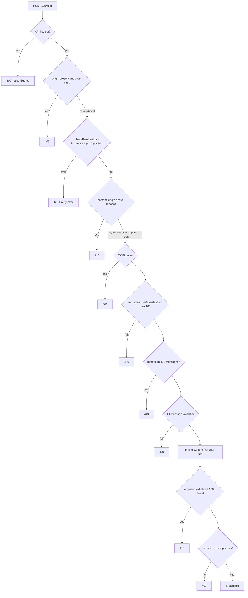

# Architecture Decision Record: Enforce Ordered Request Guards in the Route Handler With a Per-Instance In-Memory Rate Limiter

> **Template Origin**: Official | **ArcKit Version**: 6.16.3 | **Command**: `/arckit:adr`

## Document Control

| Field | Value |
|-------|-------|
| **Document ID** | ARC-001-ADR-007-v1.0 |
| **Document Type** | Architecture Decision Record |
| **Project** | Cadre AI Support Chatbot — cadre-chatbot (Project 001) |
| **Classification** | OFFICIAL |
| **Status** | DRAFT |
| **Version** | 1.0 |
| **Created Date** | 2026-09-28 |
| **Last Modified** | 2026-09-28 |
| **Review Cycle** | Monthly |
| **Next Review Date** | 2026-10-28 |
| **Owner** | Jhon Felipe Urrego — Solution Architect, Cadre AI Support Chatbot |
| **Reviewed By** | [PENDING] |
| **Approved By** | [PENDING] |
| **Distribution** | Project Team, Architecture Team |

## Revision History

| Version | Date | Author | Changes | Approved By | Approval Date |
|---------|------|--------|---------|-------------|---------------|
| 1.0 | 2026-09-28 | ArcKit AI | Initial creation from `/arckit:adr` command (retrospective, as-built at commit `d63c3ac`) | [PENDING] | [PENDING] |

---

## 1. Decision Title

**Enforce Ordered Request Guards in `POST /api/chat` Before Any Model Call: 2,000 Characters per User Message, 256 KB Declared Body Limit, and a 10 Requests/Minute/IP In-Memory Rate Limiter**

| Attribute | Value |
|-----------|-------|
| **ADR Number** | ADR-007 |
| **Decision Status** | **Accepted** (retrospective record of an implemented decision) |
| **Decision Date** | 2026-09-24 → 2026-09-25 (see table below) |
| **Recorded** | 2026-09-28, against repository commit `d63c3ac` |
| **Escalation Level** | Team |
| **Governance Forum** | Builder self-review via `plan.md` decisions log → take-home review panel (day-5 live review) |

| Guard added | Commit | Date |
|-------------|--------|------|
| Rate limiter | `2bf2fa8` | 2026-09-24 |
| Validation and per-message cap | `0e87a40` | 2026-09-24 |
| Empty-message and 100-message caps | `c94f85c` | 2026-09-24 |
| Origin and `Content-Length` checks | `4f4018f` | 2026-09-25 |

> **Retrospective record.** This ADR describes `app/api/chat/route.ts`, `lib/rate-limit.ts` and `lib/config.ts` **at commit `d63c3ac`**. Paths in the application's `.gitignore` were not reviewed. HEAD `acbd6a0` does not change any of these files: the five later commits touch only `lib/escalations.ts`, its tests and documentation. The decision therefore holds at HEAD as well.

---

## 2. Stakeholders

### 2.1 Deciders (RACI: Accountable)

- **Jhon Felipe Urrego, Solution Architect / Builder**: chose the guard chain, the limits and the limiter design (SD-13).

### 2.2 Consulted (RACI: Consulted)

- **Cadre AI Engineering**: future owner of abuse controls; must decide C-2 (SD-5).
- **Finance**: the guards protect the $5 credential budget and future model spend (SD-8).

### 2.3 Informed (RACI: Informed)

- Take-home Review Panel: will hit the public URL during review (SD-6).
- Prospective and existing clients: will see the 413 and 429 messages (SD-10, SD-11).

### 2.4 UK Government Escalation Context

**Decision Level**: Team

**Escalation Rationale**:

- [x] **Team**: Local implementation choice (input validation and throttling for one endpoint)
- [ ] **Cross-team**: Integration patterns, shared services, API standards
- [ ] **Department**: Technology standards, cloud providers, security frameworks
- [ ] **Cross-government**: National infrastructure, cross-department interoperability

Cadre AI is a private company, so the UK Government tiers are used only as a scale. Platform-wide bot protection or a shared rate-limit store would be a hosting-account decision for AI Engineering (C-2).

**Governance Forum**: `plan.md` "Decisions & trade-offs" (rows "In-memory rate limit", "Spend cap = OpenRouter key credit limit", "Empty or whitespace-only messages blocked…"), reviewed at the day-5 live review.

**Approval Date**: [PENDING] (no formal approval recorded; implemented 2026-09-24 → 2026-09-25)

---

## 3. Context and Problem Statement

### 3.1 Problem Description

`POST /api/chat` is a public, anonymous URL. Every request that reaches the model costs money out of a $5 credential [NSTCCA-C2], and "the URL is public" (`CLAUDE.md` hard constraints). Reviewers, bots and curious users will all send traffic, and the bot has to stay live through the review [CACTHC-C10].

**Problem statement as a question**: Which checks run, in what order and with what limits, so that invalid, oversized, cross-site or excessive requests are rejected cheaply before any model spend, without adding infrastructure?

### 3.2 Why This Decision Is Needed

- **Business context**: BR-005 (operate within the runtime budget and stay live).
- **Technical context**:
  - NFR-SEC-003: API input validation and hardening
  - NFR-P-002: throughput and per-client rate
  - NFR-P-003: bounded work per request
  - NFR-F-001: hard cost caps
  - NFR-I-001: API standards and error contract
  - NFR-SEC-001: anonymous access; origin check
  - FR-023: error, retry and input states
- **Regulatory context**: No UK Government regime applies. The rate limiter keeps IP addresses in memory for the life of the instance (REQ Entity 5, classified CONFIDENTIAL). They are not persisted or logged.

### 3.3 Supporting Links

- **Repository evidence**:
  - `app/api/chat/route.ts:21-78, 121-130`
  - `lib/rate-limit.ts`
  - `lib/config.ts` (`limits`, `rateLimit`)
  - `components/Chat.tsx:92` (`maxLength`)
  - `app/api/chat/route.test.ts`
  - `lib/rate-limit.test.ts`
  - `evals/run.ts:7, 43-44` (the runner honours `retry-after`)
  - `plan.md` "Decisions & trade-offs", "Budget" and "Known limitations"
- **Requirements**: BR-005, FR-023, NFR-P-002, NFR-P-003, NFR-F-001, NFR-SEC-001, NFR-SEC-003, NFR-S-001, NFR-I-001
- **Related ADRs**: ADR-001 (single route on serverless), ADR-002 (model caps), ADR-004 (history window)

---

## 4. Decision Drivers (Forces)

### 4.1 Technical Drivers

- **Cheap checks first, before any model call**: configuration, origin, rate, declared size, then parse, schema and semantics.
  - Requirements: NFR-SEC-003
  - Principle: P-14 Validate Every Input at the Boundary
- **One error contract**: JSON `{ error }` with a specific status (400, 403, 413, 429 with `retry-after`, 500).
  - Requirements: NFR-I-001, FR-023
  - Principle: P-14
- **No infrastructure**: stateless serverless functions with no shared store (ADR-001, ADR-004).
  - Principle: P-17
- **Limits in one place**: every number lives in `lib/config.ts`.
  - Requirements: NFR-F-001
  - Principle: P-6

### 4.2 Business Drivers

- **Protect the budget and uptime** through the review window.
  - Requirements: BR-005
  - Stakeholder goals: G-5, SD-8
- **Don't punish real users**: 10 messages a minute is well above human chat pace, and the `retry-after` header tells clients when to retry.
- **Build time**: "Zero infra for MVP" (`plan.md`) [CACTHC-C14].

### 4.3 Regulatory & Compliance Drivers

- **GDS Service Standard / TCoP**: Not applicable.
- **Security**:
  - Rejects a forged `system` role.
  - Rejects cross-site browser requests.
  - Leaves CSP and platform bot protection to the future (F-017, C-2).
- **Data Protection**:
  - IP addresses are held only in instance memory and are not logged.
  - Rejected requests are not logged, so no content is kept.

### 4.4 Alignment to Architecture Principles

Principles from `projects/000-global/ARC-000-PRIN-v1.0.md`:

| Principle | Alignment | Impact |
|-----------|-----------|--------|
| P-13 Security by Design | ⚠️ Partial | Origin, role and schema checks exist. The body cap trusts `Content-Length` (F-005), non-browser callers bypass the origin check (F-006), and the IP key is spoofable (F-022) |
| P-14 Validate Every Input at the Boundary | ⚠️ Partial | Ordered chain, one error contract, every path unit-tested. Only user text is length-checked (F-001, F-002) |
| P-16 Cost as a First-Class Architectural Constraint | ✅ Supports | All caps are in config, and no model call is made for a rejected request (unit-tested) |
| P-17 Stateless Compute With an Explicit Scaling Path | ⚠️ Partial (by design) | The rate-limit map is the one piece of per-instance mutable state. It is documented, with a named successor (Upstash Redis) |
| P-6 Separation of Behaviour, Knowledge and Configuration | ✅ Supports | `CONFIG.limits` and `CONFIG.rateLimit` are the single source of the limits |

---

## 5. Considered Options

Five options are listed. Each rejected option has a **Source** line that says whether the alternative is recorded in the repository or reconstructed.

### Option 1: Ordered In-Handler Guard Chain Plus a Per-Instance Fixed-Window Rate Limiter (CHOSEN)

**Description**: `POST` in `app/api/chat/route.ts` runs a fixed sequence of checks. Each check returns `jsonError(status, message)` on failure, and `streamText` is reached only if all checks pass. Throttling is done by an in-memory fixed-window counter keyed by client IP.

**Implementation approach (as built at `d63c3ac`)**:

1. **Guard chain, in order**:

   | # | Check | Code | Rejection |
   |---|-------|------|-----------|
   | 1 | Credential configured (`OPENROUTER_API_KEY`) | `route.ts:34-35` | 500 "The chat is not configured." |
   | 2 | Cross-site browser request: `Origin` present, parseable, and host ≠ request `Host` | `:37-41` | 403 "Requests from other sites aren't allowed." |
   | 3 | Rate limit: `checkRateLimit(clientKey(req))` | `:43-48` | 429 "Too many messages…" + `retry-after` (seconds) |
   | 4 | Declared size: `Number(content-length) > 256_000` | `:50-52` | 413 "The request is too large." |
   | 5 | JSON parse (`req.json()`) | `:54-59` | 400 "Request body must be JSON." |
   | 6 | zod `bodySchema`: `id?` ≤ 100 chars; `messages` non-empty; `role` ∈ {user, assistant}; unknown fields tolerated (`.loose()`) | `:21-24, 61-62` | 400 "Invalid request." |
   | 7 | More than 100 messages (`maxRequestMessages`) | `:63-65` | 413 "This conversation is too long. Reload the page…" |
   | 8 | `safeValidateUIMessages` against tool schemas | `:67-68` | 400 "Invalid messages." |
   | 9 | `trimHistory` to 12 messages starting at a user turn; empty result | `:70-71` | 400 "The conversation must include a user message." |
   | 10 | Any **user** message whose **text parts** exceed 2,000 characters (`maxMessageChars`) | `:72-74` | 413 "Messages are limited to 2000 characters." |
   | 11 | Latest message is a non-empty user message | `:75-78` | 400 "The message can't be empty." |

2. **Rate limiter** (`lib/rate-limit.ts`):
   - A module-level `Map<string, { count, resetAt }>`. The code comments that it is "Per serverless instance: resets on cold start and isn't shared across instances (see plan.md)."
   - Fixed window: `CONFIG.rateLimit = { windowMs: 60_000, maxRequests: 10 }`. The first request opens the window. Requests are counted until 10, then rejected with `retryAfterSeconds = ceil((resetAt − now)/1000)`.
   - Memory bound: when the map reaches `MAX_TRACKED_KEYS = 10,000`, expired windows are swept. **Live windows are not evicted**, so a burst of distinct keys inside one window can push the map above 10,000.
   - Key (`clientKey`): the first `x-forwarded-for` value, then `x-real-ip`, and otherwise the shared literal `"unknown"`.
   - The limiter runs **before** size and body checks. Every request that passes the origin check counts, including ones rejected later.
3. **Supporting limits elsewhere**:
   - `maxDuration = 30` s (ADR-001).
   - `maxOutputTokens` 600 and ≤ 3 steps (ADR-002).
   - A 12-message history window, also applied on the client (ADR-004).
   - The UI input has `maxLength={maxMessageChars}` (`Chat.tsx:92`) and blocks empty sends. `plan.md` says the API "can't rely on the UI".
4. **Spend ceiling**: The OpenRouter key's credit limit, enforced upstream. An in-app spend counter was rejected (Option 4).
5. **Error contract**: Every rejection is `Response.json({ error }, { status, headers? })`. Rejections are not logged.
6. **Verification**:
   - Unit tests (`route.test.ts`, 13 tests: 11 `it` plus a 2-case `it.each`):
     - 500 when the key is missing
     - 400 for a non-JSON body
     - 400 for a forged system role
     - 400 for an empty or whitespace message
     - 413 for an oversized message, also when it sits in history
     - 413 for more than 100 messages
     - 429 with `retry-after`
     - 403 for a cross-site request, while same-origin and origin-less requests pass
     - 413 for `content-length` above the cap, before the body is read
     - "never calls the model for a rejected request"
   - `rate-limit.test.ts` (5 cases): window count and `retry-after`, a new window after `windowMs`, separate counters per key, `x-forwarded-for` then `x-real-ip` then the shared-key fallback.
   - Evals: `input-empty`, `input-whitespace`, `input-too-long`, `api-forged-system-role`, `api-oversized-history-turn`, `multi-history-over-cap`.
   - The eval runner waits for `retry-after` on 429 (`evals/run.ts:43-44`).

**Wardley Evolution Stage**: Custom-Built (the guard chain and limiter). zod is a Product.

#### Good (Pros)

- ✅ **No model spend on rejected requests**: this is unit-tested (NFR-SEC-003 ✅).
- ✅ **Consistent, specific errors** that the UI shows with Retry (NFR-I-001 ✅, FR-023 ✅).
- ✅ **Zero infrastructure**: the limiter runs in memory, and every limit is in config (NFR-F-001 ✅).
- ✅ **Standard back-off signal**: `retry-after` on 429, which the eval runner honours.
- ✅ **Bounded memory in normal operation**: expired windows are swept at 10,000 keys.

#### Bad (Cons)

- ❌ **The body cap trusts the declared header** (F-005).
- ❌ **The limiter is per instance**: counts reset on cold start and aren't shared, so the effective limit is 10 requests per minute per IP **per warm instance** (NFR-P-002 ⚠, F-006).
- ❌ **The IP key can be spoofed on some hosts**, and headerless callers share one bucket (F-022).
- ❌ **The length cap covers only user text parts** (F-001, F-002; ADR-004).
- ❌ **Non-browser callers pass the origin check** by design, because the eval runner depends on it (F-006).

#### Cost Analysis

- **CAPEX**: About 80 lines of guard and limiter code plus 16 unit tests.
- **OPEX**: None.
- **TCO (3-year)**: Negligible. The risk cost is the potential budget drain (see Consequences).

#### GDS Service Standard Impact

| Point | Impact | Notes |
|-------|--------|-------|
| 5. Security | Partial | Validation chain; F-005, F-006, F-022 open |
| 14. Operate a reliable service | Partial | Throttling is best effort across instances |

*Not applicable to a private company; shown as an engineering checklist only.*

---

### Option 2: Shared-Store Rate Limiter (Upstash Redis or Similar) Plus a Daily Spend Counter (REJECTED FOR MVP — recorded)

**Description**: Keep the guard chain, but hold rate-limit windows (and a daily token or spend counter) in a shared managed store, so that limits apply across all instances.

**Source**:

- `plan.md` "Decisions & trade-offs": "In-memory rate limit — Zero infra for MVP — Revisit when: Real traffic → Upstash Redis".
- `plan.md` "Scaling path": "Rate limit and escalations → Upstash Redis (shared across instances)".
- "With more time: Redis (Upstash) for a shared rate limit and a daily spend counter".
- CDAU C-2 option (c).

**Wardley Evolution Stage**: Commodity (managed serverless Redis)

#### Good (Pros)

- ✅ **Real global limits** per IP and per day, which closes the per-instance gap (F-006).
- ✅ **A shared spend counter** gives a daily ceiling below the key credit limit (NFR-F-003 follow-up).

#### Bad (Cons)

- ❌ **New dependency, secret and network hop** on every request, adding latency and a new failure mode.
- ❌ **Outside the build budget** and not needed at demo volume [CACTHC-C14].

#### Cost Analysis

- **CAPEX**: Small (client library and configuration).
- **OPEX**: Free tier to a small monthly cost at low volume.
- **TCO (3-year)**: Low.

#### GDS Service Standard Impact

| Point | Impact | Notes |
|-------|--------|-------|
| 14. Operate a reliable service | Positive | Consistent limits |

---

### Option 3: Platform-Level Protection (Hosting Firewall, WAF Rate Rules, Bot Protection) (REJECTED FOR MVP — reconstructed)

**Description**: Enforce rate and bot rules at the hosting platform's edge, before requests reach the function.

**Source**: Reconstructed from CDAU C-2 option (b) ("Add platform bot protection or firewall rules"). The repository has no platform configuration (no `vercel.json`; F-018).

**Wardley Evolution Stage**: Commodity or Product (platform feature)

#### Good (Pros)

- ✅ **Rejects abuse before any function cost**, across all instances.
- ✅ **Handles distributed or bot traffic** better than per-IP counters.

#### Bad (Cons)

- ❌ **Configuration lives in the platform UI**, not in code, unless it is codified (F-018).
- ❌ **Plan-dependent features and possible cost**. Not assessed in the repository.

#### Cost Analysis

- **CAPEX**: Configuration effort.
- **OPEX**: Depends on the plan (not recorded).
- **TCO (3-year)**: Low to moderate.

#### GDS Service Standard Impact

| Point | Impact | Notes |
|-------|--------|-------|
| 5. Security | Positive | Edge-level abuse control |

---

### Option 4: In-App In-Memory Spend Counter as the Budget Ceiling (REJECTED — recorded)

**Description**: Track token spend in process memory and refuse requests once a daily budget is reached.

**Source**: `plan.md` "Decisions & trade-offs": "Spend cap = OpenRouter key credit limit, not an in-app counter — An in-memory counter isn't shared across serverless instances, so it would give false safety". The Principle P-16 "Common Violations" list says the same.

**Wardley Evolution Stage**: Custom-Built

#### Good (Pros)

- ✅ **No infrastructure**.

#### Bad (Cons)

- ❌ **False safety**: each instance counts separately, so the real spend is a multiple of the cap.
- ❌ **Duplicates the upstream credit limit**, which is authoritative.

#### Cost Analysis

- **CAPEX / OPEX / TCO**: Negligible cost, but it is ineffective.

#### GDS Service Standard Impact

| Point | Impact | Notes |
|-------|--------|-------|
| 14. Operate a reliable service | Negative | Misleading control |

---

### Option 5: Do Nothing (Baseline): Rely on UI Checks and the Upstream Credit Limit Only

**Description**: No server-side guards beyond what the SDK does. The UI's `maxLength` and empty-send blocking, plus the OpenRouter credit limit, are the only controls.

**Source**:

- Recorded as the thing to avoid. Principle P-14: "Client-side checks are a convenience, never a control."
- `plan.md` row: "Empty or whitespace-only messages blocked in the UI and rejected by the API (400) — No model call for nothing; the API can't rely on the UI".
- Commit `c94f85c`.

#### Good

- ✅ **Zero code**.

#### Bad

- ❌ **Anyone can call the model directly** with arbitrary size, roles or volume. That could drain the $5 budget in minutes [NSTCCA-C2], and the bot goes dead on review day (BR-005 ❌).
- ❌ **Forged `system` roles** could reach the model.

---

## 6. Decision Outcome

### 6.1 Chosen Option

**"Option 1: Ordered in-handler guard chain plus a per-instance fixed-window rate limiter"**

### 6.2 Y-Statement (Structured Justification)

> **In the context of** a public, anonymous chat endpoint running on serverless instances and paid per token from a $5 credential,
> **facing** invalid, oversized, cross-site and excessive requests that would waste budget or take the bot offline,
> **we decided for** a fixed guard chain in `POST /api/chat` (key → origin → rate limit → declared size of 256,000 bytes → JSON → schema → 100-message cap → UI-message validation → trim → 2,000-character user text → non-empty latest user message), each check returning JSON `{ error }` before any model call, plus a 10-requests-per-60-second fixed window per IP held in instance memory,
> **to achieve** zero model spend on rejected requests, one error contract with `retry-after`, and no infrastructure, with every limit in configuration,
> **accepting** a size check that trusts `Content-Length` (F-005), a rate limit that is per warm instance rather than global, an IP key that can be spoofed on some hosts, and the upstream credit limit as the only hard spend ceiling, until C-2 decides the access model.

### 6.3 Justification (Why This Option?)

**Key reasons**:

1. **Cost protection where it matters**: every guard runs before `streamText`, which is unit-tested.
2. **Honest about limits**: the per-instance limitation is documented in code, in `plan.md` and in the REQ, with a named successor (Upstash Redis). The authoritative spend ceiling is upstream (NFR-F-003).
3. **Zero infrastructure** during a 4–6 hour build [CACTHC-C14].
4. **Friendly to legitimate automation**: server-to-server callers without `Origin` pass, so the eval runner works, and `retry-after` lets it back off.

**Stakeholder consensus**: This was a single-builder decision, recorded in `plan.md` with revisit triggers.

**Risk appetite**: This is acceptable for the assessment window with a low key credit limit. It is not sufficient for production traffic without C-2.

---

## 7. Consequences

### 7.1 Positive Consequences

- ✅ **No model call for any rejected request** (NFR-SEC-003 ✅).
- ✅ **Specific, consistent errors** that the UI renders with Retry (FR-023 ✅).
- ✅ **Per-IP throttling with `retry-after`** in each instance (NFR-P-002 ✅, per instance).
- ✅ **All limits configurable in one file** (NFR-F-001 ✅).

**Measurable outcomes**:

- Rejection paths covered by unit tests: all 11 guards (13 route tests plus 5 limiter tests)
- API-contract evals passing on production: `input-*`, `api-*`, `multi-history-over-cap`
- 429 and 413 rates: **not measured**, because rejections are not logged

### 7.2 Negative Consequences (Accepted Trade-offs)

These are audit gaps from `ARC-001-CDAU-001-v1.0`, plus the limitations required by the request:

- ❌ **F-005 (MEDIUM): the body-size guard trusts the declared `Content-Length`.**
  - The check is `Number(req.headers.get("content-length")) > CONFIG.limits.maxBodyBytes` (`route.ts:50`).
  - If the header is absent, `Number(null)` is `0`. If it is non-numeric, `Number(...)` is `NaN`. Both comparisons are false, so the check passes.
  - `req.json()` (`:56`) then reads the **whole body, up to the hosting platform's own limit** (inferred).
  - The unit test covers only a declared oversize header (`route.test.ts:103-108`).
  - The docs describe the guard more broadly than the code enforces (F-021).
- ❌ **The in-memory rate limit is per instance on Vercel.**
  - The `Map` in `lib/rate-limit.ts` lives in one serverless instance. It is empty after every cold start, and it is not shared between concurrent instances.
  - The real limit is therefore **10 requests/minute/IP per warm instance**. Under concurrency or scale-out, one IP can exceed 10 per minute across instances, and a redeploy resets all counters.
  - The limitation is documented in the code comment, `plan.md` "Known limitations" ("In-memory rate limit resets per serverless instance"), NFR-P-002 ⚠ and NFR-S-001 ⚠.
  - `plan.md` also explains why the same property rules out an in-app spend counter (Option 4).
  - Secondary effect: the 10,000-key sweep removes only expired windows, so a burst of distinct keys inside one window can grow the map past the intended bound.
- ❌ **F-006 (MEDIUM): scripted traffic can drain the shared budget.**
  - The origin check applies only when `Origin` is present, so any non-browser client passes. The eval runner relies on this.
  - Combined with the per-instance limiter, scripted traffic from a handful of IPs can drain the budget with normal-sized requests.
- ❌ **F-022 (LOW): the rate-limit key trusts the first `X-Forwarded-For` value.**
  - That value can be spoofed on hosts that don't overwrite it (inferred; depends on the host's proxy behaviour).
  - Requests with neither header share one `"unknown"` bucket.
- ❌ **F-001 / F-002 (CRITICAL / HIGH): only user text parts are length-checked** (guard #10). See ADR-004.

**Blocking decision C-2: access and abuse-control model for the public chat API.** The only controls are the per-instance limiter and the gateway credit limit, and non-browser callers are deliberately allowed. Cost and availability depend on this decision, and so does the eval pipeline (F-019). The audit lists these options:

- **(a)** Require a secret header or token for non-browser callers, and run evals against a preview deployment with its own key.
- **(b)** Add platform bot protection or firewall rules (Option 3).
- **(c)** Use a shared-store limiter plus a daily spend counter (Option 2).
- **(d)** Accept the risk while it is bounded by a low credit limit. This is the current de facto position.

**Mitigation strategies**:

- **F-005 (unblocked)**:
  - Reject a missing or non-numeric `Content-Length` with 411 or 413.
  - Enforce the cap on **bytes actually read** with a bounded stream reader before `JSON.parse`.
  - Add unit tests for an absent header and a lying header.
- **Per-instance limiter**:
  - Decide C-2.
  - Meanwhile, keep a low credit limit on the serving key and check the balance before eval runs and submission (`plan.md` "Budget").
  - Make the sweep evict the oldest live windows when the map is full.
- **F-006**: Choose C-2 option (a), (b) or (c). Move eval traffic to a preview deployment.
- **F-022**: Use the platform's trusted client-IP source and document that dependency.
- **F-001 / F-002**: Apply guard #10 to every role, allowlist part types, and add a total-character budget (ADR-004).

### 7.3 Neutral Consequences (Changes Needed)

- 🔄 **UX**: Users see "Too many messages. Please wait a moment…" after 10 requests a minute, and "This conversation is too long. Reload the page…" after 100 messages.
- 🔄 **Automation**: Tools and evals must honour `retry-after`. The runner already does.
- 🔄 **Configuration**: Changing a limit is a one-line change to `CONFIG` plus a redeploy.

### 7.4 Risks and Mitigations

| Risk | Likelihood | Impact | Mitigation | Owner |
|------|------------|--------|------------|-------|
| Large body read despite the cap, because the header is missing or lying (F-005) | M | M | Bounded reader; reject a missing or invalid header | AI Engineering |
| Budget drained across instances or by many IPs (per-instance limiter, F-006) | M | H | Low key credit limit; C-2 (shared limiter or edge protection) | Solution Architect / Builder → AI Engineering |
| Limiter bypassed by a spoofed `X-Forwarded-For` (F-022) | L–M | M | Trusted platform IP source | AI Engineering |
| Legitimate users behind one NAT or proxy share a 10/min bucket | L | L | Tune `CONFIG.rateLimit`; per-session keys after C-2 | AI Engineering |
| Map grows beyond 10,000 keys during a distinct-key burst | L | L | Evict live windows by age when full | AI Engineering |

**Link to risk register**: None yet (no `ARC-001-RISK`). Run `/arckit:risk` to register these.

---

## 8. Validation & Compliance

### 8.1 How Will Implementation Be Verified?

**Design review**:

- [x] Architecture diagrams reflect this decision:
  - ARC-001-DIAG-003 (Component: guards, rate limiter)
  - DIAG-009 (Flowchart: request pipeline)
  - Archify DIAG-012 and DIAG-019 (guard workflow)
- [ ] C-2 decided and recorded as an ADR
- [ ] Conformance check against this ADR (`/arckit:conformance`)

**Code review**:

- [x] Guard order matches the table in Section 5
- [x] All limits read from `CONFIG`
- [x] Every rejection uses `jsonError`
- [ ] Size cap enforced on bytes read (F-005)
- [ ] Trusted client-IP source (F-022)

**Testing strategy**:

- [x] Route unit tests for every rejection path, plus "never calls the model for a rejected request"
- [x] Limiter unit tests (window, reset, per-key, key derivation)
- [x] Evals: `input-empty`, `input-whitespace`, `input-too-long`, `api-forged-system-role`, `api-oversized-history-turn`, `multi-history-over-cap`
- [ ] Unit tests for an absent or non-numeric `Content-Length` and a body larger than declared (F-005)
- [ ] Load test showing the per-instance behaviour (documentation of the effective limit)

### 8.2 Monitoring & Observability

**Success metrics**:

- **Rejections by status** (400/403/413/429): not logged today. Add one content-free log line or counter per rejection.
- **Requests per IP per minute across instances**: not observable without a shared store.
- **Key credit remaining**: from the OpenRouter dashboard (manual).

**Alerts and dashboards**: None (F-012). Candidates: a spike in 429s, a spike in uncached input tokens, and a low credit balance.

### 8.3 Compliance Verification

**GDS Service Assessment / TCoP**: Not applicable.

**Security assurance**:

- [x] Forged `system` role rejected
- [x] Cross-site browser requests rejected
- [ ] Access model for non-browser callers (C-2)
- [ ] Platform or edge abuse protection (C-2 option b)

**Data protection**:

- [x] IP addresses held only in instance memory; not logged
- [ ] DPIA mention of transient IP processing

---

## 9. Links to Supporting Documents

### 9.1 Requirements Traceability

**Business Requirements**:

- BR-005: Operate Within the Runtime Budget and Stay Live Through the Assessment

**Functional Requirements**:

- FR-023: Error, Retry and Input States

**Non-Functional Requirements**:

- NFR-P-002: Throughput and Per-Client Rate (per instance ⚠)
- NFR-P-003: Bounded Work per Request
- NFR-F-001: Hard Cost Caps
- NFR-SEC-001: Authentication and Authorisation (origin check)
- NFR-SEC-003: API Input Validation and Hardening (partial: F-001, F-002, F-005)
- NFR-S-001: Horizontal Scaling (the rate-limit map is the per-instance state)
- NFR-I-001: API Standards (error contract)

**Data model**: REQ Entity 5, RateLimitWindow (instance memory).

### 9.2 Architecture Artifacts

**Architecture principles**: `projects/000-global/ARC-000-PRIN-v1.0.md` — P-6, P-13, P-14, P-16, P-17

**Stakeholder drivers**: `projects/001-cadre-chatbot/ARC-001-STKE-v1.0.md` — SD-5, SD-6, SD-8, SD-10, SD-11, SD-13; goal G-5

**Risk register**: Not yet created

**Architecture diagrams**: `projects/001-cadre-chatbot/diagrams/` — DIAG-003, DIAG-009; Archify DIAG-012, DIAG-019

**Codebase audit**: `projects/001-cadre-chatbot/audits/ARC-001-CDAU-001-v1.0.md` — F-001, F-002, F-005, F-006, F-012, F-021, F-022; blocking decision C-2

### 9.3 Design Documents

**Detailed Design**: `plan.md` "API and data model" (error statuses) and "Budget" (guards).

### 9.4 External References

**Standards and RFCs**: RFC 9110 HTTP Semantics — 400, 403, 411, 413, 429, 500, `Retry-After`, `Content-Length`.

**Vendor documentation**:

- zod 4 (`z.object().loose()`, enums)
- AI SDK 7 `safeValidateUIMessages`
- Next.js Route Handlers (bundled docs)

**Research and evidence**:

- Commits `2bf2fa8`, `0e87a40`, `c94f85c`, `4f4018f`
- Unit tests and eval cases listed above

---

## 10. Implementation Plan

### 10.1 Dependencies

**Prerequisite decisions**:

- ADR-001: single route handler on serverless (where guards and the limiter live)
- ADR-004: history window and roles (guards #6–#11)

**Infrastructure dependencies**: None. The OpenRouter key credit limit is the upstream ceiling.

### 10.2 Implementation Timeline

This is already implemented. Actual timeline:

| Phase | Activities | Duration | Owner |
|-------|-----------|----------|-------|
| **Phase 1: Limiter** | Fixed-window in-memory limiter, 10/min/IP, 10,000-key sweep (`2bf2fa8`) | 2026-09-24 | Builder |
| **Phase 2: Validation** | Key check, rate limit, JSON, zod, UI-message validation, trim, 2,000-character cap (`0e87a40`) | 2026-09-24 | Builder |
| **Phase 3: Caps** | Empty-message rejection; 100-message request cap (`c94f85c`) | 2026-09-24 | Builder |
| **Phase 4: Hardening** | Origin 403; `Content-Length` 413; security headers (`4f4018f`) | 2026-09-25 | Builder |
| **Phase 5: Tests** | Route and limiter unit tests (`6020010` and later) | 2026-09-25 | Builder |

**Outstanding follow-ups**:

- Unblocked: F-005 and F-022, logging rejections, and eviction when the map is full.
- Waiting on C-2: F-006 and the shared limiter.

### 10.3 Rollback Plan

**Rollback trigger**: A guard change rejects valid `useChat` requests, or lets through a class of request it should block.

**Rollback procedure**:

1. Revert the commit on `main` and push, or promote the previous deployment.
2. For a limit value, adjust `CONFIG` and redeploy.
3. Re-run `npm test` and `npm run eval -- input api multi-history`.

**Rollback owner**: Jhon Felipe Urrego, Solution Architect / Builder (AI Engineering after handover)

---

## 11. Review and Updates

### 11.1 Review Schedule

**Initial review**: When C-2 is decided, and no later than 2026-10-28.

**Periodic review**: Quarterly, or when traffic becomes real.

**Review criteria**:

- Has abuse or budget drain happened?
- Is traffic real enough to trigger the `plan.md` "Upstash Redis" change?
- Are legitimate users hitting 429 or 413?
- Is F-005 fixed?

### 11.2 Trigger Events for Review

- [ ] Real production traffic, or embedding on cadreai.com (the `plan.md` trigger)
- [ ] Budget-drain incident or unexplained spend spike
- [ ] Change of hosting platform, which changes the proxy and IP header trust
- [ ] New endpoints (every endpoint needs the same guard chain)
- [ ] Change in model price or budget that affects acceptable request rates

---

## 12. Related Decisions

### 12.1 Decisions This ADR Depends On

- **ADR-001**: Use Next.js 16 App Router With a Single Streaming Route Handler on Vercel — where the guards run, and why per-instance state exists.
- **ADR-004**: Keep the Server Stateless — history window, roles and the 100-message cap.

### 12.2 Decisions That Depend On This ADR

- **ADR-002**: Access Claude Haiku 4.5 Through OpenRouter — model spend is reached only after the guards pass.
- **ADR-008 (planned)**: Quality assurance — evals depend on origin-less access and `retry-after` handling.
- **Future C-2** (access and abuse control): will amend this ADR (options a, b, c) or confirm it (option d).

### 12.3 Conflicting Decisions

- None identified. The per-instance limiter is a documented, accepted limitation of ADR-001's serverless choice, not a conflict.

---

## 13. Appendices

### Appendix A: Options Analysis Details

| Criterion | Opt 1 In-handler guards + in-memory limiter (chosen) | Opt 2 Shared-store limiter + spend counter | Opt 3 Platform or edge protection | Opt 4 In-memory spend counter | Opt 5 UI checks only |
|-----------|------------------------------------------------------|--------------------------------------------|-----------------------------------|-------------------------------|----------------------|
| No spend on invalid requests | ✅ | ✅ | ⚠️ (rate only) | ❌ | ❌ |
| Global rate limit | ❌ per instance | ✅ | ✅ | n/a | ❌ |
| Infrastructure | None | Managed Redis | Platform configuration | None | None |
| Honest spend ceiling | Upstream credit limit | ✅ plus upstream | Upstream | ❌ false safety | Upstream only |
| Evidence source | code | `plan.md` decisions and scaling, C-2(c) | C-2(b) (reconstructed) | `plan.md` decisions row | P-14, `c94f85c` |

### Appendix B: Stakeholder Consultation Log

| Date | Stakeholder | Feedback | Action Taken |
|------|-------------|----------|--------------|
| 2026-09-24 | Builder (brief constraint) | "The URL is public": cap and rate-limit `/api/chat` | Limiter and guards (`2bf2fa8`, `0e87a40`) |
| 2026-09-24 | Builder testing | Empty messages called the model; long chats could exceed caps | 400 on empty; 100-message cap (`c94f85c`) |
| 2026-09-25 | Builder hardening | Cross-site calls and oversized bodies | 403 origin check; 413 `Content-Length` check (`4f4018f`) |
| 2026-09-28 | ArcKit codebase audit | F-005, F-006, F-022; C-2 | Recorded under Consequences |

### Appendix C: Alternative Formats

---

## Document Approval

| Role | Name | Signature | Date |
|------|------|-----------|------|
| **Technical Architect** | Jhon Felipe Urrego | | [PENDING] |
| **Senior Responsible Owner** | [PENDING] | | [PENDING] |
| **Security Architect** | [PENDING] | | [PENDING] |
| **Governance Board** | Take-home review panel | | [PENDING] |

---

*This ADR follows the MADR v4.0 format enhanced with UK Government requirements and ArcKit governance standards.*

*For more information:*

- *MADR: https://adr.github.io/madr/*
- *UK Gov ADR Framework: https://www.gov.uk/government/publications/architectural-decision-record-framework*
- *ArcKit Documentation: `projects/001-cadre-chatbot/README.md`*

## External References

> This section provides traceability from generated content back to source documents.
> Follow citation instructions in the project's citation reference guide.

### Document Register

| Doc ID | Filename | Type | Source Location | Description |
|--------|----------|------|-----------------|-------------|
| CACTHC | Cadre_AI_Chatbot_Take_Home_Candidate_v1.1.pdf | Challenge brief | 001-cadre-chatbot/external/ | Public URL requirement; build-time guidance |
| NSTCCA | Next Steps  Tech Challenge  Cadre AI.txt | Recruiter email | 001-cadre-chatbot/external/ | Credential budget (credential value not reproduced) |
| APP | cadre-chatbot repository at `d63c3ac` (unchanged at HEAD `acbd6a0` for these files) | Reference implementation | github.com/johnfelipe/cadre-chatbot | `app/api/chat/route.ts`, `lib/rate-limit.ts`, `lib/config.ts`, `components/Chat.tsx`, `app/api/chat/route.test.ts`, `lib/rate-limit.test.ts`, `evals/run.ts`, `evals/cases.ts`, `plan.md`, `CLAUDE.md`, commits `2bf2fa8`, `0e87a40`, `c94f85c`, `4f4018f` |
| CDAU | ARC-001-CDAU-001-v1.0.md | Codebase audit | 001-cadre-chatbot/audits/ | F-001, F-002, F-005, F-006, F-012, F-021, F-022; blocking decision C-2 |

### Citations

| Citation ID | Doc ID | Page/Section | Category | Quoted Passage |
|-------------|--------|--------------|----------|----------------|
| CACTHC-C10 | CACTHC | p.4, Deliverables | Non-Functional Requirement | "The app must be deployed and accessible on a public URL." |
| CACTHC-C14 | CACTHC | p.2, Challenge Format | Business Requirement | "We recommend budgeting 4–6 hours. Build, deploy, and prepare your submission." |
| NSTCCA-C2 | NSTCCA | Paragraph "API Key" | Procurement Constraint | "It has a $5 budget and expires in 7 days, so plan accordingly" (credential value redacted) |

### Unreferenced Documents

| Filename | Source Location | Reason |
|----------|-----------------|--------|
| README.md | 001-cadre-chatbot/external/ | Folder placeholder; no decision content |

---

**Generated by**: ArcKit `/arckit:adr` command
**Generated on**: 2026-09-28 GMT
**ArcKit Version**: 6.16.3
**Project**: Cadre AI Support Chatbot — cadre-chatbot (Project 001)
**AI Model**: Claude Opus 5.5 (claude-opus-5-5)
**Generation Context**: Retrospective ADR from the as-built repository at commit `d63c3ac`, which is unchanged at HEAD for these files. Code sources: the route guard chain, `lib/rate-limit.ts`, `CONFIG` limits, the UI `maxLength`, the route and limiter unit tests, the API-contract evals, and the eval runner's 429 handling. Project sources: `plan.md` decisions, limitations and scaling path. Also used: ARC-000-PRIN, ARC-001-REQ, ARC-001-STKE, ARC-001-CDAU-001, the external brief and the recruiter email.
