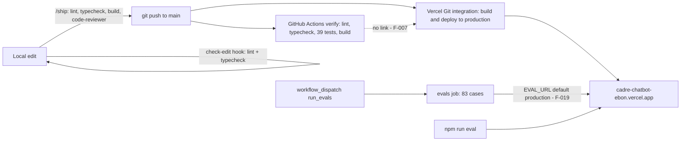

# Architecture Decision Record: Layered Quality Assurance: Free Unit Tests, Opt-In Behavioural Evals, CI on Every Push, and Git-Integration Auto-Deploy of `main`

> **Template Origin**: Official | **ArcKit Version**: 6.16.3 | **Command**: `/arckit:adr`

## Document Control

| Field | Value |
|-------|-------|
| **Document ID** | ARC-001-ADR-008-v1.0 |
| **Document Type** | Architecture Decision Record |
| **Project** | Cadre AI Support Chatbot — cadre-chatbot (Project 001) |
| **Classification** | OFFICIAL |
| **Status** | DRAFT |
| **Version** | 1.0 |
| **Created Date** | 2026-09-28 |
| **Last Modified** | 2026-09-28 |
| **Review Cycle** | Monthly |
| **Next Review Date** | 2026-10-28 |
| **Owner** | Jhon Felipe Urrego — Solution Architect, Cadre AI Support Chatbot |
| **Reviewed By** | [PENDING] |
| **Approved By** | [PENDING] |
| **Distribution** | Project Team, Architecture Team |

## Revision History

| Version | Date | Author | Changes | Approved By | Approval Date |
|---------|------|--------|---------|-------------|---------------|
| 1.0 | 2026-09-28 | ArcKit AI | Initial creation from `/arckit:adr` command (retrospective, as-built at commit `d63c3ac`; counts verified) | [PENDING] | [PENDING] |

---

## 1. Decision Title

**Assure Quality in Layers: 39 Vitest Unit Tests With the Model Mocked, an 83-Case Behavioural Eval Suite Run On Demand Against a Deployment, GitHub Actions CI (Lint, Typecheck, Test, Build) on Every Push and Pull Request, and Vercel Git-Integration Auto-Deploy of `main`**

| Attribute | Value |
|-----------|-------|
| **ADR Number** | ADR-008 |
| **Decision Status** | **Accepted** (retrospective record of an implemented decision) |
| **Decision Date** | 2026-09-24 → 2026-09-25 (auto-deploy from phase 1; evals from phase 4; unit tests `6020010`; CI and hooks added in phase 6) |
| **Recorded** | 2026-09-28, against repository commit `d63c3ac` |
| **Escalation Level** | Team |
| **Governance Forum** | Builder self-review via `plan.md` and `CLAUDE.md` rules → take-home review panel (day-5 live review) |

> **Retrospective record.** This ADR describes the repository at `d63c3ac`. Paths in the application's `.gitignore` were not reviewed.
>
> **Counts verified statically** from the files at `d63c3ac`. No test or eval was executed for this ADR.
>
> - **Unit tests: 39.** There are 37 `it(...)` calls plus one `it.each` with 2 cases (`route.test.ts`), across 6 files: `route.test.ts` 13, `guard-knowledge.test.ts` 6, `escalations.test.ts` 6, `Chat.test.tsx` 5, `rate-limit.test.ts` 5 and `prompt.test.ts` 4.
> - **Eval cases: 83.** These are the `id:` entries in `evals/cases.ts`.
> - **Commits: 63, merge commits: 0.**
>
> At HEAD `acbd6a0` there are **43** unit tests (4 retry tests added to `escalations.test.ts`), 83 eval cases and 69 commits. The QA design is unchanged.

---

## 2. Stakeholders

### 2.1 Deciders (RACI: Accountable)

- **Jhon Felipe Urrego, Solution Architect / Builder**: designed the test layers, CI and deploy flow (SD-13).

### 2.2 Consulted (RACI: Consulted)

- **Cadre AI Engineering**: the future owner of the pipeline and the release policy. Decisions C-7 and C-8 are theirs (SD-5).
- **Take-home Review Panel**: weighs Code Quality & Verification at 15% and the Claude Code workflow at 30% [CACTHC-C11].

### 2.3 Informed (RACI: Informed)

- Finance: evals spend model budget (SD-8).
- Inbound: evals that escalate reach the real team channel (F-019).
- Talent / Recruiting: submission includes the history and CI badge (SD-7).

### 2.4 UK Government Escalation Context

**Decision Level**: Team

**Escalation Rationale**:

- [x] **Team**: Local implementation choice (testing strategy, pipeline, deploy trigger)
- [ ] **Cross-team**: Integration patterns, shared services, API standards
- [ ] **Department**: Technology standards, cloud providers, security frameworks
- [ ] **Cross-government**: National infrastructure, cross-department interoperability

Cadre AI is a private company, so the UK Government tiers are used only as a scale. Production release gating (C-7) and supply-chain policy (C-8) become AI Engineering decisions once the system is handed over.

**Governance Forum**: `CLAUDE.md` "Rules" and `plan.md` phases, reviewed at the day-5 live review.

**Approval Date**: [PENDING]. No formal approval is recorded; the decision was implemented 2026-09-24 → 2026-09-25.

---

## 3. Context and Problem Statement

### 3.1 Problem Description

The bot's behaviour depends on non-deterministic model output as well as on deterministic code. The brief asks for early, continuous deploys: "Deploy early. Get something live before you start iterating" [CACTHC-C13]. Model calls spend a $5 budget that must last through the review [NSTCCA-C2], and "No automated test calls the model" (`CLAUDE.md` hard constraints).

**Problem statement as a question**: How should correctness be verified for both the code and the model's behaviour, and how should changes reach production, so that iteration stays fast and cheap, regressions are caught, and the budget is protected?

### 3.2 Why This Decision Is Needed

- **Business context**:
  - BR-005: stay live within budget.
  - BR-006: deliver the required artefacts, including the commit history.
  - BR-008: an ownable, maintainable system.
  - BR-002: zero ungrounded claims, verified by evals.
- **Technical context**:
  - NFR-M-004: automated quality gates.
  - NFR-M-005: behavioural evaluation suite.
  - NFR-M-006: AI-assisted development workflow.
  - NFR-F-004: zero-cost automated verification.
  - NFR-SEC-007: vulnerability management.
  - NFR-SEC-008: development-tooling guardrails.
  - INT-005: source control, CI and hosting.
  - NFR-A-001: availability through the assessment.
- **Regulatory context**: No UK Government regime applies. Eval traffic creates real handoff records containing test emails (F-019).

### 3.3 Supporting Links

- **Repository evidence**:
  - `.github/workflows/ci.yml` and `vitest.config.ts`.
  - The six `*.test.ts(x)` files.
  - `evals/cases.ts` and `evals/run.ts`.
  - `.claude/commands/ship.md`, `eval.md` and `log-decision.md`.
  - `.claude/agents/eval-runner.md` and `code-reviewer.md`.
  - `.claude/hooks/check-edit.mjs` and `guard-knowledge.mjs`.
  - `CLAUDE.md` "Commands", "Rules" and the mistakes log.
  - `plan.md` phases 1, 4 and 6.
  - `README.md` "Verification".
- **Requirements**: BR-002, BR-005, BR-006, BR-008, NFR-A-001, NFR-M-004, NFR-M-005, NFR-M-006, NFR-F-004, NFR-SEC-007, NFR-SEC-008, INT-005
- **Related ADRs**: ADR-001 (Vercel, the single route), ADR-002 (the model; evals gate model changes), ADR-003 (evals gate knowledge changes), ADR-005 (tool evals), ADR-007 (the eval runner relies on origin-less access and `retry-after`)

---

## 4. Decision Drivers (Forces)

### 4.1 Technical Drivers

- **Deterministic code must be tested for free and fast.** The model is mocked in unit tests.
  - Requirements: NFR-M-004, NFR-F-004
  - Principle: P-21 Automated Verification Before Every Change
- **Model behaviour must be tested against the real model.** Regex assertions target claims, not mentions, and every answer bug becomes a regression case.
  - Requirements: NFR-M-005
  - Principle: P-10 Behavioural Evaluation as a Release Gate
- **Continuous delivery from the main line.**
  - Requirements: INT-005
  - Principle: P-22 Continuous Delivery in Small, Traceable Steps
- **Guardrails for AI-assisted coding.** The harness enforces rules; they are not only written down.
  - Requirements: NFR-M-006, NFR-SEC-008
  - Principle: P-20 AI-Augmented Development With Explicit Context and Guardrails

### 4.2 Business Drivers

- **Live early, redeployed often** [CACTHC-C13], with a public URL [CACTHC-C10].
  - Requirements: BR-005, NFR-A-001
- **Protect the budget.** Eval runs are deliberate and costed beforehand.
  - Requirements: BR-005, NFR-F-004
  - Stakeholder goals: G-5, SD-8
- **Reviewable history.** Small, conventional commits that reviewers read.
  - Requirements: BR-006
  - Stakeholder goals: G-7, G-8, SD-6
  - Source: [NSTCCA-C3]

### 4.3 Regulatory & Compliance Drivers

- **GDS Service Standard / TCoP**: Not applicable. Used only as a checklist: automated testing, continuous delivery, and AI assurance (TCoP Point 13).
- **Security**:
  - CI inputs are passed through `env`, never interpolated into shell ("so they can't inject shell commands", `ci.yml`).
  - There is no dependency scanning, and there are no least-privilege `permissions:` (F-008).
- **Data Protection**: Eval handoffs send test data to the real team channel (F-019).

### 4.4 Alignment to Architecture Principles

Principles from `projects/000-global/ARC-000-PRIN-v1.0.md`:

| Principle | Alignment | Impact |
|-----------|-----------|--------|
| P-10 Behavioural Evaluation as a Release Gate | ⚠️ Partial | 83 cases; the last full run on production was 83/83 in 489 s. Evals run only on demand or by manual CI dispatch, so they **do not gate** deploys. Assertions are regex-based |
| P-20 AI-Augmented Development With Explicit Context and Guardrails | ✅ Supports | `CLAUDE.md` rules and mistakes log; `code-reviewer` and `eval-runner` subagents; `check-edit` and `guard-knowledge` hooks |
| P-21 Automated Verification Before Every Change | ⚠️ Partial | CI runs lint → typecheck → test → build on every push and PR, with the model mocked. It runs in parallel with deploy rather than before it, and there are no merges to gate (F-007) |
| P-22 Continuous Delivery in Small, Traceable Steps | ✅ Supports / ⚠️ | Every push to `main` deploys, with conventional commits. The post-deploy smoke test is manual |
| P-16 Cost as a First-Class Architectural Constraint | ✅ Supports | Unit tests are free. The `/eval` command states the case count and cost before running |

---

## 5. Considered Options

Five options were considered. For each rejected option, the **Source** line says whether it is recorded in the repository or has been reconstructed.

### Option 1: Layered QA — Free Unit Tests, Opt-In Evals, CI on Push and PR, Independent Git-Integration Auto-Deploy (CHOSEN)

**Description**: Four independent mechanisms.

1. Vitest unit tests, with the model mocked.
2. A behavioural eval suite run on demand against a deployment.
3. A GitHub Actions `verify` job on every push and PR.
4. Vercel's Git integration, which deploys every push to `main` to production regardless of the CI result.

**Implementation approach (as built at `d63c3ac`)**:

1. **Unit tests: 39 across 6 files.** `vitest.config.ts` uses the `node` environment and includes `.claude/hooks/*.test.ts` explicitly ("Globs skip dot-folders"). The streaming response is stubbed and `streamText` is replaced, so no test calls the model.

   | File | Tests | What it covers |
   |------|-------|----------------|
   | `app/api/chat/route.test.ts` | 13 | Every rejection path; "never calls the model for a rejected request"; caps, temperature, cached system instructions; exact tool set; history trim |
   | `.claude/hooks/guard-knowledge.test.ts` | 6 | Knowledge provenance hook |
   | `lib/escalations.test.ts` | 6 | Masking, payload content and 2,000-character cap, log-only and webhook paths, never throws |
   | `components/Chat.test.tsx` | 5 | UI rendering, including XSS-safe text (README) |
   | `lib/rate-limit.test.ts` | 5 | Window, reset, per-key counters, key derivation |
   | `lib/prompt.test.ts` | 4 | Knowledge wrapping and caching; rules before knowledge; no URLs in rules |

2. **Behavioural evals: 83 cases** (`evals/cases.ts`), run by `evals/run.ts`.
   - Each case POSTs a UI-message request to `${EVAL_URL}/api/chat`. The default URL is `http://localhost:3000`.
   - The runner parses the SSE stream and checks the answer with `mustMatch` / `mustNotMatch` regexes, `expectTool` / `forbidTool`, and `expectStatus`.
   - It checks that every cited URL appears in `knowledge/` or in a tool result.
   - It waits for `retry-after` on 429, up to 3 retries.
   - Case groups by id prefix:
     - `sec` 17, `ground` 10, `input` 8, `oos` 7, `tool` 6
     - `gap` 5, `multi` 5, `s1` 4, `lang` 3, `s6` 3
     - `api` 2, `s2` 2
     - 1 each: `s3`, `s4`, `s5`, `case`, `contact`, `fmt`, `off`, `pii`, `pricing`, `prompt`, `spanish`
   - Last recorded full run on production: **83/83 in 489 s** (`plan.md` phase 4).
   - The `eval-runner` subagent classifies failures by cause (knowledge, prompt, tool, or eval too strict).
   - Rule: "Add a case for every bug found in the bot's answers."
3. **CI** (`.github/workflows/ci.yml`):
   - Triggers: `push` to `main`, `pull_request`, and `workflow_dispatch`.
   - Concurrency cancels superseded runs.
   - `verify` job (ubuntu, Node 22, 10-minute timeout): `npm ci` → `npm run lint` → `npm run typecheck` (`next typegen && tsc --noEmit`) → `npm test` → `npm run build`.
   - `evals` job: only when `workflow_dispatch` has `run_evals: true`, after `verify`, with a 20-minute timeout. Inputs are `eval_url` (default: the production URL `https://cadre-chatbot-ebon.vercel.app`) and `cases` (prefix filter), both passed through `env`.
   - The workflow has **no deploy step, no `permissions:` block, and actions pinned to tags** (`actions/checkout@v4`, `actions/setup-node@v4`).
4. **Deploy**:
   - Vercel's Git integration deploys every push to `main` to production (`plan.md` phase 1; README "redeployed on every push to `main`").
   - The `/ship` command also runs `npx vercel --prod` if `.vercel/` exists.
   - **Nothing links the deploy to the CI result.**
   - History: 63 commits pushed straight to `main`, 0 merge commits.
5. **Local and agent guardrails**:
   - `CLAUDE.md` rule: "Before saying a task is done: `npm run lint && npm run typecheck && npm test && npm run build`. If prompt/knowledge changed: `npm run eval`."
   - The `check-edit.mjs` PostToolUse hook lints each edited `.ts`/`.tsx` file and typechecks.
   - The `guard-knowledge.mjs` PreToolUse hook blocks unsourced knowledge facts (ADR-003).
   - The `code-reviewer` subagent reviews diffs in `/ship`.
6. **Budget controls**:
   - Unit tests are free.
   - `/eval` states the case count and cost before running.
   - CI evals are opt-in.
   - `plan.md` estimates about $0.25 per full run with caching.

**Wardley Evolution Stage**:

- Vitest, GitHub Actions and the Vercel Git integration: Commodity or Product.
- The eval suite and runner: Custom-Built.

#### Good (Pros)

- ✅ **Free, fast gate on every change.** Lint, types, 39 tests and a production build run in under 10 minutes (NFR-M-004 ✅, NFR-F-004 ✅).
- ✅ **Real-model regression suite.** It covers the six scenarios, grounding, injection, leaks, tool misuse, languages and the API contract. It caught real bugs, including the hospitality contradiction and the live-demo escalation regression (`CLAUDE.md` mistakes log).
- ✅ **Live from day 1, redeployed on every push** [CACTHC-C13] (BR-005, P-22).
- ✅ **Guardrails enforced by the harness**, not only documented (NFR-M-006).
- ✅ **Safe CI inputs** (no shell interpolation).

#### Bad (Cons)

- ❌ **Deploy is not gated by CI** (F-007).
- ❌ **Evals don't gate anything.** They run when someone chooses to run them, and they target production by default in the CI dispatch.
- ❌ **Regex assertions** catch known failure shapes, not every unsupported claim. `plan.md` "Known limitations" says an LLM judge would automate that.
- ❌ **Supply chain is not hardened** (F-008).

#### Cost Analysis

- **CAPEX**: Test and eval authoring during the build.
- **OPEX**:
  - CI: free-tier minutes.
  - Evals: about $0.25 per full run with caching (`plan.md`).
  - Hosting: plan not recorded.
- **TCO (3-year)**: Low. Eval spend scales with run frequency.

#### GDS Service Standard Impact

| Point | Impact | Notes |
|-------|--------|-------|
| 10. Define what success looks like | Positive | 83 behavioural cases with explicit expectations |
| 13. Use and contribute to open standards | Neutral | — |
| 14. Operate a reliable service | Partial | Continuous deploy without a CI gate (F-007) |

*Not applicable to a private company; shown as an engineering checklist only.*

---

### Option 2: CI-Gated Production Release (Required Checks or Deploy From CI, Preview-First) (REJECTED FOR MVP — reconstructed)

**Description**: Production is promoted only after the `verify` job passes. There are three ways to do this:

- Vercel deployment protection or required status checks on a protected `main`.
- Deploying from CI after `verify`.
- A preview-first flow, with evals run on the preview and manual promotion.

**Source**: Reconstructed from CDAU C-7 options (a), (b) and (c). The repository has no deploy step in CI and no branch protection evidence. There are 0 merges.

**Wardley Evolution Stage**: Commodity

#### Good (Pros)

- ✅ **A broken build or failing test cannot reach production** (F-007 closed).
- ✅ **Evals can run on a preview**, away from the real team channel (F-019 closed).

#### Bad (Cons)

- ❌ **Slower iteration** during a 3-day challenge in which reviewers test the live URL [CACTHC-C13].
- ❌ **Platform configuration in the UI**, or a CI deploy token to manage (F-018).

#### Cost Analysis

- **CAPEX**: Small (settings or a deploy job).
- **OPEX**: Negligible.
- **TCO (3-year)**: Low.

#### GDS Service Standard Impact

| Point | Impact | Notes |
|-------|--------|-------|
| 14. Operate a reliable service | Positive | Gated releases |

---

### Option 3: Run the Full Eval Suite Automatically on Every Push (REJECTED — recorded)

**Description**: Make the `evals` job run on every push instead of only on manual dispatch.

**Source**:

- `CLAUDE.md` hard constraints: "The key is for the bot's runtime only. No coding help or bulk experiments with it. No automated test calls the model."
- The `ci.yml` evals job is `workflow_dispatch`-only, with the input description "real model calls, spends budget".
- NFR-F-004.

**Wardley Evolution Stage**: Custom-Built

#### Good (Pros)

- ✅ **Behavioural gate on every change** (P-10 fully met).

#### Bad (Cons)

- ❌ **Spends the $5 challenge budget** (about $0.25 per run) on every push, 63 of them. It also conflicts with the credential-use rule [NSTCCA-C4].
- ❌ **Slow**: about 8 minutes per full run.
- ❌ **Non-deterministic failures** would make pushes flaky.

#### Cost Analysis

- **CAPEX**: None.
- **OPEX**: About $0.25 × pushes, which is prohibitive on this budget.
- **TCO (3-year)**: Depends on the budget. Plausible with a separate eval key.

#### GDS Service Standard Impact

| Point | Impact | Notes |
|-------|--------|-------|
| 10. Define what success looks like | Positive | — (but infeasible on budget) |

---

### Option 4: LLM-as-Judge Groundedness Evaluation (DEFERRED — recorded)

**Description**: Add a judge model that checks every claim in sampled answers is traceable to `knowledge/`. This would complement or replace the regex assertions.

**Source**: `plan.md` "Known limitations" says "an LLM judge for groundedness would automate that". "With more time" lists an "LLM-as-judge groundedness check … on a sample of eval answers", and "Scaling path" mentions "LLM-as-judge evals in CI". NFR-M-005 marks this ❌.

**Wardley Evolution Stage**: Product → Custom-Built

#### Good (Pros)

- ✅ **Catches subtle unsupported claims** that regexes miss (BR-002).

#### Bad (Cons)

- ❌ **More model spend and judge calibration**, and the judge itself needs evaluating.
- ❌ **Outside the build budget** [CACTHC-C14].

#### Cost Analysis

- **CAPEX**: Judge prompts and calibration set.
- **OPEX**: Judge tokens per sampled answer.
- **TCO (3-year)**: Moderate.

#### GDS Service Standard Impact

| Point | Impact | Notes |
|-------|--------|-------|
| 10. Define what success looks like | Positive | Automated groundedness |

---

### Option 5: Do Nothing (Baseline) — Manual Checks Only, Deploy From Laptop

**Description**: No automated tests, CI or evals. The builder tries the bot by hand and deploys manually.

**Source**: This is the starting point before phase 1. The `CLAUDE.md` rules and `plan.md` phases record moving away from it.

#### Good

- ✅ **No setup time**.

#### Bad

- ❌ **Regressions go unnoticed.** Several bugs were found only by evals or tests (`CLAUDE.md` mistakes log).
- ❌ **Fails the review criteria** for Code Quality & Verification (15%) and the Claude Code workflow (30%) [CACTHC-C11].
- ❌ **No evidence** for NFR-M-004 or NFR-M-005.

---

## 6. Decision Outcome

### 6.1 Chosen Option

**"Option 1: Layered QA — free unit tests, opt-in evals, CI on push and PR, independent Git-integration auto-deploy"**

### 6.2 Y-Statement (Structured Justification)

> **In the context of** a 3-day take-home build of a public LLM chatbot on a $5 model budget, where reviewers test the live URL and read the commit history,
> **facing** the need to verify both deterministic code and non-deterministic model behaviour while shipping early and often without spending the budget on automation,
> **we decided for** 39 Vitest unit tests with the model mocked, an 83-case behavioural eval suite run on demand against a deployment, a GitHub Actions `verify` job (lint, typecheck, test, build) on every push and PR, and Vercel Git-integration auto-deploy of every push to `main`,
> **to achieve** a free, fast gate on every change, a real-model regression suite (83/83 on production), a live bot from day 1, and a readable, conventional history,
> **accepting** that production deploys are not gated by CI (F-007), that evals are neither automatic nor a release gate and target production by default, and that the pipeline's supply chain is not hardened.

### 6.3 Justification (Why This Option?)

**Key reasons**:

1. **It fits the constraints.** "No automated test calls the model" rules out automatic evals. "Deploy early" favours auto-deploy [CACTHC-C13].
2. **It caught real defects.** The evals and the tests found bugs that reading the code missed (`CLAUDE.md` mistakes log). The rule "add a case for every bug" keeps them fixed.
3. **The mitigation is a local and agent gate.** `CLAUDE.md` requires lint, typecheck, test and build before a task is done. `/ship` runs them plus a code review before pushing, and the `check-edit` hook checks every edit. These gates are procedural, not enforced by the platform.

**Stakeholder consensus**: This was a single-builder decision. The review panel sees it through the CI badge, the history and the eval results.

**Risk appetite**: This is acceptable for a single-author challenge with a manual smoke test after each release. It is not acceptable for a team or for production. C-7 must be decided.

---

## 7. Consequences

### 7.1 Positive Consequences

- ✅ **Every push is lint-, type-, test- and build-checked in CI** (NFR-M-004 ✅).
- ✅ **Behavioural regression suite with recorded runs** (NFR-M-005 ✅; runs are logged in `plan.md`).
- ✅ **Zero-cost automated verification** (NFR-F-004 ✅).
- ✅ **Continuous deployment from `main`** (INT-005 ✅, P-22).
- ✅ **Harness-enforced guardrails for AI-assisted development** (NFR-M-006 ✅).

**Measurable outcomes**:

| Measure | At `d63c3ac` | At HEAD |
|---------|--------------|---------|
| Unit tests | 39 | 43 |
| Eval cases | 83 | 83 |
| Last full eval run on production | 83/83 in 489 s | — |
| Commits (conventional prefixes) | 63 | 69 |
| Merges | 0 | 0 |
| CI duration | Bounded by a 10-minute timeout (actual durations not recorded in the repo) | — |

### 7.2 Negative Consequences (Accepted Trade-offs)

Audit gaps from `ARC-001-CDAU-001-v1.0`:

- ❌ **F-007 (MEDIUM): production deploys are not gated on CI.**
  - The Git integration deploys every push to `main`, while lint, typecheck and tests run in a workflow that nothing requires (`plan.md:30`; `.github/workflows/ci.yml:3-38` has no deploy step and no required-check linkage).
  - All 63 commits at `d63c3ac` (69 at HEAD) went straight to `main`, with no pull-request merges (`git log --merges` returns 0).
  - The effect: a commit that fails lint, typecheck, tests or build **still deploys**. If the build itself fails, Vercel does not promote it (INT-005: "A failed build does not deploy"), but failing tests or lint do not stop it.
  - The audit rates this as inferred, because hosting and branch settings are not visible in the repository.
  - It also conflicts with P-21's "before it is merged", because nothing is merged.
- ❌ **F-019 (LOW): eval traffic mixes with real handoffs.** Eval runs default to the production URL in CI dispatch, and 4 cases trigger real escalations into the team channel (ADR-006).
- ❌ **F-008 (MEDIUM): supply chain not hardened.**
  - No dependency-vulnerability scanning or update automation (no `.github/dependabot.yml`).
  - Actions pinned to mutable tags; no least-privilege `permissions:`.
  - Caret ranges for most dependencies.
  - NFR-SEC-007 is ⚠.
- ❌ **F-021 (LOW): documentation drift in the eval tooling.** `/eval` and `eval-runner` state about $0.006 per case, against the about $0.003 measured (`plan.md`).
- ❌ **Evals are not a release gate** (P-10 ⚠), and their assertions are regex-based (no LLM judge).
- ❌ **Post-deploy smoke test is manual** (`plan.md` phase 6).

**Blocking decisions from the audit that bear on this ADR**:

- **C-7: production release gating and environments.** P-10 and P-21 rely on gates that don't currently gate anything (F-007, F-019). The options are:
  - (a) Require CI checks before promotion (deployment protection or required checks).
  - (b) Deploy from CI after the verify job.
  - (c) A preview-first flow, with evals on preview and manual promotion.

  Suggested ADR title: "Production release gating and environment strategy".
- **C-8: dependency and CI supply-chain policy.** NFR-SEC-007 has no control to test against (F-008). The options are:
  - (a) Dependabot, dependency review, SHA-pinned actions and least-privilege permissions.
  - (b) A scheduled `npm audit` job with alerts.
  - (c) Pinning plus a documented manual update cadence.

**Mitigation strategies**:

- **F-007**: Enable Vercel deployment protection so production is promoted only after the `verify` check, or deploy from a CI job after `verify`. Protect `main` and require PRs (C-7).
- **F-019**: Point evals at a preview deployment with the webhook disabled and its own key, or tag eval conversations so that `recordEscalation` skips the webhook.
- **F-008**:
  - Add `.github/dependabot.yml` for npm and actions.
  - Add a dependency-review or `npm audit` step.
  - Pin actions by SHA and set `permissions: contents: read` (C-8).
- **F-021**: Correct the per-case cost in `/eval` and `eval-runner`.
- **Evals as a gate**: Before promoting a prompt, knowledge or model change, run the affected eval prefixes on a preview. Consider a separate eval key for scheduled runs (Option 3 variant) and an LLM judge (Option 4).

### 7.3 Neutral Consequences (Changes Needed)

- 🔄 **Process**: Every bug fix or validation rule in `app/` or `lib/` comes with a unit test. Every new bot behaviour comes with an eval case (`CLAUDE.md` rules).
- 🔄 **Budget**: Check the OpenRouter balance before each eval run (`plan.md` "Budget").
- 🔄 **Handover**: The Vercel project settings (Git integration, environment variables, protection) live only in the platform UI (F-018) and must be documented for AI Engineering.

### 7.4 Risks and Mitigations

| Risk | Likelihood | Impact | Mitigation | Owner |
|------|------------|--------|------------|-------|
| A commit that fails CI reaches production (F-007) | M | M | Local and `/ship` gates (procedural); deployment protection or deploy-from-CI (C-7) | Solution Architect / Builder → AI Engineering |
| A prompt or knowledge regression ships because evals weren't run | M | H | `CLAUDE.md` rule (run evals when prompt or knowledge changes); preview evals before promotion | AI Engineering |
| A vulnerable dependency goes unnoticed (F-008) | M | M | Dependabot and audit step (C-8) | AI Engineering |
| Eval runs spam the real team channel or spend production budget (F-019) | M | L | Preview target and skip flag | Solution Architect / Builder |
| Regex evals miss a subtle ungrounded claim | M | M | Read answers, not only pass/fail (`CLAUDE.md`); LLM judge (Option 4) | AI Engineering |

**Link to risk register**: None yet (no `ARC-001-RISK`). Run `/arckit:risk` to register these.

---

## 8. Validation & Compliance

### 8.1 How Will Implementation Be Verified?

**Design review**:

- [x] Architecture diagrams reflect this decision: ARC-001-DIAG-006 (Deployment: GitHub → Vercel, CI) and Archify DIAG-015
- [ ] C-7 and C-8 decided and recorded as ADRs
- [ ] Conformance check against ADR-001 to ADR-008 (`/arckit:conformance`)

**Code review**:

- [x] `ci.yml` runs lint, typecheck, test and build on push and PR
- [x] Evals are dispatch-only, and inputs go through `env`
- [ ] A deploy step or protection linked to `verify` (F-007)
- [ ] `permissions:`, SHA pins and Dependabot (F-008)

**Testing strategy** (this ADR is the testing strategy):

- [x] Unit layer: 39 tests at `d63c3ac`, with the model mocked
- [x] Behavioural layer: 83 cases, with the last full run at 83/83
- [ ] Automated post-deploy smoke test (six scenarios) on preview or production
- [ ] Playwright end-to-end test of the escalation flow (`plan.md` "With more time")

### 8.2 Monitoring & Observability

**Success metrics**:

- **CI pass rate on `main`**: from GitHub Actions history (CI badge in the README)
- **Eval pass rate per run**: recorded in `plan.md`; target 100%
- **Time from push to live**: not measured
- **Deploys that went out with failed CI**: target 0 once C-7 is decided (not measurable today without joining CI and Vercel records)

**Alerts and dashboards**: GitHub's default failure notifications only. No deploy-health alert (F-012).

### 8.3 Compliance Verification

**GDS Service Assessment / TCoP**: Not applicable.

**Security assurance**:

- [x] CI inputs passed via `env` (no shell injection)
- [x] Coding-agent guardrails (hooks, deny rules; F-020 notes gaps)
- [ ] Dependency scanning (F-008)

**Data protection**:

- [ ] Eval handoffs isolated from the real team channel (F-019)

---

## 9. Links to Supporting Documents

### 9.1 Requirements Traceability

**Business Requirements**:

- BR-002: Protect Brand Credibility (grounding evals)
- BR-005: Operate Within the Runtime Budget and Stay Live (auto-deploy; free unit tests)
- BR-006: Deliver Required Project Artefacts for Review (history, `CLAUDE.md`, `plan.md`)
- BR-008: Ownable, Maintainable System (CI on every push)

**Non-Functional Requirements**:

- NFR-A-001: Availability Target (live since phase 1)
- NFR-M-004: Automated Quality Gates
- NFR-M-005: Behavioural Evaluation Suite
- NFR-M-006: AI-Assisted Development Workflow
- NFR-F-004: Zero-Cost Automated Verification
- NFR-SEC-007: Vulnerability Management (partial, F-008)
- NFR-SEC-008: Development-Tooling Guardrails

**Integration Requirements**: INT-005: Integration With Source Control, CI and Hosting.

### 9.2 Architecture Artifacts

**Architecture principles** (`projects/000-global/ARC-000-PRIN-v1.0.md`): P-10, P-16, P-20, P-21, P-22

**Stakeholder drivers** (`projects/001-cadre-chatbot/ARC-001-STKE-v1.0.md`): SD-5, SD-6, SD-7, SD-8, SD-13; goals G-5, G-7, G-8

**Risk register**: Not yet created

**Architecture diagrams** (`projects/001-cadre-chatbot/diagrams/`): DIAG-006; Archify DIAG-015

**Codebase audit** (`projects/001-cadre-chatbot/audits/ARC-001-CDAU-001-v1.0.md`): F-007, F-008, F-012, F-018, F-019, F-020, F-021; blocking decisions C-7 and C-8

### 9.3 Design Documents

**Detailed Design**: `CLAUDE.md` "Commands" and "Rules"; `README.md` "Verification"; `plan.md` phase 4 (the eval history).

### 9.4 External References

**Vendor documentation**:

- Vitest 5
- GitHub Actions (`workflow_dispatch` inputs, `concurrency`, `permissions`)
- Vercel Git integration and deployment protection

**Research and evidence**: `plan.md` phase 4 eval runs (17 → 22 → 47 → 82 → 83 cases); `CLAUDE.md` mistakes log (bugs caught by evals and tests).

---

## 10. Implementation Plan

### 10.1 Dependencies

**Prerequisite decisions**: ADR-001 (Vercel hosting; single route under test).

**Infrastructure dependencies**:

- GitHub repository with Actions enabled
- Vercel project linked through the Git integration
- A reachable deployment and budget for evals

**Team dependencies**: Familiarity with Vitest mocking of the AI SDK and with the eval case format.

### 10.2 Implementation Timeline

This is already implemented. Actual timeline:

| Phase | Activities | Duration | Owner |
|-------|-----------|----------|-------|
| **Phase 1: Deploy** | Vercel Git integration; every push to `main` deploys (`plan.md` phase 1) | 2026-09-24 | Builder |
| **Phase 2: Evals** | Eval runner and cases; 17 → 83 cases with recorded runs (`plan.md` phase 4) | 2026-09-24 → 2026-09-25 | Builder |
| **Phase 3: Unit tests** | Vitest with the model mocked (`6020010`), growing to 39 | 2026-09-25 | Builder |
| **Phase 4: CI and hooks** | GitHub Actions `verify` and dispatch-only `evals`; `check-edit` and `guard-knowledge` hooks (`plan.md` phase 6) | 2026-09-25 | Builder |

**Outstanding follow-ups**:

- C-7 (F-007, F-019)
- C-8 (F-008)
- F-021
- Automated smoke test
- LLM judge

### 10.3 Rollback Plan

**Rollback trigger**: A deploy breaks the live bot (smoke test or user report), or CI changes block legitimate work.

**Rollback procedure**:

1. **Broken production deploy**: promote the previous deployment in Vercel, or revert on `main` and push. The revert is auto-deployed.
2. **CI change**: revert `ci.yml`. CI failures don't block deploys today, so there is no outage risk from CI.
3. Re-run the six-scenario smoke test and the affected eval prefixes.

**Rollback owner**: Jhon Felipe Urrego, Solution Architect / Builder (AI Engineering after handover)

---

## 11. Review and Updates

### 11.1 Review Schedule

**Initial review**: At handover, or when C-7 is decided (no later than 2026-10-28).

**Periodic review**: Quarterly.

**Review criteria**:

- Can a failing commit reach production?
- Are evals run before every prompt, knowledge or model change?
- Is the eval budget separate from production?
- Is the supply chain monitored?

### 11.2 Trigger Events for Review

- [ ] A second contributor joins (PR flow, branch protection)
- [ ] A regression reaches production
- [ ] A dependency vulnerability is disclosed
- [ ] A separate eval key or budget becomes available (automatic evals become feasible)
- [ ] Move of hosting or CI platform

---

## 12. Related Decisions

### 12.1 Decisions This ADR Depends On

- **ADR-001: Use Next.js 16 App Router With a Single Streaming Route Handler on Vercel.** Provides the hosting, the Git-integration deploy and the build under test.
- **ADR-007: Enforce Ordered Request Guards.** The eval runner relies on origin-less access and on `retry-after`.

### 12.2 Decisions That Depend On This ADR

- **ADR-002, ADR-003, ADR-005.** Model, knowledge and tool changes are verified by the eval suite defined here.
- **ADR-006.** Eval-triggered handoffs reach the real channel (F-019).
- **Future C-7 (release gating) and C-8 (supply chain).** These will amend this ADR.

### 12.3 Conflicting Decisions

- **P-21 vs as-built flow.** P-21 says checks pass "before it is merged". There are no merges, and deploys don't wait for CI. C-7 resolves this.

---

## 13. Appendices

### Appendix A: Options Analysis Details

| Criterion | Opt 1 Layered QA (chosen) | Opt 2 CI-gated release | Opt 3 Evals on every push | Opt 4 LLM judge | Opt 5 Manual only |
|-----------|---------------------------|------------------------|---------------------------|-----------------|-------------------|
| Free gate on every change | ✅ (not blocking deploy) | ✅ blocking | ✅ | ✅ | ❌ |
| Real-model behaviour verified | ✅ on demand | ✅ on preview | ✅ every push | ✅ deeper | ⚠️ ad hoc |
| Failing commit can reach production | ⚠️ yes (F-007) | ❌ no | ❌ no | n/a | ⚠️ yes |
| Model spend per push | $0 | $0 (evals optional) | about $0.25 | more | $0 |
| Evidence source | code, `plan.md` | CDAU C-7 (reconstructed) | `CLAUDE.md`, `ci.yml` | `plan.md` limitations and more-time list | pre-phase-1 |

### Appendix B: Stakeholder Consultation Log

| Date | Stakeholder | Feedback | Action Taken |
|------|-------------|----------|--------------|
| 2026-09-24 | Brief tips | "Deploy early" | Git-integration auto-deploy in phase 1 |
| 2026-09-24 | Reading eval answers | Bugs the pass/fail line missed | Rule: read answers; regression case per bug |
| 2026-09-25 | Builder | Need free, fast checks | Vitest with the model mocked; CI `verify` job |
| 2026-09-25 | Live demo by hand | Escalation regression not covered by evals | Eval histories use real bot replies (`4c091a0`) |
| 2026-09-28 | ArcKit codebase audit | F-007, F-008, F-019, F-021; C-7 and C-8 | Recorded under Consequences |

### Appendix C: Alternative Formats

---

## Document Approval

| Role | Name | Signature | Date |
|------|------|-----------|------|
| **Technical Architect** | Jhon Felipe Urrego | | [PENDING] |
| **Senior Responsible Owner** | [PENDING] | | [PENDING] |
| **Security Architect** | [PENDING] | | [PENDING] |
| **Governance Board** | Take-home review panel | | [PENDING] |

---

*This ADR follows the MADR v4.0 format enhanced with UK Government requirements and ArcKit governance standards.*

*For more information:*

- *MADR: https://adr.github.io/madr/*
- *UK Gov ADR Framework: https://www.gov.uk/government/publications/architectural-decision-record-framework*
- *ArcKit Documentation: `projects/001-cadre-chatbot/README.md`*

## External References

> This section provides traceability from generated content back to source documents.
> Follow citation instructions in the project's citation reference guide.

### Document Register

| Doc ID | Filename | Type | Source Location | Description |
|--------|----------|------|-----------------|-------------|
| CACTHC | Cadre_AI_Chatbot_Take_Home_Candidate_v1.1.pdf | Challenge brief | 001-cadre-chatbot/external/ | Deploy-early tip, public URL, evaluation weights, build-time guidance |
| NSTCCA | Next Steps  Tech Challenge  Cadre AI.txt | Recruiter email | 001-cadre-chatbot/external/ | Budget, credential-use rule, submission with `.git` (credential value not reproduced) |
| APP | cadre-chatbot repository at `d63c3ac` (HEAD `acbd6a0` compared) | Reference implementation | github.com/johnfelipe/cadre-chatbot | `.github/workflows/ci.yml`, `vitest.config.ts`, 6 test files, `evals/cases.ts`, `evals/run.ts`, `.claude/commands/*`, `.claude/agents/*`, `.claude/hooks/*`, `CLAUDE.md`, `plan.md`, `README.md`, git history |
| CDAU | ARC-001-CDAU-001-v1.0.md | Codebase audit | 001-cadre-chatbot/audits/ | F-007, F-008, F-012, F-018, F-019, F-020, F-021; blocking decisions C-7, C-8 |

### Citations

| Citation ID | Doc ID | Page/Section | Category | Quoted Passage |
|-------------|--------|--------------|----------|----------------|
| CACTHC-C10 | CACTHC | p.4, Deliverables | Non-Functional Requirement | "The app must be deployed and accessible on a public URL." |
| CACTHC-C11 | CACTHC | p.5, What We're Looking For | Stakeholder Need | Weighted dimensions: Claude Code Proficiency 30% … Code Quality & Verification 15% … |
| CACTHC-C13 | CACTHC | p.7, Tips | Non-Functional Requirement | "Deploy early. Get something live before you start iterating." |
| CACTHC-C14 | CACTHC | p.2, Challenge Format | Business Requirement | "We recommend budgeting 4–6 hours. Build, deploy, and prepare your submission." |
| NSTCCA-C2 | NSTCCA | Paragraph "API Key" | Procurement Constraint | "It has a $5 budget and expires in 7 days, so plan accordingly" (credential value redacted) |
| NSTCCA-C3 | NSTCCA | Paragraph "Submission" | Compliance Constraint | "Exclude node_modules, dist, build, or your virtual environment, but keep the .git folder so we can review your commit history. The zip should stay lightweight, just a few MB." |
| NSTCCA-C4 | NSTCCA | Paragraph "API Key" | Security Requirement | "Note — this key is for the chatbot only, not for coding assistance. Use it exclusively so your chatbot can respond to users with the model of your choice." |

### Unreferenced Documents

| Filename | Source Location | Reason |
|----------|-----------------|--------|
| README.md | 001-cadre-chatbot/external/ | Folder placeholder; no decision content |

---

**Generated by**: ArcKit `/arckit:adr` command
**Generated on**: 2026-09-28 GMT
**ArcKit Version**: 6.16.3
**Project**: Cadre AI Support Chatbot — cadre-chatbot (Project 001)
**AI Model**: Claude Opus 5.5 (claude-opus-5-5)
**Generation Context**: Retrospective ADR from the as-built repository at commit `d63c3ac`, with test, eval and commit counts verified statically. Sources: the CI workflow, Vitest config, eval runner and cases, Claude Code commands, agents and hooks, `CLAUDE.md` rules, and `plan.md` phases and limitations. HEAD `acbd6a0` was compared (43 tests, 69 commits). Also used: ARC-000-PRIN, ARC-001-REQ, ARC-001-STKE, ARC-001-CDAU-001, the external brief and the recruiter email.
