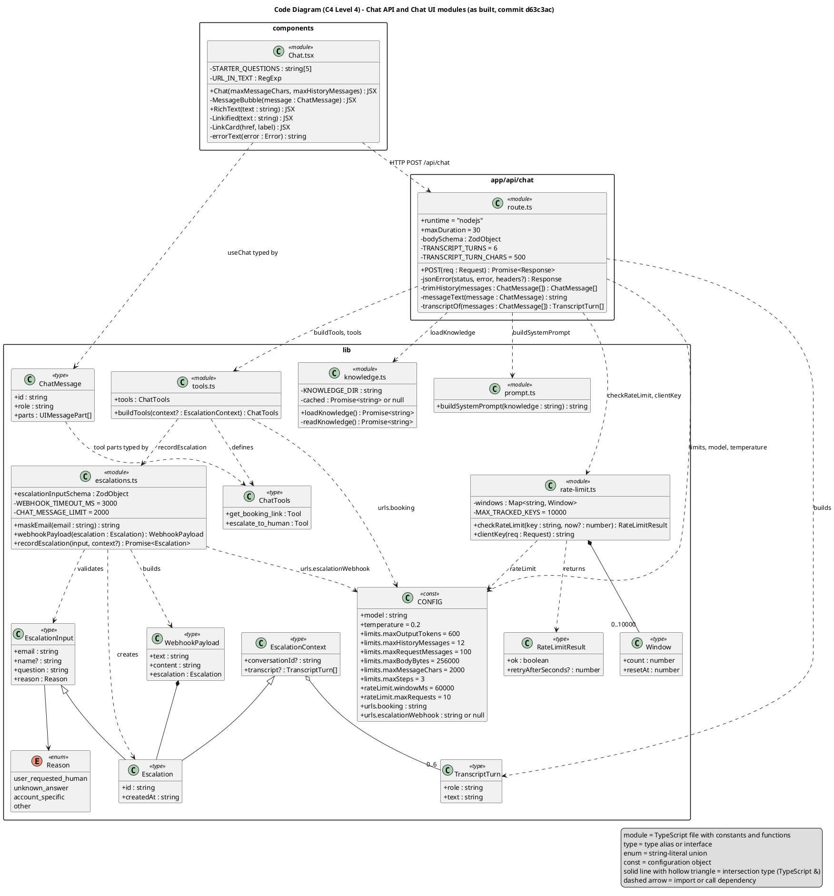

# Architecture Diagram: C4 Level 4 — Code (Class-Level)

> **Template Origin**: Official | **ArcKit Version**: 6.16.3 | **Command**: `/arckit:diagram`

## Document Control

| Field | Value |
|-------|-------|
| **Document ID** | ARC-001-DIAG-004-v1.0 |
| **Document Type** | Architecture Diagram |
| **Project** | Cadre AI Support Chatbot — cadre-chatbot (Project 001) |
| **Classification** | OFFICIAL |
| **Status** | DRAFT |
| **Version** | 1.0 |
| **Created Date** | 2026-09-27 |
| **Last Modified** | 2026-09-27 |
| **Review Cycle** | Monthly |
| **Next Review Date** | 2026-10-27 |
| **Owner** | Jhon Felipe Urrego — Solution Architect, Cadre AI Support Chatbot |
| **Reviewed By** | [PENDING] |
| **Approved By** | [PENDING] |
| **Distribution** | Project Team, Architecture Team |

## Revision History

| Version | Date | Author | Changes | Approved By | Approval Date |
|---------|------|--------|---------|-------------|---------------|
| 1.0 | 2026-09-27 | ArcKit AI | Initial creation from `/arckit:diagram` command | [PENDING] | [PENDING] |

---

## Diagram

**Type**: C4 Level 4, Code (UML class diagram). **Scope**: the TypeScript modules and types behind the Chat API and the Chat UI entry module, at commit `d63c3ac`. The codebase is functional rather than class-based, so the diagram uses these conventions:

- `<<module>>`: a TypeScript file. Its "attributes" are module-level constants and its "operations" are exported (`+`) or private (`-`) functions.
- `<<type>>`: a type alias or interface; `<<enum>>`: a string-literal union; `<<const>>`: a frozen configuration object.
- `..>` is a dependency (import or call), `*--` is composition, `o--` is aggregation, and `<|--` is used for TypeScript intersection types (`Escalation = EscalationInput & EscalationContext & {...}`).

C4 Level 4 is normally generated from code by IDE tooling. This hand-drawn version shows the design-relevant shapes only; private React subcomponents and test files are omitted.

### PlantUML Class Diagram Format

**View this diagram** (PlantUML does NOT render in GitHub markdown):

- **Online**: https://www.plantuml.com/plantuml/uml/ (paste code above)
- **VS Code**: Install PlantUML extension (jebbs.plantuml)
- **CLI**: `java -jar plantuml.jar diagram.puml`

**Notation notes**: `?` marks optional fields. `ChatMessage` is `UIMessage<unknown, UIDataTypes, ChatTools>` from the AI SDK. Its `role` is validated to `user` or `assistant` by `bodySchema`. `RateLimitResult` is the discriminated union `{ ok: true } | { ok: false; retryAfterSeconds }`.

### Diagram Quality Gate

| # | Criterion | Target | Result | Status |
|---|-----------|--------|--------|--------|
| 1 | Edge crossings | < 5 | 2–4 expected: `Config` is a shared dependency of four modules | PASS |
| 2 | Visual hierarchy | Packages most prominent | Three packages (`components`, `app/api/chat`, `lib`) | PASS |
| 3 | Grouping | Related elements proximate | Types grouped next to their owning module | PASS |
| 4 | Flow direction | Consistent | Top-down from UI module to route to lib | PASS |
| 5 | Relationship traceability | Unambiguous | Every dependency labelled with the function used | PASS |
| 6 | Abstraction level | One C4 level | Code level only | PASS |
| 7 | Edge label readability | Legible | Short function names | PASS |
| 8 | Node placement | No long edges | Config edges are the longest; accepted | PASS |
| 9 | Element count | n/a for code level (guideline ≤ 20) | 18 classifiers | PASS |

**Accepted trade-off**: `Config` is referenced by four modules. A few crossings are accepted instead of duplicating the node.

---

## Component Inventory

| Component | Type | Technology | Responsibility | Evolution Stage (indicative) | Build/Buy |
|-----------|------|------------|----------------|------------------------------|-----------|
| `components/Chat.tsx` | Module (client) | React 19, `@ai-sdk/react` | UI state, rendering, safe linkify, error text | Custom | BUILD |
| `app/api/chat/route.ts` | Module (server) | Next.js route handler | Request pipeline | Custom | BUILD |
| `lib/config.ts` (`CONFIG`) | Const object | TypeScript `as const` | All tunables and URLs | Commodity | BUILD (trivial) |
| `lib/rate-limit.ts` | Module | `Map` | Per-IP fixed window | Commodity | BUILD (flag) |
| `lib/knowledge.ts` | Module | `node:fs/promises` | Cached corpus loader | Custom | BUILD |
| `lib/prompt.ts` | Module | Template string | Behaviour rules | Custom | BUILD |
| `lib/tools.ts` | Module | AI SDK `tool()` | Tool definitions, `ChatMessage` type | Custom | BUILD |
| `lib/escalations.ts` | Module | zod, `fetch` | Handoff record, masking, payload, delivery | Custom | BUILD |
| `ChatMessage`, `ChatTools` | Types | AI SDK generics | Typed UI messages and tool parts | Product (library types) | USE |
| `EscalationInput`, `Reason`, `EscalationContext`, `Escalation`, `TranscriptTurn`, `WebhookPayload` | Types | zod inference / TS types | Handoff data contract | Custom | BUILD |
| `Window`, `RateLimitResult` | Types | TS types | Limiter state and result | Commodity | BUILD |

---

## Architecture Decisions

### Key Design Decisions

**Decision 1**: Functions over classes

- **Context**: `CLAUDE.md` rule "No classes where functions suffice".
- **Decision**: Modules export pure or near-pure functions; state is limited to two module-level caches (`cached` corpus, `windows` map).
- **Rationale**: Testability (Vitest mocks at module boundaries) and small surface.
- **Consequences**: Module-level state is per serverless instance (CDAU F-006).

**Decision 2**: The escalation data contract is derived from one zod schema

- **Context**: The model supplies tool input that must be validated.
- **Decision**: `escalationInputSchema` is the single source for the tool's `inputSchema` and the `EscalationInput` type (`z.infer`).
- **Consequences**: Input validation and types cannot drift. Output confirmation is not tied to delivery (CDAU F-003).

---

## Requirements Traceability

| Requirement ID | Description | Component(s) | Coverage Status |
|----------------|-------------|--------------|-----------------|
| FR-014 | Escalation tool | `tools.ts`, `escalations.ts`, `EscalationInput`, `Reason` | ✅ |
| FR-022 | Safe rendering | `Chat.tsx` `RichText` / `Linkified` | ✅ |
| FR-023 | Error and retry states | `Chat.tsx` `errorText` | ✅ |
| NFR-P-002 | Rate limit | `rate-limit.ts`, `Window` | ⚠️ (per instance) |
| NFR-SEC-003 | Input validation | `route.ts` `bodySchema`, `messageText` (text parts only) | ⚠️ (CDAU F-001, F-002) |
| DR-002 | Escalation schema | `Escalation`, `EscalationInput`, `EscalationContext` | ✅ |
| DR-004 | PII minimisation | `escalations.ts` `maskEmail` | ⚠️ |
| NFR-I-003 | Data portability | `WebhookPayload.escalation` | ✅ |

**Coverage Summary**: Total 8. Covered 5 (63%), Partially covered 3, Not covered 0.

---

## Integration Points

Code-level integration points are the AI SDK (`streamText`, `tool`, `safeValidateUIMessages`, `convertToModelMessages`, `useChat`), the OpenRouter provider (`createOpenRouter`) and `fetch` for the webhook. System-level interfaces: see **ARC-001-DIAG-002**.

---

## Data Flow

Types in this diagram are the logical data model's implementation. See **ARC-001-DIAG-007** (ER) for relationships and PII classification, and DIAG-002 for the PII handling table.

**DPIA Required**: Yes (before production)
**DPO Consulted**: N/A

---

## Security Architecture

| Control | Code location | Notes |
|---------|---------------|-------|
| Role allowlist (`user`, `assistant`) | `route.ts` `bodySchema` | Forged `system` role rejected |
| User-turn length cap | `route.ts` `messageText` | Counts `text` parts of user turns only (CDAU F-001, F-002) |
| Email masking | `escalations.ts` `maskEmail` | Applied only when a webhook is configured (CDAU F-010) |
| Link safety | `Chat.tsx` `Linkified` | http(s) only, `noopener noreferrer`; no domain allowlist (CDAU F-014) |

---

## Deployment Architecture

All modules are bundled into one Next.js deployment; see **ARC-001-DIAG-006**.

---

## Non-Functional Requirements

Limits live in `CONFIG` (see the class above). Performance, scalability and availability are covered in **ARC-001-DIAG-002**.

---

## UK Government Compliance (if applicable)

Not applicable (private US company).

---

## Wardley Map Integration

**Related Wardley Map**: N/A. The code level has no separate strategic positioning; see DIAG-002.

---

## Linked Artifacts

**Requirements**: `projects/001-cadre-chatbot/ARC-001-REQ-v1.0.md`
**Codebase Audit**: `projects/001-cadre-chatbot/audits/ARC-001-CDAU-001-v1.0.md`
**Other views**: DIAG-003 (Component), DIAG-007 (ER)

---

## Change Log

| Version | Date | Author | Changes | Rationale |
|---------|------|--------|---------|-----------|
| v1.0 | 2026-09-27 | ArcKit AI | Initial diagram | Document code structure at `d63c3ac` |

**Next Review Date**: 2026-10-27

---

## External References

> This section provides traceability from generated content back to source documents.
> Follow citation instructions in the project's citation reference guide.

### Document Register

| Doc ID | Filename | Type | Source Location | Description |
|--------|----------|------|-----------------|-------------|
| APP | cadre-chatbot repository at `d63c3ac` | Reference implementation | github.com/johnfelipe/cadre-chatbot | `app/api/chat/route.ts`, `lib/*.ts`, `components/Chat.tsx` |
| CDAU | ARC-001-CDAU-001-v1.0.md | Codebase audit | 001-cadre-chatbot/audits/ | Gap references |

### Citations

| Citation ID | Doc ID | Page/Section | Category | Quoted Passage |
|-------------|--------|--------------|----------|----------------|
| — | — | — | — | — |

### Unreferenced Documents

| Filename | Source Location | Reason |
|----------|-----------------|--------|
| Cadre_AI_Chatbot_Take_Home_Candidate_v1.1.pdf | 001-cadre-chatbot/external/ | No code-level content |
| Next Steps  Tech Challenge  Cadre AI.txt | 001-cadre-chatbot/external/ | No code-level content (live credential not reproduced) |

---

**Generated by**: ArcKit `/arckit:diagram` command
**Generated on**: 2026-09-27 GMT
**ArcKit Version**: 6.16.3
**Project**: Cadre AI Support Chatbot — cadre-chatbot (Project 001)
**AI Model**: Claude Opus 5.5 (claude-opus-5-5)
**Generation Context**: As-built repository at commit `d63c3ac` (modules and types read directly)
