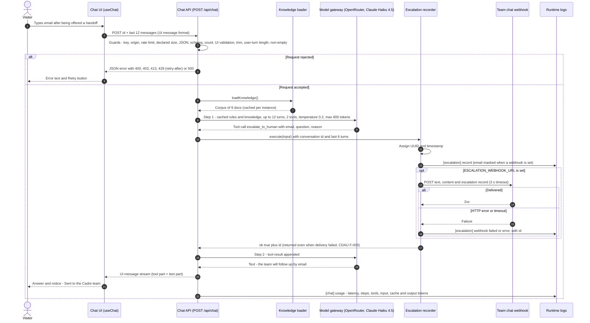

# Architecture Diagram: Sequence — Escalation Turn

> **Template Origin**: Official | **ArcKit Version**: 6.16.3 | **Command**: `/arckit:diagram`

## Document Control

| Field | Value |
|-------|-------|
| **Document ID** | ARC-001-DIAG-005-v1.0 |
| **Document Type** | Architecture Diagram |
| **Project** | Cadre AI Support Chatbot — cadre-chatbot (Project 001) |
| **Classification** | OFFICIAL |
| **Status** | DRAFT |
| **Version** | 1.0 |
| **Created Date** | 2026-09-27 |
| **Last Modified** | 2026-09-27 |
| **Review Cycle** | Monthly |
| **Next Review Date** | 2026-10-27 |
| **Owner** | Jhon Felipe Urrego — Solution Architect, Cadre AI Support Chatbot |
| **Reviewed By** | [PENDING] |
| **Approved By** | [PENDING] |
| **Distribution** | Project Team, Architecture Team |

## Revision History

| Version | Date | Author | Changes | Approved By | Approval Date |
|---------|------|--------|---------|-------------|---------------|
| 1.0 | 2026-09-27 | ArcKit AI | Initial creation from `/arckit:diagram` command | [PENDING] | [PENDING] |

---

## Diagram

**Type**: Sequence diagram (Mermaid). **Scenario**: the most involved path through the system. After being offered a handoff, a visitor gives their email (acceptance scenario 6, eval case `s6-human-request-then-email`). The turn passes the guards, calls the `escalate_to_human` tool, delivers the handoff to the team channel, and streams the confirmation back. Guard rejection and webhook failure appear as alternative fragments. The booking path is the same shape with `get_booking_link`, which returns the configured URL and has no side effects. Part of the set ARC-001-DIAG-001…009.

### Mermaid Format

**View this diagram**:

- **GitHub**: Renders automatically in markdown preview
- **VS Code**: Install Mermaid Preview extension
- **Online**: https://mermaid.live (paste code above)
- **Export**: Use mermaid.live to export as PNG/SVG/PDF

**Legend**: Solid arrows are calls; dashed arrows are responses. `alt` is a mutually exclusive branch and `opt` an optional block. Numbers come from `autonumber`.

### Diagram Quality Gate

| # | Criterion | Target | Result | Status |
|---|-----------|--------|--------|--------|
| 1 | Edge crossings | n/a (sequence) | Messages flow between adjacent lifelines where possible | PASS |
| 2 | Visual hierarchy | Main path dominant | Accepted branch is the main body | PASS |
| 3 | Grouping | Related messages grouped | Guards, tool execution and delivery in nested fragments | PASS |
| 4 | Flow direction | Top-to-bottom | Time flows downward | PASS |
| 5 | Relationship traceability | Each message clear | Autonumbered, labelled with function or payload | PASS |
| 6 | Abstraction level | One scenario | Escalation turn only | PASS |
| 7 | Edge label readability | Legible | One line per message | PASS |
| 8 | Node placement | Lifelines ordered by first use | Left-to-right in call order | PASS |
| 9 | Element count | ≤ 8 lifelines | 8/8 | PASS |

---

## Component Inventory

| Component | Type | Technology | Responsibility | Evolution Stage (indicative) | Build/Buy |
|-----------|------|------------|----------------|------------------------------|-----------|
| Chat UI | Lifeline | React, `useChat` | Sends turn, renders stream and notices | Custom | BUILD |
| Chat API | Lifeline | Route handler, `streamText` | Guards, orchestration, telemetry | Custom | BUILD |
| Knowledge loader | Lifeline | `lib/knowledge.ts` | Cached corpus | Custom | BUILD |
| Model gateway | Lifeline | OpenRouter, Claude Haiku 4.5 | Two model steps | Commodity | USE |
| Escalation recorder | Lifeline | `lib/escalations.ts` | Record, log, post | Custom | BUILD |
| Team chat webhook | Lifeline | Discord / Slack | Receives handoff | Commodity | USE |
| Runtime logs | Lifeline | Platform logs | `[escalation]` and `[chat]` lines | Commodity | USE |

---

## Architecture Decisions

### Key Design Decisions

**Decision 1**: The escalation happens inside the model's tool loop

- **Context**: The model decides when a handoff is appropriate (prompt rules `lib/prompt.ts:18-24`).
- **Decision**: `escalate_to_human` is a tool, and a second model step writes the confirmation (`stopWhen: isStepCount(3)`).
- **Rationale**: One request covers detection, execution and wording.
- **Consequences**: A tool turn costs two model steps. The prefix is sent twice but served from cache (`plan.md:95-100`).

**Decision 2**: Delivery is best-effort, and the conversation is never blocked

- **Context**: The webhook may be slow or down.
- **Decision**: 3 s timeout, failure logged, the tool still returns `ok: true`.
- **Consequences**: The user can be told the handoff succeeded when it didn't (CDAU F-003; blocking decision C-3).

---

## Requirements Traceability

| Requirement ID | Description | Component(s) | Coverage Status |
|----------------|-------------|--------------|-----------------|
| FR-013 | Human request flow | Chat API, Model gateway | ✅ |
| FR-014 | Escalation tool with context | Escalation recorder | ✅ |
| FR-015 | Truthful confirmation | Escalation recorder, Chat UI | ⚠️ (steps after webhook failure) |
| NFR-SEC-003 | Guards before model call | Chat API | ⚠️ |
| NFR-A-003 | Fault tolerance (webhook timeout) | Escalation recorder | ⚠️ (no retry) |
| NFR-C-002 | Handoff audit log | Runtime logs | ⚠️ (no reconciliation) |
| NFR-M-001 | Usage telemetry | Runtime logs | ⚠️ |
| NFR-F-002 | Cached prefix | Model gateway | ✅ |
| INT-002 | Team webhook | Team chat webhook | ⚠️ |

**Coverage Summary**: Total 9. Covered 3 (33%), Partially covered 6, Not covered 0.

---

## Integration Points

| Integration | Message(s) | Protocol | Notes |
|-------------|------------|----------|-------|
| Browser → Chat API | Steps 2, 4, 20 | HTTPS POST JSON; SSE response | UI message stream protocol |
| Chat API → Model gateway | Steps 8, 18 | HTTPS, bearer key, streaming | Two steps on tool turns |
| Recorder → Webhook | Step 13 | HTTPS POST JSON, 3 s timeout | `{ text, content, escalation }` |

---

## Data Flow

Personal data in this scenario: the email, any name, the question and the last 6 turns (≤ 500 chars each). These travel to the team channel and to logs (email masked only when a webhook is set). The full PII table is in **ARC-001-DIAG-002**.

**DPIA Required**: Yes (before production)
**DPO Consulted**: N/A

---

## Security Architecture

Guards (step 3) run before any model call. The transcript passed in step 10 comes from **client-supplied** history, so staff-facing content is untrusted (CDAU F-004, blocking decision C-4). See DIAG-002 for zones and controls.

---

## Deployment Architecture

See **ARC-001-DIAG-006**.

---

## Non-Functional Requirements

| Requirement | Target | Where in the sequence |
|-------------|--------|----------------------|
| Bounded output | ≤ 600 tokens per step, ≤ 3 steps | Steps 8 and 18 |
| Webhook bound | 3 s | Step 13 |
| Function limit | 30 s total | Whole accepted branch |

---

## UK Government Compliance (if applicable)

Not applicable (private US company).

---

## Wardley Map Integration

**Related Wardley Map**: N/A. See DIAG-002 for indicative positioning.

---

## Linked Artifacts

**Requirements**: `projects/001-cadre-chatbot/ARC-001-REQ-v1.0.md`
**Codebase Audit**: `projects/001-cadre-chatbot/audits/ARC-001-CDAU-001-v1.0.md`
**Other views**: DIAG-003 (Component), DIAG-008 (State), DIAG-009 (Flowchart)

---

## Change Log

| Version | Date | Author | Changes | Rationale |
|---------|------|--------|---------|-----------|
| v1.0 | 2026-09-27 | ArcKit AI | Initial diagram | Document the escalation turn at `d63c3ac` |

**Next Review Date**: 2026-10-27

---

## External References

> This section provides traceability from generated content back to source documents.
> Follow citation instructions in the project's citation reference guide.

### Document Register

| Doc ID | Filename | Type | Source Location | Description |
|--------|----------|------|-----------------|-------------|
| APP | cadre-chatbot repository at `d63c3ac` | Reference implementation | github.com/johnfelipe/cadre-chatbot | `route.ts`, `tools.ts`, `escalations.ts`, `Chat.tsx`, `evals/cases.ts` |
| CDAU | ARC-001-CDAU-001-v1.0.md | Codebase audit | 001-cadre-chatbot/audits/ | Gap references |

### Citations

| Citation ID | Doc ID | Page/Section | Category | Quoted Passage |
|-------------|--------|--------------|----------|----------------|
| — | — | — | — | — |

### Unreferenced Documents

| Filename | Source Location | Reason |
|----------|-----------------|--------|
| Cadre_AI_Chatbot_Take_Home_Candidate_v1.1.pdf | 001-cadre-chatbot/external/ | Scenario defined via REQ; no interaction design |
| Next Steps  Tech Challenge  Cadre AI.txt | 001-cadre-chatbot/external/ | No interaction content (live credential not reproduced) |

---

**Generated by**: ArcKit `/arckit:diagram` command
**Generated on**: 2026-09-27 GMT
**ArcKit Version**: 6.16.3
**Project**: Cadre AI Support Chatbot — cadre-chatbot (Project 001)
**AI Model**: Claude Opus 5.5 (claude-opus-5-5)
**Generation Context**: As-built repository at commit `d63c3ac`, ARC-001-CDAU-001-v1.0
