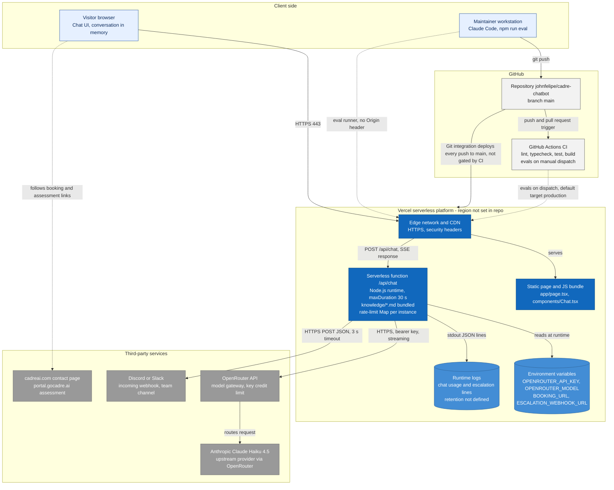

# Architecture Diagram: Deployment

> **Template Origin**: Official | **ArcKit Version**: 6.16.3 | **Command**: `/arckit:diagram`

## Document Control

| Field | Value |
|-------|-------|
| **Document ID** | ARC-001-DIAG-006-v1.0 |
| **Document Type** | Architecture Diagram |
| **Project** | Cadre AI Support Chatbot — cadre-chatbot (Project 001) |
| **Classification** | OFFICIAL |
| **Status** | DRAFT |
| **Version** | 1.0 |
| **Created Date** | 2026-09-27 |
| **Last Modified** | 2026-09-27 |
| **Review Cycle** | Monthly |
| **Next Review Date** | 2026-10-27 |
| **Owner** | Jhon Felipe Urrego — Solution Architect, Cadre AI Support Chatbot |
| **Reviewed By** | [PENDING] |
| **Approved By** | [PENDING] |
| **Distribution** | Project Team, Architecture Team |

## Revision History

| Version | Date | Author | Changes | Approved By | Approval Date |
|---------|------|--------|---------|-------------|---------------|
| 1.0 | 2026-09-27 | ArcKit AI | Initial creation from `/arckit:diagram` command | [PENDING] | [PENDING] |

---

## Diagram

**Type**: Deployment (Mermaid flowchart, top-down). **Scope**: the runtime topology and the delivery path as evidenced by the repository and its documentation. No infrastructure-as-code exists (CDAU F-018), so hosting details come from `plan.md` and `CLAUDE.md` and are marked "not in repo" where the repository cannot confirm them. Part of the set ARC-001-DIAG-001…009.

### Mermaid Format

**View this diagram**:

- **GitHub**: Renders automatically in markdown preview
- **VS Code**: Install Mermaid Preview extension
- **Online**: https://mermaid.live (paste code above)
- **Export**: Use mermaid.live to export as PNG/SVG/PDF

**Legend**: Dark blue = compute on the platform; mid blue cylinders = configuration and log stores; grey = third-party services; light blue = client side; light grey = delivery tooling. Solid arrows are runtime or deploy paths; dotted arrows are link-outs and test traffic.

### Diagram Quality Gate

| # | Criterion | Target | Result | Status |
|---|-----------|--------|--------|--------|
| 1 | Edge crossings | < 5 | 1–2 expected (dotted test-traffic edges from Dev and CI into Edge) | PASS |
| 2 | Visual hierarchy | Platform boundary prominent | Vercel subgraph is central, holding 5 nodes | PASS |
| 3 | Grouping | Related elements proximate | Four trust/ownership subgraphs | PASS |
| 4 | Flow direction | Top-to-bottom | Clients → GitHub/Vercel → third parties | PASS |
| 5 | Relationship traceability | Unambiguous | All edges labelled with protocol or purpose | PASS |
| 6 | Abstraction level | Deployment only | Runtime nodes and delivery path | PASS |
| 7 | Edge label readability | Legible | Comma-separated labels, no line breaks | PASS |
| 8 | Node placement | No long edges | The deploy edge to the platform subgraph is the longest; accepted | PASS |
| 9 | Element count | ≤ 15 | 13/15 | PASS |

**Accepted trade-off**: the dotted test-traffic edges (Dev and CI to Edge) cross the deploy edge. They are kept because evals targeting production is itself a finding (CDAU F-019).

---

## Component Inventory

| Component | Type | Technology | Responsibility | Evolution Stage (indicative) | Build/Buy |
|-----------|------|------------|----------------|------------------------------|-----------|
| Edge network and CDN | Platform | Vercel | TLS termination, routing, static delivery, response headers from `next.config.ts` | Commodity (0.90) | USE |
| Static page and JS bundle | Deployable | Next.js build output | Chat UI | Custom (0.40) | BUILD |
| Serverless function `/api/chat` | Deployable | Node.js runtime, `maxDuration = 30` | Chat API with bundled knowledge | Custom (0.35) | BUILD |
| Environment variables | Config store | Vercel project settings (not in repo) | Secrets and overrides; changes need a redeploy | Commodity (0.90) | USE |
| Runtime logs | Log store | Vercel runtime logs (retention not in repo) | Telemetry and handoff fallback | Commodity (0.90) | USE |
| GitHub repository | Source control | GitHub | Source of truth; 63 commits, 1 contributor, no PR merges | Commodity (0.95) | USE |
| GitHub Actions CI | CI | `.github/workflows/ci.yml` | Verify job; manual eval job | Commodity (0.90) | USE |
| OpenRouter API | SaaS | Model gateway | Routing, credit limit | Product (0.65) | USE |
| Anthropic Claude Haiku 4.5 | SaaS | LLM | Inference | Commodity (0.80) | USE |
| Discord / Slack webhook | SaaS | Incoming webhook | Team channel | Commodity (0.90) | USE |
| cadreai.com / portal.gocadre.ai | Existing sites | Cadre web properties | Booking form, assessment | Product (0.65) | USE (existing) |

---

## Architecture Decisions

### Key Design Decisions

**Decision 1**: Serverless deployment with Git-integrated continuous deployment

- **Context**: The brief says to deploy early and redeploy after every phase (`CLAUDE.md` hard constraints).
- **Decision**: The platform's Git integration deploys every push to `main` to production (`plan.md:30`).
- **Rationale**: Zero deployment configuration.
- **Consequences**: CI and deploy run independently, so a failing test does not stop a production deploy (CDAU F-007, blocking decision C-7). Rollback is a redeploy of a previous build.

**Decision 2**: Secrets in platform environment variables; no secret manager

- **Context**: Two secrets: the gateway key and the webhook URL.
- **Decision**: Stored as project environment variables, read only by the function.
- **Consequences**: No rotation automation. The key switch before submission needs a **redeploy** (`plan.md:56`).

**Decision 3**: No infrastructure-as-code

- **Consequences**: Region, deployment protection, log retention and function settings are unversioned (CDAU F-018).

### Technology Choices

| Technology | Purpose | Rationale | Evolution Stage |
|------------|---------|-----------|-----------------|
| Vercel | Hosting, CDN, functions | Native Next.js platform | Commodity |
| GitHub Actions (Node 22) | CI | Lint, typecheck, test, build on push and PR | Commodity |
| OpenRouter | Gateway | Mandated credential | Product |

---

## Requirements Traceability

| Requirement ID | Description | Component(s) | Coverage Status |
|----------------|-------------|--------------|-----------------|
| BR-005 | Live and within budget through the assessment window | Function, OpenRouter key credit limit | ⚠️ (CDAU F-001; key switch pending) |
| NFR-A-001 | Availability | Edge, Function | ⚠️ (no monitoring) |
| NFR-A-002 | Disaster recovery (rollback ≤ 15 min) | Vercel deployments | ⚠️ (no runbook) |
| NFR-S-001 | Horizontal scaling | Function instances | ⚠️ (per-instance state) |
| NFR-SEC-002 | Secrets management | Environment variables | ✅ |
| NFR-SEC-005 | Security headers | Edge (from `next.config.ts`) | ⚠️ (no CSP/HSTS in code) |
| NFR-M-004 | Automated quality gates | GitHub Actions CI | ⚠️ (deploy not gated) |
| INT-005 | CI and hosting | Repo, CI, Vercel | ⚠️ |
| NFR-F-003 | Upstream spend ceiling | OpenRouter key | Not evidenced (account setting) |

**Coverage Summary**: Total 9. Covered 1 (11%), Partially covered 7, Not evidenced 1.

---

## Integration Points

### External Systems

| External System | Interface | Protocol | Responsibility | SLA |
|----------------|-----------|----------|----------------|-----|
| OpenRouter → Anthropic | Chat completions | HTTPS 443, bearer key | Inference | Provider-dependent |
| Discord / Slack | Incoming webhook | HTTPS 443 POST | Handoffs | Best-effort |
| GitHub → Vercel | Git integration | Webhook (platform-managed) | Deploy on push | Platform |

### APIs and Endpoints

| API | Endpoint | Method | Purpose | Authentication |
|-----|----------|--------|---------|----------------|
| Chat API | `https://cadre-chatbot-ebon.vercel.app/api/chat` | POST | Chat turn | None (public) |

---

## Data Flow

| Data | Where it rests | Retention |
|------|----------------|-----------|
| Conversation | Browser memory only | Until reload |
| Secrets | Platform environment variables | Until rotated |
| Telemetry and handoff records | Runtime logs | Not defined (CDAU F-010) |
| Handoffs | Team channel | Channel policy (not defined) |
| Inference inputs | Gateway and upstream provider | Account/provider policy (CDAU F-011) |

Processing region: not configured in the repository, so the platform default applies. Confirm it for data-residency statements in the DPIA.

**DPIA Required**: Yes (before production)
**DPO Consulted**: N/A

---

## Security Architecture

### Security Zones

| Zone | Components | Security Level | Controls |
|------|------------|----------------|----------|
| Internet / client | Browser, workstation | Untrusted | HTTPS only |
| Delivery | GitHub repo, Actions | Maintainer-controlled | No workflow `permissions:`, tag-pinned actions (CDAU F-008) |
| Runtime | Edge, function, env, logs | Platform-managed | Env-var secrets, headers, guards |
| Suppliers | OpenRouter, Anthropic, Discord/Slack | Third party | Bearer key, secret webhook URL |

### Authentication & Authorization

| Component | Authentication | Authorization | Session Management |
|-----------|----------------|---------------|-------------------|
| Public chat | None | None | None |
| Platform / GitHub consoles | Account login (MFA not evidenced in repo) | Account roles | Platform |

---

## Deployment Architecture

### Cloud Provider

**Provider**: Vercel (serverless platform)
**Region**: Not configured in the repository (platform default)
**Availability Zones**: Platform-managed

### Infrastructure Components

| Component | Type | Spec | HA | Backup |
|-----------|------|------|-----|--------|
| Serverless function `/api/chat` | Function | Node.js runtime, 30 s max duration | Platform-managed multi-instance | Immutable deployments (redeploy previous) |
| Static assets | CDN | Next.js build output | Edge-replicated | Immutable deployments |
| Environment variables | Config | 4 variables (2 secrets) | Platform | None (re-enter manually) |

### Network Architecture

| Network Component | CIDR | Purpose | Security Group |
|------------------|------|---------|----------------|
| Public edge endpoint | n/a (managed) | HTTPS ingress | Platform-managed; no WAF or bot rules in repo |
| Function egress | n/a (managed) | Calls to OpenRouter and webhook | Unrestricted egress (platform default) |

---

## Non-Functional Requirements

| Requirement | Target | Component(s) | How Achieved |
|-------------|--------|--------------|--------------|
| Availability | Live through ~2026-10-01; 99.5% proposed | Edge, function | Platform SLA; no monitoring |
| RTO | ≤ 15 min | Deployments | Redeploy previous build |
| Scalability | Platform concurrency | Function | Stateless handler |
| Cost | ≤ $5 challenge credit | OpenRouter key | Credit limit plus app caps |

---

## UK Government Compliance (if applicable)

Not applicable (private US company). Cloud-first and open-source characteristics are present anyway: managed serverless hosting, and open-source frameworks (Next.js, React, AI SDK).

---

## Wardley Map Integration

**Related Wardley Map**: N/A. All platform and supplier components are USE (Commodity/Product), consistent with their stage.

- [x] No commodity infrastructure is built in-house at the deployment level
- [x] Evolution stages align with USE decisions

---

## Linked Artifacts

**Requirements**: `projects/001-cadre-chatbot/ARC-001-REQ-v1.0.md`
**Codebase Audit**: `projects/001-cadre-chatbot/audits/ARC-001-CDAU-001-v1.0.md`
**Other views**: DIAG-001 (Context), DIAG-002 (Container)

---

## Change Log

| Version | Date | Author | Changes | Rationale |
|---------|------|--------|---------|-----------|
| v1.0 | 2026-09-27 | ArcKit AI | Initial diagram | Document deployment as evidenced at `d63c3ac` |

**Next Review Date**: 2026-10-27

---

## External References

> This section provides traceability from generated content back to source documents.
> Follow citation instructions in the project's citation reference guide.

### Document Register

| Doc ID | Filename | Type | Source Location | Description |
|--------|----------|------|-----------------|-------------|
| APP | cadre-chatbot repository at `d63c3ac` | Reference implementation | github.com/johnfelipe/cadre-chatbot | `.github/workflows/ci.yml`, `next.config.ts`, `route.ts`, `plan.md`, `CLAUDE.md`, `README.md` |
| CDAU | ARC-001-CDAU-001-v1.0.md | Codebase audit | 001-cadre-chatbot/audits/ | Gap references |

### Citations

| Citation ID | Doc ID | Page/Section | Category | Quoted Passage |
|-------------|--------|--------------|----------|----------------|
| — | — | — | — | — |

### Unreferenced Documents

| Filename | Source Location | Reason |
|----------|-----------------|--------|
| Cadre_AI_Chatbot_Take_Home_Candidate_v1.1.pdf | 001-cadre-chatbot/external/ | Requires only a public URL; no topology content |
| Next Steps  Tech Challenge  Cadre AI.txt | 001-cadre-chatbot/external/ | No topology content (live credential not reproduced) |

---

**Generated by**: ArcKit `/arckit:diagram` command
**Generated on**: 2026-09-27 GMT
**ArcKit Version**: 6.16.3
**Project**: Cadre AI Support Chatbot — cadre-chatbot (Project 001)
**AI Model**: Claude Opus 5.5 (claude-opus-5-5)
**Generation Context**: As-built repository at commit `d63c3ac` (CI config, Next config, route settings) and deployment facts from `plan.md` / `CLAUDE.md`
