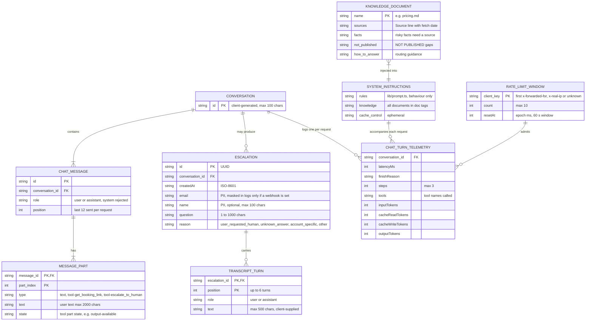

# Architecture Diagram: Entity-Relationship (Logical Data Model)

> **Template Origin**: Official | **ArcKit Version**: 6.16.3 | **Command**: `/arckit:diagram`

## Document Control

| Field | Value |
|-------|-------|
| **Document ID** | ARC-001-DIAG-007-v1.0 |
| **Document Type** | Architecture Diagram |
| **Project** | Cadre AI Support Chatbot — cadre-chatbot (Project 001) |
| **Classification** | OFFICIAL |
| **Status** | DRAFT |
| **Version** | 1.0 |
| **Created Date** | 2026-09-27 |
| **Last Modified** | 2026-09-27 |
| **Review Cycle** | Monthly |
| **Next Review Date** | 2026-10-27 |
| **Owner** | Jhon Felipe Urrego — Solution Architect, Cadre AI Support Chatbot |
| **Reviewed By** | [PENDING] |
| **Approved By** | [PENDING] |
| **Distribution** | Project Team, Architecture Team |

## Revision History

| Version | Date | Author | Changes | Approved By | Approval Date |
|---------|------|--------|---------|-------------|---------------|
| 1.0 | 2026-09-27 | ArcKit AI | Initial creation from `/arckit:diagram` command | [PENDING] | [PENDING] |

---

## Diagram

**Type**: Entity-Relationship diagram (Mermaid). **Important**: the system has **no database**. This is a **logical** model of the data structures the code creates, exchanges and emits, annotated with where each one lives:

| Entity | Lives in | Code source |
|--------|----------|-------------|
| CONVERSATION, CHAT_MESSAGE, MESSAGE_PART | Browser memory (last 12 messages sent per request) | `components/Chat.tsx`, AI SDK `UIMessage` |
| ESCALATION, TRANSCRIPT_TURN | Runtime log line and team-channel message | `lib/escalations.ts` |
| CHAT_TURN_TELEMETRY | Runtime log line | `app/api/chat/route.ts:98-113` |
| KNOWLEDGE_DOCUMENT | Markdown files bundled with the function | `knowledge/*.md`, `lib/knowledge.ts` |
| SYSTEM_INSTRUCTIONS | Built per request (cached corpus) | `lib/prompt.ts` |
| RATE_LIMIT_WINDOW | Function-instance memory | `lib/rate-limit.ts` |

Part of the set ARC-001-DIAG-001…009.

### Mermaid Format

**View this diagram**:

- **GitHub**: Renders automatically in markdown preview
- **VS Code**: Install Mermaid Preview extension
- **Online**: https://mermaid.live (paste code above)
- **Export**: Use mermaid.live to export as PNG/SVG/PDF

**Legend**: Crow's-foot notation. `||` is exactly one, `o{` zero or many, `|{` one or many. `PK`/`FK` are logical keys, not database constraints. Attributes marked "PII" hold personal data.

### Diagram Quality Gate

| # | Criterion | Target | Result | Status |
|---|-----------|--------|--------|--------|
| 1 | Edge crossings | < 5 | 0–1 expected (conversation hub with three children) | PASS |
| 2 | Visual hierarchy | Core entity prominent | CONVERSATION is the hub | PASS |
| 3 | Grouping | Related entities proximate | Conversation cluster, handoff cluster, runtime cluster | PASS |
| 4 | Flow direction | Consistent | Parent to child | PASS |
| 5 | Relationship traceability | Unambiguous | Every relationship labelled with cardinality | PASS |
| 6 | Abstraction level | Logical model only | No physical storage implied | PASS |
| 7 | Edge label readability | Legible | 1–4 word labels | PASS |
| 8 | Node placement | No long edges | Handled by the ER layout engine | PASS |
| 9 | Element count | ≤ 12 | 9/12 | PASS |

---

## Component Inventory

| Component | Type | Technology | Responsibility | Evolution Stage (indicative) | Build/Buy |
|-----------|------|------------|----------------|------------------------------|-----------|
| CONVERSATION / CHAT_MESSAGE / MESSAGE_PART | Client-held entities | AI SDK UI message format | Conversation state | Product (library format) | USE |
| ESCALATION / TRANSCRIPT_TURN | Emitted record | zod schema + TS types | Handoff to humans | Custom | BUILD |
| CHAT_TURN_TELEMETRY | Emitted record | JSON log line | Usage and cost observability | Custom | BUILD |
| KNOWLEDGE_DOCUMENT | File | Markdown | Curated facts | Custom | BUILD (content) |
| SYSTEM_INSTRUCTIONS | Derived artefact | String | Prompt prefix (cached) | Custom | BUILD |
| RATE_LIMIT_WINDOW | In-memory state | `Map` | Abuse control | Commodity | BUILD (flag) |

---

## Architecture Decisions

### Key Design Decisions

**Decision 1**: No persistence layer

- **Context**: `plan.md` scope "OUT: Persistent chat history / DB".
- **Decision**: Conversations live in the browser; handoffs are emitted, not stored.
- **Consequences**: There is no system of record for handoffs beyond the team channel and logs (CDAU F-003, F-010; principle P-12).

**Decision 2**: The escalation carries bounded context

- **Decision**: At most 6 transcript turns of 500 chars each, plus the question (1–1,000 chars) and optional name (≤ 100).
- **Consequences**: Transcript turns come from client-supplied history and may be forged (CDAU F-004, blocking decision C-1).

---

## Requirements Traceability

| Requirement ID | Description | Entity | Coverage Status |
|----------------|-------------|--------|-----------------|
| DR-001 | Knowledge provenance | KNOWLEDGE_DOCUMENT | ⚠️ (guard scope, CDAU F-013) |
| DR-002 | Escalation schema | ESCALATION, TRANSCRIPT_TURN | ✅ |
| DR-003 | No persistence | CONVERSATION (browser only) | ✅ |
| DR-004 | PII minimisation | ESCALATION, CHAT_TURN_TELEMETRY | ⚠️ |
| DR-005 | Retention | All emitted records | ❌ |
| DR-006 | Knowledge freshness | KNOWLEDGE_DOCUMENT.sources | ⚠️ |
| NFR-M-001 | Observability | CHAT_TURN_TELEMETRY | ⚠️ |
| NFR-P-002 | Rate limit | RATE_LIMIT_WINDOW | ⚠️ |

**Coverage Summary**: Total 8. Covered 2 (25%), Partially covered 5, Not covered 1.

---

## Integration Points

| Entity | Leaves the system via | Format |
|--------|-----------------------|--------|
| CHAT_MESSAGE / MESSAGE_PART (last 12) | Model gateway request | Model messages converted by `convertToModelMessages` |
| ESCALATION + TRANSCRIPT_TURN | Team webhook | `{ text, content, escalation }` JSON |
| ESCALATION, CHAT_TURN_TELEMETRY | Runtime logs | JSON lines |

---

## Data Flow

### Data Sources

| Data Source | Type | Data Format | Update Frequency | Owner |
|-------------|------|-------------|------------------|-------|
| Visitor input | User | Text parts | Per turn | Visitor |
| Knowledge files | Curated | Markdown | Per deploy | Marketing / Engineering |

### Data Sinks

| Data Sink | Type | Data Format | Retention | Backup |
|-----------|------|-------------|-----------|--------|
| Runtime logs | Log | JSON lines | Not defined | None |
| Team channel | Chat | Text + JSON | Not defined | Platform |
| Model gateway | Inference | Model messages | Provider policy | n/a |

### PII Handling (GDPR / applicable privacy law)

| Entity | PII Type | Processing | Legal Basis | Retention | Deletion |
|--------|----------|------------|-------------|-----------|----------|
| MESSAGE_PART | Free text (may contain anything) | Sent to gateway (last 12 turns) | To confirm in DPIA | Not stored by the app | n/a |
| ESCALATION | Email, name, question | Logged, posted to channel | Consent (user-initiated) | Not defined | Not defined |
| TRANSCRIPT_TURN | Free text | Posted to channel, logged | Consent | Not defined | Not defined |
| RATE_LIMIT_WINDOW | IP address | In-memory counter | Legitimate interest | 60 s window / instance | Automatic |
| CHAT_TURN_TELEMETRY | None by design (raw error logs may contain content, CDAU F-009) | Logged | Legitimate interest | Not defined | Not defined |

**DPIA Required**: Yes (before production)
**DPO Consulted**: N/A

---

## Security Architecture

Data classification (logical): KNOWLEDGE_DOCUMENT is PUBLIC (from the website). ESCALATION and TRANSCRIPT_TURN are CONFIDENTIAL (personal data). CHAT_TURN_TELEMETRY is INTERNAL. RATE_LIMIT_WINDOW is CONFIDENTIAL (IP). Controls: see DIAG-002.

---

## Deployment Architecture

See **ARC-001-DIAG-006** for where each store physically lives.

---

## Non-Functional Requirements

| Requirement | Target | Entity | How Achieved |
|-------------|--------|--------|--------------|
| History window | 12 messages | CHAT_MESSAGE | Client slice + server trim |
| Request cap | ≤ 100 messages | CHAT_MESSAGE | 413 |
| Limiter memory | ≤ 10,000 keys | RATE_LIMIT_WINDOW | Sweep of expired windows |

---

## UK Government Compliance (if applicable)

Not applicable (private US company).

---

## Wardley Map Integration

**Related Wardley Map**: N/A.

---

## Linked Artifacts

**Requirements**: `projects/001-cadre-chatbot/ARC-001-REQ-v1.0.md` (Data Requirements, Entities 1–5)
**Codebase Audit**: `projects/001-cadre-chatbot/audits/ARC-001-CDAU-001-v1.0.md`
**Other views**: DIAG-004 (Code), DIAG-005 (Sequence)
**Next**: `/arckit:data-model` for a full data model; `/arckit:dpia`

---

## Change Log

| Version | Date | Author | Changes | Rationale |
|---------|------|--------|---------|-----------|
| v1.0 | 2026-09-27 | ArcKit AI | Initial diagram | Document the logical data model at `d63c3ac` |

**Next Review Date**: 2026-10-27

---

## External References

> This section provides traceability from generated content back to source documents.
> Follow citation instructions in the project's citation reference guide.

### Document Register

| Doc ID | Filename | Type | Source Location | Description |
|--------|----------|------|-----------------|-------------|
| APP | cadre-chatbot repository at `d63c3ac` | Reference implementation | github.com/johnfelipe/cadre-chatbot | `lib/escalations.ts`, `lib/rate-limit.ts`, `lib/knowledge.ts`, `route.ts`, `knowledge/` |
| REQ | ARC-001-REQ-v1.0.md | Requirements | 001-cadre-chatbot/ | Data entities 1–5 |
| CDAU | ARC-001-CDAU-001-v1.0.md | Codebase audit | 001-cadre-chatbot/audits/ | Gap references |

### Citations

| Citation ID | Doc ID | Page/Section | Category | Quoted Passage |
|-------------|--------|--------------|----------|----------------|
| — | — | — | — | — |

### Unreferenced Documents

| Filename | Source Location | Reason |
|----------|-----------------|--------|
| Cadre_AI_Chatbot_Take_Home_Candidate_v1.1.pdf | 001-cadre-chatbot/external/ | No data model content |
| Next Steps  Tech Challenge  Cadre AI.txt | 001-cadre-chatbot/external/ | No data model content (live credential not reproduced) |

---

**Generated by**: ArcKit `/arckit:diagram` command
**Generated on**: 2026-09-27 GMT
**ArcKit Version**: 6.16.3
**Project**: Cadre AI Support Chatbot — cadre-chatbot (Project 001)
**AI Model**: Claude Opus 5.5 (claude-opus-5-5)
**Generation Context**: As-built repository at commit `d63c3ac`, ARC-001-REQ-v1.0 data entities
