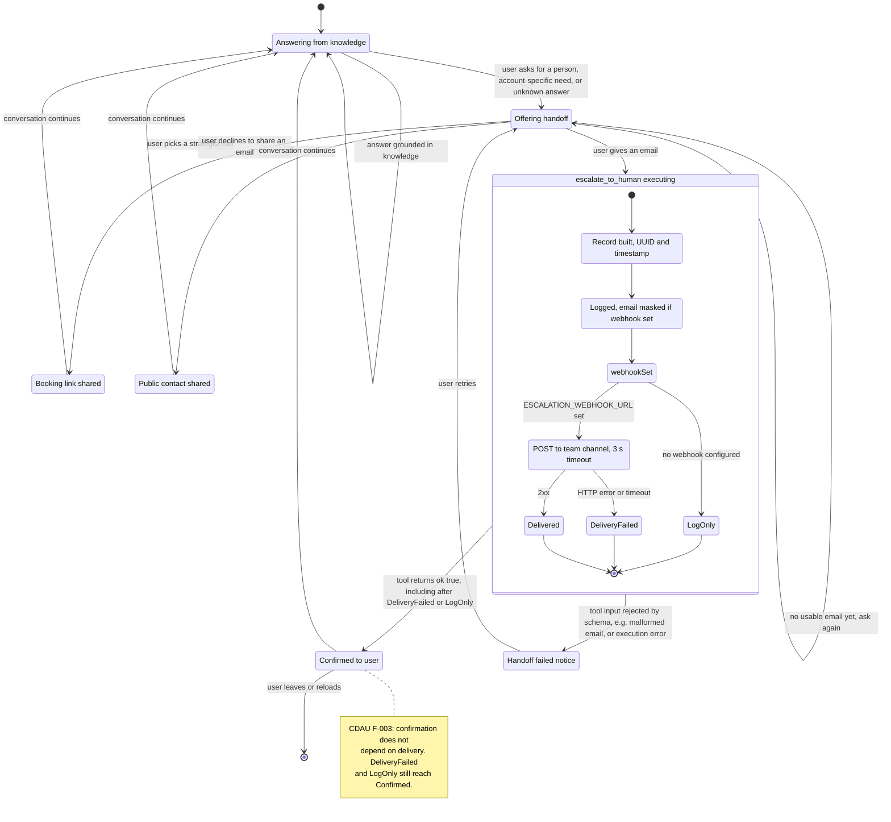
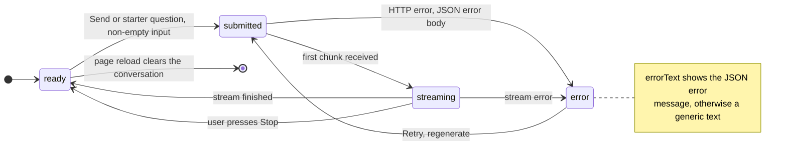

# Architecture Diagram: State — Handoff Lifecycle and UI Request Status

> **Template Origin**: Official | **ArcKit Version**: 6.16.3 | **Command**: `/arckit:diagram`

## Document Control

| Field | Value |
|-------|-------|
| **Document ID** | ARC-001-DIAG-008-v1.0 |
| **Document Type** | Architecture Diagram |
| **Project** | Cadre AI Support Chatbot — cadre-chatbot (Project 001) |
| **Classification** | OFFICIAL |
| **Status** | DRAFT |
| **Version** | 1.0 |
| **Created Date** | 2026-09-27 |
| **Last Modified** | 2026-09-27 |
| **Review Cycle** | Monthly |
| **Next Review Date** | 2026-10-27 |
| **Owner** | Jhon Felipe Urrego — Solution Architect, Cadre AI Support Chatbot |
| **Reviewed By** | [PENDING] |
| **Approved By** | [PENDING] |
| **Distribution** | Project Team, Architecture Team |

## Revision History

| Version | Date | Author | Changes | Approved By | Approval Date |
|---------|------|--------|---------|-------------|---------------|
| 1.0 | 2026-09-27 | ArcKit AI | Initial creation from `/arckit:diagram` command | [PENDING] | [PENDING] |

---

## Diagram

**Type**: State diagrams (Mermaid `stateDiagram-v2`). Two state machines matter in this system:

1. **Handoff lifecycle (primary).** How a conversation moves from answering to a human handoff. The transitions are defined by the prompt's escalation rules (`lib/prompt.ts:17-24`) and the tool and recorder code (`lib/tools.ts:16-24`, `lib/escalations.ts:54-85`).
2. **UI request status (supporting).** The `useChat` status cycle as handled in `components/Chat.tsx` (Send disabled while busy, Stop, error with Retry).

Part of the set ARC-001-DIAG-001…009.

### Mermaid Format — Handoff lifecycle

### Mermaid Format — UI request status

**View these diagrams**:

- **GitHub**: Renders automatically in markdown preview
- **VS Code**: Install Mermaid Preview extension
- **Online**: https://mermaid.live (paste code above)
- **Export**: Use mermaid.live to export as PNG/SVG/PDF

**Legend**: Rounded boxes are states and the diamond is a choice. `[*]` is start or end. The composite state `Escalating` shows the recorder's internal steps. Transition labels are the triggering events.

### Diagram Quality Gate

| # | Criterion | Target | Result | Status |
|---|-----------|--------|--------|--------|
| 1 | Edge crossings | < 5 | 1–2 expected around `OfferingHandoff` fan-out | PASS |
| 2 | Visual hierarchy | Main lifecycle dominant | Handoff machine first, with a composite for delivery | PASS |
| 3 | Grouping | Related states proximate | Delivery sub-states nested in `Escalating` | PASS |
| 4 | Flow direction | Consistent | TB (lifecycle); LR (UI status cycle) | PASS |
| 5 | Relationship traceability | Unambiguous | Every transition labelled with its trigger | PASS |
| 6 | Abstraction level | One concern per diagram | Handoff behaviour vs UI status | PASS |
| 7 | Edge label readability | Legible | Short event labels | PASS |
| 8 | Node placement | No long edges | Loops kept local | PASS |
| 9 | Element count | ≤ 15 states per diagram | 13 (lifecycle incl. sub-states and choice); 4 (UI) | PASS |

---

## Component Inventory

| Component | Type | Technology | Responsibility | Evolution Stage (indicative) | Build/Buy |
|-----------|------|------------|----------------|------------------------------|-----------|
| Handoff policy | Behaviour (prompt rules) | `lib/prompt.ts` escalation rules | Decides OfferingHandoff and Escalating transitions | Custom | BUILD |
| Escalation tool + recorder | Code | `lib/tools.ts`, `lib/escalations.ts` | Implements the `Escalating` composite | Custom | BUILD |
| `useChat` status | Library state | `@ai-sdk/react` | ready, submitted, streaming, error | Product | USE |
| Chat UI handlers | Code | `components/Chat.tsx` | Send, Stop, Retry, error text | Custom | BUILD |

---

## Architecture Decisions

### Key Design Decisions

**Decision 1**: The handoff state is driven by the model, not a server-side state machine

- **Context**: The server is stateless; the conversation lives in the browser.
- **Decision**: The model moves between states under prompt rules. Only `Escalating` is code.
- **Rationale**: No session store needed.
- **Consequences**: Transitions are verified behaviourally (evals `s6-*`, `tool-*`), not by unit tests. A forged history can place the model in any state (CDAU blocking decision C-1).

**Decision 2**: The user is confirmed regardless of the delivery outcome

- **Consequences**: `DeliveryFailed → Confirmed` is an undesired transition that exists today (CDAU F-003, blocking decision C-3). The target design is `DeliveryFailed → ToolError` with a fallback contact, or a durable queue.

---

## Requirements Traceability

| Requirement ID | Description | State(s) | Coverage Status |
|----------------|-------------|----------|-----------------|
| FR-013 | Human request flow | Answering → OfferingHandoff | ✅ |
| FR-014 | Escalation tool | Escalating | ✅ |
| FR-015 | Truthful confirmation | Escalating → Confirmed | ⚠️ (F-003) |
| FR-016 | Email declined → public contact | PublicContact | ✅ |
| FR-007 / FR-008 | Booking | BookingShared | ✅ |
| FR-023 | Error and retry states | UI: error → submitted | ✅ |
| FR-024 | Ephemeral conversations | UI: ready → end on reload | ✅ |
| INT-002 | Team webhook | Posting, Delivered, DeliveryFailed | ⚠️ |

**Coverage Summary**: Total 9 (FR-007 and FR-008 counted separately). Covered 7 (78%), Partially covered 2, Not covered 0.

---

## Integration Points

`Posting` is the only state that calls an external system (team chat webhook, 3 s timeout). The `submitted` and `streaming` UI states correspond to the `POST /api/chat` request/stream (see DIAG-005).

---

## Data Flow

Entering `Escalating` produces an ESCALATION record with up to 6 TRANSCRIPT_TURNs (see DIAG-007). `Logged` writes it to runtime logs. `Posting` sends it to the team channel.

**DPIA Required**: Yes (before production)
**DPO Consulted**: N/A

---

## Security Architecture

The handoff transitions depend on model judgement over client-supplied history. The code-level safeguard is input validation of the tool arguments: email format and enum reason. Notification content is not sanitised (CDAU F-004). See DIAG-002.

---

## Deployment Architecture

See **ARC-001-DIAG-006**.

---

## Non-Functional Requirements

| Requirement | Target | State | How Achieved |
|-------------|--------|-------|--------------|
| Webhook bound | 3 s | Posting | `AbortSignal.timeout(3000)` |
| No double sends while busy | One in-flight request | UI submitted/streaming | Send ignored while busy |

---

## UK Government Compliance (if applicable)

Not applicable (private US company).

---

## Wardley Map Integration

**Related Wardley Map**: N/A.

---

## Linked Artifacts

**Requirements**: `projects/001-cadre-chatbot/ARC-001-REQ-v1.0.md` (UC-3, UC-6)
**Codebase Audit**: `projects/001-cadre-chatbot/audits/ARC-001-CDAU-001-v1.0.md`
**Other views**: DIAG-005 (Sequence), DIAG-009 (Flowchart)

---

## Change Log

| Version | Date | Author | Changes | Rationale |
|---------|------|--------|---------|-----------|
| v1.0 | 2026-09-27 | ArcKit AI | Initial diagrams | Document handoff and UI state machines at `d63c3ac` |

**Next Review Date**: 2026-10-27

---

## External References

> This section provides traceability from generated content back to source documents.
> Follow citation instructions in the project's citation reference guide.

### Document Register

| Doc ID | Filename | Type | Source Location | Description |
|--------|----------|------|-----------------|-------------|
| APP | cadre-chatbot repository at `d63c3ac` | Reference implementation | github.com/johnfelipe/cadre-chatbot | `lib/prompt.ts`, `lib/tools.ts`, `lib/escalations.ts`, `components/Chat.tsx`, `evals/cases.ts` |
| CDAU | ARC-001-CDAU-001-v1.0.md | Codebase audit | 001-cadre-chatbot/audits/ | Gap references |

### Citations

| Citation ID | Doc ID | Page/Section | Category | Quoted Passage |
|-------------|--------|--------------|----------|----------------|
| — | — | — | — | — |

### Unreferenced Documents

| Filename | Source Location | Reason |
|----------|-----------------|--------|
| Cadre_AI_Chatbot_Take_Home_Candidate_v1.1.pdf | 001-cadre-chatbot/external/ | No state behaviour specified |
| Next Steps  Tech Challenge  Cadre AI.txt | 001-cadre-chatbot/external/ | No state content (live credential not reproduced) |

---

**Generated by**: ArcKit `/arckit:diagram` command
**Generated on**: 2026-09-27 GMT
**ArcKit Version**: 6.16.3
**Project**: Cadre AI Support Chatbot — cadre-chatbot (Project 001)
**AI Model**: Claude Opus 5.5 (claude-opus-5-5)
**Generation Context**: As-built repository at commit `d63c3ac` (prompt rules, tools, recorder, UI)
