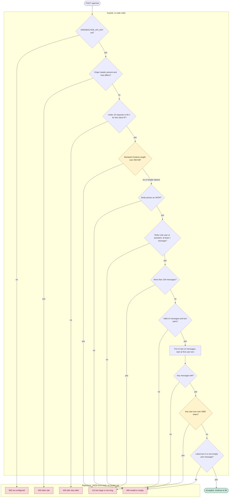
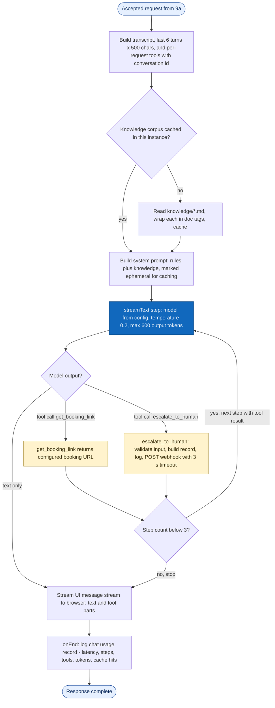

# Architecture Diagram: Flowchart — Request Pipeline and Generation Loop

> **Template Origin**: Official | **ArcKit Version**: 6.16.3 | **Command**: `/arckit:diagram`

## Document Control

| Field | Value |
|-------|-------|
| **Document ID** | ARC-001-DIAG-009-v1.0 |
| **Document Type** | Architecture Diagram |
| **Project** | Cadre AI Support Chatbot — cadre-chatbot (Project 001) |
| **Classification** | OFFICIAL |
| **Status** | DRAFT |
| **Version** | 1.0 |
| **Created Date** | 2026-09-27 |
| **Last Modified** | 2026-09-27 |
| **Review Cycle** | Monthly |
| **Next Review Date** | 2026-10-27 |
| **Owner** | Jhon Felipe Urrego — Solution Architect, Cadre AI Support Chatbot |
| **Reviewed By** | [PENDING] |
| **Approved By** | [PENDING] |
| **Distribution** | Project Team, Architecture Team |

## Revision History

| Version | Date | Author | Changes | Approved By | Approval Date |
|---------|------|--------|---------|-------------|---------------|
| 1.0 | 2026-09-27 | ArcKit AI | Initial creation from `/arckit:diagram` command | [PENDING] | [PENDING] |

---

## Diagram

**Type**: Flowcharts (Mermaid). The processing of `POST /api/chat` is split in two, to stay readable:

- **9a — Request guard pipeline**: every check in `app/api/chat/route.ts:33-78`, in code order, with the exact HTTP status of each rejection.
- **9b — Generation and tool loop**: prompt assembly, `streamText`, the tool branches and telemetry (`route.ts:80-118`, `lib/tools.ts`, `lib/escalations.ts`).

Part of the set ARC-001-DIAG-001…009.

### Mermaid Format — 9a Request guard pipeline

### Mermaid Format — 9b Generation and tool loop

**View these diagrams**:

- **GitHub**: Renders automatically in markdown preview
- **VS Code**: Install Mermaid Preview extension
- **Online**: https://mermaid.live (paste code above)
- **Export**: Use mermaid.live to export as PNG/SVG/PDF

**Legend**:
- **9a**: diamonds are guard decisions, red boxes are rejections (no model call is made), and green is the accepted exit. **Amber diamonds mark the checks the codebase audit found incomplete.**
  - `CL`: the size check trusts the declared header, so an absent header passes (CDAU F-005).
  - `LEN`: only user turns are length-checked, and only text parts count (CDAU F-001, F-002).
- **9b**: the dark blue box is the model call, amber boxes are tool executions, and light blue boxes are the entry and exit points.

### Diagram Quality Gate

| # | Criterion | Target | Result | Status |
|---|-----------|--------|--------|--------|
| 1 | Edge crossings | < 5 | 9a: rejection edges converge on 5 shared status nodes (a few crossings expected, accepted); 9b: 0–1 | PASS |
| 2 | Visual hierarchy | Main path dominant | 9a: guard spine vertical, rejections grouped to the side; 9b: single spine with one loop | PASS |
| 3 | Grouping | Related elements proximate | Guards and Rejections subgraphs | PASS |
| 4 | Flow direction | Consistent | Top-to-bottom in both | PASS |
| 5 | Relationship traceability | Unambiguous | Every decision edge labelled yes/no or with the tool name | PASS |
| 6 | Abstraction level | One concern per chart | Validation vs generation | PASS |
| 7 | Edge label readability | Legible | Short labels, no line breaks in edge labels | PASS |
| 8 | Node placement | No long edges | Rejection edges are the longest; accepted for grouping | PASS |
| 9 | Element count | Split when large | 9a: 19 nodes (split from 9b to stay readable); 9b: 13 nodes | PASS (accepted) |

**Accepted trade-off**: 9a has more than 12 nodes, because every guard in the code is shown in order. Grouping the rejections into five status nodes keeps it readable. It was split from 9b rather than cut, so that no guard is hidden.

---

## Component Inventory

| Component | Type | Technology | Responsibility | Evolution Stage (indicative) | Build/Buy |
|-----------|------|------------|----------------|------------------------------|-----------|
| Guard spine | Process | `route.ts:34-78`, zod, `safeValidateUIMessages` | Reject before any model call | Custom | BUILD |
| Rejection responses | Output | `jsonError` | JSON `{ error }` with specific status | Custom | BUILD |
| Knowledge cache | Process | `lib/knowledge.ts` | Load once per instance, reset on failure | Custom | BUILD |
| Model step | Process | AI SDK `streamText` + OpenRouter | Generation with up to 3 steps | Product / Commodity | USE |
| Booking tool | Process | `lib/tools.ts` | Deterministic URL | Custom | BUILD |
| Escalation tool | Process | `lib/tools.ts`, `lib/escalations.ts` | Handoff record and delivery | Custom | BUILD |
| Telemetry | Output | `onEnd` in `route.ts` | Usage log line | Custom | BUILD |

---

## Architecture Decisions

### Key Design Decisions

**Decision 1**: Cheapest checks first, and no model call on rejection

- **Rationale**: Protects the per-token budget. It is asserted by unit test `route.test.ts:110-113`.
- **Consequences**: The pipeline is only as strong as its weakest cap (amber nodes; CDAU F-001, F-002, F-005).

**Decision 2**: Multi-step tool loop capped at 3 steps

- **Rationale**: A tool call needs a second step to word the answer. Three steps bound the cost of a misbehaving model.
- **Consequences**: A tool turn sends the cached prefix twice (measured, `plan.md:95-100`).

---

## Requirements Traceability

| Requirement ID | Description | Node(s) | Coverage Status |
|----------------|-------------|---------|-----------------|
| NFR-SEC-003 | Input validation in order | 9a guard spine | ⚠️ (amber nodes) |
| NFR-SEC-001 | Origin check for browsers | 9a `O` | ⚠️ (non-browser callers pass) |
| NFR-P-002 | Rate limit | 9a `RL` | ⚠️ (per instance) |
| NFR-I-001 | JSON error contract | 9a rejections | ✅ (except knowledge-load failure, CDAU F-016) |
| NFR-F-001 | Hard cost caps | 9a `CL`, `CNT`, `LEN`; 9b `Step`, `More` | ⚠️ |
| NFR-F-002 | Prompt caching | 9b `Prompt` | ✅ |
| FR-007 | Booking tool | 9b `Book` | ✅ |
| FR-014 | Escalation tool | 9b `Esc` | ✅ |
| FR-021 | Multi-turn context | 9a `TR` | ✅ |
| NFR-M-001 | Observability | 9b `Tel` | ⚠️ |

**Coverage Summary**: Total 10. Covered 5 (50%), Partially covered 5, Not covered 0.

---

## Integration Points

External calls happen only in 9b. `Step` calls the model gateway (HTTPS, bearer key) and `Esc` calls the team webhook (HTTPS POST, 3 s). Everything in 9a is in-process. See DIAG-002 for interface details.

---

## Data Flow

9a reads the request body and headers (client IP for rate limiting). 9b sends the trimmed history to the gateway, and on escalation sends the email, question and transcript to the webhook and logs. The PII table is in **ARC-001-DIAG-002**.

**DPIA Required**: Yes (before production)
**DPO Consulted**: N/A

---

## Security Architecture

9a is the system's only trust boundary for client input; 9b trusts everything 9a passes. The recommended hardening at the amber nodes (CDAU recommended actions 1 and 5):
- **`LEN`**: cap every turn regardless of role, and add a total-character budget.
- **Part types**: allowlist per role.
- **`CL`**: enforce the size on bytes actually read.
- **Notifications**: sanitise the content sent to the team channel.

---

## Deployment Architecture

Both flows run inside one serverless function invocation (30 s limit). See **ARC-001-DIAG-006**.

---

## Non-Functional Requirements

| Requirement | Target | Node | How Achieved |
|-------------|--------|------|--------------|
| Rate | 10 / 60 s / IP | 9a `RL` | Fixed window per instance |
| Body size | 256 KB declared | 9a `CL` | `Content-Length` check |
| History | 100 accepted, 12 used | 9a `CNT`, `TR` | 413; trim |
| Message size | 2000 chars (user turns) | 9a `LEN` | 413 |
| Output | 600 tokens per step, 3 steps | 9b `Step`, `More` | `maxOutputTokens`, `stopWhen` |

---

## UK Government Compliance (if applicable)

Not applicable (private US company).

---

## Wardley Map Integration

**Related Wardley Map**: N/A.

---

## Linked Artifacts

**Requirements**: `projects/001-cadre-chatbot/ARC-001-REQ-v1.0.md`
**Codebase Audit**: `projects/001-cadre-chatbot/audits/ARC-001-CDAU-001-v1.0.md`
**Other views**: DIAG-003 (Component), DIAG-005 (Sequence), DIAG-008 (State)

---

## Change Log

| Version | Date | Author | Changes | Rationale |
|---------|------|--------|---------|-----------|
| v1.0 | 2026-09-27 | ArcKit AI | Initial diagrams | Document request processing at `d63c3ac` |

**Next Review Date**: 2026-10-27

---

## External References

> This section provides traceability from generated content back to source documents.
> Follow citation instructions in the project's citation reference guide.

### Document Register

| Doc ID | Filename | Type | Source Location | Description |
|--------|----------|------|-----------------|-------------|
| APP | cadre-chatbot repository at `d63c3ac` | Reference implementation | github.com/johnfelipe/cadre-chatbot | `app/api/chat/route.ts`, `route.test.ts`, `lib/*.ts` |
| CDAU | ARC-001-CDAU-001-v1.0.md | Codebase audit | 001-cadre-chatbot/audits/ | Gap references |

### Citations

| Citation ID | Doc ID | Page/Section | Category | Quoted Passage |
|-------------|--------|--------------|----------|----------------|
| — | — | — | — | — |

### Unreferenced Documents

| Filename | Source Location | Reason |
|----------|-----------------|--------|
| Cadre_AI_Chatbot_Take_Home_Candidate_v1.1.pdf | 001-cadre-chatbot/external/ | No processing-flow content |
| Next Steps  Tech Challenge  Cadre AI.txt | 001-cadre-chatbot/external/ | No processing-flow content (live credential not reproduced) |

---

**Generated by**: ArcKit `/arckit:diagram` command
**Generated on**: 2026-09-27 GMT
**ArcKit Version**: 6.16.3
**Project**: Cadre AI Support Chatbot — cadre-chatbot (Project 001)
**AI Model**: Claude Opus 5.5 (claude-opus-5-5)
**Generation Context**: As-built repository at commit `d63c3ac` (route handler read line by line)
